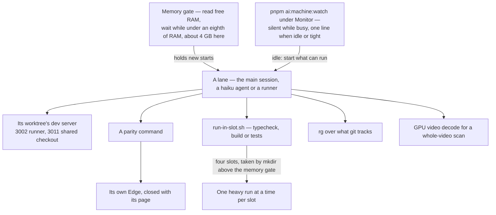

# Machine efficiency

The work on this machine is many agents and a few long runners sharing one set of cores, one GPU and about 32 GB of memory. The rules an agent follows are in the `throughput` skill (`.agents/skills/throughput/references/machine-efficiency.md`); this page covers what each one buys, with the magnitude measured on this machine.

## How the work runs

A **lane** is one thing doing work on the machine: the main session, a `haiku` agent in a wave, or a compute-queue runner. Every lane gets the same few shared resources, and four rules keep them from stacking up:

- **Each worktree serves its own parity page.** A runner's worktree starts its dev server on port 3002, and the shared checkout's page is served once on 3011 for the main session. A server holds its memory flat across page loads, so one per lane costs little.
- **Each command launches its own browser.** A parity command opens an Edge for its own life and closes it with its page, so no browser outlives the command that started it, and a browser that grows across pages never builds up.
- **Every heavy run takes a slot.** A typecheck, a build or a test run goes through `run-in-slot.sh`, which lets four of them run at once, each only while free memory is above an eighth of the machine's RAM, and holds the rest back. A tsdown build peaks near 2 GB, and many agents building at once took free memory down to about 1.3 GB; a fixed two slots then held the cores at about 37% with agents queued, so the count keeps the cores fed and the gate keeps memory.
- **A worktree commit borrows the main checkout's tools.** The pre-commit hook used to run `pnpm` in a fresh worktree, which installed the whole workspace there and failed on an unbuilt `@esposter/shared` (102 to 179 s across three runs, each failing); its check and formatter now run from the main checkout's install, and a commit takes about 2 s (1.6 to 2.1 s across three runs).
- **The memory gate and the machine watcher hold the rest.** Before a heavy run starts it reads the free memory and waits at the gate, about 4 GB here, as the throughput skill sets out. The machine watcher (`pnpm ai:machine:watch`, under Monitor) wakes the session only when the machine has gone idle or the gate is hit, so nothing polls. It also pushes the machine's heartbeat, a `refs/machines/<id>` commit every ten minutes carrying its CPU, GPU and free memory, which `pnpm ai:fleet:status` reads for the whole fleet ([Fleet](/docs/architecture/fleet)); a failed push prints one line and the watcher carries on.

## The mechanisms and what they save

| Mechanism                                             | Status  | Measured magnitude                                                                                                                                                                                                                             |
| :---------------------------------------------------- | :------ | :--------------------------------------------------------------------------------------------------------------------------------------------------------------------------------------------------------------------------------------------- |
| One dev server per lane                               | Kept    | About 0.65 GB, flat over ten page loads; page ready in 1.6–1.9 s warm. A static build would be the alternative, but the page does not build as the repository stands, so no ratio is stated                                                    |
| Each command's own Edge                               | Kept    | 0.73 GB while a page is open and none after it closes, against a shared browser that grew to about 2.97 GB over ten pages                                                                                                                      |
| The shared Edge                                       | Removed | 1.4× faster per page (a 2.0 s launch against 1.4 s shared), and about 4× the memory of a launch after ten pages, so it was removed                                                                                                             |
| One-off checks, not a standing watcher                | Kept    | About 750× less memory-time per check than an hour of watcher on `scripts`, which breaks even only above about 750 checks an hour                                                                                                              |
| Two heavy-run slots                                   | Kept    | Half the concurrent heavy runs: four launched together run four at once without the slot and two with it                                                                                                                                       |
| `rg` over `grep -r` from the repository root          | Kept    | More than 200× faster: `rg` takes about 4 s, while `grep -r` ran over 900 s in two runs without printing a match                                                                                                                               |
| GPU video decode for a whole-video scan               | Kept    | 2.4× faster: a luma scan of the first 60 s of a capture takes about 65 s on the GPU at 64 pixels wide, against about 155 s decoding on the CPU at full size                                                                                    |
| GPU vocoder for the persona's spoken lines (DirectML) | Kept    | About 85% less CPU time for five lines (a median of 379 CPU-seconds in the process on the CPU rung, 57 on the top rung), and each line's wall time the same or lower; the language model stays on WebGPU, since DirectML rejects a slice in it |

The shared Edge saved time while it was kept, and it was removed once its growth was measured. Its growth was not traced to a cause, so a relaunch every few pages was not added: each page launches its own browser, which closes back to nothing, so there is no growth to bound. The GPU row measures the scan's time alone; the peak memory of the two decodes was not captured.

## Key files

| File                                                          | Role                                                                                                                         |
| :------------------------------------------------------------ | :--------------------------------------------------------------------------------------------------------------------------- |
| `.agents/skills/throughput/references/machine-efficiency.md`  | The rules an agent follows: slots, one check per package, search and long-run placement                                      |
| `.agents/skills/throughput/scripts/run-in-slot.sh`            | Runs one heavy command in one of four machine-wide slots, taken only above the memory gate                                   |
| `scripts/src/machine/watch/index.ts`                          | Watches the CPU, GPU and free memory under Monitor, prints the idle and tight lines, sweeps orphans and pushes the heartbeat |
| `scripts/src/services/genshinParity/shared/openParityPage.ts` | Launches the page's own Edge with the flags an unlimited frame rate needs, and closes it with the page                       |
| `scripts/src/services/genshinParity/shared/constants.ts`      | The page's port, `GENSHIN_PARITY_PORT`, 3011 for the shared checkout and 3002 for a runner                                   |
| `packages/genshin-world/parity/vite.config.ts`                | The parity page's dev server, which each worktree serves on its own port                                                     |
