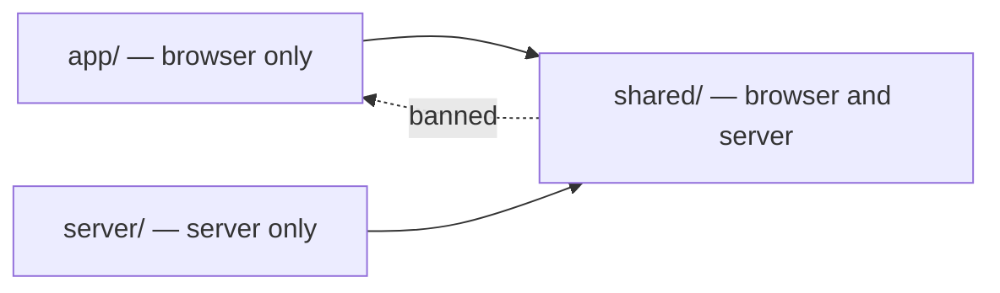

# Module boundaries

`packages/app` is one package with three import zones, and the whole standard is a single rule about which way an import may point.

`app/` (reached as `@/` or `~/`) is client code — meaning no server module may import it, **not** that it only ever executes in a browser: the SSR render evaluates it in Node, which is [browser execution](/docs/architecture/browser-execution)'s subject rather than this page's. `server/` is Nitro code. `shared/` (reached as `#shared`) is the ground both stand on: every module in it is parsed by the server **and** shipped to the browser. So `app/` and `server/` may import `shared/` freely, and `shared/` may import neither.

## Why the direction matters

An import from `shared/` into `@/` is not a style complaint. It drags whatever the client module pulls in — a UI component library's types, a form vocabulary, a browser-only runtime value — into the graph the server evaluates, and it does so invisibly: the offending import usually sits several hops from the module a server route actually named. A validation schema that a tRPC procedure parses should not be able to fail because a Vuetify type moved.

The direction also encodes the honest split of responsibility. `shared/` states **what a thing is** — its fields, its constraints, the refinements that make a value valid anywhere. How that thing is _rendered_ is a client question, and a client question answered inside `shared/` is a boundary violation waiting to look like a schema.

## Twins, not relocation

When a `shared/` module is found reaching into `@/`, the fix is almost never to move the client module down into `shared/` — that relocates the boundary instead of restoring it, and usually drags a UI dependency along. The fix is a **twin**: `shared/` keeps the validating schema, and `app/` gets a form schema derived from it.

Derived is the load-bearing word. A twin that restates its counterpart is two schemas that drift; a twin built with Zod's `safeExtend` layers presentation onto the shared schema and overrides nothing else, so a field, constraint or refinement added on the shared side reaches the form without being copied. Typing the result `satisfies z.ZodType<TSharedType>` closes the loop — an arm that stops matching what the server parses stops compiling.

The sheet column forms are the worked example. `shared/models/resource/sheet/column/transformation/` holds transformation schemas with no presentation metadata at all; `app/models/resource/sheet/column/transformation/ColumnTransformationForm.ts` holds the vjsf twin that names which context list feeds each source-column picker. The column form schemas themselves live wholly under `app/` — nothing on the server ever parsed them.

## Enforcement

An `overrides` entry in the root `.oxlintrc.json` scopes `no-restricted-imports` to `packages/app/shared/**` and bans the `@/**` and `~/**` patterns. It catches type-only imports too, which matters — a `.d.ts` augmentation reaching into `app/` is the same coupling with the runtime cost hidden.

Two things about that entry are easy to get wrong. Oxlint's path globs do not cross `/`, so the pattern must be `@/**` and never `@/*`. And an `overrides` entry **replaces** a rule's options rather than merging with them, so the repo-wide `node:crypto` ban has to be restated inside the override or it silently stops applying to `shared/`.

The server direction is deliberately not banned. A handful of `shared/` modules reach into `@@/server` for a router's inferred types or to register a test double, which costs nothing at runtime.

Nor does the rule reach `scripts/`. The Tiled and Phaser code generators import from `@/` for the tilemap property models they emit against — Node processes reading the browser tree, which never enters either runtime graph.

## What stays in `shared/` despite reaching nothing

The ban guards the import direction. It says nothing about the weaker case: a module that lives in `shared/` and imports no client code, but which no server module ever uses. That is client code paying a shared-tree tax, and it is what drags client concerns back toward the boundary over time — so the default is that such a module moves to `app/`.

Three exceptions are deliberate, and are recorded here so an audit does not keep rediscovering them:

- **`shared/generated/tiled/**`** — only three of its outputs are server-reached, but the generator hardcodes a single output root, so splitting them is a generator change rather than a relocation.
- **`shared/generated/phaser/**`** — currently has no consumer at all. It is retained deliberately: the generator was ported ahead of the code that will read it, and deleting the output without deleting the generator only recreates it.
- **`shared/types/crossws.d.ts`** — a server-only ambient augmentation. Both `tsconfig.app.json` and `tsconfig.server.json` include `../shared/**/*.d.ts`, so it resolves from where it is.

## A workspace package is imported where it lives

The zones above are about direction. The fourth import kind — a workspace package such as `@esposter/db` or `@esposter/shared` — has no direction question, and gets no local shim: a file under `server/services/` whose whole body re-exports one name from a package is deleted and its callers import the package. The shim reads like an abstraction seam but is not one. Nothing can be swapped behind it, since the package is where the function is defined and the Azure Functions handlers reach it directly anyway, and it leaves the same function reachable under two names — so a grep for callers answers half, and two files disagree about which import path is idiomatic.

The seam that is worth keeping is the opposite shape: a local function that _wraps_ package behaviour with something of its own, like `getSurveyResponseFilter` naming what "this survey's responses" means on top of `getPartitionKeyFilter`. The test is whether deleting the file would lose a decision.

## Key files

| File                                                                                       | Role                                                     |
| ------------------------------------------------------------------------------------------ | -------------------------------------------------------- |
| `.oxlintrc.json`                                                                           | The `packages/app/shared/**` override carrying the ban   |
| `packages/app/shared/types/zod.d.ts`                                                       | Zod metadata both zones share                            |
| `packages/app/app/types/zod.d.ts`                                                          | Client-only Zod metadata, merged into the same interface |
| `packages/app/app/models/resource/sheet/column/transformation/ColumnTransformationForm.ts` | The worked twin                                          |
