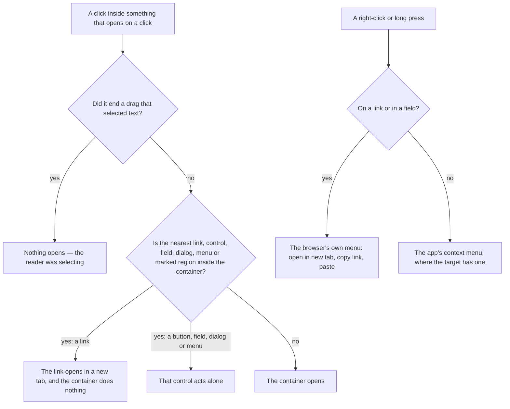

# Nested Interactions

A click does one thing. When something that opens on a click — a table row, a dashboard tile, a folded tool call — holds a link, a button or a dialog of its own, a click on that inner thing is its alone: the link opens and the row does not. Before this standard, a link in a todo's notes opened in a new tab _and_ opened the todo's edit dialog behind it, and a still click anywhere inside a dashboard tile's open edit dialog re-opened the dialog over itself, throwing away the unsaved edits.

## Is opening a new tab right?

Yes, for a link inside what a person wrote. Chat, feed and task apps open a link in user content in a new tab, so the reader keeps their place in the conversation or the list they were reading. What no app does is also act on the container behind it, which is the half this page fixes. The sanitizer writes the tab rule onto every link rather than trusting the markup: `target="_blank"` and `rel="noopener noreferrer nofollow"`, so an author's `rel="opener"` never gives the new tab a way to redirect the one it came from.

## How a click is routed

## How it works

- **The container decides, never a wall around each control.** Whatever opens on a click asks `checkIsNestedInteraction(event)` first. It finds the nearest link, button, field, `summary`, `label`, dialog, menu, or element with an interactive role between the click and the container, and if that element sits inside the container the click is not the container's. A control nobody thought to wall off — a link in rendered HTML above all — is covered because nobody has to think of it.
- **A region that is its own control without being one says so.** A table's selection cell and a dashboard tile's action corner are not buttons themselves, but a click on their padding must not open the row or the tile, so each carries `data-nested-interaction`, which the guard treats as a control.
- **Ending a selection is not a click.** A reader dragging across a row's text to copy it releases the pointer on the row; a non-empty text selection at that moment means nothing opens.
- **A bare `@click.stop` is banned.** It was the old mechanism — a wall around each control remembered by hand — and it can never cover the link inside rendered HTML. The `vue/no-restricted-syntax` entry in `restrictedEventSyntaxes.js` fails a template that builds one.
- **Nested interactive content is still never built.** A row that is itself a button or a link holds nothing interactive inside it, since the browser gives the whole row's activation to the outer element; its controls sit beside it (`UiList`'s actions slot, the `vue-page-composition` skill's list shells). A todo's row keeps its notes in the dialog for the same reason: rendered notes inside the row's button would put their links inside a button.
- **A preview is inert.** A message drawn as a preview — a search result, a thread in the threads list — takes no pointer inside its body, so the whole card is one target that jumps to the message, and a link inside it is not a second target.
- **The browser's menu stays over a link.** A right-click or a long press on a link, even inside something with a context menu of its own, gives the browser's menu with opening the link in a new tab and copying its address, as a field keeps it for paste and spell-check ([context menus](/docs/architecture/context-menus)).

## The surfaces

| Surface                                          | What opens on a click           | Inside it                                             |
| :----------------------------------------------- | :------------------------------ | :---------------------------------------------------- |
| `UiDataTable` rows — resources, survey responses | The row's `onOpen`              | The selection checkbox, a favorite star, action menus |
| A dashboard visual's tile                        | Its edit dialog                 | The edit and delete corner, the dialog itself         |
| The agent console's tool calls and thinking      | Folding or unfolding the block  | Text a reader selects                                 |
| A TodoList's task row                            | The todo's detail dialog        | Nothing — the notes stay in the dialog                |
| Posts and comments                               | Nothing — the title is the link | Their rendered description and its links              |

## Key files

| File                                                            | Role                                                          |
| :-------------------------------------------------------------- | :------------------------------------------------------------ |
| `apps/web/app/util/dom/checkIsNestedInteraction.ts`             | Whether a click belongs to something inside its container     |
| `apps/web/app/services/ui/constants.ts`                         | The guard's selector, and the context menu's browser selector |
| `apps/web/app/components/Ui/DataTable.vue`                      | A row that opens on a click, through the guard                |
| `apps/web/app/composables/onClickExceptDrag.ts`                 | A click that was not a drag's end, through the guard          |
| `apps/web/app/composables/ui/useContextMenu.ts`                 | Leaves a link and a field to the browser's own menu           |
| `packages/shared/src/services/sanitizeHtml/sanitizeTextHtml.ts` | Writes the new tab and the fixed `rel` onto every link        |
| `packages/configuration/eslint/restrictedEventSyntaxes.js`      | Bans the bare `@click.stop` wall                              |

## Sources

- [HTML Living Standard — the `a` element](https://html.spec.whatwg.org/multipage/text-level-semantics.html#the-a-element) — an `a` element's content model admits no interactive content, which is why a control is placed beside a link row rather than inside it.
- [MDN — `rel="noopener"`](https://developer.mozilla.org/en-US/docs/Web/HTML/Attributes/rel/noopener) — what `window.opener` hands a page opened in a new tab, and that an explicit `rel="opener"` restores it.
