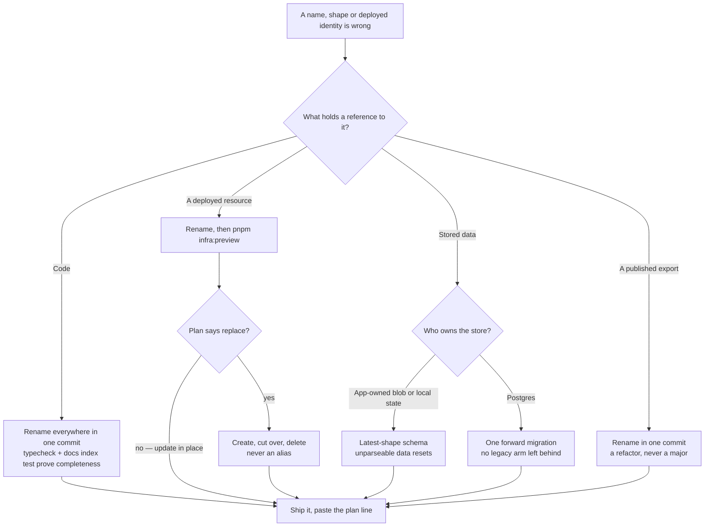

# No compatibility debt

Nothing in this repository exists to keep an older version of itself working. When a name, a shape or a deployed identity turns out to be wrong, it is corrected in place and every reference moves with it in the same commit. The old form is deleted, not aliased.

This is the rule the codebase's other absences follow from: there are no `@deprecated` markers, no `nameV2`, no re-export shims pointing an old path at a new one, no Pulumi `aliases`, no legacy union arms in a schema, and no read path that accepts two shapes because one of them used to be written.

## Why the cost argument does not apply here

The usual reason to keep a wrong name is that changing it is expensive. Here it is not, and each of the three places that could have been expensive has already been paid for:

- **Names in code** — the compiler finds every reference. A rename that typechecks is complete, and what typecheck cannot see (a path in a docs table, a name in prose) is covered by the docs index test and a grep across `content/docs`, `.agents` and the READMEs.
- **Deployed identities** — infrastructure is Pulumi code ([platform](/docs/architecture/platform)), so renaming an Azure resource, a function, or the identifier a subscription points at is an ordinary edit followed by `pnpm infra:preview`. The plan says exactly what will happen before anything happens. "This would be a risky infra change" is a claim a preview either supports or refutes, and it is not allowed to stand unpreviewed.
- **A published package's exports** — `virrun`, `parse-tmx`, `vue-phaserjs`, `azure-mock`, `@esposter/azure`,
  `@esposter/shared` and `@esposter/xml2js` are published, and renaming an export from one is **not treated as a
  breaking change here**. The packages exist because this repository needed them factored out, not because they
  have an audience to keep faith with; every call site of every export lives inside its own package or inside
  this monorepo, where the compiler finds them. Paying a major — which in lerna's fixed mode drags all seven to
  the next whole number, including the ones that changed nothing — to protect a consumer nobody has is the same
  cost argument this page refuses everywhere else. So a rename lands as a `refactor` like any other, and no
  commit carries a `BREAKING CHANGE:` footer for one. This is a statement about _these_ packages: it stops
  applying the day one of them is adopted somewhere that is not this repository.
- **Persisted shapes** — covered in full by [persisted data — latest shape only](/docs/architecture/persisted-data-latest-shape-only): app-owned state parses the latest shape or resets, and server-owned relational data evolves through a real Drizzle migration.

A migration is forward-only movement to the correct state. That is the opposite of a compatibility shim, which is a permanent second code path funded by a temporary population.

## What a correction looks like

## The one thing that is kept

A name that is still **accurate** is not churn to be renamed for symmetry with its neighbours. `deleteStorageBlobs` sits beside `releaseStorageLedgerEntries` because it really does delete blobs and then release their ledger entries ([storage quotas](/docs/platform/storage-quotas)); renaming it to match the table would make it describe something it does not do. Correctness is the criterion, not consistency of prefix.

## What this rules out

- Keeping a stale identifier because renaming it "touches infra" — preview it and read the plan.
- Shipping a rename with a re-export of the old path "for now", which makes the old name permanent by making nothing fail.
- A schema that accepts the previous shape alongside the current one.
- Version-suffixed anything (`useFooV2`, `handlerNew`) as a way of avoiding the rename.
- A comment explaining that a name is historical. If it is wrong, change it; the explanation is the cost.
