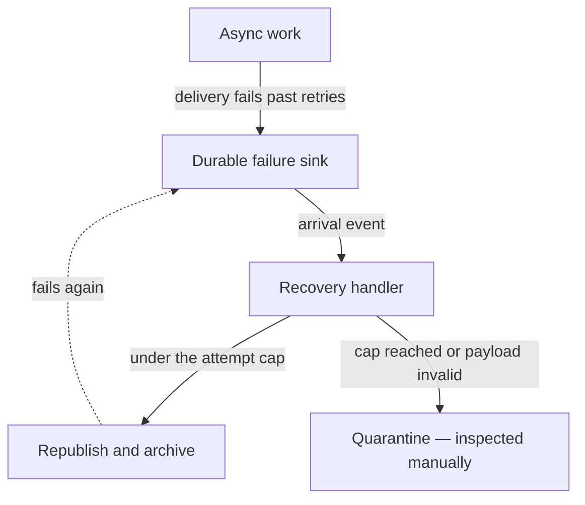

# No Manual Recovery

When async work fails past its retries, the recovery path must be **automatic and push-triggered**. A recovery step that only happens because a human noticed and ran something is not a recovery path — it is an outage with extra steps, and it decays the moment the person who knew about the script stops looking.

Every failure sink in this repository follows the same three-stage shape:

1. **Land the failure somewhere durable.** Exhausted deliveries are written down, never dropped — Event Grid dead-letters to a blob container, and the write itself is what starts recovery.
2. **React to the landing as an event.** Something arriving in the failure sink pushes to a handler. No cron sweeping a container, no operator command — that would be [polling](/docs/architecture/no-polling) wearing an ops hat.
3. **Cap the attempts, then quarantine.** Automatic retry without a ceiling is a poison-message loop: the event fails, lands, is replayed, fails again, forever. The handler carries an attempt counter with the payload and, once the cap is reached — or the payload fails validation, so it can never succeed — moves it to a quarantine the trigger filter excludes, and logs the poison case through `context.error`. Nothing pages on that log — the alerting layer is deliberately absent to stay in the free tier ([observability](/docs/infra/observability)) — so the poison case is found by inspecting the sink it landed in. The recovery itself stays automatic — only the human hand-off for the poison case is manual.

The attempt counter travels **with the payload itself**, not in the handler's memory and not on the artifact the sink happens to store it in — so the count survives the round trip through the failure sink. Pick the carrier by asking what the sink round-trips verbatim: the dead-letter replay puts the count on each event's own id, because every failed cycle writes a brand-new blob and a blob-scoped counter would restart at zero forever. A counter that resets each cycle is the same infinite loop with more code.

**Delivery is at-least-once, so redelivery is normal input, not corruption.** A replayed batch may repeat an event id, and the same blob may be handed to the handler again after a partial failure — neither is a malformed payload, so neither is a validation bar: rejecting a batch for repeating an id would quarantine every healthy event batched alongside it. Handle it in the handler instead — make each step idempotent, and make the steps that emit the poison log (quarantine, `context.error`) fire only on the delivery that actually created the artifact, so one poison payload logs once rather than once per retry.

Cap **per unit of work, not per batch**. A sink usually lands whatever failed together, and judging the whole batch by its worst member lets one poison payload strand every transient failure beside it — so partition the batch, quarantine only what is over the cap, and retry the rest.

Manual operations scripts are still legitimate for work that is inherently a human decision — a one-off backfill, a data migration — but never as the recovery path for a failure the system can see happening. Such a script also belongs in the package whose environment it uses, not hoisted into a shared package.

The reference implementation is [Event Grid dead-letter](/docs/infra/eventgrid-dead-letter).
