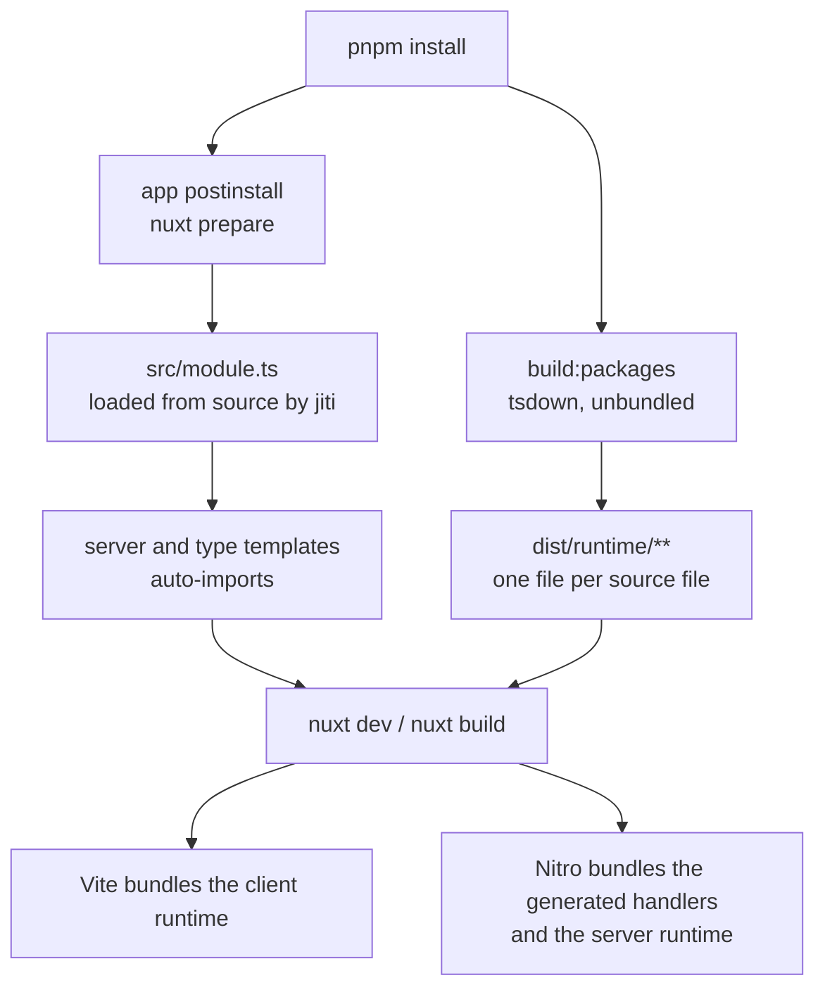

# Nuxt module packages

A package that joins a library to Nuxt is a **Nuxt module**, not a library each app wires by hand: the routes, the plugin, the type augmentation and the build entries a library leaves to its consumer are what a module does for itself through `@nuxt/kit`. Such a package runs in two places that must never meet. Its **module entry** is loaded by Nuxt, in Node, while it reads `nuxt.config`, before any bundler runs. Its **runtime** is code Nuxt bundles into the app and Nitro bundles into the server, and it imports frameworks — `nuxt/app`, `nitro/h3`, `vue` — that the configuration loader must never evaluate. Everything on this page follows from keeping those two apart. `packages/trpc-nuxt-module` is the package built this way ([trpc-nuxt-module](/docs/trpc-nuxt-module)).

## Where each half runs

- **The module entry is loaded before any package is built.** The app's `postinstall` runs `nuxt prepare`, which loads every module in the config, and on a fresh clone no workspace package has a `dist` yet. A module registered by its package name resolves to that missing `dist` and fails the install. So the app registers a workspace module by the path to its source entry — `../../packages/<package>/src/module.ts` — which Nuxt resolves from the app root and loads through jiti, `#src/*` imports included. A consumer outside the repository registers it by name, as the README shows. It is not an import: the configuration evaluates no workspace package, and Nuxt resolves the path itself — the same line a configuration file keeps everywhere else, where a value a package owns is written out rather than imported.
- **The runtime is loaded from `dist`, at dev and build time only**, after `build:packages`, the same as every other package the app bundles. The module names its runtime files by package subpath — `<package>/runtime/client/…` in `addImports`, `<package>/runtime/server/…` in a generated handler — never by a path into `src`.

## Layout and build

- **`src/module.ts` is the `.` entry**: `export default defineNuxtModule<ModuleOptions>(…)` and the `ModuleOptions` type, since Nuxt imports a module's default export. No barrel is generated (`exportsGeneration: "none"`); a generated barrel would reach the runtime and evaluate it at configuration time.
- **`src/runtime/**` is built unbundled**, one output per source file, which is Nuxt's own convention for a module's runtime: `entry` is the module plus the runtime glob, `unbundle: true` and `root: "src"`. tsdown writes an `exports` entry per file, so a new runtime file ships with nothing added by hand. A `services` folder under the runtime is the package's own and is excluded from `exports`; what stays public is the functions a consumer calls and the `models` that type them.
- **A type-only dependency the declarations reference is a `dependency`, never inlined.** Unbundled, tsdown cannot flatten an inlined package's declarations into one file and copies them under `dist/node_modules`, which npm never publishes — the bundled packages keep inlining because their declarations are flattened.
- **The runtime imports published packages only** — `nuxt/app`, `nitro/h3`, `vue`, `crossws` — never `#imports` or `#app`, nor bare `h3` or `nitropack/*`, whose server code Nuxt 5 runs under its Nitro 2 compatibility layer. Nuxt's virtual modules resolve only inside a Nuxt build and export values, not types, so a runtime file importing them fails `deps.onlyImport`, fails under a test runner, and ships declarations that collapse to `any`. Nuxt, Vue, Nitro and every engine the module joins are `peerDependencies`; `@nuxt/kit` and `@nuxt/schema` are `dependencies` of the module entry.
- **Nuxt transpiles a module's own root**, so the app carries no `build.transpile` entry for it.

## What the module generates

- **Server handlers are server templates.** `addServerTemplate` writes a small module that imports the app's own exports by the path the options resolved — through Nuxt's aliases, since Nitro knows none — and `addServerHandler` registers it. A handler that needs the Nitro app at its top level is registered `lazy`, because a handler Nitro imports eagerly runs before the app exists.
- **Runtime hooks are named under the module**: `<package>:<subject>:<event>`, one constant each in `src/runtime/constants.ts`, annotated with their template literal type so a hook map stays keyed by the literal names. A type template declares them on `NitroRuntimeHooks`, in both the Nitro and the Nuxt type contexts, because Nuxt typechecks server routes in the app project too.
- **Nitro's options are typed by `@nuxt/nitro-server`'s augmentation**, which a module compiled outside an app does not load; the module entry imports it for its types alone.

## Tests

- **Composables run inside a fixture app.** The package's Vitest config is `defineVitestProject` over the shared factory, rooted at `test/fixture` — a `nuxt.config.ts` and nothing else — with the default environment put back to `node`, so only a file headed `// @vitest-environment nuxt` pays for the Nuxt runtime. That is Nuxt's own recommendation for testing a module, and it is what lets a composable run over the real `useAsyncData` rather than a mock of it.
- **Server runtime runs against a real h3 app** on a real node server, and a WebSocket handler against crossws's node adapter with tRPC's own client — the transport under test is the one production uses.
- **The generated templates are not asserted as text.** What they produce is proven by the app that registers the module: its typecheck, its suites and its dev server.

## Key files

| File                                                    | Role                                                                  |
| ------------------------------------------------------- | --------------------------------------------------------------------- |
| `packages/trpc-nuxt-module/tsdown.config.ts`            | The module entry and the unbundled runtime directory                  |
| `packages/trpc-nuxt-module/src/module.ts`               | The module entry — options, templates, handlers and imports           |
| `packages/trpc-nuxt-module/src/runtime/constants.ts`    | The runtime hook names, readable from both the module and the runtime |
| `packages/trpc-nuxt-module/vitest.config.ts`            | The fixture-rooted Nuxt project with a node default                   |
| `packages/trpc-nuxt-module/test/fixture/nuxt.config.ts` | The fixture app the composable suites run in                          |
| `apps/web/configuration/modules.ts`                     | The app registering a workspace module by its source                  |

## Sources

- [Module author guide](https://nuxt.com/docs/4.x/guide/modules), [module anatomy](https://nuxt.com/docs/4.x/guide/modules/module-anatomy), [advanced recipes](https://nuxt.com/docs/4.x/guide/modules/recipes-advanced), [best practices](https://nuxt.com/docs/4.x/guide/modules/best-practices) and [testing](https://nuxt.com/docs/4.x/guide/modules/testing) (Nuxt) — the runtime directory, templates and type contexts, prefixed exports and hooks, fixture-based tests.
- [Unbundle mode](https://tsdown.dev/options/unbundle) (tsdown) — one output per source file under a common root.
