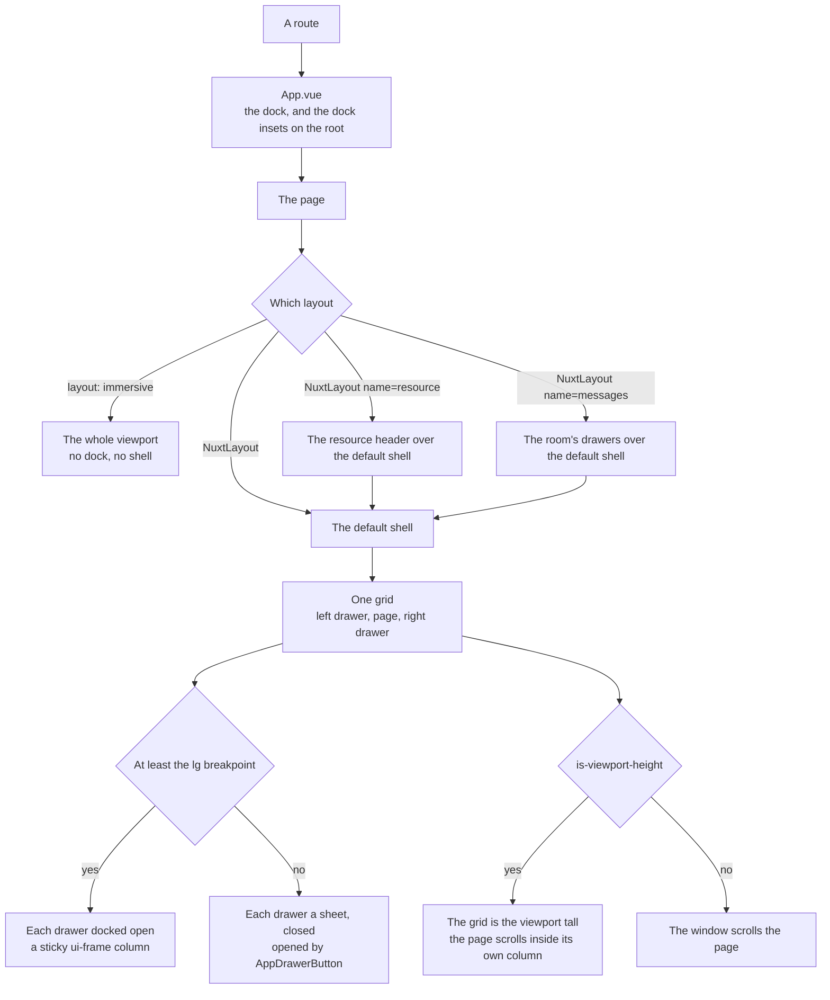

# Page Layout

Every page is laid out by the same process: it picks a layout, the layout builds the shell, and the shell decides what the width and the height change. A page only fills slots. It never paints its own background, never positions a region and never opens a drawer by hand, because each of those already has one owner below, and a page doing it again is a second owner that drifts from the first.

## How a page is laid out

- **A page picks a layout and fills its slots.** The default slot is the page; `#left` and `#right` are its drawers, and a page with neither has one column. `resource` wraps the default shell with the header every resource page shares — its trail, storage meter, title and section links — and `messages` fills the room's drawers and sizes them from the reader's resize handles. `immersive` is a place of its own: no dock, no shell, the whole viewport to draw in, and the page brings its own way back.
- **The shell is one grid.** Its columns are the left drawer, the page and the right drawer, and a docked drawer's column is as wide as the drawer while it is open and none at all while it is closed, so the page takes the room as the columns animate and no region is offset by hand. A docked drawer is sticky, so it stays in view while the window scrolls the page, and holds its content at full width so closing clips it toward its edge.
- **Every region starts where the dock ends.** The dock's breadth is `--dock-size`, and the app root sets `--dock-inset-inline-start` and `--dock-inset-block-end` by breakpoint. The shell pads its grid by them, and a fixed region of a page's own, or a page sized to the viewport, subtracts them rather than a bar's height.

## What the width changes

A wide screen docks every drawer the page has, open. A narrow one keeps each closed behind a button as a `UiDialog` sheet arriving from its own side, and a page picked from inside one closes it. Both renders start narrow, since the server has no screen ([responsive breakpoints](/docs/architecture/responsive)), so the layout decides after mount.

- **The button that opens a drawer is `AppDrawerButton`**, placed by the page in its own header — beside the title, in the toolbar — since where it reads naturally is the page's call. The component owns the rest: it exists only on a narrow screen and opens its side's drawer. A page with a drawer and no button leaves a phone no way to reach the drawer at all.
- **A drawer is titled once.** A sheet draws a title bar with a close button over what the page put in it. Content that already draws its own — the room's side panes, each under one `MessageRightSideBarHeader` with its title and close — passes `is-right-title-hidden`, and the sheet keeps its title only as the dialog's accessible name, so no screen shows two titles and two close buttons for one pane.

## What the height changes

Every page scrolls the window, which keeps the browser's scroll restoration, anchors and find-in-page. A page that scrolls inside its own regions — a room, a call, a game — passes `is-viewport-height`: the grid is then exactly the viewport tall, its one row is definite, and the page's `h-full` column resolves against it with its scrolling child `flex-1`. The room's composer is the last row of the room's own column, so the shell has no footer.

## Which part draws each surface

| Surface                         | Drawn by                                             |
| ------------------------------- | ---------------------------------------------------- |
| The ground under everything     | `body`, in the `background` token (`globals.scss`)   |
| A docked drawer                 | The shell's `<aside>`, which wears `ui-frame`        |
| A drawer on a narrow screen     | `UiDialog`, as a sheet                               |
| The page                        | Nothing — the page sits on the ground                |
| A region inside the page        | The component that is the region, wearing `ui-frame` |
| A bar — a room's header, a tool | The bar, wearing `ui-bar`                            |

**No page paints its own background, and the layout takes no style from a page.** A page that looks like it needs one — a list that should read as a panel — is a list that belongs in a drawer, or a region that wears `ui-frame`. The shell's props are only what the grid needs to know — the drawers' widths and titles, and the height mode — since a style prop would let any page push any style into the one component every page shares.

## Notes

- **`/messages` has nothing to show of its own.** It opens the reader's last room, or with none the friends page, as Discord's home is its friends list — so the room list is always the left drawer, never a page, and no page in the app has a surface to paint.

## Key files

| File                                           | Role                                                                        |
| ---------------------------------------------- | --------------------------------------------------------------------------- |
| `apps/web/app/App.vue`                         | The dock and the dock insets on the root, around every page                 |
| `apps/web/app/layouts/default.vue`             | The shell grid: the drawers as columns or sheets, the page, the height mode |
| `apps/web/app/layouts/resource.vue`            | The resource header over the default shell                                  |
| `apps/web/app/layouts/messages.vue`            | The room's drawers over the default shell, sized from the resize handles    |
| `apps/web/app/layouts/immersive.vue`           | The whole viewport, with no dock and no shell                               |
| `apps/web/app/components/App/DrawerButton.vue` | The one button that opens a drawer on a narrow screen                       |
| `apps/web/app/store/layout.ts`                 | Whether the screen is wide, and whether each drawer is open                 |
