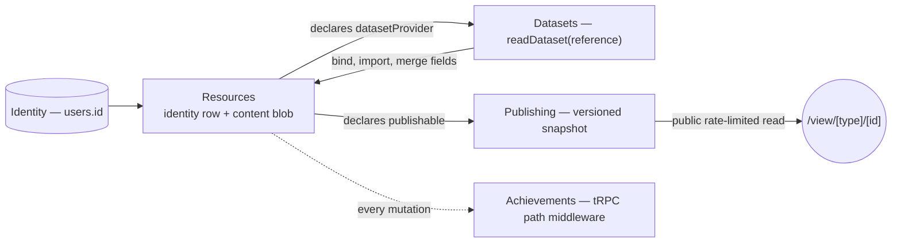
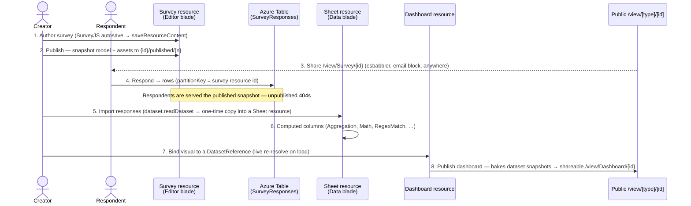

# Platform — Cross-Product Layer Model

How Esposter's products link together. Five layers; the Resources layer carries the products, and the others are capabilities or infrastructure it plugs into.

## Principle

> **Everything is a resource; capabilities are opt-in.** A resource exposes and consumes **datasets** if it declares so. Anything publishable gets a **public versioned read**. Every mutation is already an **achievement trigger**.

New products join the platform by adding one `ResourceType` and one `ResourceDefinitionMap` entry, not by adding services or bespoke pages. Games, anime, and the fluid simulator deliberately stay outside (achievements only) — a game save has nothing to gain from naming, sharing, or dataset semantics.

## Layer model

| Layer          | Contract                                                                                                               |
| -------------- | ---------------------------------------------------------------------------------------------------------------------- |
| **Identity**   | `users.id` (better-auth) keys every row, blob path, and session — shared by all products                               |
| **Resources**  | Postgres identity row + content blob + capability declaration → [resources](/docs/architecture/resources)              |
| **Datasets**   | Columns + rows served by DatasetProvider types → [datasets](/docs/architecture/datasets)                               |
| **Publishing** | Versioned publish copy + public rate-limited read at `/view/[type]/[id]` → [publishing](/docs/architecture/publishing) |
| **Events**     | tRPC mutation path = achievement trigger key (`achievementPlugin`) — every new procedure is automatically triggerable  |

## Business-logic user journey

The headline cross-product flow — **create a survey → collect responses → extract/transform → visualise → publish** — runs entirely through resources and their capabilities:

## Capability matrix

`ResourceDefinitionMap` ([resources](/docs/architecture/resources)) is the authoritative declaration; this is the summary:

| ResourceType | Publishable | DatasetProvider | FileAssets | Portable  | Blades beyond Overview/Editor |
| ------------ | :---------: | :-------------: | :--------: | :-------: | ----------------------------- |
| Blueprint    |             |                 |            |           |                               |
| Dashboard    |     ✅      |                 |            |           |                               |
| Email        |     ✅      |                 |     ✅     | ✅ export |                               |
| Flowchart    |     ✅      |                 |            |           |                               |
| Note         |     ✅      |                 |            |           |                               |
| Program      |             |    ✅ status    |            |           | Setup, Status                 |
| Sheet        |             |       ✅        |            |    ✅     | Data, Settings                |
| Survey       |     ✅      |  ✅ responses   |     ✅     |           | Responses                     |
| TodoList     |             |                 |            |           | Items, Calendar               |
| Webpage      |     ✅      |                 |     ✅     |           |                               |

Outside the resource model: **Posts** (relational Postgres, social feed semantics), **Esbabbler** (distribution channel for published links), **Achievements** (the events layer itself), and **games/anime/fluid** (blob save state or none; achievements only). Single-blob-per-user save state (`useSave`, blob `${userId}/save`) remains only for genuinely one-per-user saves: clicker and dungeons.
