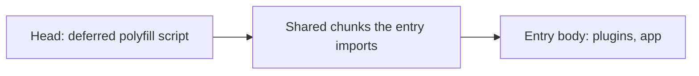

# Polyfills

A polyfill installs a global that a browser the app supports does not ship yet. Every one is a gap in a browser rather than a design decision, so each is written to be deleted: it says which browser lacks what, and the signal that ends it.

## A head script, never a plugin or an import

Modules read globals while they load — a constant such as `Temporal.Duration.from({ seconds: 1 })` runs the moment its file is evaluated. So a polyfill has to run before the first module that reads it, and nothing inside the bundle can promise that. The bundler places shared modules in chunks the entry imports, and every chunk an entry imports is evaluated before the entry's own body. A polyfill imported by the entry, or installed by a plugin sorted first, runs after those chunks — a sorted plugin order only orders the plugins.

A deferred classic script in the document head is outside that graph. Deferred classic scripts and module scripts share one queue in document order, and the head scripts lead it, so the polyfill has finished before any chunk is evaluated.

## The shape every polyfill takes

- **One script per global**, in `apps/web/configuration/app.ts`'s `head.script` list. That list is the inventory — this page does not copy it. Each one retires on its own signal, so removing one never touches another. Every browser fetches every script, a browser with the native global included, so a polyfill costs its size on every first visit until it is deleted.
- **Served under `/polyfills/`**, named after the global it installs. A package's global build is served from its own install through a Nitro `publicAssets` entry in `apps/web/configuration/nitro.ts`, so its version is the lockfile's and no copy of it is committed. A polyfill we write ourselves goes in a `polyfills` folder under `apps/web/public`.
- **It leaves a native global alone**, so the script turns into a no-op as browsers ship the feature, before anyone deletes it.
- **A `@TODO` on its entry** links the feature's [Web Platform Status](https://webstatus.dev) page and names the browsers that still lack it. The script is deleted, with any dependency it alone uses, once the feature is Baseline.
- **A web worker polyfills itself.** A worker has its own global, which the head script never reaches, so a worker that reads the global imports the package's global entry on its first line, as `app/workers/agentConsole/chunk.worker.ts` does.

## What a polyfill is not for

A library that reads a global it could do without — a module-level lookup on a browser feature it never needs — is fixed at the dependency, not stubbed. A stub keeps a crash and a dependency around for nothing. That is why `parse-tmx` takes XML text and no `data-urls`: its `whatwg-url` chain reads `SharedArrayBuffer` at load, a global a browser exposes only on a cross-origin isolated page, and Safari cannot isolate a page under the `credentialless` embedder policy the app sends.

## Rejected

- **A plugin or an import at the top of the entry.** It runs after the chunks the entry imports, which is the bug this page exists for.
- **Rolldown's `strictExecutionOrder`.** It would keep module order across chunks, but by wrapping every module in the bundle, to serve a few globals.
- **One file for every polyfill.** A package's global build cannot be folded into a file of ours without committing a copy of it, and removing one would mean editing a file the others share.
- **A committed copy of a package's global build.** It falls behind the dependency that ships it.
