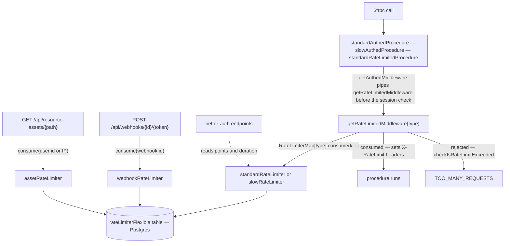

# Rate Limiting

When a feature page calls a procedure "rate-limited", this is the mechanism it means. Every budget in the app is a [`rate-limiter-flexible`](https://github.com/animir/node-rate-limiter-flexible) `RateLimiterDrizzleNonAtomic` whose store is the app's own Postgres database — the `rateLimiterFlexible` table in `@esposter/db-schema`, a key plus a point count and an expiry. Because the counters live in the database rather than in process memory, one budget is shared across every running instance: scaling out adds throughput, not allowance.

A limiter is defined by two configured numbers — how many points a key may spend (`points`) and the window it spends them in (`duration`, in seconds) — a mandatory `keyPrefix` naming its keyspace, and optionally a `blockDuration` that locks a key out for a further period once it overspends. Each limiter lives in its own file under `server/services/rateLimiter/`.

## The four limiters

| Limiter               | Budget             | Key prefix        | Keyed on                        | Guards                                   |
| --------------------- | ------------------ | ----------------- | ------------------------------- | ---------------------------------------- |
| `standardRateLimiter` | 1000 points / 60s  | `Standard`        | user id, else path + IP address | ordinary tRPC procedures                 |
| `slowRateLimiter`     | 100 points / 60s   | `Slow`            | user id, else path + IP address | expensive or abuse-prone tRPC procedures |
| `webhookRateLimiter`  | 30 points / 60s    | `Webhook`         | the webhook's id                | the inbound webhook push route           |
| `assetRateLimiter`    | 10000 points / 60s | `resource-assets` | user id, else IP address        | the resource-asset redirect route        |

The first two are procedure budgets and are the only two in the central registry, `RateLimiterMap.ts`, which is declared `as const satisfies Record<RateLimiterType, RateLimiterDrizzleNonAtomic>` over the two-value `RateLimiterType` enum (`Slow`, `Standard`) so adding an enum member fails to compile until a limiter exists for it.

The webhook and asset limiters sit outside that map deliberately, because neither describes a procedure budget. A webhook is a machine identity rather than a caller, so its budget is keyed on the webhook row itself and no user or address is involved. Assets are not API calls at all: one rendered page issues one request per embedded asset and every anonymous viewer behind a shared egress address arrives on the same key, so the traffic on one key is renders times assets times viewers. That limiter is also the only one with **no** `blockDuration` — a burst has to be allowed to recover on its own inside the sliding window instead of locking an address out of a page it is entitled to read.

## Enforcement

`server/trpc/middleware/getRateLimitedMiddleware.ts` is the whole tRPC enforcement path. It resolves the session first, then consumes a point: on the user id when a session exists, and otherwise on `` `${path}${ID_SEPARATOR}${ipAddress}` `` so an anonymous caller is budgeted per procedure per address rather than globally. On success it writes `Retry-After` and the `X-RateLimit-Limit` / `X-RateLimit-Remaining` / `X-RateLimit-Reset` headers so a client can back off before it is refused. Outside production the middleware short-circuits after resolving the session. In production the bypass is narrower than it looks: only an **anonymous** request whose IP address cannot be determined is warned about and allowed through, because that is the one case with no key to spend a point against — a signed-in caller is keyed on its user id and is budgeted regardless. `getIpAddress` also falls back to the socket's remote address, so the header being absent is not by itself enough to reach the bypass.

Because the middleware already resolved the session, `getAuthedMiddleware.ts` simply pipes it and then rejects when there is no session. Authentication and rate limiting are therefore a single middleware in one order: **a caller is charged before it is told it is unauthorized**, which is what stops an unauthenticated attacker from probing authed procedures for free.

Every limiter writes to one table, so each carries its **own key prefix** and the budgets stay independent. Without one, three of the four would share a counter row per signed-in user — both procedure limiters and the asset limiter key an authed caller on the bare user id — and the slow budget would be spent out by ordinary app traffic, refusing the first slow call of the session, while one published page full of images would 429 the app around it. That is a correctness invariant rather than a nicety, so `createRateLimiter` takes `keyPrefix` as a **required** parameter: a new limiter cannot inherit a shared keyspace by omission, and `createRateLimiter.test.ts` pins that the four prefixes are distinct.

Three procedure builders sit on top: `standardRateLimitedProcedure` (public, standard budget), `standardAuthedProcedure`, and `slowAuthedProcedure`. `AuthedProcedureMap.ts` maps the enum onto the latter two, and the room procedure builders — `getPermissionsProcedure` and `getOwnerProcedure`, described in [RBAC](/docs/esbabbler/rbac) — take a `rateLimiterType` parameter defaulting to `Standard` and select through it, so moving a room procedure onto the slow budget is a one-argument change at its declaration.

## Answering 429 instead of 500

`rate-limiter-flexible` signals an over-budget consume by **rejecting with a `RateLimiterRes`**, which is not an `Error` and carries no `message`. Every [neverthrow](/docs/architecture/async-operations) boundary in the repo wraps a non-`Error` rejection, so by the time a caller inspects it the `RateLimiterRes` is the `cause` of a wrapper `Error` and a bare `instanceof` check misses it — dropping the request into the generic branch that answers 500. `checkIsRateLimitExceeded.ts` checks both shapes once, so no call site has to know which side of a `getResultAsync` it is reading the rejection on.

## Notes

- better-auth's own endpoints are budgeted to match: `server/auth.ts` sets its `rateLimit.max` and `rateLimit.window` from `standardRateLimiter.points` and `standardRateLimiter.duration`, so the numbers stay in one place even though better-auth keeps its own counters.
- `nuxt-security` ships a rate limiter and it is explicitly turned off (`rateLimiter: false`) — see [security posture](/docs/architecture/security-posture). This page describes the only rate limiting the app performs.

## Key files

Paths relative to `packages/app` unless noted.

| File                                                      | Role                                                      |
| --------------------------------------------------------- | --------------------------------------------------------- |
| `packages/db-schema/src/schema/rateLimiterFlexible.ts`    | the shared counter table                                  |
| `server/services/rateLimiter/standardRateLimiter.ts`      | the default procedure budget                              |
| `server/services/rateLimiter/slowRateLimiter.ts`          | the tightened budget for expensive procedures             |
| `server/services/rateLimiter/webhookRateLimiter.ts`       | per-webhook budget for the inbound push route             |
| `server/services/rateLimiter/assetRateLimiter.ts`         | asset-request budget, deliberately without a block period |
| `server/services/rateLimiter/createRateLimiter.ts`        | the shared constructor — window, store, required prefix   |
| `server/services/rateLimiter/RateLimiterMap.ts`           | enum → limiter registry for the procedure budgets         |
| `server/services/rateLimiter/checkIsRateLimitExceeded.ts` | recognises the rejection through a neverthrow wrapper     |
| `server/models/rateLimiter/RateLimiterType.ts`            | the `Slow` / `Standard` enum                              |
| `server/trpc/middleware/getRateLimitedMiddleware.ts`      | consumes a point and sets the response headers            |
| `server/trpc/middleware/getAuthedMiddleware.ts`           | pipes the rate limiter, then requires a session           |
| `server/trpc/procedure/AuthedProcedureMap.ts`             | enum → authed procedure builder                           |
| `server/api/webhooks/[id]/[token].post.ts`                | inbound webhook route, 429 on overspend                   |
| `server/api/resource-assets/[...path].get.ts`             | asset redirect route, 429 on overspend                    |
| `server/auth.ts`                                          | better-auth budget derived from the standard limiter      |
