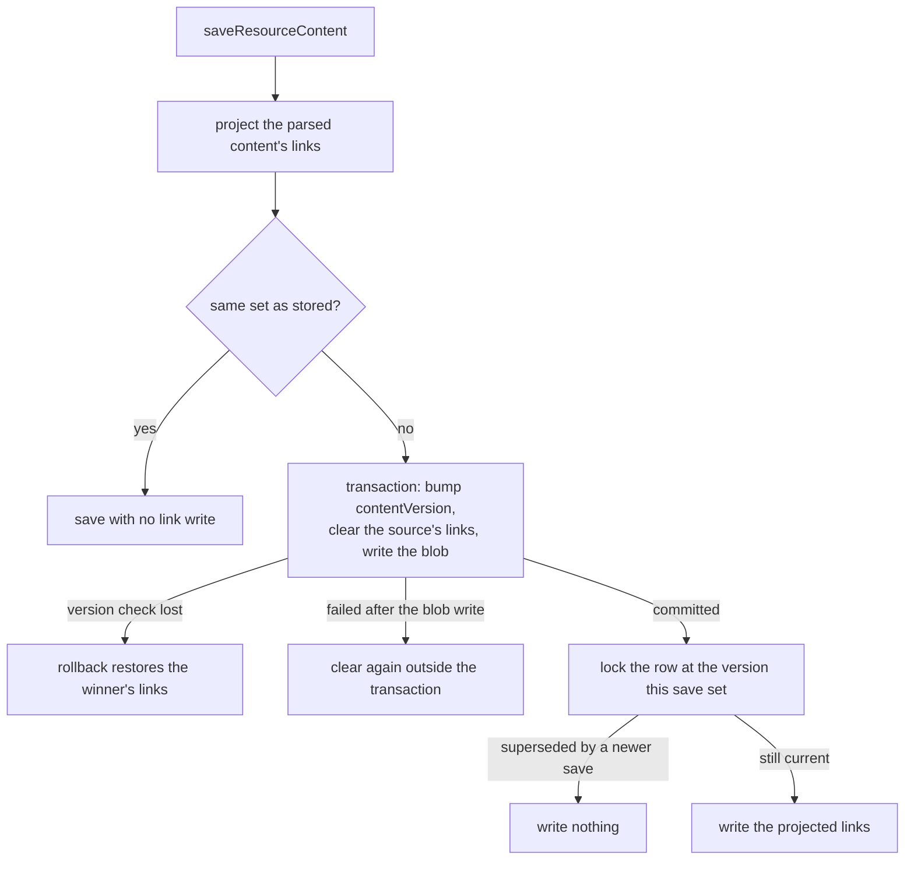
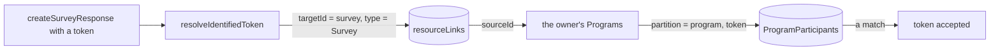

# Resource Links

A resource points at other resources by id inside its own content: a Program names the Survey it issues tokens for, the Email it sends and the dataset that is its audience; every Dashboard visual names the dataset it charts; an Email names the dataset its merge fields read. The content is the source of truth, and each reference is re-resolved when it is read, so deleting a target leaves its consumers failing soft rather than cascading.

What content alone cannot answer is the reverse — which resources point at this one — without reading every blob. The **resource-link index** answers it: one row per reference, written by the save that writes the content. It is the same split Azure Resource Manager draws, where a resource holds its references as resource ids inside its own properties and Resource Graph answers queries across them as an index rather than a second source of truth.

## The table

`resourceLinks`, in the `resource` schema (`packages/db-schema/src/schema/resource/resourceLinksInResource.ts`):

| Column     | Type                          | Notes                                                                                 |
| ---------- | ----------------------------- | ------------------------------------------------------------------------------------- |
| `sourceId` | uuid, FK → resources, cascade | the resource whose content holds the reference; its rows go with it when it is purged |
| `type`     | `ResourceLinkType` pg enum    | the role: what the target is used as                                                  |
| `targetId` | uuid, no reference            | the resource referred to                                                              |

The primary key is `(sourceId, type, targetId)`, and `resourceLinks_target_index` on `(targetId, type)` is the reverse lookup.

- **The role names what the target is used as, never who uses it.** The source row's own `type` already says that, so `ResourceLinkType` is `Dataset`, `Email` or `Survey`. The role is what keeps two links to one target apart: a Program whose audience is a Survey's responses holds a `Dataset` link to that survey, and only a `Survey` link means it issues the survey's participant tokens.
- **`targetId` takes no foreign key.** It is projected from user-authored content on every save, so a `set null` on the target's deletion would have that content's next save write the dangling id back and fail on the constraint. A link to a deleted target stays, and its reader fails soft, as the content does.
- **A soft delete keeps the links**, as it keeps the content: a recycle-binned Program still authorizes the tokens it already handed out. Purging the source cascades them away.

## The law: a link is declared where its field is

A field that holds another resource's id is written as `createResourceLinkSchema(ResourceLinkType.X)`, a `z.uuid()` registered in `resourceLinkRegistry` with its role. **That declaration is the link, and nothing else lists links**: no map per type, no projector to keep beside the schema. This is the [write once](/docs/architecture/write-once) rule applied to references — the content schema already describes every field, so the mechanism reads it, and a new reference field anywhere is indexed by being declared.

- `DatasetReference.id` is a `Dataset` link, which covers a Dashboard visual's binding, an Email's merge source and a Program's audience at once.
- A Program's `emailId` and `surveyId` are `Email` and `Survey` links, each `.or(z.literal(""))` so the empty sentinel stays its absence.
- An empty id is dropped before the write, never sent to the uuid column.

`createGetResourceLinkTargets` reads a schema's links once: it converts the schema with `z.toJSONSchema`, stamping each registered field's role onto its JSON node, and marks every node a link can be reached from. A schema that declares none returns nothing, so its type never reads or writes a link. What it returns walks one parsed value along the schema as the value goes — into properties, array items, record values, union variants and references — entering only the nodes a link is reachable from. Walking as the value goes, rather than along paths fixed in advance, is what finds a link inside a recursive shape at whatever depth the value nests it, and the pruning is what keeps a large document whose links sit in one corner from being read whole. `ResourceTypeGetLinkTargetsMap` holds one per type that declares a link.

**A Blueprint declares none.** Its entries' content is `z.unknown()` — a template whose ids may still be `{{entry:…}}` aliases or parameter tokens, re-resolved at deploy — so it is not a consumer of anything, and each resource a deploy creates indexes its own links when it is saved. Capture and deploy keep their own type-agnostic walk over every string in an entry ([blueprint capture](/docs/resource/blueprint-capture)), which rewires each link field because each one is a uuid string; the two walks answer different questions, which ids to rewrite inside a template and which references a live resource holds.

## Keeping the index in step

Every content write goes through `saveResourceContent` — an editor save, a delta or staged save, a duplicate, a restore, a blueprint deploy — so that is where the links are projected, and nowhere else. The index authorizes participant tokens, so a link the content no longer backs would accept a token its owner revoked; every partial outcome therefore lands on no links, which authorize nothing, rather than on a stale set.

- **Compared before written.** The stored set is one indexed read, and an unchanged set — most autosaves — writes nothing. A set an earlier failure cleared differs from the content's, so the next save that lands writes it again.
- **Cleared inside the transaction**, so a save that loses the version check rolls its clear back and the winner's links stand.
- **Written after the commit, under a lock on the row at the version this save established**, so a save that committed first cannot overwrite a later one's links, and one committing meanwhile waits rather than interleaving.

## Reading it in reverse

The one reader today is participant-token validation. An identified survey accepts a token only when a Program bound to it issued that token, so `resolveIdentifiedToken` asks for the survey owner's Programs holding a `Survey` link to the survey, then scans each one's participants for the token.

A "referenced by" panel and a delete-time warning are further readers of the same index, not yet built ([resource references](/docs/resource/deferred/resource-references), [dangling dataset references](/docs/resource/deferred/dangling-dataset-references)).

## Key files

| File                                                                      | Role                                                                     |
| ------------------------------------------------------------------------- | ------------------------------------------------------------------------ |
| `packages/db-schema/src/schema/resource/resourceLinksInResource.ts`       | the table and its role enum                                              |
| `packages/db-schema/src/models/resource/ResourceLinkType.ts`              | the roles                                                                |
| `apps/web/shared/services/resource/link/createResourceLinkSchema.ts`      | the one way a content shape declares a link                              |
| `apps/web/shared/services/resource/link/resourceLinkRegistry.ts`          | where each declared field's role is recorded                             |
| `apps/web/server/services/resource/link/createGetResourceLinkTargets.ts`  | a schema's links read once, and the walk that collects them from content |
| `apps/web/server/services/resource/link/ResourceTypeGetLinkTargetsMap.ts` | one walk per type that declares a link                                   |
| `apps/web/server/services/resource/saveResourceContent.ts`                | where the index is kept in step with the content                         |
| `apps/web/server/services/survey/resolveIdentifiedToken.ts`               | the reverse lookup that authorizes a participant token                   |

## Notes

- **Resource Graph is eventually consistent; this index is not.** Azure keeps its index current from change notifications plus a periodic full scan, and documents that its data lags. Here the index authorizes, so the save itself keeps it in step and every failure leaves it cleared rather than behind — the cost being that a Program whose save failed after its blob landed rejects its survey's tokens until its next save.

## Sources

- [Overview of Azure Resource Graph](https://learn.microsoft.com/en-us/azure/governance/resource-graph/overview) — an index over the properties Resource Manager's providers return, kept current by change notifications and a regular full scan, and not strongly consistent.
- [Template functions — resources: `resourceId`](https://learn.microsoft.com/en-us/azure/azure-resource-manager/templates/template-functions-resource#resourceid) — a resource references another by its id inside its own properties, as a network interface's `ipConfigurations[].properties.subnet.id`.
