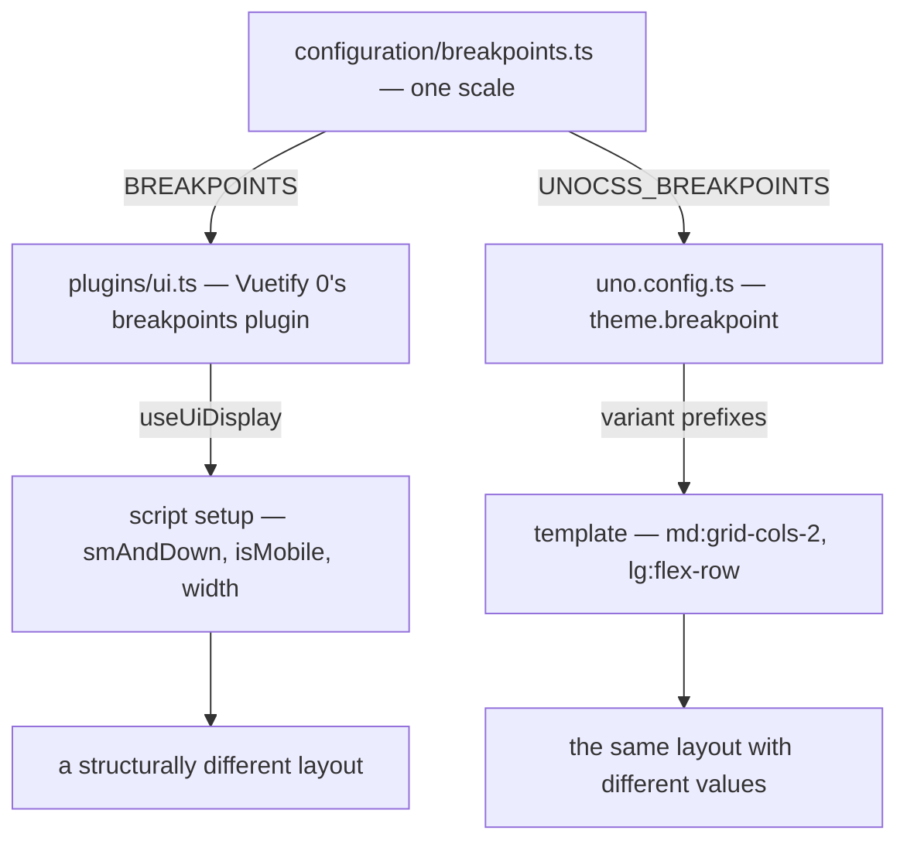

# Responsive Breakpoints

Script and UnoCSS utilities agree on where a viewport becomes narrow because they are given the same numbers. `configuration/breakpoints.ts` declares one scale (`xs`, `sm`, `md`, `lg`, `xl`, `xxl`) and exports it as `BREAKPOINTS`, beside `UNOCSS_BREAKPOINTS` — the same scale with each value rendered as a px string. Nothing else in the repo defines a breakpoint, and nothing should — a second scale is how a component ends up folding its layout at one width while the utility inside it folds at another.

## How it works

`app/plugins/ui.ts` installs Vuetify 0's breakpoints plugin with `BREAKPOINTS` and `mobileBreakpoint: "lg"`, which makes `isMobile` true below the `lg` threshold: the width under which a page's drawers become sheets. `uno.config.ts` passes `UNOCSS_BREAKPOINTS` as `theme.breakpoint`, which is what makes `sm:`/`md:`/`lg:`/`xl:` prefixes resolve to those same widths.

The server has no screen, so the plugin starts both renders at no width, where every page is narrow, and the client measures once the app is mounted. A branch on width therefore hydrates as the narrow layout and switches after mount, never mismatching.

## Choosing where to branch

Both surfaces read the same widths, so the choice is about what changes, not about which library is nearer to hand.

**Reach for `useUiDisplay` in script** when a narrow viewport produces a _different_ layout: a control rail that becomes a dropdown, a command bar that collapses into an overflow menu, a panel that is removed rather than shrunk, or a default that must be seeded differently on first render. These decisions have to be expressed as reactive state because something other than CSS depends on them. The composable is the library's reading of Vuetify 0's breakpoints, which only the library imports. `smAndDown` is the flag most call sites use, because the codebase treats the question as "narrow or not" rather than as a ladder of sizes; `app/store/layout.ts` reads `isMobile`, the wider cut at which the default layout docks its drawers.

**Reach for a UnoCSS prefix in the template** when the layout is unchanged and only a value moves — a grid's column count, a flex direction, a utility that applies above a width. It costs no reactivity and no script line, and it is the right tool precisely when there is nothing for script to decide.

Applied examples live with the features that own them: the [resource explorer](/docs/resource/explorer) folds its two-box layout into a single column on `smAndDown`, and the [call view](/docs/esbabbler/calls/call-view) flips its prejoin screen from a column to a row with a `lg:` prefix.

## Viewport is not device

A breakpoint answers how wide the window is, which is not the same question as what the user is holding. [Dungeons](/docs/dungeons/scenes-and-input) selects between keyboard and joystick controls by device detection, not by breakpoint, because a narrow window on a desktop still has a keyboard and a wide tablet still has none. Use this scale for layout, and device detection for input.

## Key files

Paths relative to `apps/web`.

| File                                 | Role                                                             |
| ------------------------------------ | ---------------------------------------------------------------- |
| `configuration/breakpoints.ts`       | the single scale, exported for both                              |
| `app/plugins/ui.ts`                  | the breakpoints plugin, its `mobileBreakpoint` and its SSR width |
| `app/composables/ui/useUiDisplay.ts` | the library's reading of it, for script                          |
| `uno.config.ts`                      | `theme.breakpoint`, the source of the variant prefixes           |
| `app/store/layout.ts`                | the consumer of `isMobile`                                       |
