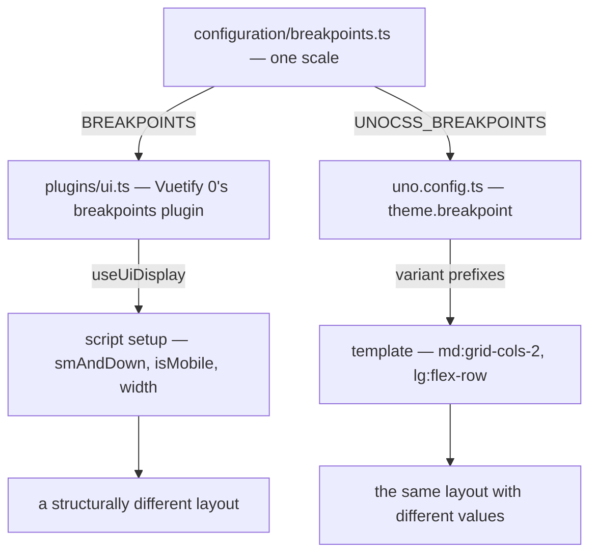
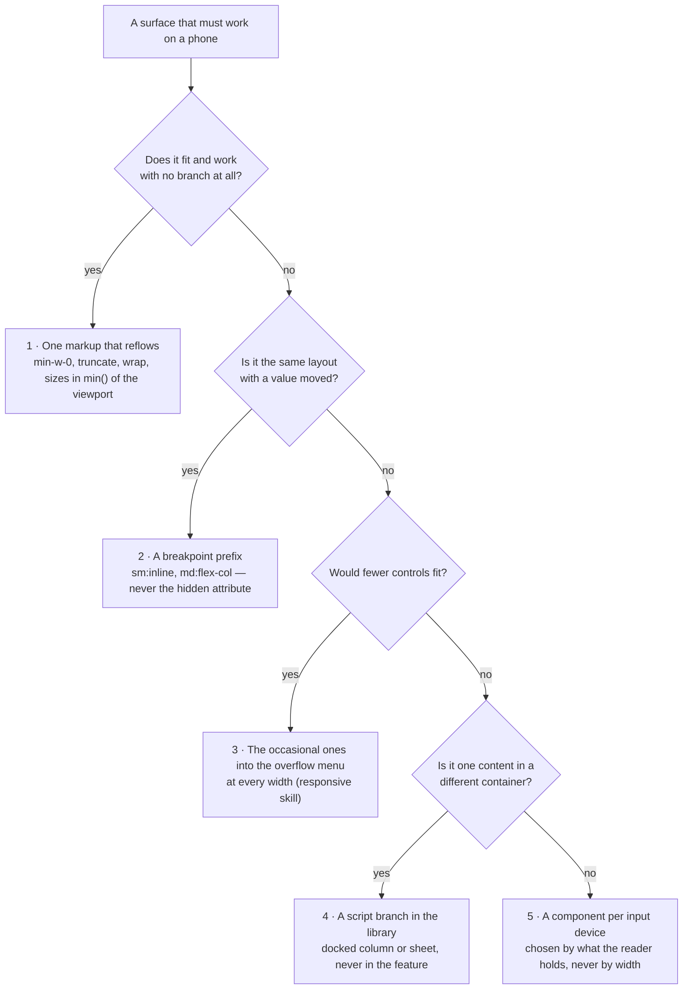

# Responsive Breakpoints

Script and UnoCSS utilities agree on where a viewport becomes narrow because they are given the same numbers. `configuration/breakpoints.ts` declares one scale (`xs`, `sm`, `md`, `lg`, `xl`, `xxl`) and exports it as `BREAKPOINTS`, beside `UNOCSS_BREAKPOINTS` — the same scale with each value rendered as a px string. Nothing else in the repo defines a breakpoint, and nothing should — a second scale is how a component ends up folding its layout at one width while the utility inside it folds at another.

## How it works

`app/plugins/ui.ts` installs Vuetify 0's breakpoints plugin with `BREAKPOINTS` and `mobileBreakpoint: "lg"`, which makes `isMobile` true below the `lg` threshold: the width under which a page's drawers become sheets. `uno.config.ts` passes `UNOCSS_BREAKPOINTS` as `theme.breakpoint`, which is what makes `sm:`/`md:`/`lg:`/`xl:` prefixes resolve to those same widths.

The server has no screen, so the plugin starts both renders at no width, where every page is narrow, and the client measures once the app is mounted. A branch on width therefore hydrates as the narrow layout and switches after mount, never mismatching.

## Choosing where to branch

Both surfaces read the same widths, so the choice is about what changes, not about which library is nearer to hand.

**Reach for `useUiDisplay` in script** when a narrow viewport produces a _different_ layout: a docked column that becomes a sheet over the page, a panel that is removed rather than shrunk, or a default that must be seeded differently on first render. These decisions have to be expressed as reactive state because something other than CSS depends on them. The composable is the library's reading of Vuetify 0's breakpoints, which only the library imports. `smAndDown` is the flag most call sites use, because the codebase treats the question as "narrow or not" rather than as a ladder of sizes; `app/store/layout.ts` reads `isMobile`, the wider cut at which the default layout docks its drawers.

**Reach for a UnoCSS prefix in the template** when the layout is unchanged and only a value moves — a grid's column count, a flex direction, a utility that applies above a width. It costs no reactivity and no script line, and it is the right tool precisely when there is nothing for script to decide.

Applied examples live with the features that own them: the [resource explorer](/docs/resource/explorer) folds its two-box layout into a single column on `smAndDown`, and the [call view](/docs/esbabbler/calls/call-view) flips its prejoin screen from a column to a row with a `lg:` prefix.

## One component for every device

A surface is written once and serves a phone, a tablet and a desktop alike. The cost this avoids is the one that grows: a presentation per device is a component per device for every surface, each fixed separately and each drifting from the others on the first change, while one component that adapts is fixed once. So every surface starts at the bottom of this ladder and climbs a rung only when the rung below cannot say what it needs, and a review asks of every rung above the first which rung below was tried.

- **The first three rungs cover almost every feature.** A header that loses its topic below `sm`, a panel sized `min(24rem, 100dvw - 2rem)`, a toolbar whose occasional commands wait in the overflow menu on every width — none of them branch, so none of them can disagree with themselves at some width nobody tested.
- **A container is the library's to swap, not the feature's.** The default layout docks a drawer as a grid column on a wide screen and opens it as a sheet on a narrow one; every page that hands it a drawer gets both for nothing. A feature that finds itself writing `v-if="smAndDown"` around two containers is asking the library for one it lacks, and grows it there first.
- **A popover is anchored at every width.** It sizes itself to the viewport and flips to the side that has room, so a phone needs no sheet of its own; a sheet up from the bottom edge lies over the dock and away from what it acts on.
- **A component per device is for a different input, not a narrower window** — the joystick beside the keyboard below. It sits beside its sibling, named for the input it serves.

### Settled — do not re-propose

- **A `mobile/` folder, or a `Mobile` component prefix.** A folder per device mirrors the tree once per device, and every surface in it is a second copy of one outside it. What rung five produces is named for its input and sits beside the component it replaces.
- **A second bar of buttons for a narrow screen.** A surface that does not fit moves its occasional commands into the overflow menu at every width; a phone-only bar is a second presentation of the same commands. The [room UI](/docs/esbabbler/room-ui) header is the worked example.

## Viewport is not device

A breakpoint answers how wide the window is, which is not the same question as what the user is holding. [Dungeons](/docs/dungeons/scenes-and-input) selects between keyboard and joystick controls by device detection, not by breakpoint, because a narrow window on a desktop still has a keyboard and a wide tablet still has none. Use this scale for layout, and device detection for input. The same holds for the keyboard a touch screen draws over the page: the layout store's `isTouchScreen` reads `(pointer: coarse)`, and only on a touch screen does the dock step aside while a composer has focus, or a composer and the emoji picker's search wait for a tap rather than autofocusing — a narrow window on a desktop has no keyboard over it to make room for.

## Key files

Paths relative to `apps/web`.

| File                                 | Role                                                             |
| ------------------------------------ | ---------------------------------------------------------------- |
| `configuration/breakpoints.ts`       | the single scale, exported for both                              |
| `app/plugins/ui.ts`                  | the breakpoints plugin, its `mobileBreakpoint` and its SSR width |
| `app/composables/ui/useUiDisplay.ts` | the library's reading of it, for script                          |
| `uno.config.ts`                      | `theme.breakpoint`, the source of the variant prefixes           |
| `app/store/layout.ts`                | the consumer of `isMobile`, and `isTouchScreen` for the input    |
