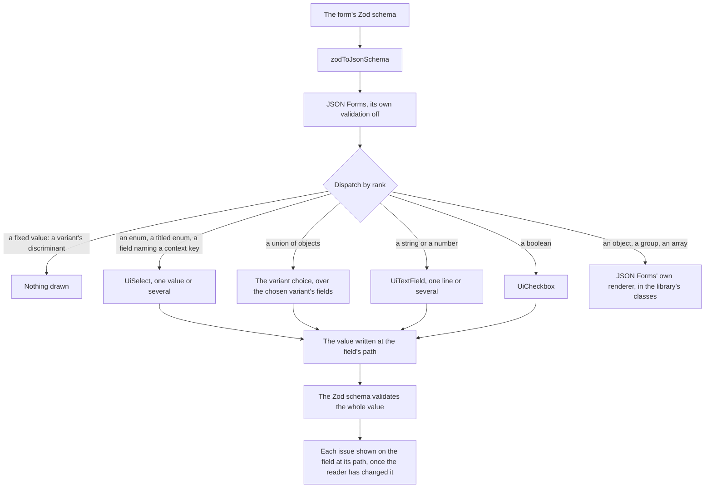

# Schema Forms

The sheet's settings, its column create and edit dialogs and the dashboard's visual editor render their forms from a Zod schema. `zodToJsonSchema` turns the form schema into JSON Schema, and `UiSchemaForm` renders that: [JSON Forms](https://jsonforms.io/) lays it out and keeps every nested value in step, the library's own fields draw each node, and the Zod schema the form came from is what validates it.

## How a form is drawn

- **JSON Schema is the input.** JSON Forms generates the layout from the schema where no UI schema is given, which is every form the app has, and `zodToJsonSchema`'s inline snapshot tests pin the schema each form receives.
- **The library draws every field.** Text, numbers, booleans and choices are the library's own renderers, ranked above JSON Forms' vanilla set, which still lays out objects, groups and arrays with class names from one styles object in the library's surfaces.
- **Layout meta is typed data.** A field that wants several lines, or a choice among items only the dialog knows, says so in its `layout` meta — a flag, or a key of the dialog's context interface — never an expression string evaluated at runtime.
- **The Zod schema validates.** JSON Forms runs with its validation off. The form's Zod schema checks the whole value on every change, as the dialog's error icon does, and each issue reaches the field at its path through the form's config, shown once the reader has changed that field. A rule that reads live state, a column name unique among the sheet's, is a refinement the dialog's composable builds.
- **A variant is its discriminant.** A union's variants each fix their discriminant to a literal, which the form hides and the variant choice sets. Switching keeps the fields the variants share and anything the schema does not describe, such as a column's id, and drops the old variant's own.

## Why an engine rather than a renderer of our own

A schema form engine is most of the work: laying out an object's fields, dispatching each node to a control, detecting which variant of a union the data is in, editing arrays and keeping every nested value in step. Writing that for a handful of dialogs would put an engine in the repository that nothing else maintains, so the engine is adopted and only the look is ours.

| Candidate                                                                       | Why it is or is not the one                                                                                                                                                                                                                                                                            |
| :------------------------------------------------------------------------------ | :----------------------------------------------------------------------------------------------------------------------------------------------------------------------------------------------------------------------------------------------------------------------------------------------------- |
| JSON Forms, chosen                                                              | Renders the JSON Schema the app already generates; its Vue binding is framework-free, its vanilla renderers take their class names from one styles object, and a renderer of ours is registered by rank beside them. Maintained by EclipseSource, with the largest user base of the Vue schema engines |
| vjsf, replaced                                                                  | Bound to Vuetify as a peer dependency, so Vuetify could not leave while it stayed, and its fields could not wear the library's look                                                                                                                                                                    |
| [shadcn-vue's AutoForm](https://radix.shadcn-vue.com/docs/components/auto-form) | Walks the Zod schema itself, but it is copied into the repository rather than installed — a renderer of our own under another name — and it brings Reka UI and vee-validate beside Vuetify 0                                                                                                           |
| [FormKit](https://formkit.com/)                                                 | A whole form framework whose inputs, validation and schema format would replace the library's fields and the app's JSON Schema                                                                                                                                                                         |

## AJV is JSON Forms'

JSON Forms' core imports AJV and builds an instance when a form mounts, even with its validation off, to match a union's variants. So AJV and its formats stay, as JSON Forms' own dependencies rather than the app's, and the Vite plugin that turns their CommonJS into ESM for rolldown stays with them. What went with vjsf is everything the app wrote on top: its validation keywords, its error-message and translation packages, the layout engine's `debug`, and the pre-bundle list vjsf published.

## Key files

| File                                                               | Role                                                                       |
| :----------------------------------------------------------------- | :------------------------------------------------------------------------- |
| `apps/web/app/components/Ui/SchemaForm/Index.vue`                  | JSON Forms with the renderers, the styles and the Zod issues in its config |
| `apps/web/app/services/ui/schemaForm/SchemaFormRenderers.ts`       | Which renderer draws which node, by rank                                   |
| `apps/web/app/services/ui/schemaForm/SchemaFormStyles.ts`          | The library's classes for JSON Forms' own layout renderers                 |
| `apps/web/app/services/ui/schemaForm/getSchemaFormVariantValue.ts` | The value a union switched to another variant keeps                        |
| `apps/web/app/composables/ui/useSchemaFormControl.ts`              | What every field reads: its layout meta and its issue                      |
| `apps/web/app/services/jsonSchema/zodToJsonSchema.ts`              | The form's JSON Schema, with its layout meta                               |
| `apps/web/shared/models/schemaForm/SchemaFormLayout.ts`            | The layout meta a field may carry                                          |
| `apps/web/app/composables/resource/sheet/useColumnForm.ts`         | The column dialogs' context and their refined form schema                  |
| `apps/web/configuration/plugins/fixAjv.ts`                         | JSON Forms' AJV turned into ESM for rolldown                               |

## Sources

- [JSON Forms' Vue binding](https://github.com/eclipsesource/jsonforms/tree/master/packages/vue) and [vanilla renderers](https://github.com/eclipsesource/jsonforms/tree/master/packages/vue-vanilla): `useJsonFormsControl`, `rankWith`, the styles object and the `NoValidation` mode.
- [JSON Schema in Zod](https://zod.dev/json-schema): the conversion the form's input comes from.
