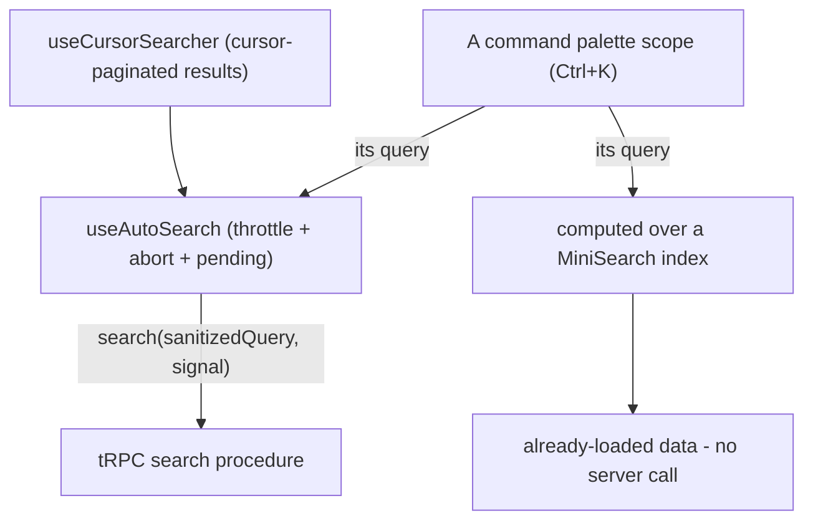

# Search

Every search UI in the repo composes from one small stack instead of hand-rolling its own throttle, request-cancellation, and hotkey wiring. **Hand-rolling search-as-you-type around a tRPC query is banned** — new search features pick a layer below, and anything that looks like a new exception gets refactored onto the stack instead. A per-feature copy of throttle, abort and pending state drifts from every other copy, and a palette of a surface's own would make one Ctrl+K behave differently depending on which surface is open.

## The layers



**Which branch a feature takes is decided by one question: does answering the query need the server?** If it does, it is the `useAutoSearch` stack and nothing about that is optional. If the data is already in memory, it is the right branch below and the stack would be pure ceremony — there is no request to throttle, abort, or show pending state for.

### `useAutoSearch` — the shared core

`app/composables/useAutoSearch.ts` owns everything reactive about search-as-you-type, exactly once:

- **1s throttle** on the query ref (`useThrottle` + `Temporal.Duration`) so typing doesn't fire a request per keystroke.
- **In-flight abort** — each new search aborts the previous request via `AbortController`; the `AbortSignal` is passed to the `search` callback to forward to tRPC as `{ signal }`.
- **Normalized change detection** — queries run through `normalizeString`, and a throttled value that normalizes to the same string as before does not re-query.
- **Reset on empty** — when the query empties out, the in-flight request aborts and the consumer's `reset` callback drops stale results (skipped with `isIncludeEmptySearchQuery`, for pickers where an empty query should list everything).
- **`isPending`** — the returned ref drives progress indicators; the consumer never tracks its own `isSearching` flag.
- **Error surfacing** — failures raise the real `Error.message` as an alert via the same `getResultAsync` → `createAlert` stack as [client data access](/docs/architecture/client-data); a superseded (aborted) request stays silent. `AbortController` plays the role the latest-wins guard plays for [reads on the shared primitive](/docs/architecture/async-operations) — with the bonus that the stale HTTP request is actually cancelled, not just ignored.

Consumers with plain array results call it directly:

```ts
const { isPending } = useAutoSearch(searchQuery, {
  reset: () => {
    searchResults.value = [];
  },
  search: async (sanitizedSearchQuery, signal) => {
    searchResults.value = await $trpc.friend.searchUsers.query(sanitizedSearchQuery, { signal });
  },
});
```

### `useCursorSearcher` — cursor-paginated results

`app/composables/useCursorSearcher.ts` composes `useAutoSearch` with `useCursorPaginationData` for searches whose results paginate (room pickers, forward-to dialogs); its callback contract is `.agents/skills/pagination/references/search-as-you-type.md`. It returns `{ hasMore, items, readSearchedItems, readMoreSearchedItems, searchQuery }`, so the list renders with the standard `StyledWaypoint` infinite-scroll pattern.

```ts
export const useRoomSearchStore = defineStore("message/room/search", () => {
  const { $trpc } = useNuxtApp();
  return useCursorSearcher((searchQuery, cursor, opts) => {
    const normalizedSearchQuery = normalizeString(searchQuery);
    return $trpc.room.readRooms.query(
      { cursor, filter: normalizedSearchQuery ? { name: normalizedSearchQuery } : undefined },
      opts,
    );
  }, true);
});
```

### Client-index search — MiniSearch

When the data is already loaded, the search is a `computed` over a **MiniSearch** index and nothing more. MiniSearch is the one client-side index in the repo: a second one — a hand-rolled token map, a sorted-prefix array, a bespoke scorer — is the same drift this page exists to stop, and it loses on the part that actually matters, which is relevance rather than speed.

Two settings carry most of that relevance and are easy to omit:

- **`combineWith: "AND"`** — the default unions terms, so a two-word query returns nearly everything instead of the intersection.
- **`prefix: true`** — an as-you-type query is a prefix, not a whole word.

Boost the field a user is most likely to be naming — the title in docs search, the shortcode in the emoji index. Where that field is a canonical identifier rather than prose, pin an exact hit on it ahead of the ranked results rather than trusting the score to float it up; a prose title has no exact form to pin. `fuzzy` is a per-index call: off for short canonical names, where it manufactures noise, and on (docs search runs `0.2`) where the indexed body is prose long enough for a typo to cost the whole query.

This branch has no `isPending` and no abort, because there is nothing asynchronous to track. It is not an exception to the ban — the ban is on re-rolling the _server_ query lifecycle — and it is not a licence to hand-roll the index either.

### The command palette — one Ctrl+K

There is one palette, `AppCommandPalette`, and a surface with a search of its own hands that search to it as a scope rather than opening a dialog of its own ([command palette](/docs/architecture/ui-library#command-palette)). `useCommandScope` takes the surface's query ref, a getter over what it finds as `UiCommand` rows, and optionally its pending state and a way to read more; the query lifecycle behind them is whichever branch above the surface already uses. The palette's field writes the scope's query, and its list, keyboard contract and empty state are the palette's, so no surface draws results of its own.

```ts
useCommandScope({ commands: () => results.value, placeholder: "Search docs", query, title: "Docs" });
```

The docs register their MiniSearch results, the room list its cursor-paginated rooms (with `readMore` for the waypoint), and the resource explorer's home page its grouped search, each for as long as it is mounted.

## Sanctioned exceptions

Three search shapes legitimately sit outside `useAutoSearch`, because there is no as-you-type server query to throttle/abort — or something else already owns fetch orchestration:

| Exception              | Why it is out of scope                                                                                                | Example                                          |
| ---------------------- | --------------------------------------------------------------------------------------------------------------------- | ------------------------------------------------ |
| `v-data-table-server`  | The table owns fetch orchestration — its `search` prop triggers `@update:options`; feed it a `refDebounced` query ref | `Resource/List/View.vue` + `useReadResources`    |
| Explicit-submit search | Enter submits, with filters and history; nothing fires per keystroke                                                  | [Message search](/docs/esbabbler/message-search) |
| Client-index search    | A `computed` over already-loaded data — no server call, no abort, no pending state (see above)                        | Docs search, the emoji picker (both MiniSearch)  |

## Key files

| File                                                        | Role                                                                                    |
| ----------------------------------------------------------- | --------------------------------------------------------------------------------------- |
| `app/composables/useAutoSearch.ts`                          | Shared core — throttle, abort, normalized change detection, `isPending`                 |
| `app/composables/useCursorSearcher.ts`                      | Cursor-paginated search on top of `useAutoSearch`                                       |
| `app/components/App/CommandPalette.vue`                     | The one Ctrl+K palette, app-wide or in the current surface's scope                      |
| `app/composables/ui/useCommandScope.ts`                     | Hands a surface's search to the palette for as long as it is mounted                    |
| `app/components/Docs/Search.vue`                            | The docs' scope: client-index results (MiniSearch)                                      |
| `app/services/message/emoji/searchEmojis.ts`                | Client-index emoji search shared by the picker and the composer's `:` trigger           |
| `app/components/Message/Model/Room/Searcher.vue`            | The rooms' scope: cursor-paginated results (`useRoomSearchStore`)                       |
| `app/components/Message/Friends/Search.vue`                 | Inline (non-palette) `useAutoSearch` consumer                                           |
| `app/composables/resource/search/useResourceSearchItems.ts` | Portal dropdown — `useAutoSearch` for the Resources group, client-side groups around it |
| `app/store/message/room/search.ts`                          | Store returning `useCursorSearcher` for the rooms' scope                                |

## Notes

- The 1-second throttle and the `normalizeString` sanitization are deliberately inside the core, not per consumer — a feature wanting a different cadence is a smell, not a parameter.
- Zero-result and pending UI stay with the consumer; the stack only guarantees the query lifecycle.
- Delete confirmation has the same "one shell, never re-roll" treatment — see [destructive confirmation](/docs/architecture/destructive-confirmation).
