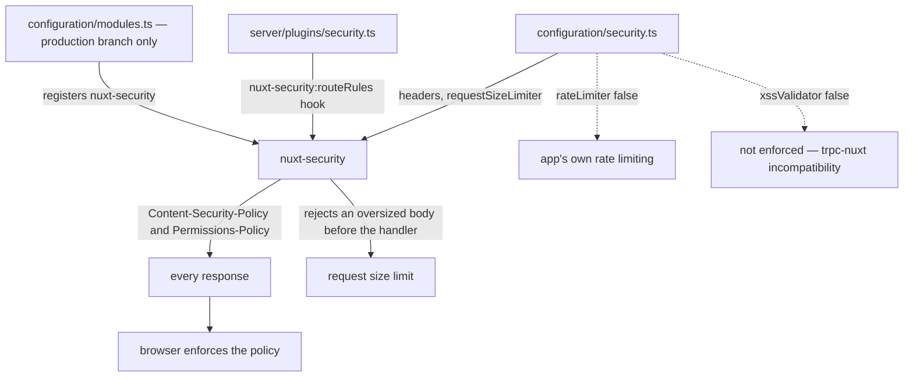

# Security Posture

The app's runtime hardening is [`nuxt-security`](https://nuxt-security.vercel.app), registered in `configuration/modules.ts`. It appears only in the production branch of that list: the Vitest branch is an allowlist of the modules a unit test actually exercises, and security headers are something no test asserts, so including the module would only slow config resolution. Nothing about the posture is therefore observable from a unit test — it is a property of a running server.

This page covers the **app**. The Azure estate's posture — network exposure, managed identities, key handling — is owned by the [cost and security posture](/docs/infra/cost-and-security-posture).

## How it works

### Content Security Policy

`img-src` is not written in the security config at all — it is the shared `ImageSourceWhitelist`, so the one list of permitted image origins serves both the CSP and any other consumer that needs it. `script-src` carries `'unsafe-eval'`, which Desmos requires to evaluate the expressions it is given; the separate `script-src-elem` and `style-src-elem` lists enumerate the third-party origins actually loaded (Desmos, GrapesJS, MediaPipe's track processors, the font host) with a comment naming the dependency behind each entry, so an entry whose dependency is removed is obvious. `worker-src` allows `'self'` for the PDF viewer's worker and `blob:` for the one Desmos constructs at runtime.

### Permissions policy

`permissionsPolicy` scopes `camera`, `microphone`, `display-capture` and `fullscreen` to `self`. The first three exist for LiveKit — [voice and video](/docs/esbabbler/voice-video) cannot acquire tracks without them — and `fullscreen` for the PDF viewer. Scoping to `self` rather than leaving them at the module default means an embedded third-party frame cannot inherit the app's grant.

### Request size

`requestSizeLimiter` is wired to `MAX_REQUEST_SIZE` and `MAX_FILE_REQUEST_SIZE`, the same constants that bound the tRPC body and the upload SAS. Those values and the upload path they govern are documented in [file uploads](/docs/architecture/file-uploads) — this config is only where the module is told about them.

### The messages route override

`server/plugins/security.ts` hooks `nuxt-security:routeRules` and widens `img-src` to include `https:` under the messages route, merged over whatever rules already apply via `defu`. Members post arbitrary image links to each other, and an allowlist cannot enumerate the web; every other route keeps the narrow whitelist, so the widening is scoped to exactly the surface that needs it.

The accepted cost is a privacy one, and it is accepted rather than unnoticed: a rendered image is a request the viewer's browser makes to whatever origin the poster chose, so that origin learns every viewer's IP address and the moment they opened the room. Nothing mitigates it today. The only real fix is proxying message images through the app, which trades the leak for bandwidth, a cache and a fetch-side SSRF surface — worth revisiting when rooms hold people who do not already trust each other, not before.

## Deliberately off

- **`rateLimiter: false`** — the module ships an in-memory rate limiter, and the app has its own Postgres-backed one that is shared across instances. Two mechanisms would mean two answers to the same question, so the module's is disabled and [rate limiting](/docs/architecture/rate-limiting) is the single mechanism. better-auth is handed the same numbers but keeps its own per-process counters, which that page records.
- **`xssValidator: false`** — the validator rejects request bodies that look like markup, which tRPC's batched request format trips. It carries a `@TODO` linking the upstream trpc-nuxt issue, and stays off until that is resolved.

## Key files

Paths relative to `packages/app`.

| File                                          | Role                                                               |
| --------------------------------------------- | ------------------------------------------------------------------ |
| `configuration/modules.ts`                    | registers `nuxt-security` in the production module list only       |
| `configuration/security.ts`                   | CSP, permissions policy, request size limits, disabled features    |
| `server/plugins/security.ts`                  | per-route CSP override widening `img-src` under the messages route |
| `shared/services/app/ImageSourceWhitelist.ts` | the shared list of permitted image origins                         |
| `shared/services/app/constants.ts`            | `MAX_REQUEST_SIZE` and `MAX_FILE_REQUEST_SIZE`                     |
