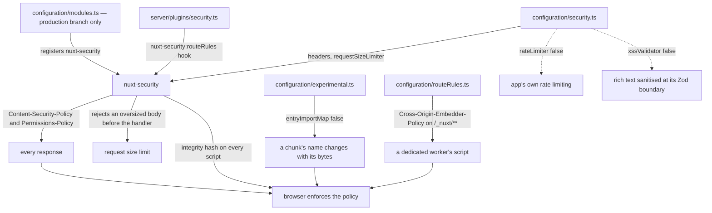

# Security Posture

The app's runtime hardening is [`nuxt-security`](https://nuxt-security.vercel.app), registered in `configuration/modules.ts`. It appears only in the production branch of that list: the Vitest branch is an allowlist of the modules a unit test actually exercises, and security headers are something no test asserts, so including the module would only slow config resolution. Nothing about the posture is therefore observable from a unit test — it is a property of a running server.

This page covers the **app**. The Azure estate's posture — network exposure, managed identities, key handling — is owned by the [cost and security posture](/docs/infra/cost-and-security-posture).

## How it works

```mermaid
flowchart TD
  modules["configuration/modules.ts — production branch only"] -->|"registers nuxt-security"| module["nuxt-security"]
  config["configuration/security.ts"] -->|"headers, requestSizeLimiter"| module
  plugin["server/plugins/security.ts"] -->|"nuxt-security:routeRules hook"| module
  module -->|"Content-Security-Policy and Permissions-Policy"| response["every response"]
  module -->|"rejects an oversized body before the handler"| upload["request size limit"]
  response --> browser["browser enforces the policy"]
  module -->|"integrity hash on every script"| browser
  experimental["configuration/experimental.ts"] -->|"entryImportMap false"| names["a chunk's name changes with its bytes"]
  names --> browser
  rules["configuration/routeRules.ts"] -->|"Cross-Origin-Embedder-Policy on /_nuxt/**"| worker["a dedicated worker's script"]
  worker --> browser
  config -.->|"rateLimiter false"| rate["app's own rate limiting"]
  config -.->|"xssValidator false"| xss["rich text sanitised at its Zod boundary"]
```

### Content Security Policy

`img-src` is not written in the security config at all — it is the shared `ImageSourceWhitelist`, so the one list of permitted image origins serves both the CSP and any other consumer that needs it. Under `nuxt dev` alone, `configuration/development.ts` appends `https://nuxt.com`, where Nuxt DevTools loads the logo on its button from, and `https://unocss.dev`, where the UnoCSS inspector's tab loads its icon from; production names neither. `script-src` carries `'unsafe-eval'`, which Desmos requires to evaluate the expressions it is given; the separate `script-src-elem` and `style-src-elem` lists enumerate the third-party origins actually loaded (Desmos, GrapesJS, MediaPipe's track processors) with a comment naming the dependency behind each entry, so an entry whose dependency is removed is obvious. No font origin is listed: `@nuxt/fonts` fetches each family's stylesheet on the server, at build and in dev, and serves the files from the app's own `/_fonts`, so the browser never contacts the font host. `worker-src` allows `'self'` for the PDF viewer's worker and `blob:` for the one Desmos constructs at runtime.

### Embedder policy

The module sends `Cross-Origin-Embedder-Policy` — `credentialless` in production, `unsafe-none` in development — on rendered pages only, never on a static asset. A page under an embedder policy can start a dedicated worker only when the worker's script sends one as well, so without it every `?worker` import fails in production and nowhere else. `configuration/routeRules.ts` gives the built scripts under `/_nuxt/` the production policy, which reaches them because Nitro's route-rule headers run ahead of its static handler.

A header change to those scripts never reaches a copy already cached. They are served `immutable` for a year, and the host's edge keeps its own copy for each `Accept-Encoding`, so a script cached before the change goes on being served without the new header until the edge's cache is purged, and a browser that fetched it meanwhile keeps its copy until its own cache is cleared. A file the change also renames is the exception, since no cache holds its new name.

### Subresource integrity

The module's `sri` is left at its default, so every script the page loads carries an `integrity` hash, and the scripts under `/_nuxt/` are served `immutable` and cached by the host's edge besides. That holds only while a file name never outlives its bytes, which Nuxt's `experimental.entryImportMap` breaks: under it a chunk imports the entry as `#entry`, so the chunk's hash leaves the entry's out, while Vite writes the entry's hashed name into the chunk's preload list after hashing. A deploy that changed only the entry shipped a chunk under its old name with new bytes, a browser or edge holding the old bytes failed the new integrity hash, and the page never booted. `configuration/experimental.ts` turns the import map off, so a changed entry renames every chunk that reaches it.

### Permissions policy

`permissionsPolicy` scopes `camera`, `microphone`, `display-capture` and `fullscreen` to `self`. The first three exist for LiveKit — [voice and video](/docs/esbabbler/voice-video) cannot acquire tracks without them — and `fullscreen` for the PDF viewer. Scoping to `self` rather than leaving them at the module default means an embedded third-party frame cannot inherit the app's grant.

### Request size

`requestSizeLimiter` is wired to `MAX_REQUEST_SIZE` and `MAX_FILE_REQUEST_SIZE`, the same constants that bound the tRPC body and the upload SAS. Those values and the upload path they govern are documented in [file uploads](/docs/architecture/file-uploads) — this config is only where the module is told about them.

### The messages route override

`server/plugins/security.ts` hooks `nuxt-security:routeRules` and widens `img-src` to include `https:` under the messages route, merged over whatever rules already apply via `defu`. Members post arbitrary image links to each other, and an allowlist cannot enumerate the web; every other route keeps the narrow whitelist, so the widening is scoped to exactly the surface that needs it.

The accepted cost is a privacy one, and it is accepted rather than unnoticed: a rendered image is a request the viewer's browser makes to whatever origin the poster chose, so that origin learns every viewer's IP address and the moment they opened the room. Nothing mitigates it today. The only real fix is proxying message images through the app, which trades the leak for bandwidth, a cache and a fetch-side SSRF surface — worth revisiting when rooms hold people who do not already trust each other, not before.

## Deliberately off

- **`rateLimiter: false`** — the module ships an in-memory rate limiter, and the app has its own Postgres-backed one that is shared across instances. Two mechanisms would mean two answers to the same question, so the module's is disabled and [rate limiting](/docs/architecture/rate-limiting) is the single mechanism. better-auth is handed the same numbers but keeps its own per-process counters, which that page records.
- **`xssValidator: false`** — the validator runs every request body through `FilterXSS` and rejects the request if the filter would change it, which is the wrong test for this app in both directions. Under its default options it rejects ordinary text a message carries — `i <3 you`, `a < b`, a password containing `<` — and every mention the rich-text editor writes, whose attributes it strips; with `escapeHtml` turned off to let those through, it passes a `<script>` tag. `configuration/security.test.ts` pins that measurement against the filter the module uses. What the app does instead is sanitise rich text where it enters, at the Zod schemas every message, webhook body and post description passes through (`packages/shared/src/services/sanitizeHtml/sanitizeTextHtml.ts`), so what is stored is already what may be rendered. The validator once also starved the tRPC handler of the body it had read, which h3 2.x makes the rule rather than a defect: a request's body is a stream read once, so a middleware that consumes it owns it, and with the validator off nothing in front of the [tRPC module's](/docs/trpc-nuxt-module) handler reads it.

## Key files

Paths relative to `apps/web`.

| File                                          | Role                                                                 |
| --------------------------------------------- | -------------------------------------------------------------------- |
| `configuration/modules.ts`                    | registers `nuxt-security` in the production module list only         |
| `configuration/security.ts`                   | CSP, permissions policy, request size limits, disabled features      |
| `configuration/security.test.ts`              | the XSS validator measurement that keeps it off                      |
| `configuration/development.ts`                | the dev-only `img-src` entries for the DevTools button and tab icons |
| `server/plugins/security.ts`                  | per-route CSP override widening `img-src` under the messages route   |
| `configuration/routeRules.ts`                 | the embedder policy on built scripts, so a dedicated worker starts   |
| `configuration/experimental.ts`               | the entry import map off, so a chunk's name changes with its bytes   |
| `shared/services/app/ImageSourceWhitelist.ts` | the shared list of permitted image origins                           |
| `shared/services/app/constants.ts`            | `MAX_REQUEST_SIZE` and `MAX_FILE_REQUEST_SIZE`                       |
