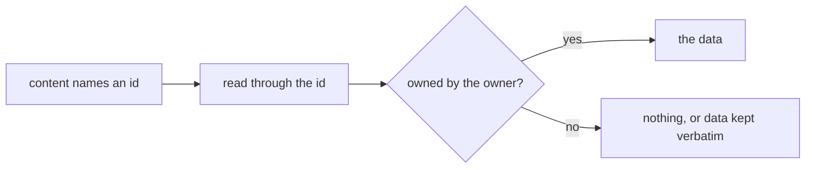

# Cross-Owner References

A resource's content is the owner's to write, and it can hold any id — a Program's survey, a dashboard's dataset, an asset url, a blueprint's entries. Nothing at save time checks that the owner owns what those ids name, and nothing needs to: an id in content is a claim. What makes it safe is that every **read through** such an id is scoped to an owner, so naming someone else's resource gets nothing back.

## How it works

## Where it applies

| Reference                            | The read, and whom it is scoped to                                                                                           |
| :----------------------------------- | :--------------------------------------------------------------------------------------------------------------------------- |
| A dashboard's or a Program's dataset | `readDataset` resolves the resource through `requireOwnedResource` before any provider runs                                  |
| A Program's survey, for its status   | `readProgramStatusRows` reads the survey's responses only when the Program's owner owns the survey                           |
| A survey's identified tokens         | `resolveIdentifiedToken` takes its candidate Programs from the survey owner's own                                            |
| An asset url in content being cloned | `cloneContentAssets` asks `checkIsResourceAssetReadable` and carries an unreadable url verbatim rather than copying its blob |
| A blueprint capture                  | `captureBlueprint` refuses the set unless the caller owns every resource in it                                               |

**The fail direction is empty, never an error that confirms existence.** A read through an id the owner does not own answers the way a missing resource does — no rows, a url left as it was — so the reference cannot be used to learn whether someone else's resource exists or how much it holds.

## Key files

Paths relative to `apps/web`.

| File                                                       | Role                                              |
| ---------------------------------------------------------- | ------------------------------------------------- |
| `server/services/resource/requireOwnedResource.ts`         | the owner and type lookup every owned read shares |
| `server/services/resource/checkIsResourceAssetReadable.ts` | whether a caller may read one asset path          |
| `server/services/program/readProgramStatusRows.ts`         | the participants × responses join                 |
| `server/services/survey/resolveIdentifiedToken.ts`         | the survey owner's programs as the token issuers  |
