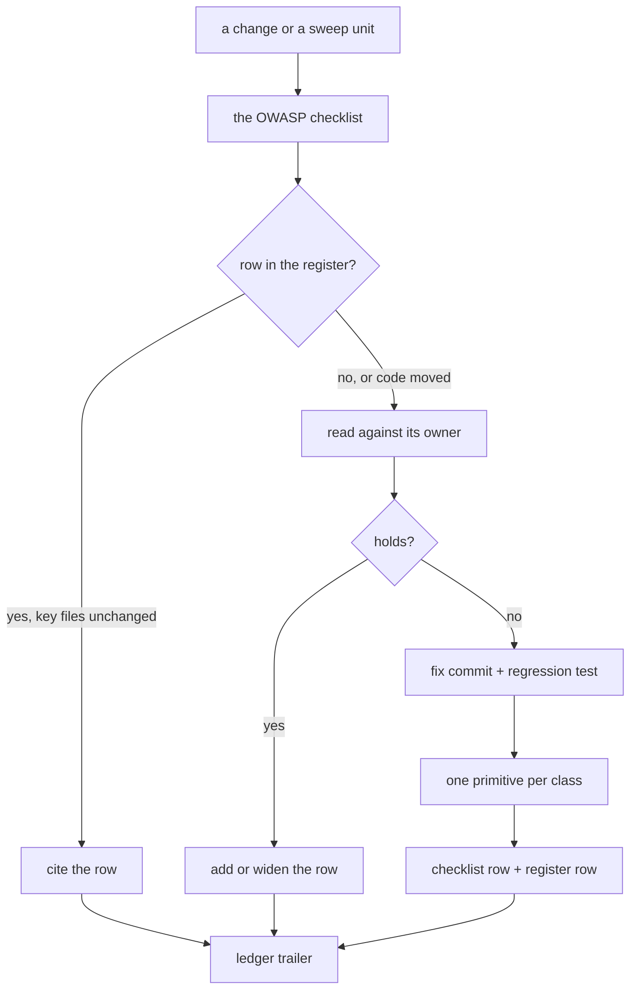

# Security Review

A security read asks what an attacker could do with a change. It is run on every change that crosses a trust boundary and, tree-wide, by the security sweep. The checklist of questions is the `security` skill's (`references/owasp-top-10.md`); this page is the process around it and the record of what has already been answered.

Sub-pages: [server authority](/docs/architecture/security/server-authority) · [cross-owner references](/docs/architecture/security/cross-owner-references). The app's runtime headers are the [security posture](/docs/architecture/security-posture), and the Azure estate's are the [cost and security posture](/docs/infra/cost-and-security-posture).

## How it works

**A verified boundary is written down once, here, and cited after.** Re-deriving why a flow is safe costs a pass the same reading every time and finds nothing new; the register is what lets a later pass skip it. A row names the defence, the primitive that holds it and the page that explains it. A pass that finds the row's primitive or owner page changed since reads it again rather than trusting the row.

**A finding is fixed with the defence the class needs, not the instance.** The second place a hole of the same shape could appear is served by the same primitive, so a fix that hand-rolls a check for its one caller is a finding waiting to recur. Each class the checklist had no question for becomes a question there, and its defence goes to the skill or page that owns the subsystem (the [enforcement ladder](/docs/architecture/enforcement-ladder)).

**A risk the owning page accepts is a decision, not a finding.** It is re-read only when the page's own revisit trigger fires.

## Register of verified boundaries

| Boundary                                        | The defence that holds it                                                                               | Primitive                                                                                 | Owner                                                                                                      |
| :---------------------------------------------- | :------------------------------------------------------------------------------------------------------ | :---------------------------------------------------------------------------------------- | :--------------------------------------------------------------------------------------------------------- |
| Who may call a procedure                        | every procedure starts from a builder naming who may reach it; public is a builder of its own           | `standardAuthedProcedure`, the room builders, `standardRateLimitedProcedure`              | the `trpc` skill                                                                                           |
| A row describing another user                   | only public columns leave the server — never an email or a storage account                              | `PublicUserColumns`, `getPublicUserColumns`                                               | the `drizzle` skill, `references/queries.md`                                                               |
| A room action on another member                 | the permission bit and the role hierarchy, and nobody moderates themselves                              | the room permission builders, `assertIsManageable`                                        | [RBAC](/docs/esbabbler/rbac), [moderation](/docs/esbabbler/moderation)                                     |
| A moderation action on a call                   | the server evicts or revokes at the SFU, and every connection re-asks the room's door                   | `evictRoomCallParticipants`, `updateLiveKitTrackSources`, `checkIsCallConnectionAdmitted` | [moderation](/docs/esbabbler/moderation), [server authority](/docs/architecture/security/server-authority) |
| A message a member posts                        | a member posts only a message or a poll; every line in the room's voice is the server's                 | `userMessageTypeSchema`                                                                   | [messaging](/docs/esbabbler/messaging)                                                                     |
| Rich text rendered as markup                    | sanitized once at the Zod boundary; `v-html` only on a body that passed it, server-written text as text | `sanitizedMessageSchema`, `sanitizeTextHtml`                                              | the `string-utils` skill, `references/html-sanitization.md`                                                |
| Content naming another resource by id           | read only when the caller, or the content's owner, owns what it names                                   | `requireOwnedResource`, `checkIsResourceAssetReadable`                                    | [cross-owner references](/docs/architecture/security/cross-owner-references)                               |
| An anonymous caller's identity                  | the rightmost `X-Forwarded-For` entry, which the front end appended, with its port dropped              | `getIpAddress`                                                                            | [rate limiting](/docs/architecture/rate-limiting)                                                          |
| A bearer token or a guessable id                | drawn from a cryptographic source, compared in constant time, and kept out of every log line            | `createId`, `checkIsUploadFileTokenValid`                                                 | [file uploads](/docs/architecture/file-uploads)                                                            |
| A body larger than it claims                    | measured before it is downloaded and capped while it inflates; quota reserved under a row lock          | `readStagedResourceContent`, `readResourceContentDelta`, `reserveStorageBytes`            | [file uploads](/docs/architecture/file-uploads), [storage quotas](/docs/resource/storage-quotas)           |
| A stale save                                    | the version check is part of the one UPDATE that writes the row                                         | `saveResourceContent`                                                                     | [resource save state](/docs/resource/resource-save-state)                                                  |
| A query or filter built from input              | SQL through Drizzle's builder or the `sql` tag, Table filters through clause serialization              | `serializeClauses`, `escapeLike`                                                          | the `drizzle` skill, the `azure-table` skill                                                               |
| A public read that spends a third party's quota | answered once per process, so no caller can exhaust the server's allowance for everyone                 | `getCommitCount`                                                                          | [server authority](/docs/architecture/security/server-authority)                                           |

## Key files

Paths relative to the repo root.

| File                                                 | Role                                        |
| ---------------------------------------------------- | ------------------------------------------- |
| `.agents/skills/security/SKILL.md`                   | the rules a security read follows           |
| `.agents/skills/security/references/owasp-top-10.md` | the checklist, one section per category     |
| `.agents/ledgers/security/README.md`                 | the tree-wide sweep's areas and find recipe |
