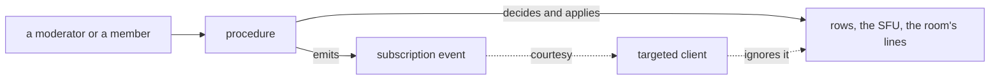

# Server Authority

A client is code the attacker runs. Whatever it is trusted to do on its own behalf — obey a moderator, name itself, say what kind of message it is posting, report where it connects from — is a thing a hostile client simply does differently. So each of those is decided on the server, and the client's own behaviour is kept only as the courtesy that makes the honest path feel instant.

## How it works

The dotted edges are the ones a hostile client controls, and nothing downstream depends on them: the state was already changed before the event left.

## Where it applies

- **Moderation of a call.** A kick, a ban, a soft ban or a timeout takes the member out of every call the room runs, and force mute and stop screen share revoke publish sources at the SFU. A removed member's token stays valid at LiveKit until its expiry, so every `participant_joined` webhook re-checks the room's door and drops a connection the room no longer admits ([moderation](/docs/esbabbler/moderation)).
- **The room's own voice.** A join, a leave, a call, a pin and a rename are lines the server writes; a member posts only messages and polls ([messaging](/docs/esbabbler/messaging)). A line in the room's voice carries member names verbatim, so it is rendered as text wherever a message is rendered as markup.
- **Who a member is.** The typing indicator reads the member's name off their membership row rather than the input, so no member can type as someone else.
- **Where a caller connects from.** An anonymous caller is keyed on the address the platform's front end appended, never an entry the caller sent ([rate limiting](/docs/architecture/rate-limiting)).
- **A third party's allowance.** A public read that calls an external API answers once per process, so a caller cannot spend the server's quota for everyone — the build version's GitHub read is the instance.

## Key files

Paths relative to `apps/web`; `packages/` ones to the repo root.

| File                                                            | Role                                          |
| --------------------------------------------------------------- | --------------------------------------------- |
| `server/services/message/call/evictRoomCallParticipants.ts`     | a removal reaching every call in the room     |
| `server/services/message/call/checkIsCallConnectionAdmitted.ts` | the door every call connection is asked again |
| `server/services/livekit/updateLiveKitTrackSources.ts`          | publish revokes and grants at the SFU         |
| `packages/db-schema/src/models/message/UserMessageType.ts`      | the message types a member may post           |
| `server/services/request/getIpAddress.ts`                       | the anonymous caller's address                |
| `server/services/app/getCommitCount.ts`                         | a third-party read answered once per process  |
