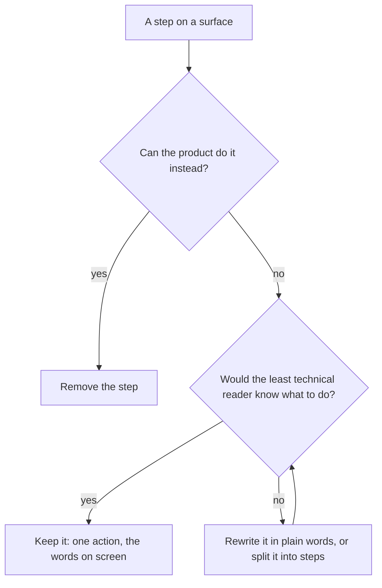

# Simplest Reader First

Every surface is written for the least technical person who will ever use it. If that person can finish the job from the screen alone, everyone else can too. The reverse never holds: a screen written for an expert loses the novice at the first word it does not know. So the target reader is the one who knows nothing about how the product works inside — not what a terminal is, what a port is, or why a file needs unzipping — and every surface is judged by whether that reader gets through it without help.

## The rules

- **One way through.** A surface offers one path to its job. A second path for experts — a command, a pasted address, an advanced toggle — is a second thing the novice has to decide against, so it lives in the docs or a README, never beside the simple path.
- **No plumbing on screen.** No addresses, ports, tokens, file paths, commands, IDs or JSON, unless the thing being shown is that plumbing. A detail the product needs is the product's to handle; a detail the reader must check for safety is said in plain words (_this link connects to another computer_), not shown raw.
- **Steps are what the reader does, in order.** A task of more than one action is a numbered list, one action per step, naming the words the reader will see on screen (_More info_, _Run anyway_, _Hold Ctrl and click the link_) rather than describing them.
- **Plain words, and the fewest of them.** Everyday words over technical ones, a short sentence over a long one, and nothing that explains how the product works inside. A sentence that only an expert needs is cut from the surface, not shortened.
- **Every step that can fail says what to do next**, in the same plain words: _Close any other Esposter host window, then open this file again_, never an error code or a stack.
- **Remove the step before explaining it.** When a step needs explaining, first ask whether it can go: an unzip becomes one file, a pasted address becomes a link, a link becomes a button. The explanation is what is left once nothing more can be removed.

## The worked case

Connecting the [agent console](/docs/infra/claude-interface/agent-console) to a computer began as: run `pnpm dlx agent-console-server` in a terminal, copy the `ws://…?token=…` address it prints, and paste it into a field. That assumed Node, pnpm, a terminal and an idea of what an address with a token is. It is now three numbered steps with one button: _Download the host_, _Open the file you downloaded_, _Hold Ctrl and click the link in it_. The download is one file rather than a zip, because Windows runs a program from inside a zip without the files beside it ([host installer](/docs/infra/claude-interface/agent-console/host-installer)). The command and the pasted address still exist, in the package README, for the reader who wants them.

## Where this sits

This page decides the words and the number of paths. Where an action lives and from where a person reaches it is the `ux` skill's; the reference product a surface is judged against is [design sources](/docs/architecture/design-sources)'. A reference product that shows its plumbing is not followed there.
