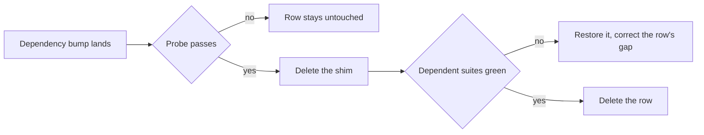

# Test Harness Workarounds

The suite carries a handful of shims that exist for one reason each: something the runner, its DOM, or a module does not implement. None of them is a design decision — they are the cost of running today's tests on today's tools, and every one is meant to be deleted rather than maintained.

The failure mode they share is silence. A shim whose cause is gone still passes: the stub is installed, nothing reads it, and no assertion notices. So a shim outlives its bug unless something tracks it, and the thing tracking it is this page — one row per shim, each with the probe that decides whether it is still needed and the code its removal deletes. A row leaves when its probe passes and the suites that leaned on the shim stay green without it.

Every row's third column is written so nobody re-derives the reasoning: it names the probe **and the signature that means the shim is still earning its place**. Running the probe and comparing against that signature is the whole check — an error string, an absent global, a failing suite. A row whose probe cannot be run at all says so, because an unrunnable probe is a finding rather than a pass.

## The blocker table

| Workaround                                 | Gap it covers                                                                                                                                                                                                                                                                                                                                                                                                                                                                                                                                                                                                                                                                                                                                                                                                                                                                                                                         | Retires when — the probe, and what "still needed" looks like                                                                                                                                                                                                                                                                                                         | Removal deletes                                                                                                             |
| ------------------------------------------ | ------------------------------------------------------------------------------------------------------------------------------------------------------------------------------------------------------------------------------------------------------------------------------------------------------------------------------------------------------------------------------------------------------------------------------------------------------------------------------------------------------------------------------------------------------------------------------------------------------------------------------------------------------------------------------------------------------------------------------------------------------------------------------------------------------------------------------------------------------------------------------------------------------------------------------------- | -------------------------------------------------------------------------------------------------------------------------------------------------------------------------------------------------------------------------------------------------------------------------------------------------------------------------------------------------------------------- | --------------------------------------------------------------------------------------------------------------------------- |
| `MemoryStorage` for `localStorage`         | The **node** environment has no storage: the shared Vitest configuration passes `--no-webstorage`, because node's own Web Storage without `--localstorage-file` reads `undefined` and prints an "ExperimentalWarning" on every run, and the setup file's `afterEach` clear runs for every file whichever environment it is in. The nuxt environment needs nothing — happy-dom's own `Storage` lands there — so the shim is installed only where the global is missing, never assigned over                                                                                                                                                                                                                                                                                                                                                                                                                                            | the node-environment suites stop sharing a setup file with the DOM ones — the probe is deleting the two assignments and running any node-environment suite, and the shim stands while that run fails on `localStorage` being undefined                                                                                                                               | two `??=` assignments and a `Storage` implementation                                                                        |
| The upstream Vue log filter                | `@nuxt/test-utils` hands Vue Test Utils a `mocks` object even when empty, so every `mountSuspended` installs a mixin the Options-API-off Vue warns about; and the nuxt environment's own filter for Vue's `<Suspense>` notice patches a console Vitest has already replaced, so the notice prints anyway. `onConsoleLog` in `getVueTestConfiguration` drops both by their opening text                                                                                                                                                                                                                                                                                                                                                                                                                                                                                                                                                | each dependency stops printing — the probe is emptying `UPSTREAM_VUE_LOGS` and running any `mountSuspended` suite with `--silent=false`, and an entry stands while its line reappears in that run's output. The flag is the probe: Vitest hides a passing test's console output, so without it the run prints neither line whether or not the filter is still needed | a constant and one `onConsoleLog`                                                                                           |
| The canvas context mock                    | Happy-dom's canvas element answers `getContext("2d")` with `null`, and Phaser needs a context to boot                                                                                                                                                                                                                                                                                                                                                                                                                                                                                                                                                                                                                                                                                                                                                                                                                                 | happy-dom implements a 2D context — the probe is `new Window().document.createElement("canvas").getContext("2d")`, and the shim stands while that is `null`; deleting it fails every `vue-phaserjs` suite at once, so the confirmation is cheap                                                                                                                      | a hand-written `CanvasRenderingContext2D` and the per-instance `createElement` spy, the largest single removal on this page |
| The `Phaser` global stub                   | `phaser4-rex-plugins` reads `Phaser` as a browser global rather than importing it                                                                                                                                                                                                                                                                                                                                                                                                                                                                                                                                                                                                                                                                                                                                                                                                                                                     | **the probe cannot be run today** — no suite imports a module that loads a rex plugin, so removing the stub passes without proving anything. It becomes checkable the moment a test covers `useInitializeGameObjectEvents`, which is the reason to write that test                                                                                                   | a `stubGlobal` and `unstubAllGlobals` pair                                                                                  |
| The Vitest module allowlist                | `@vite-pwa/nuxt` breaks Nuxt's config resolution on Windows, taking pure-node tests down with it, and builds a service worker; the other excluded modules leak a teardown error or add headers nothing asserts. `@unocss/nuxt`, once the module that crashed, now resolves cleanly and stays out only because no test needs it                                                                                                                                                                                                                                                                                                                                                                                                                                                                                                                                                                                                        | each excluded module resolves cleanly under Vitest — the probe is moving one back into the Vitest branch and running any suite on Windows, and the shim stands while that run dies with `The argument 'filename' must be a file URL object, file URL string, or absolute path string. Received 'file:///@vite-plugin-pwa/virtual:pwa-register/vue'`                  | the `process.env.VITEST` fork in the module list, leaving one list                                                          |
| The `app` block in the runtime-config mock | Nuxt's generated internal paths module reads `useRuntimeConfig().app.baseURL` at module scope, so a mock without the standard defaults fails on import                                                                                                                                                                                                                                                                                                                                                                                                                                                                                                                                                                                                                                                                                                                                                                                | the read stops being eager — the probe is the only one here that needs a **whole-suite** import graph rather than a file or two, since the failure depends on which modules a run happens to pull. It rides a CI run rather than a local pass, which is also why it is the cheapest row to leave alone                                                               | three keys of a mock                                                                                                        |
| `fake-indexeddb/auto`                      | Neither environment has IndexedDB at all — node has none, happy-dom implements none, and the nuxt environment adds none — so `indexedDB` and the `IDB*` constructors the `idb` library reaches for are both absent                                                                                                                                                                                                                                                                                                                                                                                                                                                                                                                                                                                                                                                                                                                    | an environment implements IndexedDB — the probe is dropping the setup entry and running the IndexedDB cache suites, and the shim stands while they fail with `ReferenceError: indexedDB is not defined`                                                                                                                                                              | a global setup entry and a devDependency                                                                                    |
| The Nuxt runtime warm-up                   | The first mount in a worker evaluates the whole app graph, and charged inside a test body that cold cost can exceed the per-test timeout. The same hook then awaits `router.isReady()`: the app's initial navigation lands on its own schedule and replaces the route, so a suite that writes route params before it lands loses them — invisible while every tRPC call answered at once, and a reliable failure under load once the batch link answers a macrotask later. The same hook then makes the app's own Pinia the active one, emptied, before every test — not a workaround but the harness's rule, since the app calls actions on its own stores whenever it likes (`recentPages.client.ts`'s `dom:rendered` hook and router `afterEach`) and every action re-activates its store's Pinia, so a suite holding a second Pinia of its own reads the app's from then on (the `testing` skill, `references/mounted-stores.md`) | `@nuxt/test-utils` warms its own worker — the probe reads component-test **timings** with the hook deleted rather than pass or fail, so it is the one row a green run does not settle                                                                                                                                                                                | a `beforeEach` and its module-scoped flag                                                                                   |

## How a retirement runs

A row is not removed because a release note claims the gap is closed. It is removed when the shim is gone and the suites that leaned on it still pass, which is why every row carries a probe rather than a version alone.

The probes are cheap enough to run on the bump that plausibly moves one, so nothing here earns a scheduled pass of its own: the [dependency update process](/docs/architecture/monorepo-tooling) owns the bumps, and a row whose dependency has not moved cannot have changed.

Two things the first pass through this table settled are worth stating, because both are the reason a row's signature is written down rather than reasoned out again. A shim can be **half dead**: `sessionStorage` reached the global perfectly well while `localStorage` never did, so half the storage shim was overwriting a working implementation. And a shim can outlive its bug in the runtime rather than in the library — happy-dom fires image load events and reports a `readyState` Phaser accepts, so the two spies that forced both were deleted while the canvas mock beside them stayed load-bearing. Neither was visible from the code; both took one probe.

## What is not on this list

Not every piece of test scaffolding is a workaround, and treating them alike would make the table unfalsifiable:

- **The harness itself** — the in-memory Azure clients, the PGlite database, the session mock. They stand in for services that have no business running inside a unit test, and no upstream release retires them.
- **Deliberate narrowing** — `toFake: ["Date"]` fakes _less_ than the default on purpose, because the wide default also freezes the monotonic clock a table write's `rowKey` depends on. That is a rule, not a gap.
- **An origin nothing answers** — the nuxt environment runs on `http://nuxt.test`, a `.test` host that never resolves, rather than Nuxt's default `localhost:3000`. It is a rule rather than a gap: msw intercepts beneath happy-dom's `fetch`, and a request it misses goes out to the real network, where the default origin is exactly where a developer's dev server listens — so a suite answered by the real router failed only while one was running, and passed the moment it was stopped or instrumented. On this origin a missed request fails at once with `fetch failed`, whatever the cause of the miss, and `apps/web/vitest.config.test.ts` pins that it does.
- **Language ergonomics** — `takeOne` exists for `noUncheckedIndexedAccess` across the whole repo, not for tests.

## Key files

| File                                                    | Role                                                                                       |
| ------------------------------------------------------- | ------------------------------------------------------------------------------------------ |
| `packages/configuration/src/getVueTestConfiguration.ts` | The upstream Vue log filter                                                                |
| `packages/configuration/src/getVitestConfiguration.ts`  | `--no-webstorage` for every member                                                         |
| `apps/web/shared/test/setup.ts`                         | Storage, the Azure and runtime-config mocks, the warm-up hook, and auto-unmount            |
| `apps/web/vitest.config.ts`                             | `setupFiles` including `fake-indexeddb/auto`, the node default, and the timeouts around it |
| `apps/web/configuration/modules.ts`                     | The Vitest module allowlist                                                                |
| `packages/vue-phaserjs/src/test/setupCanvas.ts`         | The canvas, image and `readyState` spies Phaser boots against                              |
| `packages/vue-phaserjs/src/test/setup.ts`               | The `Phaser` global stub                                                                   |
