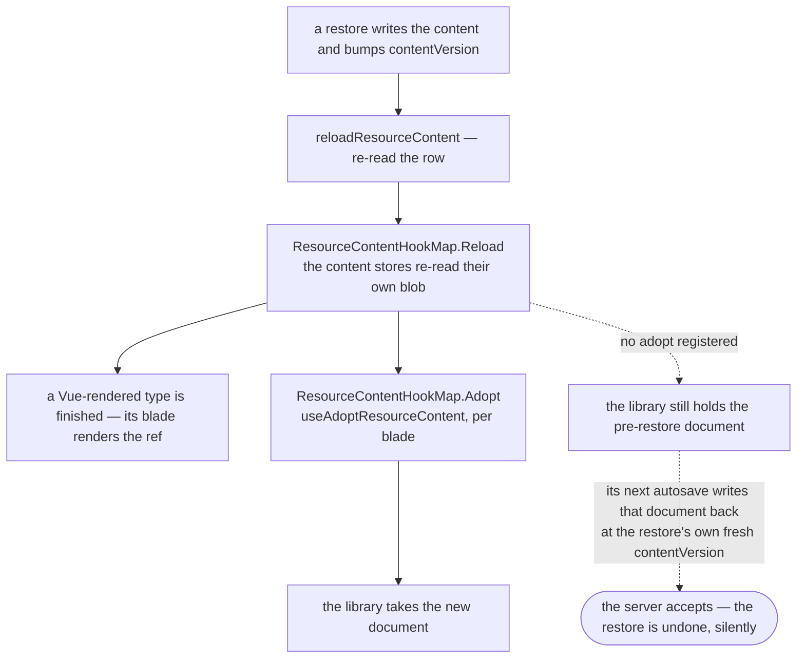

# Third-party document adapters

Most of the app's editable state is a ref a store owns and a template renders, so replacing the ref is the whole of making a change visible. Three editors are not: Tiptap, SurveyJS and GrapesJS each parse the document once and then hold it themselves, in a model the app cannot re-render from.

That difference is invisible while the only writer is the editor, and it is the entire problem the moment anything else writes — which one thing does. A [restore](/docs/resource/resource-snapshots) replaces the working copy underneath an open blade, and the row it lands on is re-read immediately, so the blade's `contentVersion` is the restore's own. An editor still holding the pre-restore document therefore does not fail its next save: it wins it.

> A library that owns the live document owes an **adopt** path. Holding a replaced document is a silent write-back, not a stale view.

## The two stages

They are two registries rather than one because a registry runs its hooks together: the adopt stage reads what the reload stage landed, so it cannot be a peer of it. The ordering is the only reason the second stage exists, and it is what `reloadResourceContent` is tested on.

`useAdoptResourceContent` registers for one `ResourceType` and unregisters when the blade's scope ends. That teardown is load-bearing, not hygiene — the registries are module-scoped and the editor is not, so a remount without it leaves an adopter holding a destroyed editor.

## What each library's adopt is

| Editor   | Where it registers     | What it does                                                                                                           |
| -------- | ---------------------- | ---------------------------------------------------------------------------------------------------------------------- |
| Tiptap   | `Resource/Note/Editor` | `setContent` with `emitUpdate: false` — an update here is the restore echoing back out as an edit                      |
| SurveyJS | `useSurveyCreator`     | re-splits the store's model string into JSON and theme, as construction does                                           |
| GrapesJS | `useGrapesJsEditor`    | `load({ clear: true })` — re-runs its own storage adapter, which hands over what the store's reload stage just re-read |

GrapesJS is the one that needs only the second stage. `clear` is passed because the undo stack and dirty counter it carries describe a document that is gone.

## Adding one

A library qualifies when it parses the content once and answers from its own copy afterwards — the test is whether replacing the store's ref changes what is on screen. If it does, there is nothing to do. If it does not, the blade registers `useAdoptResourceContent` beside wherever it constructs the editor, and the adopt uses the library's own replace-the-document call rather than a remount: a keyed remount would drop selection, scroll and undo for a change the library has an API for.

Register before the first `await` in an async composable. Past it the caller's scope is gone, so the teardown silently attaches to nothing — the same hazard `useGrapesJsEditor` already captures its instance for.

## Key files

| File                                                           | Role                                                        |
| -------------------------------------------------------------- | ----------------------------------------------------------- |
| `apps/web/app/services/resource/ResourceContentHookMap.ts`     | the two stages                                              |
| `apps/web/app/composables/resource/useAdoptResourceContent.ts` | what a blade registers, and its teardown                    |
| `apps/web/app/store/resource/index.ts`                         | `reloadResourceContent` — the row re-read, then both stages |
| `apps/web/app/services/resource/createContentData.ts`          | the reload stage every content store gets for free          |
| `apps/web/app/composables/grapesjs/useGrapesJsEditor.ts`       | the GrapesJS adopt, registered before its first await       |
| `apps/web/app/composables/survey/useSurveyCreator.ts`          | the SurveyJS adopt                                          |
| `apps/web/app/components/Resource/Note/Editor.vue`             | the Tiptap adopt                                            |

## Notes

- Real-time content sync is the same shape arriving from a different direction — another device's save streams `{ content, contentVersion, id }` and subscribers adopt both ([resources](/docs/architecture/resource)). Only TodoList wires it, and it is Vue-rendered, so it needs no second stage; a third-party editor opting in would route its subscription through its adopt rather than a second replace path.
- Nothing derives "is this type editor-owned" from a map. The adopt is registered where the editor is constructed, which is the only place that knows — a registry keyed by `ResourceType` would be a second list to keep in step with the blades, and the [capability admission rule](/docs/architecture/resource) refuses exactly that.
