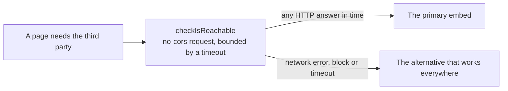

# Third-party reachability

Some readers cannot reach some third parties: YouTube is blocked in mainland China, and a school, an office or another country's network blocks hosts of its own. When a page embeds a third party that has an alternative, the question it needs answered is not where the reader is or what language they read, but whether this reader's network reaches that host right now. So the page asks the network.

## How it works

- **The probe is a real request to the host the embed loads from.** `checkIsReachable` sends a `no-cors` request, which any origin answers without a CORS header, so its response is never read: any HTTP answer, a 404 included, means the network reaches the host. A blocked host fails the request outright, or swallows it until `AbortSignal.timeout` aborts it.
- **Anything short of an answer is a no.** A failure, a timeout and a request an ad blocker refuses all pick the alternative, so the probe fails toward the choice that plays rather than toward a broken frame.
- **The wait is hidden behind something the page already does.** The probe runs while the page shows what it was showing anyway, and the choice lands when both finish, so a reader on an open network waits no longer than the page would have.

## Why not the reader's language or location

- **Language is a preference, not a place.** `Accept-Language` and `navigator.languages` say what a reader reads: a reader in Shanghai with an English browser, and one in Singapore reading Simplified Chinese, would both be sent the wrong way. Game text resolves a language from them (`matchGameLanguage`) and nothing else does.
- **Location is not the network either.** Geolocating the IP address needs a lookup service or a CDN header the host does not send, and still misreads a reader on a VPN, a reader abroad, and every network that blocks a host without being in a country that does.

## Key files

| File                                            | Role                                                              |
| :---------------------------------------------- | :---------------------------------------------------------------- |
| `apps/web/app/util/network/checkIsReachable.ts` | Whether the reader's network answers a URL within the time given  |
| `apps/web/app/components/Genshin/Index.vue`     | The first user: YouTube or Bilibili for the login door's rickroll |
