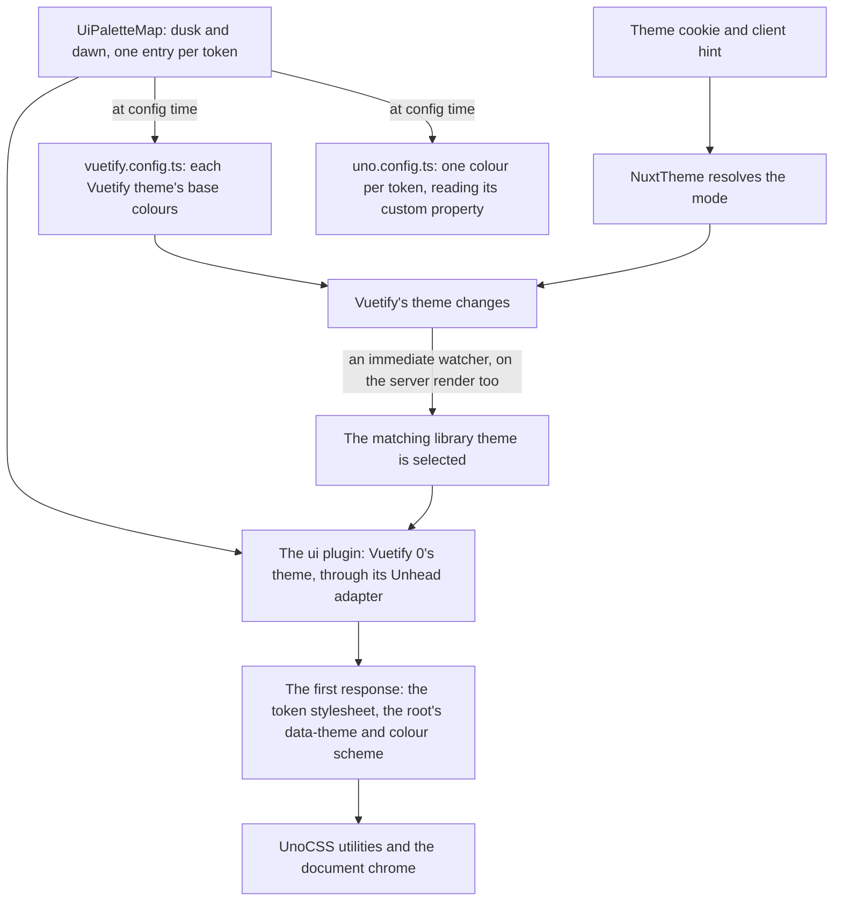
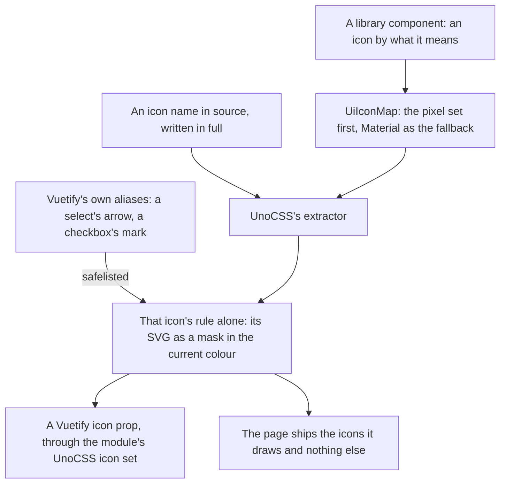

# UI Library

The app is moving from Material as Vuetify draws it to a library of its own, built in `apps/web` on [Vuetify 0](https://0.vuetifyjs.com/introduction/why-vuetify0) — Vuetify's headless layer, which owns focus, keyboard handling, ARIA and positioning and paints nothing. The migration runs as a ladder of stages, designed in the [UI library proposal](/docs/proposals/refactors/ui-library). This page is what exists so far: the foundation every later stage builds on, and the icons.

The foundation changes no component, and still repaints every page. Its design tokens are the colours of the whole app, Vuetify's pages included, and the document's own chrome — scrollbars, selection, caret, focus ring — reads them on every page whichever library draws it.

## One palette, two libraries

- **The palette is `UiPaletteMap`**, keyed by `UiTheme` and then `UiToken`: the colours an interface is drawn in: two surfaces (background and panel), the edge between them, text and its muted form, one accent, and error, info, success and warning. Dusk is the agent console's palette as it was drawn. Dawn is its light twin, authored beside it rather than computed from it, so the app keeps its light mode. Both use the same token names, so nothing that reads a token knows which theme is selected.
- **Every foreground token meets WCAG AA on every surface token in both themes.** A test computes the contrast ratio of each pair and holds it at the AA threshold.
- **Vuetify 0's theme plugin writes the tokens.** It renders one rule per theme, each token a custom property such as "--ui-accent" keyed on the root's "data-theme" attribute, and the root's colour scheme from the selected theme. Its Unhead adapter puts all of it in the first HTML response, so a page never paints in the wrong theme before hydration. The default adapter writes adopted stylesheets, which exist only in the browser.
- **Vuetify is fed from the palette.** `vuetify.config.ts` builds each of its themes' base colours — background, surface, text, primary, border and the status colours — from the matching entry, so a page Vuetify still draws matches the library on the same screen, and a palette edit repaints both.
- **UnoCSS reads the tokens as variables.** Each token is a theme colour whose value is its custom property, so a utility follows the selected theme at runtime. Vuetify's other colour names (primary, surface, border, and their opacity and variation keys) still generate while templates not yet migrated write them; where a name is both, the token wins, and since Vuetify is fed the same value the two only differ in owner.
- **The palette lives in `apps/web/configuration/`**, beside the breakpoint scale, because the Vuetify and UnoCSS configs read it and they load before any `@/` alias resolves. It imports its enums relatively, as the other configuration files do.

The agent console's palette takes its interface half from dusk, so the console and the app's dark theme are one set of colours. The console stays in dusk whichever theme the app is in, and keeps its own world materials — wood, skin, stone and the rest — until its [stage of the migration](/docs/proposals/refactors/ui-library/agent-console) moves its panels onto the library.

## Icons

- **UnoCSS's icons preset is the engine.** A class naming an Iconify icon becomes a rule that draws its SVG as a mask filled with the current colour, so an icon takes the text colour as a glyph did. The Material Design Icons set is read at build time from its Iconify JSON package and never shipped. The rules sit in their own cascade layer ahead of Vuetify's and the utilities, since each also sets its colour to inherit: a component that colours its own icon, as a field does in its error state, and a colour or size utility written on an icon both still win.
- **A name is written in full**, as "i-mdi:" and the icon's name, because the preset generates only what its extractor finds in source. A name assembled from a prefix and a variable generates nothing and draws an empty box, so it is a review finding. The extractor reads components and markup but not plain TypeScript, which would hand every string in the app to the attributify extractor and break the stylesheet on the first one that looks like an attribute, so a `.ts` file that names an icon opts in with UnoCSS's `@unocss-include` comment on its first line. A `v-icon` takes its icon as the `icon` prop, never as text content, which the extractor does not read. A test generates the icons each source file names and fails on any it cannot find, or on a `.ts` file naming one without the comment.
- **Vuetify draws through the same CSS.** Its default set is the module's "unocss-mdi", which hands the class to Vuetify's class icon. Vuetify's internal icons are aliases no source file names, and the module maps only some of them, so `vuetify.config.ts` maps every alias Vuetify defines from Vuetify's own list and `uno.config.ts` safelists the result.
- **The custom component icons** — the anime and dungeon gate marks — stay components in the custom set. The app's Vuetify plugin adds that set to the module's icon configuration rather than replacing it, which would drop the aliases.
- **The library's icons are pixel icons, named by meaning.** `Ui/Icon.vue` takes a `UiIconMeaning` — what the icon says, such as success or remove — and `UiIconMap` resolves it to a class: [Pixelarticons](https://pixelarticons.com/) first, a set drawn on a pixel grid to sit on a voxel surface, and a Material Design Icons class for a meaning it has no glyph for. Swapping sets is one map edit, a fallback is a row in the map, and a feature never names a set. Vuetify's components keep their Material icons until their unit migrates.
- **A pixel icon renders at 1.5rem**, the size of its 24-unit grid, so every unit is a whole CSS pixel; any other size blurs the grid.
- **An icon is decoration unless it is labelled.** Without a label it is hidden from assistive technology; with one it is an image with that name, for an icon that says what nothing beside it does — a tool call's success or failure mark.
- **Under Vitest the UnoCSS module is not loaded**, so the module falls back to Vuetify's plain class set: an icon still carries its class, which is what a test finds it by, and nothing draws it.

## One owner per concern

Two component libraries on one page stay coherent only if each concern has exactly one owner at a time, which is Vuetify 0's own [compatibility rule](https://0.vuetifyjs.com/guide/integration/compatibility).

| Concern                 | Owner while both libraries are in the app                                           |
| :---------------------- | :---------------------------------------------------------------------------------- |
| Which theme is selected | `NuxtTheme`, through Vuetify's theme; the library's theme follows it                |
| The colour values       | the palette map, read by both themes                                                |
| Breakpoints             | Vuetify's display composable, fed by the [one scale](/docs/architecture/responsive) |
| Validation rules        | Vuetify's rules                                                                     |
| Hotkeys                 | Vuetify's hotkey composable                                                         |

`NuxtTheme` resolves the mode once and changes Vuetify's theme, and an immediate watcher on Vuetify's theme name selects the matching library theme through `useSelectUiTheme`. Every path that changes the theme — the resolution on each request, the system preference settling after hydration, and the theme toggle — goes through Vuetify's theme, so the watcher is the one place the library's selection is written. It is immediate because the server render has to select the right theme too: the adapter's own server-side watcher then patches the head entry before it is serialised. The other concerns move to Vuetify 0 at [retirement](/docs/proposals/refactors/ui-library/retirement), each in one commit.

## The document chrome

These are properties of the document rather than of any component, so they are set once and reach every page:

- **Scrollbars** thin, with the thumb in the panel edge colour on the background colour, through the standard scrollbar properties on the root, which every scroll container inherits.
- **Selection** in the accent colour, with the background colour for its text.
- **The caret** and **native controls** — a checkbox, a range, a progress bar — in the accent colour.
- **The focus ring** on every focus-visible element: a solid accent outline, its width and its offset each one step.
- **The colour scheme** on the root, from the selected theme, so the browser's own form controls pick the right half.

They sit in a cascade layer of their own, declared before every other layer, so a component that draws its own focus or selection — as Vuetify's fields do — wins over the chrome without an override. The one non-colour token so far is `--ui-step`, a quarter rem: the voxel the library's lengths are whole numbers of, and the width of its edges and focus ring. Only the chrome reads it yet; the type scale and motion durations become tokens with the first component that reads them.

## The boundary

A feature never imports Vuetify 0. Only the library does — its components, composables, models, services and its plugin — so the headless layer stays replaceable and every accessibility decision stays in one folder. An oxlint restricted-imports entry refuses "@vuetify/v0" and its subpaths everywhere else, with an override for exactly those folders. Vuetify 0 is not auto-imported either: its names collide with VueUse and with the ones Vuetify's module auto-imports, and nothing outside the library would call them.

## Agent tooling

- **Vuetify 0's own skill** is vendored into the agent tree, and recorded in `skills-lock.json`. It carries Vuetify 0's decision trees and anti-patterns, and applies inside the library only. The repository's `ui-library` skill holds our conventions on top and outranks it where they meet: its "never a native button" rule is right for a library component and wrong for a feature, which uses the library's instead. How a vendored skill sits in the agent tree is the [agent configuration](/docs/architecture/agent-configuration) page's.
- **Vuetify 0's docs** have a markdown twin of every page, at the same path with a ".md" suffix, which is what an agent reads to look up an API rather than guessing it.

## Key files

| File                                              | Role                                                                                                  |
| :------------------------------------------------ | :---------------------------------------------------------------------------------------------------- |
| `apps/web/configuration/UiPaletteMap.ts`          | Dusk and dawn, one entry per token                                                                    |
| `apps/web/configuration/UiPaletteMap.test.ts`     | Every foreground token against every surface token, at the WCAG AA ratio                              |
| `apps/web/configuration/ThemeModeUiThemeMap.ts`   | The library theme each of Vuetify's resolved modes selects                                            |
| `apps/web/app/models/ui/UiToken.ts`               | The token names                                                                                       |
| `apps/web/app/models/ui/UiIconMeaning.ts`         | What each library icon says                                                                           |
| `apps/web/app/services/ui/UiIconMap.ts`           | Each meaning's icon class: the pixel set first, Material as the fallback                              |
| `apps/web/app/components/Ui/Icon.vue`             | The icon element, by meaning, decorative unless labelled                                              |
| `apps/web/app/plugins/ui.ts`                      | Vuetify 0's hydration and theme plugins, the theme through the Unhead adapter                         |
| `apps/web/app/composables/ui/useSelectUiTheme.ts` | Selects the library theme matching a Vuetify mode                                                     |
| `apps/web/app/components/Nuxt/Theme.vue`          | Resolves the mode once and selects it in both libraries                                               |
| `apps/web/vuetify.config.ts`                      | Its theme colours read the palette map; its icons are the UnoCSS set, every alias mapped              |
| `apps/web/uno.config.ts`                          | One theme colour per token, reading its custom property; the icons preset, and the safelisted aliases |
| `apps/web/uno.config.test.ts`                     | Every icon a source file names generates its rule                                                     |
| `apps/web/app/assets/css/globals.scss`            | The document chrome and the step token                                                                |
| `apps/web/app/assets/css/layers.css`              | Declares the chrome's layer first, and the icons' ahead of Vuetify's                                  |
| `apps/web/app/plugins/vuetify.ts`                 | Adds the custom component icons to the module's icon configuration                                    |
| `.oxlintrc.json`                                  | The import boundary                                                                                   |
| `.agents/skills/ui-library/SKILL.md`              | The library's conventions                                                                             |

## Sources

- [Nuxt integration](https://0.vuetifyjs.com/guide/integration/nuxt), Vuetify 0: the transpile entry, the Unhead theme adapter and the hydration plugin.
- [Theming](https://0.vuetifyjs.com/guide/features/theming), Vuetify 0: themes as custom properties.
- [AI tools](https://0.vuetifyjs.com/guide/tooling/ai-tools), Vuetify 0: the skill and the markdown twin of every docs page.
- [Icons preset](https://unocss.dev/presets/icons), UnoCSS: icons as generated CSS masks from Iconify JSON, emitted only for the names the extractor finds.
- [Vuetify Nuxt module](https://nuxt.vuetifyjs.com/), its icons option: the "unocss-mdi" set and the aliases it maps.
- [Pixelarticons](https://pixelarticons.com/): the pixel icon set and its MIT licence.
- [scrollbar-color](https://developer.mozilla.org/en-US/docs/Web/CSS/scrollbar-color), MDN: the standard scrollbar properties the chrome sets.
- [Success criterion 1.4.3](https://www.w3.org/TR/WCAG22/#contrast-minimum), WCAG 2.2: the AA threshold the palette test holds each pair to.
