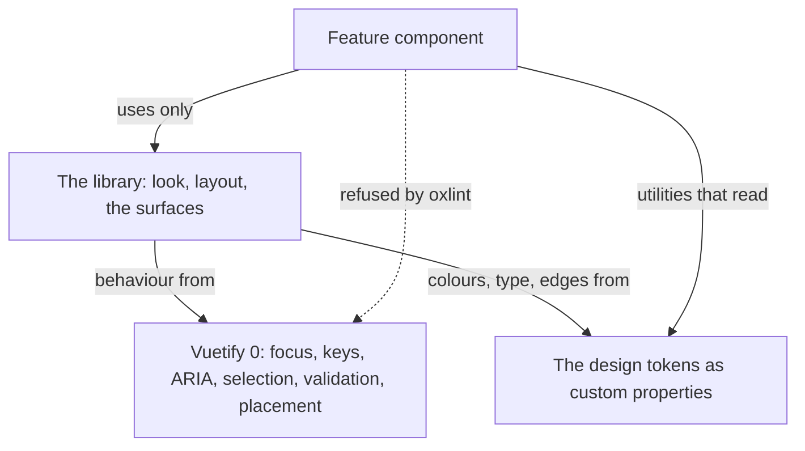
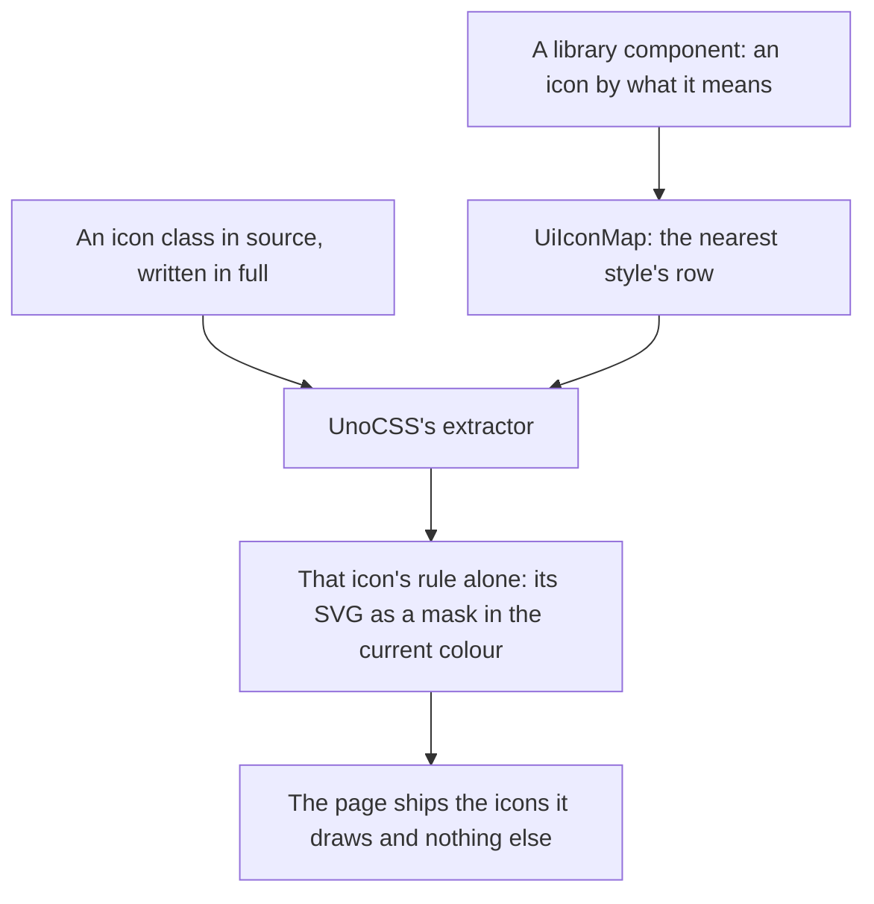
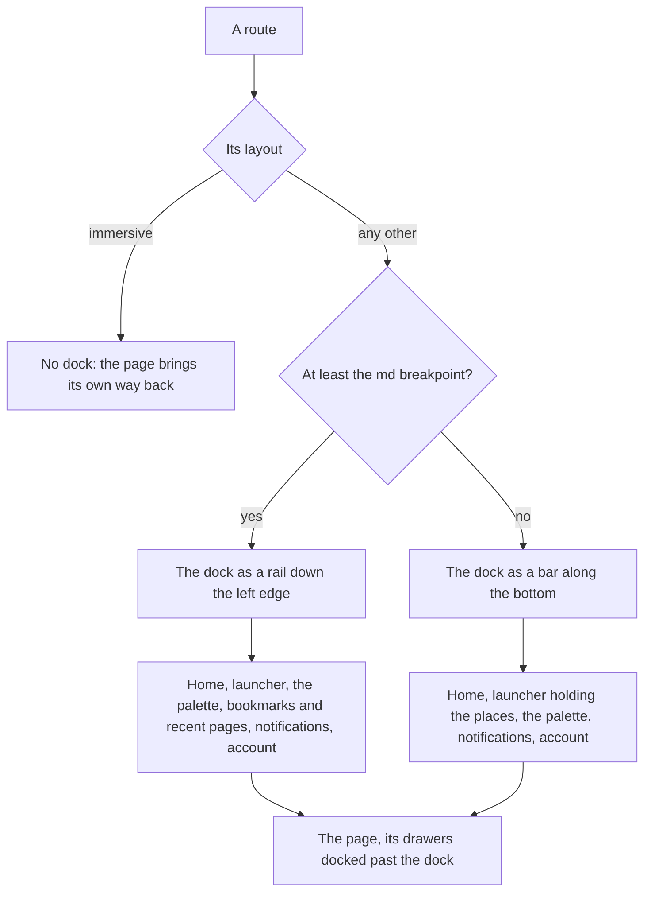
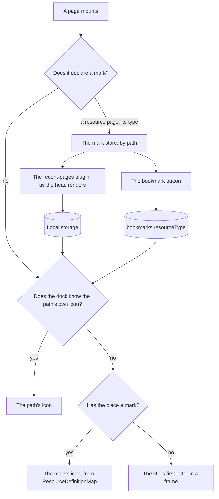
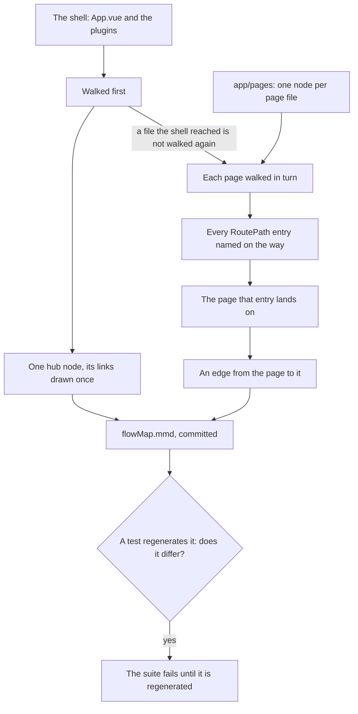

# UI Library

Every interface in the app is built from a library of its own, in `apps/web`, on [Vuetify 0](https://0.vuetifyjs.com/introduction/why-vuetify0) — Vuetify's headless layer, which owns focus, keyboard handling, ARIA, selection, validation and positioning and paints nothing. The library takes its behaviour from Vuetify 0 and its look from the [design language](/docs/architecture/design-language): the tokens, the design styles, the surfaces and the type every component and every feature's markup is drawn with. This page is the library itself: its layers and boundary, its icons, its components and their contracts, the app shell every page sits in, and the flow map. The one context menu and the one command palette built on it have standards of their own, [context menus](/docs/architecture/context-menus) and the [command palette](/docs/architecture/command-palette).

## Three layers

- **A feature never imports Vuetify 0.** It uses the library, and only the library imports Vuetify 0, so the headless layer stays replaceable and every accessibility decision stays in one folder ([the boundary](#the-boundary)).
- **The look is tokens, not components.** A component reads tokens and never holds a colour, so the palette can change, or a design style be added, without a component edit.
- **The library stays in the app.** It moves into a package of its own only when a second app consumes it, which is the repository's rule for any shared code. Until then a package would be a build, a manifest and a publish step guarding nothing.
- **The name is neutral.** The library takes "Ui" as its component prefix and folder: the tokens carry the aesthetic, so a change of look renames nothing, and [design styles](/docs/architecture/design-language#design-styles) are that change made a setting.

## One owner per concern

Each concern the interface has is owned in exactly one place, which is Vuetify 0's own [compatibility rule](https://0.vuetifyjs.com/guide/integration/compatibility) and the reason nothing drifts between two answers to one question.

| Concern                 | Owner                                                                                                                                                    |
| :---------------------- | :------------------------------------------------------------------------------------------------------------------------------------------------------- |
| Which theme is selected | `NuxtTheme`, through the theme-mode and style stores, into Vuetify 0's theme ([design language](/docs/architecture/design-language#selecting-the-theme)) |
| The colour values       | the palette map, and the style map for everything else a style draws                                                                                     |
| Breakpoints             | Vuetify 0's breakpoints, fed by the [one scale](/docs/architecture/responsive) and read through `useUiDisplay`                                           |
| Validation rules        | the library's `UiRules` builders, checked by Vuetify 0's form                                                                                            |
| Hotkeys                 | Vuetify 0's hotkey composable, through `useCommands` ([command palette](/docs/architecture/command-palette))                                             |
| Scrolling to an element | the browser's own smooth scrolling                                                                                                                       |
| Dates                   | the platform's Temporal ([calendar](/docs/architecture/calendar))                                                                                        |

## Icons

- **UnoCSS's icons preset is the engine.** A class naming an Iconify icon becomes a rule that draws its SVG as a mask filled with the current colour, so an icon takes the text colour as a glyph did. The Material Design Icons set is read at build time from its Iconify JSON package and never shipped. The rules sit in their own cascade layer ahead of the utilities, since each also sets its colour to inherit: a component that colours its own icon, as a field does in its error state, and a colour or size utility written on an icon both still win.
- **A name is written in full**, as "i-mdi:" and the icon's name, because the preset generates only what its extractor finds in source. A name assembled from a prefix and a variable generates nothing and draws an empty box, so it is a review finding. The extractor reads components and markup but not plain TypeScript, which would hand every string in the app to the attributify extractor and break the stylesheet on the first one that looks like an attribute, so a `.ts` file that names an icon opts in with UnoCSS's `@unocss-include` comment on its first line. A test generates the icons each source file names and fails on any it cannot find, or on a `.ts` file naming one without the comment.
- **The app's own marks are icons like any other.** The anime and dungeon gate marks are SVG files in `app/assets/icons/`, which UnoCSS's icons preset serves as the `i-custom:` set, so they are written whole as classes and draw wherever an icon class does. A file there is its icon's whole definition; nothing registers it.
- **The library's icons are named by meaning.** `Ui/Icon.vue` takes a `UiIconMeaning` — what the icon says, such as success or remove — and `UiIconMap` resolves it to a class in the nearest style's row. Standard's is Lucide; voxel's is [Pixelarticons](https://pixelarticons.com/) first, a set drawn on a pixel grid to sit on a voxel surface, and a Material Design Icons class for a meaning it has no glyph for. Swapping sets is one map edit, a fallback is a row in the map, and a feature never names a set: an action a library menu shows is an `Item`, whose `meaning` the menu draws in the nearest style's glyph, beside a whole class for a glyph no meaning names.
- **Pixelarticons has no text-formatting glyphs** — no bold, italic, strike or heading — so an editor's toolbar keeps its Material icons, passed as whole classes in its `Item` list.
- **A pixel icon renders at 1.5rem**, the size of its 24-unit grid, so every unit is a whole CSS pixel; any other size blurs the grid.
- **An icon is decoration unless it is labelled.** Without a label it is hidden from assistive technology; with one it is an image with that name, for an icon that says what nothing beside it does — a tool call's success or failure mark.
- **Under Vitest the UnoCSS module is not loaded**, so an icon still carries its class, which is what a test finds it by, and nothing draws it.

## Components

A component is added to the library when the first surface needs it, never ahead of a consumer, and in the shape every later consumer can use, rather than grown from whichever page reached for it first.

### Every component keeps the same contract

- **Behaviour from the primitive, look from the tokens.** The component spreads the primitive's attributes onto its own element, with the call site's on top, styles its states through the attributes those carry, and holds no colour of its own. Where a row below names no primitive, the component is presentation only.
- **Props are the library's words.** A call site states what it wants — a variant, a label, a placement — and never passes a prop bag through to the primitive.
- **A label is required where the control has no visible text.** An icon button takes a label, which is its accessible name and its tooltip at once, so an unlabelled icon button does not type-check.
- **Each has a component test** of its keyboard contract and its ARIA, mounted with the real Vuetify 0 plugins rather than mocked injections, as Vuetify 0's [testing guide](https://0.vuetifyjs.com/guide/tooling/testing) asks, once per [design style](/docs/architecture/design-language#design-styles). A feature's test then never walks a menu's arrow keys again.
- **Two groups are ours in full**, because Vuetify 0 has no component for them: the context menu, a menu positioned at a point rather than at a trigger, and the calendar, a grid of plain days. Each gets the keyboard contract a primitive would have given it, written to the WAI-ARIA pattern for its role, and its test is what holds it there.

### The catalogue

| Component           | Built on                              | What it is                                                                                                                                                                                                                |
| :------------------ | :------------------------------------ | :------------------------------------------------------------------------------------------------------------------------------------------------------------------------------------------------------------------------ |
| `UiFrame`           | none                                  | A region of content, with an optional title in the accent colour and a slot for its actions                                                                                                                               |
| `UiButton`          | Button                                | The raised block, with accent, danger and quiet variants; a pressed toggle takes the accent                                                                                                                               |
| `UiIconButton`      | `UiButton`                            | An icon by meaning, and a required label that is its accessible name and its tooltip at once                                                                                                                              |
| `UiCopyButton`      | `UiIconButton`                        | Copies its source, and says it did while the clipboard composable's copied state lasts; named "Copy" unless its label says what it copies                                                                                 |
| `UiMenu`            | Popover, roving focus                 | A trigger and the actions it opens, as the menu button pattern has them                                                                                                                                                   |
| `UiSelect`          | Select, virtual focus                 | One choice from a list, as the select-only combobox pattern has it, or several once bound to an array; its trigger shows up to three titles, then how many                                                                |
| `UiSuggestions`     | the popover composable, virtual focus | Completions under a text field the call site owns: the slash palette, a new session's repositories                                                                                                                        |
| `UiSpinner`         | none                                  | Voxel's star a frame at a time, or standard's turning ring, held still under reduced motion                                                                                                                               |
| `UiLoadingBar`      | Progress                              | A row of blocks filled as the work gets done, one thin eased track in standard, with the progress role                                                                                                                    |
| `UiLoadingLine`     | Progress                              | A page's progress as one thin line along an edge: an eased fill in standard, pixel blocks grown whole in voxel                                                                                                            |
| `UiThemeScope`      | Theme                                 | A region drawn in another mode or style than the document's                                                                                                                                                               |
| `UiPopover`         | Popover                               | A trigger and a framed panel of anything that is not a list of actions: the launcher, notifications                                                                                                                       |
| `UiContextMenuHost` | Popover, `useMenu`                    | The one context menu, opened at a point by right-click, long press or the keyboard                                                                                                                                        |
| `UiTooltip`         | Tooltip                               | A small frame naming what it hangs off, popping out at once on hover or keyboard focus; only on a control showing no text of its own, so a menu or panel trigger whose text reads its label takes `isLabelShown` and none |
| `UiAvatar`          | Avatar                                | A picture in a frame, or the first letter of its name until one loads                                                                                                                                                     |
| `UiToast`           | none                                  | A frame with a status mark, a message, an action, and a timer held while it is read                                                                                                                                       |
| `UiToastStack`      | none                                  | The one corner every toast is drawn in, announced as a polite live region                                                                                                                                                 |
| `UiDialog`          | Dialog                                | A modal in the top layer, framed, for content that is the library's alone: high, middle or a sheet                                                                                                                        |
| `UiCommandList`     | virtual focus                         | A search field over the commands it finds, grouped under headings, the list always shown                                                                                                                                  |
| `UiShortcut`        | none                                  | A shortcut as the raised key caps it is pressed with                                                                                                                                                                      |
| `UiButtonLink`      | none                                  | Somewhere to go, in the button's look: a real link, so it opens in a new tab like any other                                                                                                                               |
| `UiTabs`            | Tabs                                  | A row of tabs over the panel of the selected one, which alone mounts its content; a tab may read a muted count after its title                                                                                            |
| `UiTabLinks`        | `UiTooltip`                           | A row of links drawn as tabs, for sections that are somewhere to go; icons alone where width is short                                                                                                                     |
| `UiCollapsible`     | Collapsible                           | A trigger row with a turning chevron over content hidden while it is closed: a navigation's groups                                                                                                                        |
| `UiTextField`       | Input                                 | A labelled field of one line or several, its rules checked as the reader types, a hint under it; a search is a pill; it may be disabled, and a `maxlength` stops the typing and counts it under the field                 |
| `UiForm`            | Form                                  | The fields inside it counted into one validity, and a submit only once every one passes                                                                                                                                   |
| `UiSkeleton`        | none                                  | A block of the panel, a lighter band crossing it, where content is still on its way                                                                                                                                       |
| `UiEmptyState`      | none                                  | A mark, a sentence, a line on how that changes, and at most one action                                                                                                                                                    |
| `UiOverflowMenu`    | `UiMenu`                              | The actions of one thing behind one quiet mark, from the `Item` list its context menu opens                                                                                                                               |
| `UiConfirmDialog`   | `UiDialog`                            | A question before something that cannot be undone: Cancel, and one destructive answer until it lands                                                                                                                      |
| `UiBreadcrumbs`     | Breadcrumbs                           | A trail of links back, whose middle folds behind a button when the row is too short for it                                                                                                                                |
| `UiMeter`           | none                                  | How much of something is used, in the loading bar's blocks, turning warning then danger past its marks, or a level with none                                                                                              |
| `UiCheckbox`        | Checkbox                              | A field's box a block of the accent drops into while checked, and half a block while mixed                                                                                                                                |
| `UiSwitch`          | Switch                                | A setting that takes effect as it flips: a thumb sliding along a field's track, which fills while on                                                                                                                      |
| `UiColorField`      | none                                  | A colour from the browser's own picker, a swatch in a field beside the hex value it holds                                                                                                                                 |
| `UiDataTable`       | `UiCheckbox`, `UiResizeHandle`        | A page of rows a server reads, or every row searched, sorted and paged itself: headers, selection, groups, columns resized on their edge, a sticky first column, comfortable or compact rows, and a grid of cells         |
| `UiErrorState`      | `UiEmptyState`                        | A failed read, announced as it lands, with the button that tries again                                                                                                                                                    |
| `UiChip`            | none                                  | A short reading set into its surface — a count, a size, a kind — with a mark and a block of a token's colour; one the reader added holds a quiet remove mark, named by `removeLabel`, that emits `remove`                 |
| `UiBadge`           | none                                  | How many wait on what it sits beside — unread notifications, a room's mentions — a pill in the danger colour never narrower than it is tall, hidden unless labelled                                                       |
| `UiToggleGroup`     | Radio                                 | One of a few ways to do one thing, as quiet segments on a field's track, the chosen one filled                                                                                                                            |
| `UiAlert`           | Alert                                 | A line the page says about itself, in a frame with a block and a mark of its status                                                                                                                                       |
| `UiInlineAction`    | none                                  | Something to do inside a line of text, a system line's "Edit Room": read as a link in the info colour, never a raised button                                                                                              |
| `UiItemContent`     | none                                  | What one row of any list shows: a mark's column kept on a row without one, the title, the row's shortcut                                                                                                                  |
| `UiList`            | roving focus                          | Rows one stop in the tab order: links or buttons with the current one marked, or a listbox's options once it holds a selection; a row that destroys what it acts on, `isDanger`, in the error colour                      |
| `UiFileField`       | `useDropZone`                         | Files from the browser's own picker or dropped on it, in a field that names each with its size                                                                                                                            |
| `UiSlider`          | Slider                                | A number picked along a field's track, filled in the accent up to a raised thumb, its reading beside its label, and a live level along the track where it is set against one                                              |
| `UiRadioGroup`      | Radio                                 | One answer out of a list, each a row with a field's round mark the accent fills and a line saying more                                                                                                                    |
| `UiCalendar`        | none                                  | A month of days, six weeks tall so it never jumps, today ringed and the chosen day filled in the accent, a new month fading in over the old; or a range of days, two months side by side on a wide screen                 |
| `UiDateField`       | `UiPopover`, `UiCalendar`             | The [calendar](/docs/architecture/calendar)'s date field: a calendar under a field drawn as a select's trigger; it may be emptied                                                                                         |
| `UiDateRangeField`  | `UiPopover`, `UiCalendar`             | The [calendar](/docs/architecture/calendar)'s range field: a span of days in one trigger, read as its two ends with a dash, emptied by one button                                                                         |
| `UiEventCalendar`   | `UiCalendar`, `UiToggleGroup`         | The [calendar](/docs/architecture/calendar)'s views, after Outlook: a navigator, today, the working day shaded, a drag to move and a double click to create                                                               |
| `UiResizeHandle`    | none                                  | A pane's edge dragged or stepped to size it: a divider line that takes the accent while pointed at, focused or dragged                                                                                                    |
| `UiTokenField`      | `UiChip`, `UiPopover`                 | A search field holding tokens before its text — a query's filters — over a panel of what to type next, hung under the whole field                                                                                         |
| `UiCaretPopover`    | the popover composable                | A panel over a caret in a document the reader keeps typing in — a composer's mention, emoji and command completions — rendered in the document's own tree                                                                 |
| `UiSchemaForm`      | JSON Forms                            | A form generated from a Zod schema, laid out by JSON Forms, drawn in the library's fields and validated by the Zod schema ([schema forms](/docs/architecture/schema-forms))                                               |

### Not components

Layout is not the library's job, so a lot of what a styled library ships as a component is a utility here:

- **The grid.** A row, a column and a spacer are UnoCSS flex and grid utilities on the elements that are already there.
- **Hover wrappers** are a hover variant, or an attribute where the state is also needed in script.
- **Expand transitions** are the design language's one eased transition.
- **Dividers** are a line in the divider colour, a utility rather than a component.
- **Chips used as labels** are text in the muted colour. A chip that is a reading is `UiChip`; a chip that is a control is a toggle.

The Styled components are the app's composites over the library, each with a role of its own rather than a restyling of one component — the dialog shell and its form and edit variants above all ([dialog shell](/docs/architecture/dialog-shell), [destructive confirmation](/docs/architecture/destructive-confirmation)).

### Keyboard contracts

- **A menu** opens from its trigger onto its first item by click, Enter, Space or the down arrow, and onto its last by the up arrow. Its open state is a model as well, so what must hold still while it is open, such as a message's hover bar, reads it. The arrows walk it, and Home and End jump to its ends. Typing a title's first letters jumps to the next title they begin; a pause starts the search over, and one letter pressed again steps through every title it begins. Enter or Space picks. A disabled item, an act already under way, is still reached by the arrows and says it is disabled, as the menu pattern keeps it, but is never picked. A pick or Escape closes it with focus back on the trigger, and Tab closes it and moves on.
- **A select** opens onto its selected option by the arrows, Enter or Space. Focus stays on the trigger, which names the highlighted option as its active descendant. The arrows, Home, End and typeahead walk it, and Enter picks. Bound to several, its listbox says it is multiselectable, Enter or a click toggles the highlighted option, and the list stays open while the reader picks, until Escape, Tab or the trigger closes it.
- **Suggestions** leave focus in the field, since typing goes on there. The arrows walk them as the field's active descendant, and Enter or Tab takes the highlighted one. Enter with nothing highlighted is still the field's own key — the composer's send. Escape puts them away without reaching any shortcut on the page, and the next keystroke in the field brings them back. They show while the field has focus and something to offer, and pressing one with the mouse keeps the field focused.
- **A composer's suggestions** keep the same contract over a document: the rich text editor draws the list its caret opened in a caret popover inside its own tree, so the page's theme scope reaches it, and the suggestion plugin hands the list the arrows, Enter and Escape while focus stays in the document.
- **A context menu** is a menu opened at a point ([context menus](/docs/architecture/context-menus)).
- **A popover** opens from its trigger by click, Enter or Space, and Escape closes it with focus back on the trigger — only it, so a date field's popover inside a filter's closes alone. Its open state is a model as well, so a shortcut elsewhere on the page can open it. It can hang off an element already on the page instead of a trigger of its own — the row of a list that was pressed — which it opens against through the model and hands focus back to, so one panel serves every row of a member list or a store.
- **A command list** keeps focus in its field, as suggestions do, and highlights its first command whenever the list changes, so Enter always takes the best match. The arrows walk it, and Enter clicks the highlighted row, so a row that is a link is followed as a pointer would follow it ([command palette](/docs/architecture/command-palette)).
- **A list** is one stop in the tab order: the last row focused, else the selected or current one, else the first. The arrows walk its rows, Home and End jump to its ends, and typing a title's first letters jumps as a menu's typeahead does. Bound to a selection, it is a listbox named by its label, saying whether it takes several; each option says whether it is selected, and Enter, Space or a click selects it, or toggles it where several can be. Otherwise it is a list of links and buttons, and the current one says so; Enter or Space presses the focused row, so a link is followed as a pointer would follow it. A group of rows is named by its heading. A row's actions sit beside it, never inside it, each its own stop, and a listbox has none, since an option holds nothing interactive. A row takes the props its call site gives it, such as those that open its context menu, and a title its slot draws, such as a name in a role's colour.
- **A dialog** is the browser's: opening it moves focus inside and traps Tab there, and Escape or a click on the scrim closes it. It opens on the control that carries `autofocus`, or otherwise on the dialog itself, so nothing reads as chosen until the reader moves, and the close button keeps its place first in the tab order. A confirm dialog's destructive answer stays disabled while it is under way, and a failed one leaves the dialog open to try again. A guarded one, for an act worth the pause, shows the name of what it destroys with a copy button, opens onto a field asking for it, and keeps its answer disabled until the field holds the name exactly — the guard Azure asks before deleting a resource.
- **An alert** is a live region: an error interrupts as the alert role does, and any other status waits its turn as a polite one.
- **A toggle group** is a radio group named by its label, one stop in the tab order on its choice. The arrows move the choice along it as they go, and a click picks one. Its choices may be numbers as well as strings, stacked down as well as along, and icon-only, each named by its title as its accessible name and its tooltip, as an emoji picker's category rail and a clicker's type picker are.
- **A radio group** is named by its label, one stop in the tab order on its choice, or on its first option while nothing is chosen. The arrows move the choice as they go, wrapping at either end, and a click picks one. Each option is named by its title and described by the line under it.
- **A slider** is named by its label, drawn or not, and says its range, its value and its reading in words. The arrows step it, Page Up and Page Down step it ten at a time, and Home and End jump to its ends. A drag follows the pointer. It says it settled when a drag lets go and after every key, since Vuetify 0 reports only the drag, so a setting saved on settling is saved from the keyboard too.
- **A file field** is a button named by its label and described by the files it holds, which opens the browser's picker on Enter, Space or a click; the picker's own input stays out of the tab order. Files dropped on it are held to its accept as the picker holds them, and a quiet button clears it.
- **Tabs** are one stop in the tab order, the selected tab. The arrows move to the next or previous tab and select it as they go, Home and End jump to the ends, and each panel is labelled by its tab. A tab's count is part of its name, read after its title.
- **Tab links** are a navigation landmark of ordinary links, each its own stop in the tab order. The current one says so, and the call site decides which that is, since a section's tab stays current on every page in it rather than only on the one it links to.
- **A collapsible** is a button that says whether it is expanded and names the content it controls. What acts on the whole of its content — a section's create button — sits beside that button in the same row, never inside it, and the row takes the call site's attributes, so a right-click on a room category's header opens the context menu its overflow button does. Enter or Space toggles it, as a button's own keys. Its content is not a region: a navigation opens dozens, and a landmark each would crowd the list a screen reader offers.
- **A text field** is named by its label, drawn above it unless what surrounds the field already says what it is for, as a column's filter under the column's name does. A hint under it describes it to assistive technology, and gives way to a failing rule's message. A failing rule marks it invalid and points it at the message under it, which is a polite live region, and the form around it counts the result at once, so a submit button can stand disabled before it is pressed. A disabled field is out of the tab order and takes no input, as a native disabled control is.
- **Breadcrumbs** are a navigation landmark holding a list of ordinary links, the marks between them hidden from assistive technology. A trail too long for its row keeps its first and last crumbs and folds the middle behind a button that says how many it hides and whether they are shown, and lays them back out in place.
- **A switch** is a button with the switch role, named by its label and saying whether it is on; Space, Enter or a click flips it.
- **A chip** holds nothing to press, since it is a reading. One the reader can remove holds one button, named by its remove label, which is its only stop in the tab order.
- **A checkbox** is a button with the checkbox role, named by its label whether or not the label is drawn, and says whether it is checked, unchecked or mixed. Space or a click toggles it, as a button's own keys.
- **A data table** is a table named by its label. A sortable header is a button inside the header cell, which says which way it sorts through `aria-sort`: ascending, then descending, then the server's own order. Each row takes focus as one stop, where the menu key reaches its context menu, and a row with somewhere to go opens on Enter as it does on a click; a table whose rows go nowhere, as the recycle bin's, draws none of them as something to press. A row's checkbox is named after the row, and the header's selects the page, saying it is mixed while only some of it is. A group's header is a button that says whether it is open. Every row and every column sits on a divider, and a row takes a list row's tint while it is pointed at and a stronger one while it is focused. A resizable table puts a resize handle on each header's end edge, named "Resize" and the column's title and saying the width's range; a column nobody has sized is as wide as its content, which its handle starts from. The footer's pressed "Compact rows" button halves the rows' padding above and below. Given `isCellNavigable`, the table is a grid: its rows stop being stops, and one cell is, the active one or else the first. The arrows walk a cell at a time and stop at the edges, Home and End go to the ends of the row and with Ctrl to the grid's first and last cells, Page Up and Page Down move ten rows, and Enter hands the cell to its editor through `onEditCell`. A cell a press focuses becomes the active one too. A key the cell's own content takes, as an editor's input does, never reaches the grid, and a chord with Shift, Alt or Meta is left alone, so the commands a surface registers — the sheet's Shift+Arrow — stay on top of the grid's keys.
- **A calendar** is a grid named by its label and described by the month over it, which is read out as it changes. It is one stop in the tab order, on the focused day: the arrows walk a day or a week, Home and End go to the week's ends, Page Up and Page Down a month and a year with Shift, and Enter, Space or a click chooses. The chosen day says it is selected, today says it is the current date, and a day outside the range says it is disabled and is never chosen. Each day is named by its full date. A range calendar says it is multiselectable and every day from its start to its end says it is selected; the first press sets the start and the second the end, and Escape lets go of an end still being picked while keeping the start.
- **A date field** is a popover's trigger named by its label and described by the date it holds. Choosing a day closes it, unless it takes a time as well, which a time field under the calendar holds and Done closes. A day before its earliest moment or after its latest is moved onto it. A range field is the same trigger over a range calendar, described by both days, closing once the range has its end.
- **An event calendar** is a region named by its label. Its view is a toggle group, switched by Ctrl+Alt+1 to 4 as well, and T, J and K go to today and to the next and previous view. Each view is a grid with one stop in the tab order: the month's days walked as the date grid's are, the hours' slots by the arrows a slot or a day, Home and End to the day's ends and Page Up and Page Down a view, the cell walked to selected and Enter on it creating there where the calendar can create. Each event is a button named by its time and title, which a click or Enter opens and Alt and an arrow move, its new time read out in a polite live region; the button over each day names its full date and opens that day.
- **A resize handle** is the window splitter: a vertical separator named after the pane it sizes, one stop in the tab order, saying the width and its range. The arrows step it toward the side they point, Home and End send it to the narrowest and the widest, and a drag follows the pointer within the range.
- **A token field** is a text field named by its label, which says whether its panel is expanded. Each token's remove button is its own stop in the tab order, named after the token, and Backspace in empty text takes the last token back. Focus opens the panel, Enter submits, Escape closes the panel and then leaves the field, Escape inside the panel returns to the text, and the panel closes once focus is in neither.
- **Typeahead** is the library's own: one composable the menu and the select share, since Vuetify 0's select has none. The menu's whole contract is `useMenu`, which `UiMenu` and the context menu share.

### Popovers

- **CSS anchor positioning places them**, as Vuetify 0's popover composable writes it. The content opens below what it hangs off, aligned to its start, and the browser flips it to the other side or the other end where there is no room. Where no side has room — a wide panel off a button in a narrow screen's bottom bar — it takes the whole width below or above instead, which the browser shifts it along to stay on screen, so every panel has a placement that fits. Every engine the app supports has anchor positioning, so Vuetify 0's Floating UI adapter is not installed.
- **The top layer holds them**, through the Popover API, so no panel paints over a menu and no overflow clips one. A menu's trigger opens it natively through its popover target, so a click on the trigger of an open menu closes it rather than light-dismissing it and opening it again. Suggestions are a manual popover, since a click back into their own field lands outside them.

### Dialogs

- **A dialog stands where its purpose puts it.** `UiDialogPlacement` names it: high, so a list changing length under a field never moves the field, as the palette's does; in the middle, for one decision about one thing, as a confirmation is; down one side as a sheet, as the agent console's is; or in from the edge a navigation drawer's button stands at, as the app shell's drawers are on a narrow screen. The dialog shell derives its own: high while its pinned header holds tabs over panels of other heights, as the room and user settings do, and in the middle for every form and question.
- **A dialog writes its own margins.** The browser centres a `<dialog>` with auto margins, and the UnoCSS reset zeroes every element's margin, so each placement in `UiDialog` states them: auto on every side in the middle, auto but the top when high. A dialog left to the browser's margins sits against the corner of the page.
- **A closed dialog is still in the document.** `UiDialog` is the browser's `<dialog>`, which keeps its content mounted while it is shut. A body that reads something or draws a table therefore mounts under `v-if` on the dialog's open model, as the user settings and the sheet's duplicate rows do, so it costs nothing until it is opened and no table of a closed dialog is counted among the page's own.

### What building them taught

- **The call site's attributes win over the primitive's.** Vuetify 0's button lays its own attributes over the ones passed to it, which would drop a form's submit type and a toggle's pressed state. `UiButton` renders the element itself, from the primitive's attributes with the call site's on top. It exposes that element, because a renderless primitive leaves a fragment rather than an element as the component's root. `UiTextField` renders its control the same way, so suggestions can complete it.
- **A select's model sees only choices.** Vuetify 0's select clears the old choice before it selects the new one, which a model would see as the select going empty for a moment. `UiSelect` passes on only a value, so a call site that sends every change to a server never sends the empty one.
- **A modal is the library's dialog.** Vuetify 0's dialog opens in the browser's top layer, and everything outside the top layer is inert while it is open, so what a dialog's content opens has to open inside it: the library's menus, selects and tooltips are popovers, which join the top layer above it. The dialog shell, the command palette, the shortcuts dialog and a narrow screen's drawers are all `UiDialog`s; a wide screen's drawers are plain regions docked beside the page. A third-party component that portals its own menus to the body, as the PDF viewer does, opens them underneath and inert. A popover is not modal, so the dock's panels are the library's already, drawn with the library's parts alone.
- **A tooltip opens beside a panel, never over it.** Vuetify 0's tooltip content is an auto popover, and opening one closes every other auto popover it is not inside, so hovering one dock button would shut the panel another had open. `UiTooltip` keeps the primitive's timing and renders its own content as a manual popover. Its activator is renderless and hands the caller only its handlers and its anchor, since its other attributes would overwrite a button's type and disabled state; a trigger that anchors a panel too names both anchors. Where it opens is `--ui-tooltip-position-area`, which the dock sets beside the rail and above the bar.
- **A menu takes focus a tick after it opens.** Opening sets the popover's state, and the browser shows the popover and draws a new list of items only in the render that follows; an element in a closed popover takes no focus, so `useMenu` focuses the first item once that render is done.
- **A spinner is decoration.** It sits beside a line that says what is under way, so it has no progress role and is hidden from assistive technology. The loading bar is the one with a value to report.
- **Tabs are mandatory, not forced.** Forcing selects the first tab as the tabs register, over the choice the model already holds, so a page opened on its second tab would jump back to the first.
- **A field validates through Vuetify 0, with the library's rules.** `UiRules` builds each rule a field takes — `required`, `maxLength`, `minValue`, `maxValue`, `pattern` and `isNotProfanity` — worded as one voice, and a rule a field needs once is a `UiRule` beside it. They are builders rather than Vuetify 0's rule aliases, since an alias is a fixed check and all but two of these take the length, value or pattern they check against. An empty field passes every rule but `required`.
- **A confirmation is an alert dialog on `UiDialog`, not on Vuetify 0's alert dialog.** Vuetify 0's `AlertDialog` has the right role and focuses Cancel, but its action closes the dialog when it settles, success or not, and Cancel takes focus only when the primitive renders its own element. `UiConfirmDialog` therefore passes the alert dialog role through `UiDialog` and gives Cancel `autofocus`, which the browser's dialog focusing steps honour, and holds its own pending state so a failed delete stays open. happy-dom runs no focusing steps, so its test asserts which button carries `autofocus` rather than where focus went.
- **Breadcrumbs measure with a gap of their own.** Vuetify 0's breadcrumbs decide what fits from each crumb's width plus a `gap` prop, eight pixels by default, so the list's CSS gap is two steps to match it; a wider one would let the row overflow before anything folds. The primitive places no divider and no ellipsis itself: a divider goes before every crumb after the first, and the ellipsis after the first divider, which is where the fold keeps it.
- **A calendar is ours, over the platform's Temporal.** Vuetify 0 ships no date picker yet, only a date adapter written against a Temporal polyfill of its own, so the grid, the date field and the event calendar walk the platform's plain dates; why, and what the event calendar takes from Outlook, is the [calendar](/docs/architecture/calendar) page.
- **A server's table is not `createDataTable`.** Vuetify 0's data table keeps its own sort, grouping and page: its sort changes only through a toggle, and what it groups by is fixed when it is made. The resource list keeps its page, size and order in the address, so a link lands on the same page, and a second copy inside the primitive would have to be walked into agreement on every back and forward. `UiDataTable` therefore takes those as models and draws the table itself, on the library's checkbox, select and buttons, with the ARIA the table pattern asks for. A table given every row, as a sheet's, is the same component with no count from a server: it searches, sorts and pages them through the same models, sorts by several columns where the call site asks, and orders a column by the call site's own comparison where its text would order it wrongly.
- **What a reader lays out is a model too.** Each column's width, keyed by the column, is a model the call site keeps — the sheet in its settings by the column's id, the resource list in the address as `key:width` pairs — as the density is, and the grid's active cell is a model a surface follows, as the sheet makes each cell the grid lands on its selection. A width is set on the header in the table's automatic layout, so a column widens past its content but never narrows below the text it cannot wrap. A sticky first column sticks at the start beside the selection column, which sticks with it, so its one offset is that column's measured width; its edge takes a shade only once the table has scrolled sideways, and a row's tint is laid over its opaque cell rather than lost under it.
- **A skeleton never blinks as a whole.** A whole block stepping between two shades reads well on a card and as a strobe on a blade's full height or a table's rows blinking in step, so the block holds still in the panel colour and a lighter band steps across it, ten steps a sweep, timed in the motion unit so reduced motion holds it with the rest.
- **A spinner has text.** `UiSpinner` draws its frames as characters, so a pending button's text is its label and a frame; a test finds that button by its variant or role, never by its text.

## App shell

The frame every page sits in. There is no app bar: what is app-wide lives in a dock, and what belongs to a page is the page's own.

- **The dock holds the reader's places, not the app's catalogue.** Below the launcher come the pages the reader bookmarked, then the pages they come back to most. A product's own page, a page of the account menu's and the settings show their own icon and name — a product's page can redirect before its title is ever recorded, as the messages page opens the last room — and a docs page its section's icon. A page its path says nothing about shows the icon of its mark (below) when it has one, and any other, a room, its title's first letter in a frame, so two side by side stay told apart, which is why every page sets a title of its own: a test fails on a page file that neither does nor is named by a list or its layout. On a narrow screen the bar has no room for them, so they lead the launcher's panel instead. Which edge the dock takes is CSS alone, the `md` breakpoint through UnoCSS's variant, so no script decides it.
- **Bookmarks are server-side and recent pages are not.** A bookmark follows the reader between devices, so it is a row of `bookmarks`, toggled from the launcher's panel by a button that says in words whether it bookmarks the page open now or removes it, and capped at a handful, since the dock shows every one. A recent page is a convenience of the device, kept in local storage and ranked by frecency: each visit weighted by how long ago the last one was, in Firefox's age buckets. Home, sign-in and an address no page matches are never recent, and a signed-out reader has recent pages only. A page's title is the last part of its document title, read each time its head renders, so a room's name that arrives after its messages is picked up.
- **A place carries the mark of what it is.** A resource's address says nothing about whether it is a to-do list or a sheet, so a page declares a mark while it is mounted — `usePageMark`, called in its setup with a getter, as `useCommands` registers a surface's commands — and the resource page declares its resource's type. A mark is data, never an icon class: the dock resolves its icon when it draws it, a resource type's from `ResourceDefinitionMap`, so the icon follows the map and the server can refuse a type outside the enum. The recent-pages plugin writes the mark of the page open now beside its title, the bookmark button sends it with a new bookmark, which keeps it in the `resourceType` column of `bookmarks` (null for any other page) until it is toggled again, and a place's context menu bookmarks it with the mark it already holds. The mark store finds a mark by path and reads the page mounted last first, because a page swap mounts the next page before the last one leaves. A place visited before it had a mark draws its letter until its next visit.

- **The launcher opens every product as a panel**, grouped by what it is for: talk, make, build and play. It is the one list of products, so no page keeps a drawer of them and every page gives that width to its content.
- **The account menu holds the rarely used**: settings, the pages outside the products and signing out. Signed out, its trigger is a sign-in mark and signing in leads the same menu.
- **Notifications** are a popover on the dock with the unread count on its trigger. The panel pages through its list and marks everything read as it closes.
- **The dock steps aside for the keyboard.** On a narrow screen, while focus is inside a composer (an element marked `COMPOSER_ATTRIBUTE`), the bar is hidden and gives its room back, and it returns when focus leaves. The layout store reads it off the active element rather than being told, so a composer that unmounts with focus leaves nothing behind.
- **The shell is one grid.** Its columns are the left drawer, the page and the right drawer, and a docked drawer's column is as wide as the drawer while it is open and none at all while it is closed, so the page takes the room as the columns animate and no region is offset by hand. A docked drawer is sticky, so it stays in view while the window scrolls the page, and holds its content at full width so closing clips it toward its edge. A page that scrolls inside its own regions — a room, a call, a game — passes `is-viewport-height`: the grid is then exactly the viewport tall, its one row is definite, and the page's `h-full` column resolves against it. Every other page scrolls the window, which keeps the browser's scroll restoration, anchors and find-in-page. The room's composer is the last row of the room's own column, so the shell has no footer.
- **A drawer is titled once.** On a narrow screen a drawer is a sheet, which draws a title bar with a close button over what the page put in it. Content that already draws its own — the room's side panes, each under one `MessageRightSideBarHeader` with its title and close — passes `is-right-title-hidden`, and the sheet keeps its title only as the dialog's accessible name, so no screen shows two titles and two close buttons for one pane.
- **Every region starts where the dock ends.** The dock's breadth is `--dock-size`, and the app root sets `--dock-inset-inline-start` and `--dock-inset-block-end` by breakpoint. The shell pads its grid by them, and a fixed region of a page's own, or a page sized to the viewport, subtracts them rather than a bar's height.
- **One toast stack in one corner.** Alerts, what was copied, the notification at the head of its queue and each unlocked achievement are each a `UiToast` in `UiToastStack`. Each source keeps its own store and its own timing; the stack only draws them. A toast that closes itself holds while it is hovered or holds focus, and an error is announced at once.
- **One status page.** A route nothing matches and a failure that escapes both land on `error.vue`, which Nuxt draws in place of `App.vue`, so it is the library's alone and carries no dock. Its code is built in voxel blocks that drop into place a column at a time, held still under reduced motion; a missing page has one block knocked out of its middle digit and lying on the floor beneath it. It offers the way back that fits: home for a missing page, a retry and home for a failure. There is no catch-all page of its own, since Nuxt already answers an unmatched route with a 404 there.
- **The page loading bar** is the library's loading line along the top edge, the full width and a step thick, driven by Nuxt's own loading indicator. It hangs over the page, so its drawing is free of the in-flow bar's box.
- **The dialog shell** takes the library's words — a title, what confirming does — over the library's dialog, and mounts its body only while open ([dialog shell](/docs/architecture/dialog-shell)). It drops in and stands in the middle, as a confirmation does ([motion](/docs/architecture/design-language#motion)).

The theme mode and the design style are two menus of their own beside it, each a choice listed whole with the chosen one marked: the theme menu's mark is the mode in force, and the style menu also holds the [readable-text setting](/docs/architecture/design-language#type) while the voxel style is drawn. One menu over all three had grown too crowded to scan. The dock's command button, after the launcher, opens the [command palette](/docs/architecture/command-palette), and anything on the dock with actions of its own opens them as a [context menu](/docs/architecture/context-menus).

## The boundary

A feature never imports Vuetify 0. Only the library does — its components, composables, models, services and its plugin — so the headless layer stays replaceable and every accessibility decision stays in one folder. An oxlint restricted-imports entry refuses "@vuetify/v0" and its subpaths everywhere else, with an override for exactly those folders. Vuetify 0 is not auto-imported either: its names collide with VueUse's, and nothing outside the library would call them.

## Flow map

A redesign may move a flow to another page, merge two or split one, and the app shell is designed around products linking to each other rather than sitting side by side. Both need one picture of where a reader can go from each page, and a hand-drawn map of the whole app would be wrong within a week, so it is generated, and a change that rearranges pages regenerates it in the same commit so the new links are visible in review:

::flow-map
::

- **Navigation is derived, interaction is not.** Every link names its target through `RoutePath` ([navigation](/docs/architecture/navigation)), so where a page can lead is a reference in source. Which dialog a button opens or which menu an item sits in is a code path, and a redesign inventories those in its commit body instead.
- **A file is followed whole.** A page reaches a file by importing it, by naming its component as a tag (resolved with Nuxt's own naming, so a tag is one file), by calling a composable Nuxt auto-imports, or through its layout and middleware. Every `RoutePath` entry a reached file names is an edge. Only `app/` and `shared/` are followed, since an import reaching the server is a type. Following files rather than call paths can overstate what a page links to, so a dead end it shows is a real one.
- **The shell is a hub.** What `App.vue` and the plugins reach is drawn once from one node, and a page's walk stops at a file the shell already reached, so the sign-in redirect every request carries is the shell's rather than every page's.
- **A dynamic route is one node.** An entry that takes parameters is called with a placeholder and lands on the page whose pattern matches, the one with fewer catch-alls and more fixed segments first, as the router ranks them. An entry that lands on no page fails the generator.
- **Committed and checked.** `pnpm flow-map:gen` writes it under the [generated artifacts](/docs/architecture/generated-artifacts) folder, and a test regenerates it and fails when it differs, so a change that adds or removes a link shows it in its diff. It records what the design allows, not what readers do: the app runs no analytics.

## Agent tooling

- **Vuetify 0's own skill** is vendored into the agent tree, and recorded in `skills-lock.json`. It carries Vuetify 0's decision trees and anti-patterns, and applies inside the library only. The repository's `ui-library` skill holds our conventions on top and outranks it where they meet: its "never a native button" rule is right for a library component and wrong for a feature, which uses the library's instead. How a vendored skill sits in the agent tree is the [agent configuration](/docs/architecture/agent-configuration) page's.
- **Vuetify 0's docs** have a markdown twin of every page, at the same path with a ".md" suffix, which is what an agent reads to look up an API rather than guessing it.

## Rejected

- **Restyling a styled component library instead.** A theme and SASS variables change colours, radii and density; they cannot change the shape of what the library renders — a ripple, elevation shadows, a field outline with its floating label, a list item's structure. Every override fights a structure the next release is free to change, where the design language's surfaces are rules over the library's own DOM.
- **Another headless library.** Reka UI is the mature choice in the Vue ecosystem and would work. Vuetify 0 is chosen because its composables cover the app-wide concerns — theme, breakpoints, hotkeys, validation — as well as the components; its popover is built on the browser's own Popover API and CSS anchor positioning; and it ships an agent skill and a markdown twin of its docs, which matter in a repository most of whose code is written by agents.
- **A styled library.** Nuxt UI, PrimeVue and their kind each bring a look of their own and a stack to carry it — Nuxt UI needs Tailwind CSS and Reka UI beside the UnoCSS and Vuetify 0 already here. A look the app wants from one of them is taken as a [design style](/docs/architecture/design-language#design-styles)'s values instead, on the library that already exists.
- **Dropping the reset.** preset-wind4's preflight is the app's one reset, and the library is built on what it starts from: no margin or padding, border-box sizing, one font and line height, no list markers, and links, headings, buttons and fields that inherit. Most of the app's lists are layouts of cards, rows and chips that read without markers, every link takes its colour from `text-info` or a button or row rule, and the frame's and a card's headings are body-sized on purpose. Without the reset each of those would take the browser's bullets, indent, blue and heading sizes back, and a reset of our own would have to be written to undo them. What it costs is the few browser defaults the library relies on, each restated where it is relied on: a dialog's auto margins ("Dialogs"), and the markers of a list read by them — rich text, the docs, the agent's markdown and the bulk delete's names.
- **Writing the behaviour ourselves.** A hand-written listbox gets the arrow keys and little else: no typeahead, no Home and End, no active descendant for a screen reader. [Dependency admission](/docs/architecture/dependency-admission) keeps the component framework on its stop list as accessibility-shaped; what the library takes back is the layer that decides the look.

## Key files

| File                                                  | Role                                                                                                 |
| :---------------------------------------------------- | :--------------------------------------------------------------------------------------------------- |
| `apps/web/app/components/Ui/`                         | The components, each beside its component test                                                       |
| `apps/web/app/components/Ui/setupUiStyle.test.ts`     | Runs a component test once per design style                                                          |
| `apps/web/app/composables/ui/`                        | The library's composables over Vuetify 0's                                                           |
| `apps/web/app/models/ui/UiIconMeaning.ts`             | What each library icon says                                                                          |
| `apps/web/app/services/ui/UiIconMap.ts`               | Each style's class for every meaning                                                                 |
| `apps/web/app/components/Ui/Icon.vue`                 | The icon element, by meaning, decorative unless labelled                                             |
| `apps/web/app/models/shared/Item.ts`                  | One action a menu or a list shows, by meaning or a whole class                                       |
| `apps/web/app/composables/ui/useTypeahead.ts`         | The typeahead the menu and the select share                                                          |
| `apps/web/app/models/ui/UiMenuItem.ts`                | One choice in a menu, a select or suggestions                                                        |
| `apps/web/app/models/ui/UiDialogPlacement.ts`         | Where a dialog stands: high, in the middle, as a sheet, or as a drawer from one edge                 |
| `apps/web/app/services/ui/UiRules.ts`                 | The rules a field takes, worded as one voice                                                         |
| `apps/web/app/services/ui/constants.ts`               | The spinner's frames, the loading bar's blocks, the typeahead's pause and where a popover opens      |
| `apps/web/app/services/ui/getNextGridCellPosition.ts` | Where a key moves a data table grid's active cell                                                    |
| `apps/web/app/composables/ui/useGridKeyboard.ts`      | One tab stop in a grid, walked by the keys each grid maps; the calendars and the data table share it |
| `apps/web/app/plugins/ui.ts`                          | Vuetify 0's hydration, breakpoints and theme plugins                                                 |
| `apps/web/app/composables/ui/useUiDisplay.ts`         | The library's reading of Vuetify 0's breakpoints                                                     |
| `apps/web/uno.config.ts`                              | The icons preset and the app's own icon set                                                          |
| `apps/web/uno.config.test.ts`                         | Every icon a source file names generates its rule                                                    |
| `apps/web/app/assets/icons/`                          | The app's own marks, served by UnoCSS as the `i-custom:` set                                         |
| `apps/web/scripts/flowMap/services/getFlowMap.ts`     | Walks the pages and the shell into the flow map                                                      |
| `apps/web/app/generated/flowMap/flowMap.mmd`          | The flow map, committed                                                                              |
| `apps/web/app/components/content/FlowMap.vue`         | Draws the flow map on this page                                                                      |
| `apps/web/app/components/App/Dock/`                   | The dock: places, launcher, bookmark button, theme, style and account menus                          |
| `apps/web/app/components/App/ToastStack.vue`          | Every source of a toast, drawn in the one stack                                                      |
| `apps/web/app/store/bookmark.ts`                      | The reader's bookmarks, toggled optimistically                                                       |
| `apps/web/shared/models/app/PageMark.ts`              | What a place is: a union with a resource type as its one member                                      |
| `apps/web/app/composables/app/usePageMark.ts`         | Declares the mark of the calling page while it is mounted                                            |
| `apps/web/app/store/pageMark.ts`                      | The mark each mounted page declares, found by path                                                   |
| `apps/web/app/services/app/getPageIcon.ts`            | A place's icon: the path's own, then its mark's, else none                                           |
| `apps/web/app/store/recentPage.ts`                    | The device's recent pages, ranked by frecency                                                        |
| `apps/web/app/plugins/recentPages.client.ts`          | Records each visit, and the title the page's head settles on beside the page's mark                  |
| `apps/web/server/trpc/routers/bookmark.ts`            | Reads and toggles bookmarks, capped per reader                                                       |
| `packages/db-schema/src/schema/bookmarks.ts`          | One row per bookmarked page, with the resource type it was bookmarked with                           |
| `apps/web/app/layouts/default.vue`                    | The shell grid: the drawers as columns, the page, and the viewport-height contract                   |
| `apps/web/app/components/Styled/Dialog.vue`           | The dialog shell over the library's dialog                                                           |
| `oxlint.config.ts`                                    | The import boundary                                                                                  |
| `.agents/skills/ui-library/SKILL.md`                  | The library's conventions                                                                            |

## Sources

The accessibility patterns, usability references, platform documents and design systems the library shares with every other surface are on [Design sources](/docs/architecture/design-sources). What follows is what only this page's decisions draw on.

- [Why Vuetify 0](https://0.vuetifyjs.com/introduction/why-vuetify0): the headless layer's scope, and its standing as the foundation Vuetify's next major is built on.
- [Nuxt integration](https://0.vuetifyjs.com/guide/integration/nuxt), Vuetify 0: the transpile entry, the Unhead theme adapter and the hydration plugin.
- [Compatibility](https://0.vuetifyjs.com/guide/integration/compatibility), Vuetify 0: each concern with exactly one owner.
- [Components](https://0.vuetifyjs.com/guide/fundamentals/components), Vuetify 0: the compound parts, the attributes object each part's slot hands over, and the polymorphic base element.
- [AI tools](https://0.vuetifyjs.com/guide/tooling/ai-tools), Vuetify 0: the skill and the markdown twin of every docs page.
- [Reka UI](https://reka-ui.com/): the alternative headless library weighed and not taken.
- [Icons preset](https://unocss.dev/presets/icons), UnoCSS: icons as generated CSS masks from Iconify JSON, emitted only for the names the extractor finds.
- [Pixelarticons](https://pixelarticons.com/): the pixel icon set and its MIT licence.
- [The menu role](https://developer.mozilla.org/en-US/docs/Web/Accessibility/ARIA/Reference/Roles/menu_role), MDN: the menu's keyboard contract and its focus returning to the trigger.
- [Popover](https://0.vuetifyjs.com/components/disclosure/popover) and [roving focus](https://0.vuetifyjs.com/composables/system/use-roving-focus), Vuetify 0: the primitives under the menu, the select and the suggestions.
- [Anchor positioning's Baseline status](https://github.com/web-platform-dx/web-features/issues/3558), web-features: anchor positioning in every engine since Firefox 147, which is why no JavaScript positioning is installed.
- [Hick's law](https://lawsofux.com/hicks-law/) and [Fitts's law](https://lawsofux.com/fittss-law/), Laws of UX: a dock of the reader's own places rather than every product, on a screen edge and under the thumb.
- [Dialog](https://0.vuetifyjs.com/components/disclosure/dialog), Vuetify 0: the native modal dialog under `UiDialog`.
- [Collapsible](https://0.vuetifyjs.com/components/disclosure/collapsible), Vuetify 0: the disclosure under `UiCollapsible`.
- [Breadcrumbs](https://0.vuetifyjs.com/components/semantic/breadcrumbs), Vuetify 0, and the [breadcrumb pattern](https://www.w3.org/WAI/ARIA/apg/patterns/breadcrumb/), WAI-ARIA Authoring Practices: the landmark, the list and the folded middle under `UiBreadcrumbs`.
- [Breakpoints](https://0.vuetifyjs.com/composables/plugins/use-breakpoints), Vuetify 0: the breakpoints plugin and its server-rendering width.
- [Vue SFC compiler](https://github.com/vuejs/core/tree/main/packages/compiler-sfc): the parser the flow map reads each template's component tags with.
- [grid-template-columns](https://developer.mozilla.org/en-US/docs/Web/CSS/grid-template-columns), MDN: a track list that keeps its track count interpolates, which is what animates a drawer's column open and shut.
- [overflow-clip-margin](https://developer.mozilla.org/en-US/docs/Web/CSS/overflow-clip-margin), MDN: how far past its edge a clipped drawer still draws, where the resize handle straddles its border.
- [flex-basis](https://developer.mozilla.org/en-US/docs/Web/CSS/flex-basis), MDN: a basis other than `auto` outranks the item's height, which is why a region sized by `flex-1` never became viewport-tall and the shell sizes it as a grid row instead.
- [Viewport units](https://web.dev/blog/viewport-units), web.dev: `dvh` follows the mobile toolbars as they expand and retract, so a viewport-height page never hides its bottom edge under them.
- [Drawer](https://mui.com/material-ui/react-drawer/), MUI: a drawer names the side it originates from, a responsive shell pairs a temporary drawer on a small screen with a permanent one on a wide screen, and a temporary drawer closes when a section is picked — the shell's DrawerStart/DrawerEnd sheets and their close on navigation.
