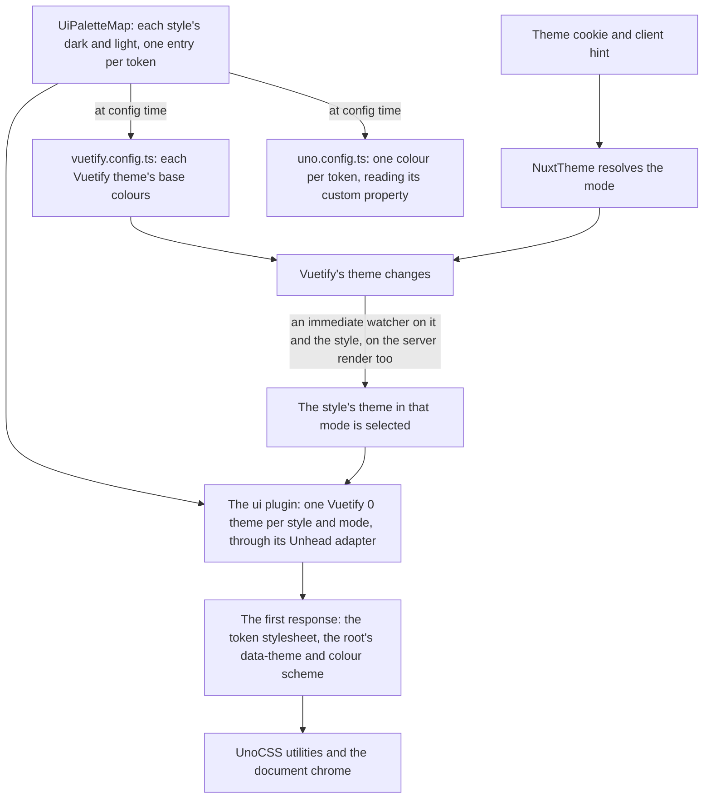
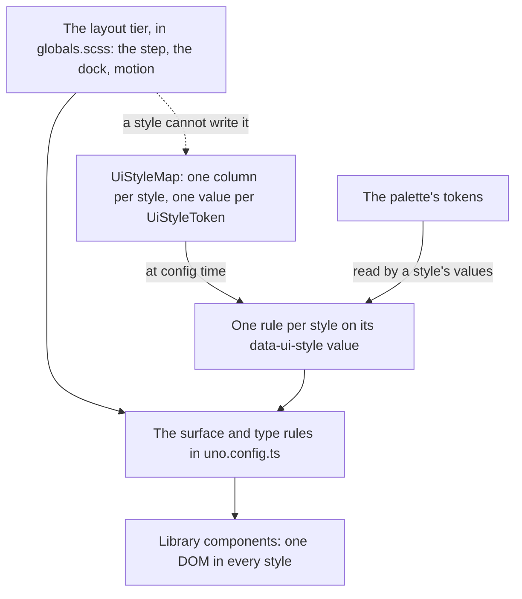
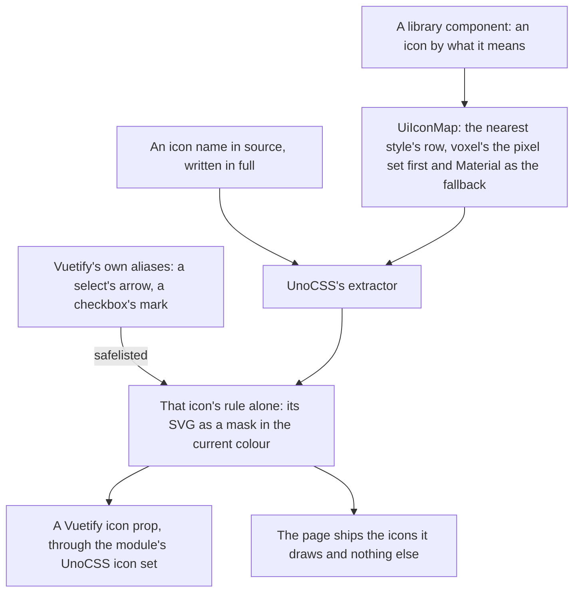
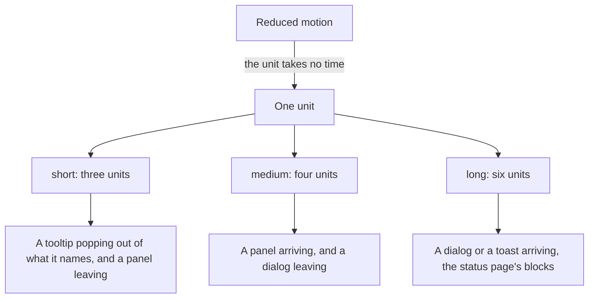
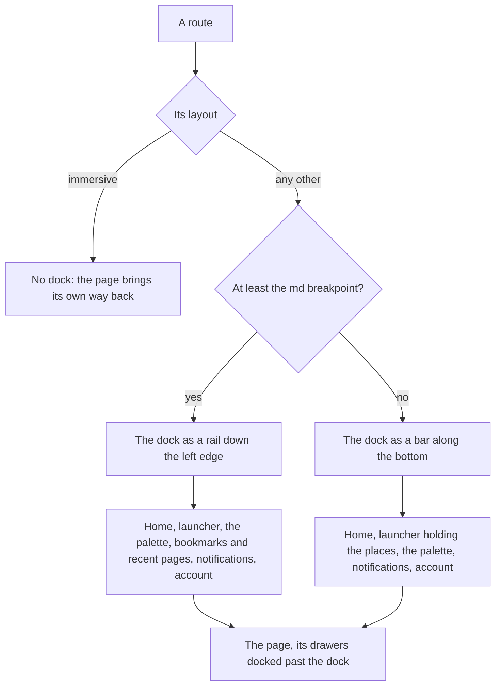
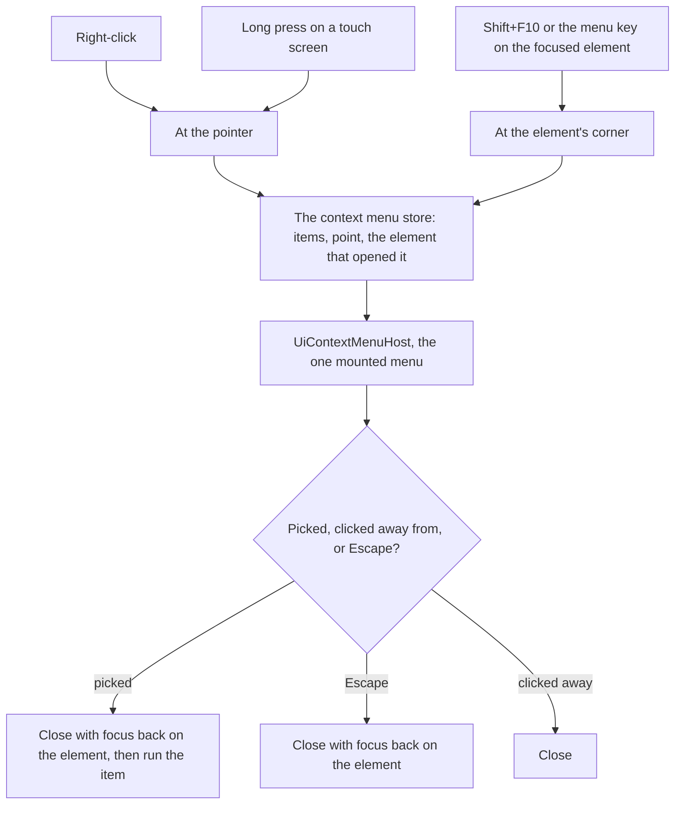
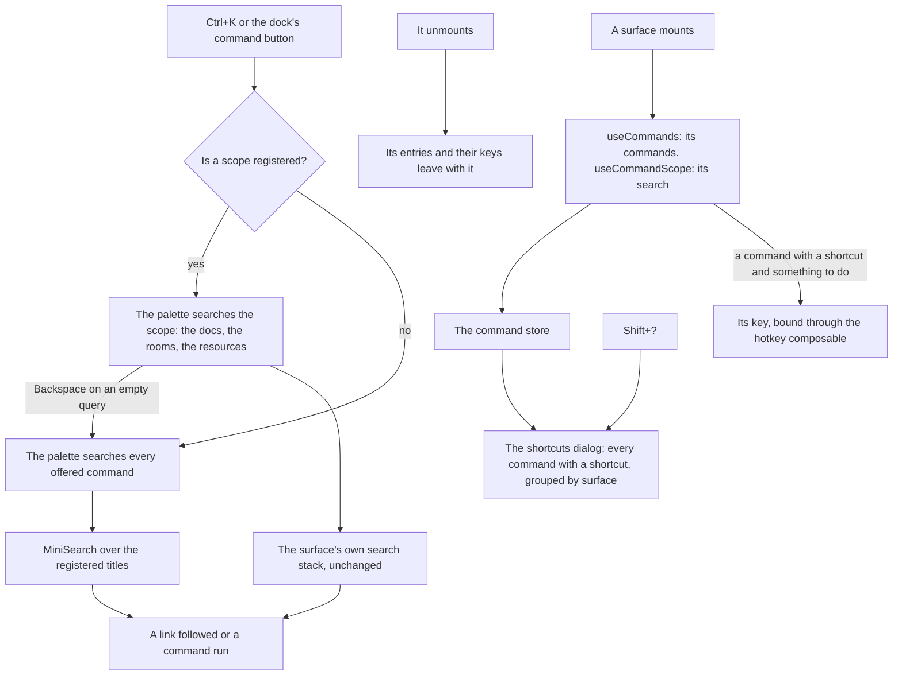
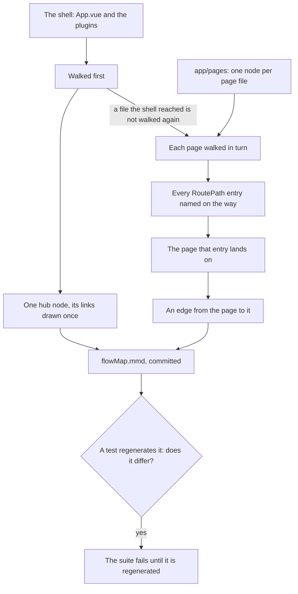

# UI Library

The app is moving from Material as Vuetify draws it to a library of its own, built in `apps/web` on [Vuetify 0](https://0.vuetifyjs.com/introduction/why-vuetify0) — Vuetify's headless layer, which owns focus, keyboard handling, ARIA and positioning and paints nothing. The migration runs as a ladder of stages, designed in the [UI library proposal](/docs/proposals/refactors/ui-library). This page is what exists so far: the foundation every later stage builds on, the icons, the type, the first components, which the agent console is built from, the flow map the later stages are designed from, the app shell every page sits in, the context menu every thing with actions of its own opens, the command palette every page answers Ctrl+K with, and the product areas moved onto it so far.

The foundation changes no component, and still repaints every page. Its design tokens are the colours of the whole app, Vuetify's pages included, and the document's own chrome — scrollbars, selection, caret, focus ring — reads them on every page whichever library draws it.

## One palette, two libraries

- **The palette is `UiPaletteMap`**, keyed by design style, then by the resolved mode, then by `UiToken`: the colours an interface is drawn in: two surfaces (background and panel), the border between them, text and its muted form, one accent, and error, info, success and warning. Voxel's dark palette is dusk, the agent console's as it was drawn; its light one is dawn, authored beside it rather than computed from it, so the app keeps its light mode. Every palette uses the same token names, so nothing that reads a token knows which theme is selected.
- **Every foreground token meets WCAG AA on every surface token in both themes.** A test computes the contrast ratio of each pair and holds it at the AA threshold.
- **Vuetify 0's theme plugin writes the tokens.** It renders one rule per theme, each token a custom property such as "--ui-accent" keyed on the root's "data-theme" attribute, and the root's colour scheme from the selected theme. Its Unhead adapter puts all of it in the first HTML response, so a page never paints in the wrong theme before hydration. The default adapter writes adopted stylesheets, which exist only in the browser.
- **Vuetify is fed from the palette.** Its themes stay named by mode alone, because the client-hints module switches them by those names, so a style reaches it as colours: `vuetify.config.ts` builds each theme's base colours — background, surface, text, primary, border and the status colours — from the default style's palette, and every selection writes the selected style's into both modes. A page Vuetify still draws matches the library on the same screen, and a palette edit repaints both.
- **UnoCSS reads the tokens as variables.** Each token is a theme colour whose value is its custom property, so a utility follows the selected theme at runtime. Vuetify's other colour names (primary, surface, border, and their opacity and variation keys) still generate while templates not yet migrated write them; where a name is both, the token wins, and since Vuetify is fed the same value the two only differ in owner.
- **The palette lives in `apps/web/configuration/`**, beside the breakpoint scale, because the Vuetify and UnoCSS configs read it and they load before any `@/` alias resolves. It imports its enums relatively, as the other configuration files do.

The agent console stays in voxel's dusk whichever style and theme the app is in. Its root is a theme scope pinned to both, so its panels read the same tokens as every other page with dusk's values ([themes and scopes](#themes-and-scopes)). Its voxel world keeps a palette of its own, `AgentConsolePaletteMap`: the materials — wood, skin, stone and the rest — beside the dusk tokens its interface-coloured props are painted in, since a vertex colour is a value rather than a custom property.

## Design styles

The look is a design style: a named set of everything that decides how the interface is drawn, beside the light and dark the palette already switches. There are two: voxel, the agent console's look, and standard, the neutral look most shipped products settled on. What is left of the move — the enforcers, the style-leak sweep and making standard the default — is the [design styles proposal](/docs/proposals/refactors/ui-library/design-styles).

- **Two tiers.** The layout tier — `--ui-step`, the dock's breadth, the motion timings and where a dialog or a panel arrives from — is the same in every style, so a unit that fits its region in one fits it in all of them. The style tier is every `UiStyleToken`: the corner radius, the border width, the shadows each surface is drawn with, the hover treatment, the focus ring's width, the faces, sizes and heading weight, the heading colour and the dialog scrim. None of its values takes room in the layout: an edge is a shadow, drawn outside the box or inset into it, never a border that would push the content.
- **A style is a column of `UiStyleMap`**, which is `satisfies Record<UiStyle, Record<UiStyleToken, string>>`, so a token without a value in every style fails the typecheck. A value may read the palette's tokens and the step, and nothing a style can hold is a padding, a gap or a height.
- **The tokens are static CSS.** `uno.config.ts` writes each style's column as one rule on its `data-ui-style` value, in the `uno-theme` layer, and the surface, type, button, bar, tab and block rules read the custom properties rather than any style's values. The resolved-config test snapshots both, so a rule that goes back to writing a value shows in the diff.
- **The style is a cookie**, read on the server and held in the style store as the readable-text setting is, so the first response already renders the reader's style and a signed-out reader has one. A value no style answers to reads as the default. The account menu and the palette switch it through one "Style" command, which steps to the next style.
- **One resolution selects both.** `useSelectUiTheme` takes the style and the mode, selects Vuetify 0's theme for the pair and writes the style's palette into Vuetify's themes. `NuxtTheme` calls it from one immediate watcher on the style and Vuetify's mode, so every path that changes either lands there.
- **A region can pin a style.** `UiThemeScope` takes a mode and, optionally, a style; without one it draws in the nearest style. The style is positional, so it is the library's one provide and inject: `useUiStyle` answers the nearest scope's style, or the reader's, which `NuxtTheme` provides around the app and the status page; a component mounted on its own draws in the default.
- **Icons follow the style.** `UiIconMap` holds a row per style, every meaning in each, and `UiIcon` resolves its meaning through `useUiStyle`.
- **The root and every theme scope carry the style.** A custom property that reads another is resolved where it is declared, so a frame's shadow declared only on the root would carry the root theme's edge colour into a scope in another theme. `NuxtTheme` puts the reader's style on the root, where the status page gets it too, and `UiThemeScope` its own on itself, so each scope declares the style's tokens again against its own palette.

### What each style draws

The three surfaces keep their roles in both: a frame holds content, a raised surface is pressed, a sunk one takes input. The layout — every length in steps, every control height — is the same in both, so the table is only drawing.

| Part            | Voxel                                                           | Standard                                                                                  |
| :-------------- | :-------------------------------------------------------------- | :---------------------------------------------------------------------------------------- |
| Palette         | Dusk and dawn                                                   | Radix's slate for the neutrals and green as the one accent, dark and light                |
| Corners         | None; the frame's ring leaves each corner notched               | One small radius on every surface, a row of a list included                               |
| Frame           | A ring outside each side, a lit line along the top              | A hairline inset in the border colour; a popover or a dialog casts one soft shadow        |
| Raised          | Lit top and left, shaded bottom and right                       | A flat fill a shade off the panel, inside a hairline; pressed darkens it, nothing moves   |
| Sunk            | Background colour shaded along the bottom                       | The background inside a hairline                                                          |
| Hover           | Brightness up a notch; a row or a quiet button tinted in accent | An overlay of the text colour; a row or a quiet button tinted in the text colour          |
| Focus ring      | A solid outline a step wide                                     | The same outline at half the width, following the corner                                  |
| Type            | VT323 for everything, headings in the accent                    | Inter for the interface, JetBrains Mono for code, headings in the text colour and heavier |
| Icons           | Pixelarticons, Material where it has no glyph                   | Lucide, which Nuxt UI and shadcn both ship by default                                     |
| Scrim           | A dither of the background colour                               | The background, translucent                                                               |
| Progress, meter | Separate blocks, filled one at a time                           | One rounded track in the same step-thick box, its fill eased to the exact reading         |
| Spinner         | The terminal's star, a frame at a time                          | A ring turning in the accent over the same element                                        |
| Skeleton        | A lighter band stepping across the block                        | A lighter band easing across it                                                           |

- **The standard column is taken, not invented**: the token vocabulary from Nuxt UI (a background, an elevated fill, a border, one radius), the role of each step of Radix's neutral scale (app background, component, border, then low- and high-contrast text), and the quiet chrome around the content from Linear's refresh. Each value passes the palette's contrast test, and the green accent was picked from a mockup of both styles side by side.
- **A drawing that differs by more than a value is keyed in the library, never in a feature.** The spinner and the skeleton carry the nearest style on their own element through `useUiStyle` and key their scoped style on it, and the loading bar's and the meter's row do the same through the `ui-blocks` shortcut, so a region pinned to voxel inside a standard page still draws voxel's blocks. The row carries its reading as `--ui-blocks-value` and its colour as `--ui-blocks-fill`, which the meter's levels set, so voxel's filled blocks and standard's track read the one value. The DOM and the roles are the same in both.
- **The icon's box is the layout's.** Every icon is `size-6` in both styles: a pixel icon needs it to land on whole pixels, and a Lucide icon in the same box keeps a row of controls lined up.

### What keeps a switch safe

A style is only worth having if switching it can never move or break anything, so each guarantee is held by something that fails:

- **A style cannot write the layout tier.** `UiStyleMap`'s type holds only style tokens, so a style that sets a padding does not typecheck.
- **Every style is complete.** The style map, the palette and the icon map are each `satisfies Record<UiStyle, …>`, so a new token, colour or meaning without a value in every style fails the typecheck, and the palette test runs over every style and mode.
- **One DOM in every style.** Every library component test runs once per style through `setupUiStyle`, so a contract that holds in one style and breaks in the other fails.
- **Features never branch on a style.** oxlint refuses `useUiStyle` outside the library's folders, in an override beside the one that holds the Vuetify 0 boundary, and a source scan in `app/templates.test.ts` refuses the style attribute and its selector anywhere else but `NuxtTheme` and the document chrome, since oxlint reads neither a template's attributes nor a style block. The same scan refuses, outside the library, an edge or a line drawn in steps rather than the style's border width, and anywhere but the icon map, voxel's face or icon set named by hand, so nothing a feature writes draws voxel in the standard style. What a feature needs to differ, the library draws.
- **Checked by eye in each style.** A unit handed over for the eye check is looked at in both styles and both modes, switched from the command palette's Style command.

## Icons

- **UnoCSS's icons preset is the engine.** A class naming an Iconify icon becomes a rule that draws its SVG as a mask filled with the current colour, so an icon takes the text colour as a glyph did. The Material Design Icons set is read at build time from its Iconify JSON package and never shipped. The rules sit in their own cascade layer ahead of Vuetify's and the utilities, since each also sets its colour to inherit: a component that colours its own icon, as a field does in its error state, and a colour or size utility written on an icon both still win.
- **A name is written in full**, as "i-mdi:" and the icon's name, because the preset generates only what its extractor finds in source. A name assembled from a prefix and a variable generates nothing and draws an empty box, so it is a review finding. The extractor reads components and markup but not plain TypeScript, which would hand every string in the app to the attributify extractor and break the stylesheet on the first one that looks like an attribute, so a `.ts` file that names an icon opts in with UnoCSS's `@unocss-include` comment on its first line. A `v-icon` takes its icon as the `icon` prop, never as text content, which the extractor does not read. A test generates the icons each source file names and fails on any it cannot find, or on a `.ts` file naming one without the comment.
- **Vuetify draws through the same CSS.** Its default set is the module's "unocss-mdi", which hands the class to Vuetify's class icon. Vuetify's internal icons are aliases no source file names, and the module maps only some of them, so `vuetify.config.ts` maps every alias Vuetify defines from Vuetify's own list and `uno.config.ts` safelists the result.
- **The app's own marks are icons like any other.** The anime and dungeon gate marks are SVG files in `app/assets/icons/`, which UnoCSS's icons preset serves as the `i-custom:` set, so they are written whole as classes and draw wherever an icon class does — a library menu as much as a Vuetify icon prop. A file there is its icon's whole definition; nothing registers it.
- **The library's icons are pixel icons, named by meaning.** `Ui/Icon.vue` takes a `UiIconMeaning` — what the icon says, such as success or remove — and `UiIconMap` resolves it to a class in the nearest style's row. Voxel's is [Pixelarticons](https://pixelarticons.com/) first, a set drawn on a pixel grid to sit on a voxel surface, and a Material Design Icons class for a meaning it has no glyph for. Swapping sets is one map edit, a fallback is a row in the map, and a feature never names a set: an action a library menu shows is a `UiItem`, whose `meaning` the menu draws in the nearest style's glyph, beside a whole class for a glyph no meaning names. Every Vuetify-era `Item` is one, so a list either library draws passes through unchanged until retirement folds the two. Vuetify's components keep their Material icons until their unit migrates.
- **Pixelarticons has no text-formatting glyphs** — no bold, italic, strike or heading — so an editor's toolbar keeps its Material icons, passed as whole classes in its `Item` list.
- **A pixel icon renders at 1.5rem**, the size of its 24-unit grid, so every unit is a whole CSS pixel; any other size blurs the grid.
- **An icon is decoration unless it is labelled.** Without a label it is hidden from assistive technology; with one it is an image with that name, for an icon that says what nothing beside it does — a tool call's success or failure mark.
- **Under Vitest the UnoCSS module is not loaded**, so the module falls back to Vuetify's plain class set: an icon still carries its class, which is what a test finds it by, and nothing draws it.

## Components

The first components came out of the agent console, which drew the look by hand before the library existed. Each takes its behaviour from a Vuetify 0 primitive and its look from the tokens, and each has a component test of its keyboard and ARIA contract, so a feature's test never walks a menu's arrow keys again.

| Component           | Built on                              | What it is                                                                                                     |
| :------------------ | :------------------------------------ | :------------------------------------------------------------------------------------------------------------- |
| `UiFrame`           | none                                  | A region of content, with an optional title in the accent colour and a slot for its actions                    |
| `UiButton`          | Button                                | The raised block, with accent, danger and quiet variants; a pressed toggle takes the accent                    |
| `UiIconButton`      | `UiButton`                            | An icon by meaning, and a required label that is its accessible name and its tooltip at once                   |
| `UiCopyButton`      | `UiIconButton`                        | Copies its source, and says it did while the clipboard composable's copied state lasts                         |
| `UiMenu`            | Popover, roving focus                 | A trigger and the actions it opens, as the menu button pattern has them                                        |
| `UiSelect`          | Select, virtual focus                 | One choice from a list, as the select-only combobox pattern has it                                             |
| `UiSuggestions`     | the popover composable, virtual focus | Completions under a text field the call site owns: the slash palette, a new session's repositories             |
| `UiSpinner`         | none                                  | Voxel's star a frame at a time, or standard's turning ring, held still under reduced motion                    |
| `UiLoadingBar`      | Progress                              | A row of blocks filled as the work gets done, one thin eased track in standard, with the progress role         |
| `UiLoadingLine`     | Progress                              | A page's progress as one thin line along an edge: an eased fill in standard, pixel blocks grown whole in voxel |
| `UiThemeScope`      | Theme                                 | A region drawn in another mode or style than the document's                                                    |
| `UiPopover`         | Popover                               | A trigger and a framed panel of anything that is not a list of actions: the launcher, notifications            |
| `UiContextMenuHost` | Popover, `useMenu`                    | The one context menu, opened at a point by right-click, long press or the keyboard                             |
| `UiTooltip`         | Tooltip                               | A small frame naming what it hangs off, popping out at once on hover or keyboard focus                         |
| `UiAvatar`          | Avatar                                | A picture in a frame, or the first letter of its name until one loads                                          |
| `UiToast`           | none                                  | A frame with a status mark, a message, an action, and a timer held while it is read                            |
| `UiToastStack`      | none                                  | The one corner every toast is drawn in, announced as a polite live region                                      |
| `UiDialog`          | Dialog                                | A modal in the top layer, framed, for content that is the library's alone: high, middle or a sheet             |
| `UiCommandList`     | virtual focus                         | A search field over the commands it finds, grouped under headings, the list always shown                       |
| `UiShortcut`        | none                                  | A shortcut as the raised key caps it is pressed with                                                           |
| `UiButtonLink`      | none                                  | Somewhere to go, in the button's look: a real link, so it opens in a new tab like any other                    |
| `UiTabs`            | Tabs                                  | A row of tabs over the panel of the selected one, which alone mounts its content                               |
| `UiTabLinks`        | `UiTooltip`                           | A row of links drawn as tabs, for sections that are somewhere to go; icons alone where width is short          |
| `UiCollapsible`     | Collapsible                           | A trigger row with a turning chevron over content hidden while it is closed: a navigation's groups             |
| `UiTextField`       | Input                                 | A labelled sunk field of one line or several, its rules checked as the reader types                            |
| `UiForm`            | Form                                  | The fields inside it counted into one validity, and a submit only once every one passes                        |
| `UiSkeleton`        | none                                  | A block of the panel, a lighter band crossing it, where content is still on its way                            |
| `UiEmptyState`      | none                                  | A mark, a sentence, a line on how that changes, and at most one action                                         |
| `UiOverflowMenu`    | `UiMenu`                              | The actions of one thing behind one quiet mark, from the `Item` list its context menu opens                    |
| `UiConfirmDialog`   | `UiDialog`                            | A question before something that cannot be undone: Cancel, and one destructive answer until it lands           |
| `UiBreadcrumbs`     | Breadcrumbs                           | A trail of links back, whose middle folds behind a button when the row is too short for it                     |
| `UiMeter`           | none                                  | How much of something is used, in the loading bar's blocks, turning warning then danger past its marks         |
| `UiCheckbox`        | Checkbox                              | A sunk box a block of the accent drops into while checked, and half a block while mixed                        |
| `UiSwitch`          | Switch                                | A setting that takes effect as it flips: a raised block sliding along a sunk track, lit while on               |
| `UiColorField`      | none                                  | A colour from the browser's own picker, a sunk swatch beside the hex value it holds                            |
| `UiDataTable`       | `UiCheckbox`                          | A page of rows a server reads, or every row searched, sorted and paged itself: headers, selection, groups      |
| `UiErrorState`      | `UiEmptyState`                        | A failed read, announced as it lands, with the button that tries again                                         |
| `UiChip`            | none                                  | A short reading set into its surface — a count, a size, a kind — with a mark and a block of a token's colour   |
| `UiToggleGroup`     | Radio                                 | One of a few ways to do one thing, as joined buttons with the chosen one filled                                |
| `UiAlert`           | Alert                                 | A line the page says about itself, in a frame with a block and a mark of its status                            |

### Keyboard contracts

- **A menu** opens from its trigger onto its first item by click, Enter, Space or the down arrow, and onto its last by the up arrow. The arrows walk it, and Home and End jump to its ends. Typing a title's first letters jumps to the next title they begin; a pause starts the search over, and one letter pressed again steps through every title it begins. Enter or Space picks. A disabled item, an act already under way, is still reached by the arrows and says it is disabled, as the menu pattern keeps it, but is never picked. A pick or Escape closes it with focus back on the trigger, and Tab closes it and moves on.
- **A select** opens onto its selected option by the arrows, Enter or Space. Focus stays on the trigger, which names the highlighted option as its active descendant. The arrows, Home, End and typeahead walk it, and Enter picks.
- **Suggestions** leave focus in the field, since typing goes on there. The arrows walk them as the field's active descendant, and Enter or Tab takes the highlighted one. Enter with nothing highlighted is still the field's own key — the composer's send. Escape puts them away without reaching any shortcut on the page, and the next keystroke in the field brings them back. They show while the field has focus and something to offer, and pressing one with the mouse keeps the field focused.
- **A context menu** keeps the menu's contract from the moment it opens onto its first item, and hands focus back to the element it opened over.
- **A popover** opens from its trigger by click, Enter or Space, and Escape closes it with focus back on the trigger. Its open state is a model as well, so a shortcut elsewhere on the page can open it.
- **A command list** keeps focus in its field, as suggestions do, and highlights its first command whenever the list changes, so Enter always takes the best match. The arrows walk it, and Enter clicks the highlighted row, so a row that is a link is followed as a pointer would follow it.
- **A dialog** is the browser's: opening it moves focus inside and traps Tab there, and Escape or a click on the scrim closes it. It opens on the control that carries `autofocus`, or otherwise on the dialog itself, so nothing reads as chosen until the reader moves, and the close button keeps its place first in the tab order. A confirm dialog's destructive answer stays disabled while it is under way, and a failed one leaves the dialog open to try again. A guarded one, for an act worth the pause, shows the name of what it destroys with a copy button, opens onto a field asking for it, and keeps its answer disabled until the field holds the name exactly — the guard Azure asks before deleting a resource.
- **An alert** is a live region: an error interrupts as the alert role does, and any other status waits its turn as a polite one.
- **A toggle group** is a radio group named by its label, one stop in the tab order on its choice. The arrows move the choice along it as they go, and a click picks one.
- **Tabs** are one stop in the tab order, the selected tab. The arrows move to the next or previous tab and select it as they go, Home and End jump to the ends, and each panel is labelled by its tab.
- **Tab links** are a navigation landmark of ordinary links, each its own stop in the tab order. The current one says so, and the call site decides which that is, since a section's tab stays current on every page in it rather than only on the one it links to.
- **A collapsible** is a button that says whether it is expanded and names the content it controls. What acts on the whole of its content — a section's create button — sits beside that button in the same row, never inside it. Enter or Space toggles it, as a button's own keys. Its content is not a region: a navigation opens dozens, and a landmark each would crowd the list a screen reader offers.
- **A text field** is named by its label, drawn above it unless what surrounds the field already says what it is for, as a column's filter under the column's name does. A failing rule marks it invalid and points it at the message under it, which is a polite live region, and the form around it counts the result at once, so a submit button can stand disabled before it is pressed.
- **Breadcrumbs** are a navigation landmark holding a list of ordinary links, the marks between them hidden from assistive technology. A trail too long for its row keeps its first and last crumbs and folds the middle behind a button that says how many it hides and whether they are shown, and lays them back out in place.
- **A switch** is a button with the switch role, named by its label and saying whether it is on; Space, Enter or a click flips it.
- **A checkbox** is a button with the checkbox role, named by its label whether or not the label is drawn, and says whether it is checked, unchecked or mixed. Space or a click toggles it, as a button's own keys.
- **A data table** is a table named by its label. A sortable header is a button inside the header cell, which says which way it sorts through `aria-sort`: ascending, then descending, then the server's own order. Each row takes focus as one stop, where the menu key reaches its context menu, and a row with somewhere to go opens on Enter as it does on a click; a table whose rows go nowhere, as the recycle bin's, draws none of them as something to press. A row's checkbox is named after the row, and the header's selects the page, saying it is mixed while only some of it is. A group's header is a button that says whether it is open.
- **Typeahead** is the library's own: one composable the menu and the select share, since Vuetify 0's select has none. The menu's whole contract is `useMenu`, which `UiMenu` and the context menu share.

### Surfaces

The three surfaces of the [design language](/docs/proposals/refactors/ui-library/design-language) are UnoCSS rules in `uno.config.ts`, not a component each. A Vuetify 0 part renders its own element and only takes classes, so a select's trigger is raised and its list is framed with no wrapper component around either.

Each surface's drawing is the style's: a rule sets the colour its role takes and reads the style's radius and shadow for everything else. Voxel's drawing is the one described here.

- **`ui-frame`** — a region: the panel colour inside a one-step ring, which leaves each corner cut out.
- **`ui-raised`** — something pressed: the edge colour with its upper sides lit and its lower sides in shadow. `UiButton` and the select's trigger wear it.
- **`ui-sunk`** — the background colour, shaded along its bottom, in the page's face. A text field in the library's look wears it until the library has a field of its own.
- **`ui-popover`** — the top-layer element a menu, a select or suggestions open in, emptied of the browser's own popover look and padded two steps, so the frame inside it never overlaps what it hangs off. Through `anchor-size()` it is at least as wide as that.
- **`ui-item`** — one row of a popover's list, tinted in the accent while it is highlighted, selected or focused.
- **`ui-block`** — one voxel block, a step thick, of a bar that fills a block at a time, in the edge colour and lit in the row's fill colour once filled: the loading bar's and the meter's, whose marks set that colour from its scoped style. Standard hides the blocks through the block opacity token and `ui-blocks` draws the row as its track instead.
- **`ui-bar`** — a bar over what it heads, on a line of the style's border width in the edge colour along its bottom: a dialog's title bar, an editor's menu bar, a row of tabs.
- **`ui-tab-list`** and **`ui-tab`** — a row of tabs on that line, and a tab drawing its own stretch of the line in the accent while it is selected or the current page's link. Shortcuts, so `UiTabs` and `UiTabLinks` wear one look.
- **`ui-button`** — something pressed, one control height of eight steps that a field and a select's trigger share so a row of them lines up, its content centred and an icon button square: `ui-raised` with the style's hover filter and a disabled state, which the select's trigger wears as well, filled by its variant or while pressed, keyed on `data-variant`, `aria-pressed` and, for a toggle group's choice, `aria-checked`; a quiet one is clear on whatever it sits on and tinted in the accent while hovered, and a quiet toggle, such as an editor's bold, fills while pressed. Quiet first drew a flat box in the panel colour, so a toolbar read as a row of boxes; it was made clear, and a button over a picture takes the raised default instead. A shortcut rather than a component's scoped style, so `UiButton` and `UiButtonLink` wear one look.

### Popovers

- **CSS anchor positioning places them**, as Vuetify 0's popover composable writes it. The content opens below what it hangs off, aligned to its start, and the browser flips it to the other side or the other end where there is no room. Every engine the app supports has anchor positioning, so Vuetify 0's Floating UI adapter is not installed.
- **The top layer holds them**, through the Popover API, so no panel paints over a menu and no overflow clips one. A menu's trigger opens it natively through its popover target, so a click on the trigger of an open menu closes it rather than light-dismissing it and opening it again. Suggestions are a manual popover, since a click back into their own field lands outside them.

### Motion

Every timing is eased, never stepped: one decelerating curve, so a change starts moving at once and settles into place. Motion says where something came from rather than decorating what is done often.

- **A duration is a whole number of units**, as a length is of steps. `--ui-motion-short`, `--ui-motion-medium` and `--ui-motion-long` in `globals.scss` are each a duration and `--ui-motion-easing`, Material's emphasised curve, so a transition names one token. Anything leaving takes a size shorter than it took arriving, as Material's motion has it.
- **Never stepped.** The library first stepped every transition a sixty-millisecond frame at a time to read as pixel art. A tooltip or a dialog then arrived in two to four visible jumps, which read as dropped frames and made each one feel slow, so the pixel look lives in the shapes and never in the timing. Voxel's skeleton band is the one stepped loop, since an eased shimmer is what it avoids; standard eases it, as its own look does.
- **Reduced motion is one line.** Under the preference the unit takes no time, so every timing that reads it is instant and nothing is restated per component. The status page keeps a rule of its own, since its blocks' stagger would still hold them back.
- **A dialog drops into place**, eight steps from above, its dithered scrim fading in with it, and rises back out. The library's dialog is the browser's, so it moves between its open and closed states from `@starting-style`, and stays in the top layer until it has gone through `allow-discrete` on `display` and `overlay`. The shell is Vuetify's, so it names a transition of the same tokens, and its scrim's fade is timed through Vuetify's own fade classes. `--ui-dialog-from` is where it comes from: a sheet rises from the bottom on a narrow screen and steps in from the right on a wide one.
- **A panel steps out of what opened it**: `UiPopover` from its trigger, and from the dock's edge on the dock, which sets `--ui-popover-from` by breakpoint as it sets where a tooltip opens. **A tooltip** pops out of what it names in the short timing. **A toast** steps in from the edge of its corner.
- **Nothing moves on a menu, a select, suggestions or the context menu.** They are opened constantly, and suggestions redraw on every keystroke, so motion would only slow each pick down.
- **A dialog stands where its purpose puts it.** `UiDialogPlacement` names it: high, so a list changing length under a field never moves the field, as the palette's does; in the middle, for one decision about one thing, as a confirmation is; or down one side as a sheet, as the agent console's is. The dialog shell derives its own: high while its pinned header holds tabs over panels of other heights, as the room and user settings do, and in the middle for every form and question.

### What building them taught

- **The call site's attributes win over the primitive's.** Vuetify 0's button lays its own attributes over the ones passed to it, which would drop a form's submit type and a toggle's pressed state. `UiButton` renders the element itself, from the primitive's attributes with the call site's on top. It exposes that element, because a renderless primitive leaves a fragment rather than an element as the component's root. `UiTextField` renders its control the same way, so suggestions can complete it.
- **A select's model sees only choices.** Vuetify 0's select clears the old choice before it selects the new one, which a model would see as the select going empty for a moment. `UiSelect` passes on only a value, so a call site that sends every change to a server never sends the empty one.
- **A modal is Vuetify's until its content is not.** Vuetify 0's dialog opens in the browser's top layer, and everything outside the top layer is inert while it is open. Vuetify renders a menu, a select or a tooltip outside the element that opened it, so inside a top-layer dialog each would open underneath it and take no clicks. The dialog shell and the page drawers therefore keep Vuetify's overlay as their behaviour and wear the library's look, and move onto Vuetify 0 once nothing inside them is Vuetify's. The command palette and the shortcuts dialog are the first whose content already is, so they are `UiDialog`s. A popover is not modal, so the dock's panels are the library's already, drawn with the library's parts alone.
- **A tooltip opens beside a panel, never over it.** Vuetify 0's tooltip content is an auto popover, and opening one closes every other auto popover it is not inside, so hovering one dock button shut the panel another had open. `UiTooltip` keeps the primitive's timing and renders its own content as a manual popover. Its activator is renderless and hands the caller only its handlers and its anchor, since its other attributes would overwrite a button's type and disabled state; a trigger that anchors a panel too names both anchors. Where it opens is `--ui-tooltip-position-area`, which the dock sets beside the rail and above the bar.
- **A menu takes focus a tick after it opens.** Opening sets the popover's state, and the browser shows the popover and draws a new list of items only in the render that follows; an element in a closed popover takes no focus, so `useMenu` focuses the first item once that render is done.
- **A spinner is decoration.** It sits beside a line that says what is under way, so it has no progress role and is hidden from assistive technology. The loading bar is the one with a value to report.
- **A utility cannot recolour a surface.** The surfaces are rules generated after the colour utilities in the same layer, so a `bg-*` written on a `ui-raised` element loses to it. A state that recolours a surface is a data attribute the component's scoped style reads, as an earned achievement's badge is, or a variant inside a shortcut, as `ui-button`'s are.
- **Tabs are mandatory, not forced.** Forcing selects the first tab as the tabs register, over the choice the model already holds, so a page opened on its second tab would jump back to the first.
- **A field validates through Vuetify 0, with Vuetify's rules.** Validation rules stay Vuetify's until retirement. A rule from `useVRules` may be a bare result as well as a function, so `UiTextField` wraps each one in the asynchronous function the primitive takes, and a migrated field keeps its rules unchanged.
- **A confirmation is an alert dialog on `UiDialog`, not on Vuetify 0's alert dialog.** Vuetify 0's `AlertDialog` has the right role and focuses Cancel, but its action closes the dialog when it settles, success or not, and Cancel takes focus only when the primitive renders its own element. `UiConfirmDialog` therefore passes the alert dialog role through `UiDialog` and gives Cancel `autofocus`, which the browser's dialog focusing steps honour, and holds its own pending state so a failed delete stays open. happy-dom runs no focusing steps, so its test asserts which button carries `autofocus` rather than where focus went.
- **A quiet toggle needs its own pressed rule.** The quiet variant and the pressed fill are the same specificity and the variant comes later, so `ui-button` states a quiet pressed fill separately; an editor's bold would otherwise never show it is on.
- **A context menu's props take the browser's menu away whatever the list holds.** A target binds them only where it has items, as a post's card does for its author alone.
- **A default a utility must override is inherited, never set on the element.** `globals.scss` is unlayered, so a custom property it sets on a class beats every UnoCSS utility, which sits in a layer. `--ui-dialog-from` and `--ui-popover-from` are set on the root instead, and a sheet or the dock sets its own on itself, which wins over an inherited value.
- **The shell's scrim never faded.** The dither's opacity is set outside every layer, so it beat Vuetify's own fade from nothing and the scrim appeared at once. Its fade is now timed and started through Vuetify's fade classes, which are more specific.
- **A toast only moves on arriving.** Each source takes its own toast away, so a leaving toast would need every source behind one transition group; its arrival is `@starting-style`, which every toast gets whoever mounts it.
- **Breadcrumbs measure with a gap of their own.** Vuetify 0's breadcrumbs decide what fits from each crumb's width plus a `gap` prop, eight pixels by default, so the list's CSS gap is two steps to match it; a wider one would let the row overflow before anything folds. The primitive places no divider and no ellipsis itself: a divider goes before every crumb after the first, and the ellipsis after the first divider, which is where the fold keeps it.
- **A server's table is not `createDataTable`.** Vuetify 0's data table keeps its own sort, grouping and page: its sort changes only through a toggle, and what it groups by is fixed when it is made. The resource list keeps its page, size and order in the address, so a link lands on the same page, and a second copy inside the primitive would have to be walked into agreement on every back and forward. `UiDataTable` therefore takes those as models and draws the table itself, on the library's checkbox, select and buttons, with the ARIA the table pattern asks for. A table given every row, as a sheet's, is the same component with no count from a server: it searches, sorts and pages them through the same models, sorts by several columns where the call site asks, and orders a column by the call site's own comparison where its text would order it wrongly.
- **A skeleton never blinks as a whole.** It first stepped the whole block between two shades, which read well on a card and as a strobe on a blade's full height or a table's rows blinking in step. The block now holds still in the panel colour and a lighter band steps across it, ten steps a sweep, timed in the motion unit so reduced motion holds it with the rest.
- **A spinner has text.** `UiSpinner` draws its frames as characters, so a pending button's text is its label and a frame; a test finds that button by its variant or role, never by its text.

### Themes and scopes

`UiThemeScope` renders Vuetify 0's theme element for its style and mode, whose theme attribute gives every token beneath it that palette's values, carries the style attribute so the style's tokens resolve against it, and sets the colour scheme to match, so the browser's own controls follow. The document chrome declares its inherited colours — the scrollbar, the caret and the native controls' accent — on every theme scope as well as on the root, because an inherited value is resolved where it is declared.

## App shell

The frame every page sits in. The top app bar is gone: what is app-wide lives in a dock, and what belongs to a page is the page's own.

- **The dock holds the reader's places, not the app's catalogue.** Below the launcher come the pages the reader bookmarked, then the pages they come back to most. A product's own page, a page of the account menu's and the settings show their own icon and name — a product's page can redirect before its title is ever recorded, as the messages page opens the last room — and a docs page its section's icon. Any other page, a room or a resource, shows its title's first letter in a frame, so two side by side stay told apart, which is why every page sets a title of its own: a test fails on a page file that neither does nor is named by a list or its layout. On a narrow screen the bar has no room for them, so they lead the launcher's panel instead. Which edge the dock takes is CSS alone: Vuetify's mobile threshold is the `md` breakpoint, the one UnoCSS's variant reads, so no script decides it.
- **Bookmarks are server-side and recent pages are not.** A bookmark follows the reader between devices, so it is a row of `bookmarks`, toggled from the launcher's panel by a button that says in words whether it bookmarks the page open now or removes it, and capped at a handful, since the dock shows every one. A recent page is a convenience of the device, kept in local storage and ranked by frecency: each visit weighted by how long ago the last one was, in Firefox's age buckets. Home, sign-in and an address no page matches are never recent, and a signed-out reader has recent pages only. A page's title is the last part of its document title, read each time its head renders, so a room's name that arrives after its messages is picked up.
- **The launcher opens every product as a panel**, grouped by what it is for: talk, make, build and play. It is the one list of products: the home and sign-in pages no longer keep a drawer of them, and give that width to their content.
- **The account menu holds the rarely used**: settings, the theme, the pages outside the products and signing out. Signed out, its trigger is a sign-in mark and signing in leads the same menu.
- **Notifications** are a popover on the dock with the unread count on its trigger. The panel pages through its list and marks everything read as it closes.
- **The dock steps aside for the keyboard.** On a narrow screen, while the page's footer (a message composer) has focus, the bar is hidden and gives its room back, and it returns when focus leaves.
- **Every fixed region starts where the dock ends.** The dock's breadth is `--dock-size`, and the app root sets `--dock-inset-inline-start` and `--dock-inset-block-end` by breakpoint. The layout's drawers, main region and footer, and any page sized to the viewport, subtract those rather than a bar's height.
- **One toast stack in one corner.** Alerts, what was copied, the notification at the head of its queue and each unlocked achievement are each a `UiToast` in `UiToastStack`. Each source keeps its own store and its own timing; the stack only draws them. A toast that closes itself holds while it is hovered or holds focus, and an error is announced at once.
- **One status page.** A route nothing matches and a failure that escapes both land on `error.vue`, which Nuxt draws in place of `App.vue`, so it is the library's alone and carries no dock. Its code is built in voxel blocks that drop into place a column at a time, held still under reduced motion; a missing page has one block knocked out of its middle digit and lying on the floor beneath it. It offers the way back that fits: home for a missing page, a retry and home for a failure. There is no catch-all page of its own, since Nuxt already answers an unmatched route with a 404 there.
- **The page loading bar** is the library's loading line along the top edge, the full width and a step thick, driven by Nuxt's own loading indicator. It hangs over the page, so its drawing is free of the in-flow bar's box.
- **The dialog shell** keeps its props and its slots, and draws the library's frame with a title bar, the library's buttons and a dithered scrim over Vuetify's dialog. The Vuetify prop bags it still takes are read into the library's words in one place: a warning or error colour becomes the danger variant, a pending state the spinner. It drops in and stands where its content puts it, as the library's dialog does ([motion](#motion)).

Every flow the app bar carried has a place in the new frame:

| Before                                                              | Now                                                      |
| :------------------------------------------------------------------ | :------------------------------------------------------- |
| Logo, back to the home page                                         | The logo at the start of the dock                        |
| Site name                                                           | The logo's accessible name; each page's own title        |
| Products grid, with the games group                                 | The launcher, games included as a group                  |
| The home and sign-in pages' drawer of products                      | The launcher, one click from every page                  |
| Theme toggle                                                        | The account menu                                         |
| Notification bell with its unread badge                             | The dock, with the count on its trigger                  |
| Account menu: settings, pages, sign-out                             | The account menu, unchanged in content                   |
| Signed-out menu: sign-in, pages                                     | The same menu behind a sign-in mark                      |
| The loading bar under the app bar                                   | The loading line along the top edge                      |
| Left and right drawers, opened by default on a wide screen          | Unchanged in behaviour, docked past the rail             |
| Scroll-to-top button                                                | A raised icon button in the page's corner, above the bar |
| Alerts, the clipboard snackbar, notification and achievement toasts | One toast stack in one corner                            |
| The call picture-in-picture window and the user settings dialog     | Unchanged                                                |

The account menu also holds the [readable-text setting](#type). The dock's command button, after the launcher, opens the [command palette](#command-palette).

## Context menus

A thing on screen with actions of its own opens them at a right-click, a long press or the keyboard, through one menu. Vuetify 0 has no context menu, so this one is ours: the library's menu, opened at a point rather than under a trigger.

- **A target declares its items, and nothing else.** `useContextMenu` hands out the props an element binds, keyed by what it is, with the same `Item` list its overflow button shows, so the two never disagree. The store holds what is open, where and over what, as the [singleton dialogs](/docs/architecture/singleton-dialogs) standard does for dialogs, and `UiContextMenuHost` in `App.vue` is the one menu: a list of thousands of rows mounts one.
- **Three ways in.** A right-click opens at the pointer. A long press on a touch screen opens at the finger, is cancelled by a finger that moves on to scroll, and swallows the click its lifting raises. Shift+F10 or the menu key opens at the focused element's corner.
- **The browser's menu stays where ours adds nothing.** Only an element that declares items prevents it. Holding Shift, or right-clicking in a field, still gives the browser's menu, with its copy, paste and spell-check.
- **It is the library's menu.** The same keyboard contract as `UiMenu`, through `useMenu`, and the same items: an icon, a title, a group that opens after a separator, and a destructive item in the error colour. A pick closes the menu and hands focus back before the item runs, so an item that opens a dialog keeps the focus the dialog takes.
- **A manual popover, closed by its own rules.** An auto popover's light dismiss lands after a second right-click has already moved the menu, and would shut the menu that click opened. The host closes on Escape, Tab, a pick or a click away, and a second right-click while it is open moves it to the new point, onto its new first item.
- **A target whose items cost too much to build per row hands on the point instead.** A message's items are built by the options bar that mounts over the one active message, so a right-click on a message records the point in the message store, and the bar mounts over it and opens the menu with the overflow menu's sections. The quick reactions stay on the bar itself, one move away.

| Surface             | Its items                                                                        |
| :------------------ | :------------------------------------------------------------------------------- |
| A message           | The overflow menu's sections: its updates, its actions, deleting                 |
| A resource row      | The row's overflow menu: open in a new tab, copy link, blueprint, rename, delete |
| A place on the dock | Open in a new tab, and bookmarking it or removing the bookmark when signed in    |
| A post or a comment | Its author's overflow menu: edit, delete                                         |
| A resource's title  | The page's overflow menu: every command but the one shown beside it              |
| A resource on Home  | Open in new tab, copy link, and adding it to or removing it from the favorites   |
| A deleted resource  | The row's overflow menu: restore, delete forever                                 |

The rest — a room, a member, a sheet column — join as their units migrate in [page migration](/docs/proposals/refactors/ui-library/page-migration), each with the items its overflow button already has.

## Command palette

Ctrl+K opens one palette on every page. It offers what the page in front of the reader can reach or do, by name, and the shortcuts dialog lists every key that works there. Both read one registry of commands.

- **A command is data.** A `UiCommand` has a title, a group — the surface that registered it — an icon or a picture, and somewhere to go, something to run, or neither. One with somewhere to go is a real link in the palette, so it opens in a new tab like any other. One with neither is a key its surface handles itself, such as the composer's Enter: the shortcuts dialog lists it, and nothing binds or offers it.
- **A surface registers for as long as it is mounted.** `useCommands` adds a surface's commands to the store and binds each shortcut through Vuetify's hotkey composable until the surface unmounts, so the shortcuts dialog never lists a key that does nothing and the palette only offers what the page can do. A sequence, such as the resource explorer's G then A, is a shortcut like any other. A shortcut never fires while a field has focus, where its keys are typing.
- **The app's own commands are the dock's.** Home, every product, the reader's bookmarked and recent pages and the account menu's entries are registered app-wide, and the account menu reads the same list, so the two never disagree. A condition such as being signed in is part of the list, so it is re-read whenever the palette shows it.
- **A surface's search is a scope, not a second palette.** The docs, the room list and the resource explorer's home page keep their search stacks as the [search standard](/docs/architecture/search) describes, and hand the palette their query and what it finds. The palette opens in the scope of the surface in front, and Backspace on an empty query steps out to the whole app. Ctrl+K keeps its meaning on their pages, and everything else is one keystroke further.
- **App-wide search is on the client.** The titles are in memory, so the palette searches them with MiniSearch, the standard's client branch, and keeps each group together under its heading.
- **The palette binds its own key**, in a field too, since no typing holds Ctrl, and does not offer itself; its registry entry only lists the key.
- **Both are the library's dialogs.** The palette and the shortcuts dialog hold nothing of Vuetify's, so they open in the top layer through `UiDialog`, high on the screen so a list changing length never moves the field.

| Surface                      | What it registers                                                                                                                  |
| :--------------------------- | :--------------------------------------------------------------------------------------------------------------------------------- |
| The app                      | Home, the products, the reader's places, the account menu's entries, and the palette's and dialog's keys                           |
| The message composer         | Its own keys: sending, a new line, slash commands, mentions, editing the last message                                              |
| The docs                     | A scope over the docs' sections                                                                                                    |
| The room list                | A scope over the reader's rooms, read a page at a time                                                                             |
| The resource explorer's home | Searching resources, going to every resource and opening notifications as G chords, and a scope over resources, services and pages |

## One owner per concern

Two component libraries on one page stay coherent only if each concern has exactly one owner at a time, which is Vuetify 0's own [compatibility rule](https://0.vuetifyjs.com/guide/integration/compatibility).

| Concern                 | Owner while both libraries are in the app                                           |
| :---------------------- | :---------------------------------------------------------------------------------- |
| Which theme is selected | `NuxtTheme`, through Vuetify's theme; the library's theme follows it                |
| The colour values       | the palette map, read by both themes                                                |
| Breakpoints             | Vuetify's display composable, fed by the [one scale](/docs/architecture/responsive) |
| Validation rules        | Vuetify's rules                                                                     |
| Hotkeys                 | Vuetify's hotkey composable                                                         |

`NuxtTheme` resolves the mode once and changes Vuetify's theme, and an immediate watcher on Vuetify's theme name and the reader's style selects the pair through `useSelectUiTheme`. Every path that changes the mode — the resolution on each request, the system preference settling after hydration, and the theme toggle — goes through Vuetify's theme, and every change of style through the store, so the watcher is the one place the library's selection is written. It is immediate because the server render has to select the right theme too: the adapter's own server-side watcher then patches the head entry before it is serialised. The other concerns move to Vuetify 0 at [retirement](/docs/proposals/refactors/ui-library/retirement), each in one commit.

## The document chrome

These are properties of the document rather than of any component, so they are set once and reach every page:

- **Scrollbars** thin, with the thumb in the border colour on the background colour, through the standard scrollbar properties on the root, which every scroll container inherits.
- **Selection** in the accent colour, with the background colour for its text.
- **The caret** and **native controls** — a checkbox, a range, a progress bar — in the accent colour.
- **The focus ring** on every focus-visible element: a solid accent outline just outside the element, as wide as the style's focus width.
- **The colour scheme** on the root, from the selected theme, so the browser's own form controls pick the right half.

They sit in a cascade layer of their own, declared before every other layer, so a component that draws its own focus or selection — as Vuetify's fields do — wins over the chrome without an override. Beside the colours, the tokens are `--ui-step`, a quarter rem — the voxel the library's lengths are whole numbers of — the [motion](#motion) timings, each a whole number of units on one curve, and the [design style's](#design-styles) own, the [type](#type) among them.

## Type

Four sizes, each a style token: the body, a section heading, a page title and a landing page's display. Voxel draws all four in one pixel face, VT323, each a whole number of steps; standard in Inter, its headings heavier, with JetBrains Mono for code.

- **Tokens and rules.** The faces are `--ui-font-body`, `--ui-font-heading` and `--ui-font-mono`, the sizes `--ui-text-body`, `--ui-text-heading`, `--ui-text-title` and `--ui-text-display`, and the heading's weight and colour `--ui-weight-heading` and `--ui-heading-color`, all the [design style's](#design-styles). Four rules in `uno.config.ts` wear them: `ui-body`, `ui-heading`, `ui-title` and `ui-display`. A title that is none of the four, as a frame's or a dialog's, takes the heading colour through `text-heading-color`.
- **A migrated page's root wears `ui-body`**, so everything under it that sets no type of its own reads it, and each heading wears one of the other three. Voxel's heading is in the accent as well as larger, so hierarchy survives a reader who scales the text.
- **One weight in voxel.** The face has one, and its heading weight says so, so a heading element's own bold is never synthesised over it.
- **The body, headings and code each have a face token**, so the readable-text setting swaps the body's alone for the system's sans-serif face and no component knows about it. Code reads the mono face, which in voxel is the pixel face whatever the body reads in.
- **Readable text is a cookie, as the theme is**, not a row of the reader's settings: the first response renders the choice with no flash of the other face, and a reader who is signed out, as most docs readers are, has it too. The root carries an attribute while it is on, and one rule in `globals.scss` swaps the voxel style's body face under it, on the root and on every voxel scope. It is off by default, and toggled from the account menu and the palette, which read one list and offer it only while voxel is selected; its cookie stays, so switching back restores it.
- **Loaded on every page.** Every style's faces are global families of the fonts module (`configuration/fonts.ts`), since the module's scan finds the faces a stylesheet names and not one named through a custom property.
- **A link is in the info colour**, underlined on hover, as the `styling` skill has it everywhere.

## Page migration

Every product area moves onto the library one unit per commit, tracked by the "ui-library" ledger in `.agents/ledgers/` and run as the [page migration proposal](/docs/proposals/refactors/ui-library/page-migration) describes: each commit carries its unit's flow inventory, and each unit is checked by eye against it. The first units are the small pages and the settings — about, the privacy policy, sign-in, user settings, achievements and the profile — which settled the type, the frame, the button, fields and tabs. The docs came next, the first long read: running text held to a readable measure while tables, code and diagrams keep the column's width, everything that finds a page in the one sidebar — a search button drawn as the field it opens, the categories as a row of icon tab links, and the page tree with its groups as collapsibles — so nothing stands over the content but a slim toolbar on a narrow screen, and the readable-text setting. The posts followed, the first feed: the landing page's cards in Reddit's current arrangement across the page's width ([feed and ranking](/docs/post/feed-and-ranking)), the thread under Reddit's lines, and the rich text editor, whose chrome is the library's while Tiptap's document is themed from outside. A centred column on the feed was tried and dropped as wasted space, so the posts keep the page's width, as the design pass asks of every unit. The resource explorer's first unit brought the first page header, laid out on the [resource explorer's page](/docs/resource/explorer): breadcrumbs over a title row over tab links. A resource shows one action beside its name and keeps every other command in the page's overflow menu, which a right-click on the title opens too; the Azure-style rail of blades and labelled command bar it replaced are recorded as retired there. The resource list followed, the first data table: its page, order and selection stay in the address as models of `UiDataTable`, its filters are pills that open panels, and its occasional commands wait in an overflow menu on every width. The explorer's home and recycle bin closed the explorer's pages: Home's search became a button drawn as the field it opens, onto the palette's resources scope as the docs' search is, its sections dropped their cards for headings across the page's width, and its recent and favorite resources became slots with a context menu; the bin moved onto `UiDataTable` with rows that go nowhere, each resource's time left drawn in the storage meter's blocks. Every button the Styled wrappers draw — `StyledButton`, the tooltip icon and menu buttons, and the dialog shell's rows — then became the library's `UiButton` behind the Vuetify props their call sites pass, read through one translation: a text or plain variant is quiet, an error or warning colour danger, `loading` the spinner, and Vuetify's sizes and tooltip locations nothing, since the library sizes every button and places every tooltip. So every Cancel, Discard and Save row in the app moved at once, ahead of the units that own the pages around them. The sheet came next, the first table that holds every row itself: its grid and column list are `UiDataTable` without a server count, searching, sorting by the value under each cell and paging on their own, a column's commands open from its header, its row and its overflow button alike, its keys became registered commands bound only while cells are selected, and its panels became collapsible headings with their actions beside them. The rest of the resource area followed — the per-type editors, the dashboard and flowchart editors, create, overview and version history — with every table on `UiDataTable`, every confirmation a library dialog, and the edit dialog's header on the shell's title bar. `v-counter` and `v-pull-to-refresh` were the first Vuetify tags left with no consumer, then the breadcrumbs', the server data table, the tabs' window, and with the resource area the data table, the expansion panels, the colour input, the overlay, the card item and the toolbar title, so `vue/no-restricted-html-elements` bans them, and each tag that follows joins them.

## The boundary

A feature never imports Vuetify 0. Only the library does — its components, composables, models, services and its plugin — so the headless layer stays replaceable and every accessibility decision stays in one folder. An oxlint restricted-imports entry refuses "@vuetify/v0" and its subpaths everywhere else, with an override for exactly those folders. Vuetify 0 is not auto-imported either: its names collide with VueUse and with the ones Vuetify's module auto-imports, and nothing outside the library would call them.

## Flow map

The migration may move a flow to another page, and the app shell is designed around products linking to each other ([licence to redesign](/docs/proposals/refactors/ui-library#licence-to-redesign)). Both need one picture of where a reader can go from each page, and a hand-drawn map of the whole app would be wrong within a week, so it is generated:

::flow-map
::

- **Navigation is derived, interaction is not.** Every link names its target through `RoutePath` ([navigation](/docs/architecture/navigation)), so where a page can lead is a reference in source. Which dialog a button opens or which menu an item sits in is a code path, and stays in each migrated unit's flow inventory in its commit body.
- **A file is followed whole.** A page reaches a file by importing it, by naming its component as a tag (resolved with Nuxt's own naming, so a tag is one file), by calling a composable Nuxt auto-imports, or through its layout and middleware. Every `RoutePath` entry a reached file names is an edge. Only `app/` and `shared/` are followed, since an import reaching the server is a type. Following files rather than call paths can overstate what a page links to, so a dead end it shows is a real one.
- **The shell is a hub.** What `App.vue` and the plugins reach is drawn once from one node, and a page's walk stops at a file the shell already reached, so the sign-in redirect every request carries is the shell's rather than every page's.
- **A dynamic route is one node.** An entry that takes parameters is called with a placeholder and lands on the page whose pattern matches, the one with fewer catch-alls and more fixed segments first, as the router ranks them. An entry that lands on no page fails the generator.
- **Committed and checked.** `pnpm flow-map:gen` writes it under the [generated artifacts](/docs/architecture/generated-artifacts) folder, and a test regenerates it and fails when it differs, so a change that adds or removes a link shows it in its diff. It records what the design allows, not what readers do: the app runs no analytics.

## Agent tooling

- **Vuetify 0's own skill** is vendored into the agent tree, and recorded in `skills-lock.json`. It carries Vuetify 0's decision trees and anti-patterns, and applies inside the library only. The repository's `ui-library` skill holds our conventions on top and outranks it where they meet: its "never a native button" rule is right for a library component and wrong for a feature, which uses the library's instead. How a vendored skill sits in the agent tree is the [agent configuration](/docs/architecture/agent-configuration) page's.
- **Vuetify 0's docs** have a markdown twin of every page, at the same path with a ".md" suffix, which is what an agent reads to look up an API rather than guessing it.

## Key files

| File                                               | Role                                                                                            |
| :------------------------------------------------- | :---------------------------------------------------------------------------------------------- |
| `apps/web/configuration/UiPaletteMap.ts`           | Each style's dark and light palettes, one entry per token                                       |
| `apps/web/configuration/UiPaletteMap.test.ts`      | Every foreground token against every surface token in every palette, at the WCAG AA ratio       |
| `apps/web/app/store/ui/style.ts`                   | The reader's design style, kept in a cookie                                                     |
| `apps/web/app/composables/ui/useUiStyle.ts`        | The nearest scope's style, or the reader's                                                      |
| `apps/web/app/models/ui/UiToken.ts`                | The token names                                                                                 |
| `apps/web/app/models/ui/UiStyle.ts`                | The design styles                                                                               |
| `apps/web/app/models/ui/UiStyleToken.ts`           | The style tier's token names                                                                    |
| `apps/web/configuration/UiStyleMap.ts`             | Each style's value for every style token                                                        |
| `apps/web/app/models/ui/UiIconMeaning.ts`          | What each library icon says                                                                     |
| `apps/web/app/services/ui/UiIconMap.ts`            | Each style's class for every meaning                                                            |
| `apps/web/app/components/Ui/Icon.vue`              | The icon element, by meaning, decorative unless labelled                                        |
| `apps/web/app/components/Ui/`                      | The components, each beside its component test                                                  |
| `apps/web/app/composables/ui/useTypeahead.ts`      | The typeahead the menu and the select share                                                     |
| `apps/web/app/models/ui/UiMenuItem.ts`             | One choice in a menu, a select or suggestions                                                   |
| `apps/web/app/models/ui/UiDialogPlacement.ts`      | Where a dialog stands: high, in the middle, or as a sheet                                       |
| `apps/web/app/services/ui/constants.ts`            | The spinner's frames, the loading bar's blocks, the typeahead's pause and where a popover opens |
| `apps/web/app/plugins/ui.ts`                       | Vuetify 0's hydration and theme plugins, the theme through the Unhead adapter                   |
| `apps/web/app/composables/ui/useSelectUiTheme.ts`  | Selects a style in a mode in both libraries                                                     |
| `apps/web/app/components/Nuxt/Theme.vue`           | Resolves the mode once and selects it in both libraries                                         |
| `apps/web/vuetify.config.ts`                       | Its theme colours read the palette map; its icons are the UnoCSS set, every alias mapped        |
| `apps/web/uno.config.ts`                           | One theme colour per token; each style's rule; the surfaces; the icons preset and its aliases   |
| `apps/web/uno.config.test.ts`                      | The resolved rules and style rules; every icon a source file names generates its rule           |
| `apps/web/app/assets/css/globals.scss`             | The document chrome, the layout tier's step and motion tokens, and the dialogs' drop            |
| `apps/web/configuration/fonts.ts`                  | Every style's faces as global font families                                                     |
| `apps/web/app/assets/css/layers.css`               | Declares the chrome's layer first, and the icons' ahead of Vuetify's                            |
| `apps/web/app/assets/icons/`                       | The app's own marks, served by UnoCSS as the `i-custom:` set                                    |
| `apps/web/scripts/flowMap/services/getFlowMap.ts`  | Walks the pages and the shell into the flow map                                                 |
| `apps/web/shared/generated/flowMap/flowMap.mmd`    | The flow map, committed                                                                         |
| `apps/web/app/components/content/FlowMap.vue`      | Draws the flow map on this page                                                                 |
| `apps/web/app/components/App/Dock/`                | The dock: places, launcher, bookmark button, account                                            |
| `apps/web/app/components/App/ToastStack.vue`       | Every source of a toast, drawn in the one stack                                                 |
| `apps/web/app/store/bookmark.ts`                   | The reader's bookmarks, toggled optimistically                                                  |
| `apps/web/app/store/recentPage.ts`                 | The device's recent pages, ranked by frecency                                                   |
| `apps/web/app/plugins/recentPages.client.ts`       | Records each visit and the title the page's head settles on                                     |
| `apps/web/server/trpc/routers/bookmark.ts`         | Reads and toggles bookmarks, capped per reader                                                  |
| `packages/db-schema/src/schema/bookmarks.ts`       | One row per bookmarked page                                                                     |
| `apps/web/app/composables/useFixedLayoutStyles.ts` | Places the drawers, main region and footer past the dock                                        |
| `apps/web/app/components/Styled/Dialog.vue`        | The dialog shell, in the library's look over Vuetify's dialog                                   |
| `apps/web/app/services/styled/getUiButtonProps.ts` | A Vuetify button's props in the library button's words, for the Styled wrappers                 |
| `.oxlintrc.json`                                   | The import boundary                                                                             |
| `apps/web/app/components/Ui/ContextMenu/Host.vue`  | The one context menu                                                                            |
| `apps/web/app/composables/ui/useContextMenu.ts`    | The props that give an element a context menu, and the long press                               |
| `apps/web/app/composables/ui/useMenu.ts`           | The menu's keyboard contract, shared by `UiMenu` and the context menu                           |
| `apps/web/app/store/ui/contextMenu.ts`             | What the context menu shows, where, and over what                                               |
| `apps/web/app/store/ui/readableText.ts`            | Whether body text is in the system's face, kept in a cookie                                     |
| `apps/web/app/store/ui/command.ts`                 | The registered commands and scopes, and whether the palette and the shortcuts dialog are open   |
| `apps/web/app/composables/ui/useCommands.ts`       | Registers a surface's commands and binds their shortcuts while it is mounted                    |
| `apps/web/app/composables/ui/useCommandScope.ts`   | Hands a surface's search to the palette while it is mounted                                     |
| `apps/web/app/components/App/CommandPalette.vue`   | The palette, and the app's own commands                                                         |
| `apps/web/app/components/App/ShortcutsDialog.vue`  | Every registered shortcut, grouped by surface                                                   |
| `.agents/skills/ui-library/SKILL.md`               | The library's conventions                                                                       |
| `.agents/ledgers/ui-library.md`                    | Which product areas are on the library                                                          |

## Sources

- [Nuxt integration](https://0.vuetifyjs.com/guide/integration/nuxt), Vuetify 0: the transpile entry, the Unhead theme adapter and the hydration plugin.
- [Theming](https://0.vuetifyjs.com/guide/features/theming), Vuetify 0: themes as custom properties.
- [AI tools](https://0.vuetifyjs.com/guide/tooling/ai-tools), Vuetify 0: the skill and the markdown twin of every docs page.
- [Icons preset](https://unocss.dev/presets/icons), UnoCSS: icons as generated CSS masks from Iconify JSON, emitted only for the names the extractor finds.
- [Vuetify Nuxt module](https://nuxt.vuetifyjs.com/), its icons option: the "unocss-mdi" set and the aliases it maps.
- [Pixelarticons](https://pixelarticons.com/): the pixel icon set and its MIT licence.
- [Listbox](https://www.w3.org/WAI/ARIA/apg/patterns/listbox/) and [combobox](https://www.w3.org/WAI/ARIA/apg/patterns/combobox/), WAI-ARIA Authoring Practices: the select's and the suggestions' keyboard contracts, and the typeahead the menu shares with the select.
- [The menu role](https://developer.mozilla.org/en-US/docs/Web/Accessibility/ARIA/Reference/Roles/menu_role), MDN: the menu's keyboard contract and its focus returning to the trigger.
- [contextmenu event](https://developer.mozilla.org/en-US/docs/Web/API/Element/contextmenu_event), MDN: the event right-click and the menu key both raise, which the context menu leaves to the browser when Shift is held.
- [Popover](https://0.vuetifyjs.com/components/disclosure/popover) and [roving focus](https://0.vuetifyjs.com/composables/system/use-roving-focus), Vuetify 0: the primitives under the menu, the select and the suggestions.
- [position-anchor](https://developer.mozilla.org/en-US/docs/Web/CSS/Reference/Properties/position-anchor), MDN, and [anchor positioning's Baseline status](https://github.com/web-platform-dx/web-features/issues/3558), web-features: anchor positioning in every engine since Firefox 147, which is why no JavaScript positioning is installed.
- [Address bar ranking](https://firefox-source-docs.mozilla.org/browser/urlbar/ranking.html), Firefox: frecency, the recency-and-frequency score the recent pages are ordered by.
- [Hick's law](https://lawsofux.com/hicks-law/) and [Fitts's law](https://lawsofux.com/fittss-law/), Laws of UX: a dock of the reader's own places rather than every product, on a screen edge and under the thumb.
- [Dialog](https://0.vuetifyjs.com/components/disclosure/dialog), Vuetify 0: the native modal dialog under `UiDialog`.
- [Collapsible](https://0.vuetifyjs.com/components/disclosure/collapsible), Vuetify 0: the disclosure under `UiCollapsible`.
- [Breadcrumbs](https://0.vuetifyjs.com/components/semantic/breadcrumbs), Vuetify 0, and the [breadcrumb pattern](https://www.w3.org/WAI/ARIA/apg/patterns/breadcrumb/), WAI-ARIA Authoring Practices: the landmark, the list and the folded middle under `UiBreadcrumbs`.
- [Disclosure navigation](https://www.w3.org/WAI/ARIA/apg/patterns/disclosure/examples/disclosure-navigation/), WAI-ARIA Authoring Practices: a navigation of links grouped under disclosure buttons, the docs navigation's pattern, and aria-current on the link for the page open.
- [Hotkey](https://0.vuetifyjs.com/composables/system/use-hotkey), Vuetify 0: the hotkey composable a shortcut binds through after retirement.
- [MiniSearch](https://lucaong.github.io/minisearch/): the client index the app-wide palette searches.
- [Top layer](https://developer.mozilla.org/en-US/docs/Glossary/Top_layer), MDN: why a modal in it hides whatever renders outside it, which keeps the dialog shell on Vuetify's overlay for now.
- [Vue SFC compiler](https://github.com/vuejs/core/tree/main/packages/compiler-sfc): the parser the flow map reads each template's component tags with.
- [scrollbar-color](https://developer.mozilla.org/en-US/docs/Web/CSS/scrollbar-color), MDN: the standard scrollbar properties the chrome sets.
- [Modal and nonmodal dialogs](https://www.nngroup.com/articles/modal-nonmodal-dialog/), NN/g: a modal for what must interrupt, and a confirmation as one decision in front of the reader.
- [Success criterion 1.4.3](https://www.w3.org/TR/WCAG22/#contrast-minimum), WCAG 2.2: the AA threshold the palette test holds each pair to.
