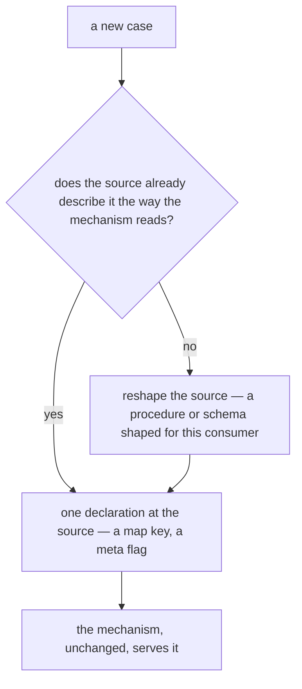

# Write Once

Esposter is written for **zero maintenance and zero churn**: code that, once written, needs no change when the product grows. The measure of a mechanism is not how short it is today but what the next case costs. A mechanism that costs a new file, a new branch or a new registration step for every case it serves is paid for again every time the product grows, and every one of those payments is a place to get it wrong. A mechanism written once over a description the cases already carry costs nothing for the next case, and nothing to keep up.

## The rule

- **Derive from the source of truth; never restate it.** Every case already describes itself somewhere: a tRPC procedure has a name, a Zod input schema and the guards that authorise it; a resource type has its entry in `ResourceDefinitionMap`; a form has the schema it validates. A mechanism reads that description. An adapter that restates it per case — a second schema, a second name, a second permission check — is the copy that drifts.
- **A new case is one declaration at its source.** Adding a case is a line where the case is defined — a key in a definition map, a flag in a procedure's meta — and never a file in the mechanism, an entry in a list the mechanism keeps, or a branch in its body.
- **The mechanism has no per-case branch.** A case the mechanism cannot serve uniformly is a case whose source has the wrong shape. The source is fixed, for example with a procedure shaped for the new consumer, and the mechanism stays as it is.
- **What is security-shaped or tracks an outside spec is a library's**, never the mechanism's own code: authentication, key storage and a wire protocol are kept and bumped, per the stop list in [dependency admission](/docs/architecture/dependency-admission). The mechanism is the thin seam between the source and the library.

## When a mechanism is written once, and when it waits

This rule does not overrule the [resource](/docs/architecture/resource) admission rule, which forbids promoting a capability for a single consumer. The two answer different questions:

- **The description already exists for every case.** A mechanism over tRPC procedures invents nothing, because every procedure already has a name, an input schema and a guard. Written generically, it costs what the one-case version costs, and every later case is free. It is written once, from the first case.
- **The shared shape would have to be designed.** A capability like Publishable is a contract several types have to agree on, and one consumer is not enough evidence of what that contract is. It waits for the second consumer, per the admission rule.

The test is whether the mechanism's input already exists, uniformly, for every case it will serve. If it does, write the mechanism once. If you would have to guess that input from the one case you have, wait.

## Where the repository does this

- **`createResourceProcedures`** builds every resource type's procedures from its `ResourceDefinitionMap` entry, so a new type is a map entry and never a router of its own ([resources](/docs/architecture/resource)).
- **`UiSchemaForm`** renders a form from the Zod schema that already validates it, so a new field is a schema field and never template code ([UI library](/docs/architecture/ui-library)).
- **The router input test** walks every procedure's input as JSON Schema, so a new procedure is checked the day it exists, with nothing to register (`apps/web/server/trpc/routers/index.test.ts`).

## Key files

| File                                                                  | Role                                                         |
| --------------------------------------------------------------------- | ------------------------------------------------------------ |
| `apps/web/shared/services/resource/ResourceDefinitionMap.ts`          | the declaration every resource mechanism derives from        |
| `apps/web/server/trpc/procedure/resource/createResourceProcedures.ts` | a type's procedures derived from its declaration             |
| `apps/web/server/trpc/routers/index.test.ts`                          | one check over every procedure's input, with no registration |
