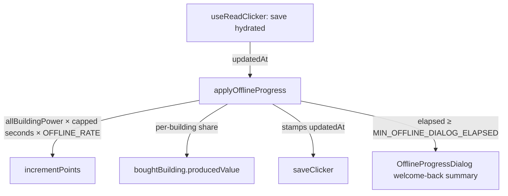

# Offline Progress

When the save loads, the game grants points for time spent away — the idle-game retention staple of coming back to a payout — computed once at load from the save's `updatedAt` stamp.

## How it works

`useReadClicker` calls the offline-progress store's `applyOfflineProgress` immediately after hydrating the save (both the authed blob path and the anonymous localStorage path). The award is `allBuildingPower × cappedSeconds × OFFLINE_RATE`, where the elapsed time is capped at `OFFLINE_CAP` (one day) and `OFFLINE_RATE` (0.5) keeps active play strictly better than idling offline. The points go through `incrementPoints`, and each bought building's lifetime `producedValue` receives its proportional share, so the stats panel stays consistent. The award then saves immediately — the awarded fields are excluded from the autosave watcher, so persisting right away is what stamps a fresh `updatedAt` and keeps a reload from re-awarding the same offline window.

The award works because [saving stamps `updatedAt`](/docs/clicker/game-loop-and-saves) on every write and autosave runs every 60 seconds, so the stamp is always within a minute of the real last-played moment. Elapsed time is guarded against clock skew (`elapsed > 0`), and absences under `MIN_OFFLINE_DIALOG_ELAPSED` (one minute) still award silently but skip the dialog — silent point jumps read as a bug, but a dialog for a page refresh is noise.

## Key files

Paths relative to `packages/app`.

| File                                               | Role                                                        |
| -------------------------------------------------- | ----------------------------------------------------------- |
| `app/store/clicker/offlineProgress.ts`             | award computation + dialog state                            |
| `app/composables/clicker/useReadClicker.ts`        | calls the award after save hydration                        |
| `app/services/clicker/constants.ts`                | `OFFLINE_RATE`, `OFFLINE_CAP`, `MIN_OFFLINE_DIALOG_ELAPSED` |
| `app/components/Clicker/OfflineProgressDialog.vue` | welcome-back summary dialog                                 |

## Notes

- The stamp is client-set, like the whole save blob (client-authoritative everywhere); a stricter server-side stamp in `createSaveBlobStateProcedure` would also benefit dungeons — revisit if trust ever matters.
- Per-building `producedValue` gets proportional shares rather than exact per-building offline math — close enough for a stat display.
