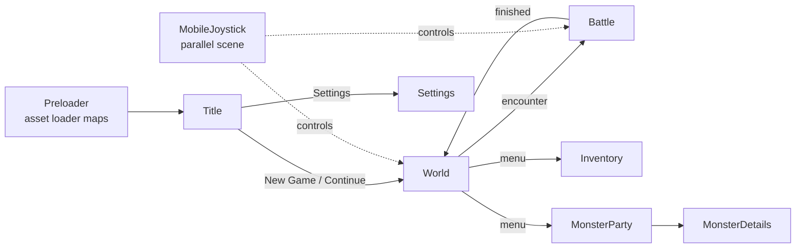

# Scenes and Input

Every Phaser scene is a Vue component registered in `SceneComponentMap` and rendered inside vue-phaserjs's `<Game>` on `pages/dungeons.vue`, which also registers the Phaser plugins the game relies on (grid-engine for tile movement, rex virtual joystick, slider, click-outside).

## How it works

The Preloader scene loads every asset through the loader constant maps (`services/dungeons/loader/` — images, spritesheets, tilemaps, sounds, fonts, all keyed by enums), then hands off to the Title scene. Title offers New Game / Continue / Settings; both game options land in the World scene, and battles swap World for Battle. `fadeSwitchToScene` on the dungeons store wraps every transition in a camera fade.

The game holds pixel art beside painted art, so filtering is chosen per texture rather than by Phaser's global `pixelArt`, which would turn smoothing off for every texture at once. `PixelArtTextureKeys` names the textures drawn on a pixel grid, each picked by looking at the sheet enlarged: every tileset and spritesheet, the world's foregrounds, the cosmo ball and the monster party's grid. The Preloader filters those nearest once loading completes. The monsters, the painted backgrounds, the title art and Kenney's UI keep linear filtering. A world character rounds its vertices to whole pixels (`fullAuto`), because the world camera's zoom scales every sprite and the default rounding skips a scaled one.

**Input** — scenes poll a `Controls` abstraction: `KeyboardControls` (cursor keys + enter/shift/etc.) on desktop, `JoystickControls` on mobile, chosen by `useInitializeControls` via `checkIsMobile`, which also launches the MobileJoystick parallel scene (rendered above the active scene; multi-touch enabled for move + confirm simultaneously). Both produce the same `PlayerInput` union (a `Direction` or a `PlayerSpecialInput` like Confirm/Cancel), so scene logic never branches on device.

**Input resolvers** — scenes with layered UI (world menu vs movement vs dialog; monster party menu vs move mode) route input through ordered `AInputResolver` chains: each scene exposes `getActiveInputResolvers`, and the first resolver whose `handleInput` returns `true` consumes the input. Adding a UI layer means adding a resolver class, not another `if` ladder.

**Menus** — every menu (title options, battle actions, settings rows, party panels) is an option **grid** model (`Grid`) navigated by direction inputs, with per-scene option-grid services defining the cells and wrap behavior.

## Key files

Paths relative to `apps/web/app`.

| File                                              | Role                                              |
| ------------------------------------------------- | ------------------------------------------------- |
| `pages/dungeons.vue`                              | `<Game>` configuration + plugin registration      |
| `services/dungeons/scene/SceneComponentMap.ts`    | scene key → async Vue component                   |
| `composables/dungeons/useInitializeControls.ts`   | keyboard vs joystick selection                    |
| `models/dungeons/input/`                          | `Controls` implementations                        |
| `models/resolvers/dungeons/AInputResolver.ts`     | resolver base; scene folders hold concrete chains |
| `models/dungeons/Grid.ts`                         | menu option grid                                  |
| `store/dungeons/index.ts`                         | `fadeSwitchToScene`, save root                    |
| `services/dungeons/loader/PixelArtTextureKeys.ts` | the textures filtered nearest                     |

## Notes

- Texture filtering governs scaling inside the fixed 1024×576 stage: an attack drawn at four times its size, the world camera's zoom. Fitting the stage to the window is the canvas's CSS size, which the browser scales smoothly whatever a texture's filter is.
- The MobileJoystick scene is first in `prioritizedParallelSceneKeys` so it always renders on top.
- Text everywhere uses the Kenney Future Narrow font set as the vue-phaserjs default text style, with per-scene style constants under `assets/dungeons/scene/*/styles/`.
