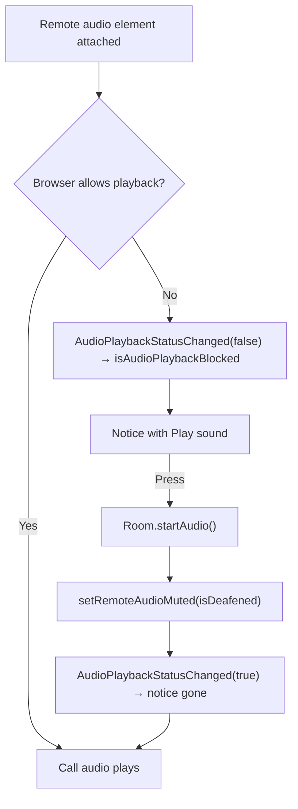

# Blocked Call Audio

A browser plays sound only after the page has had a gesture of the reader's own. Joining a call is usually that gesture, but not always — a call rejoined without a click, or a browser stricter than most — and then the call is up and silent with nothing on screen saying why. Where that happens, a warning notice reads **Your browser is keeping the call quiet until you allow its sound.** with a **Play sound** button; pressing it is the gesture, and the call's sound starts.

## How it works

LiveKit reports the refusal itself: a remote audio element that fails to play flips `Room.canPlaybackAudio` and emits `RoomEvent.AudioPlaybackStatusChanged`. `useLiveKitStore` keeps that as `isAudioPlaybackBlocked`, cleared on disconnect, and `startAudio` calls `Room.startAudio()` from inside the button's click.

`Room.startAudio()` unmutes every remote audio element as it calls `play()` on them, which would undo deafen, so the store lays `isDeafened` back over them straight after the call, before its playback settles. A reader deafened while the sound was blocked is still deafened once it plays, and still deafened if the browser refuses it again.

## Where it shows

`MessageContentCallAudioPlaybackNotice` renders in three places, so it is on screen wherever the reader is in the call:

- **The call view**, above its controls — `/calls/[id]` and a room's call view alike.
- **The [picture-in-picture](/docs/esbabbler/calls/picture-in-picture) window**, above its controls — a press there is a gesture for the page that opened it, whose document holds the audio elements.
- **Under the room's call strip**, while the call view is closed — the reader is reading messages with the call running beside them.

## Key files

| File                                                                     | Role                                                           |
| :----------------------------------------------------------------------- | :------------------------------------------------------------- |
| `apps/web/app/store/message/room/liveKit.ts`                             | `isAudioPlaybackBlocked`, `startAudio` and the deafen re-apply |
| `apps/web/app/components/Message/Content/Call/AudioPlaybackNotice.vue`   | the warning and its Play sound button                          |
| `apps/web/app/components/Message/Content/Call/View.vue`                  | places it above the call view's controls                       |
| `apps/web/app/components/Message/Content/Call/PictureInPicture/View.vue` | places it above the PiP window's controls                      |
| `apps/web/app/components/Message/Content/Call/Panel/Index.vue`           | places it under the room's call strip while the view is closed |
