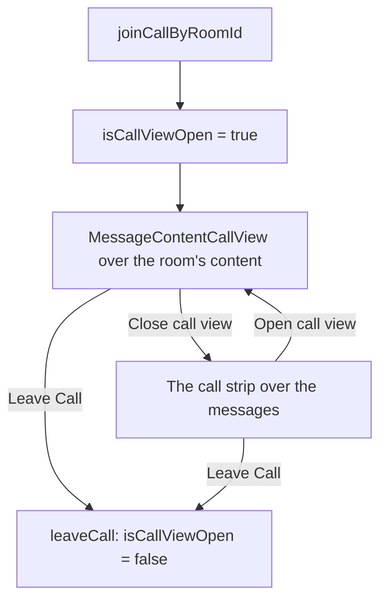
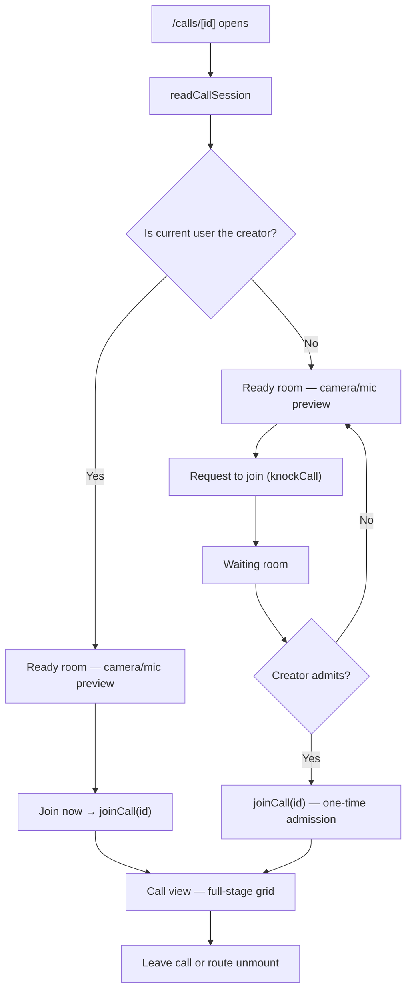

# Call View UI

Full-screen call experience for `/calls/[id]`, with `/calls` as the standalone lobby/start page. The same components render a room's call (a strip over the room's messages and the call view in `Message/Content/`), so the two surfaces never diverge.

## The room's call view

A room's call view opens **in place over the room's content**, as Discord's voice view does, rather than as a modal: a call is somewhere the reader is, not something that interrupts them, so the dock and the room list stay beside it. `MessageContentCallPanel` sits between the room's header and its message list. While the reader is in a call it draws `MessageContentCallPanelBar`, a strip over the messages with who is in the call and its controls — a narrow screen keeps only leaving and **Open call view** there — and while `isCallViewOpen` holds it lays `MessageContentCallView` over the whole content region, easing in from slightly smaller, with a **Close call view** button in the view's top bar. Joining a room's call opens the view, and leaving closes it.

## Layout

The participant grid (or, when presenting, the screenshare stage) **is** the surface — it fills the view directly with no outer wrapper card. Grid distribution by count: 1 participant = one full-stage column, 2 = up to two columns, 3+ = the wider responsive grid; no side panel is reserved in the default view. The control bar sits centred under the stage with nothing drawn around it, wrapping onto a second centred line where a narrow screen cannot fit it on one.

- **`MessageContentCallView`** — full-size flex column on the background colour. Its top bar is an absolute top-right overlay (never pushes the stage down), rendered only when there is something to show: the Meet-style **presenter pill**, lifted (`{name} is presenting` + inline **Stop presenting** when you are the presenter), plus an `append` slot where the room's panel puts its **Close call view** button — pill and close share one container.
- **`MessageContentCallParticipantTile`** — a framed tile: camera `<video>` when available, else a large centred `UiAvatar`; the whole tile a button that pins its participant; a speaking glow in the accent easing in and out with their voice; a lifted bottom-left label with the name and the screenshare, raised-hand, camera, muted and self-only deafened marks.
- **`MessageContentCallControlBar`** — the controls every call surface carries, in one order (`MessageContentCallControlGroup`): mic with its audio settings, camera with its video settings and virtual backgrounds, deafen, screenshare, raise hand and connection health — then the PiP pop-out and leave. Moderators (`MuteMembers`) get "Lower Hand" in a participant's action menu.
- **Controls are the raised default button** (`UiIconButton`, an icon with a tooltip that is its name, its `is-pending` putting a spinner in the icon's place), shared by every bar a call draws: the call view's, the room's strip, the PiP window's and the ready room's. A state that is off or stopping — muted, camera off, leaving — takes the danger variant, and one that is on — a raised hand, a screen being shared — the accent.
- **Device settings are popovers of listboxes.** The quiet caret beside the mic or the camera opens a `UiPopover` holding one `UiList` per device kind, under its title, with the device in use as its one selection; a kind the browser lists nothing for shows its system default. The video popover adds the virtual background grid under its list.
- **`MessageContentCallStage`** — the shared presenter/grid stage used by both the full view and the PiP window (`isDense`); see [screenshare](/docs/esbabbler/calls/screenshare) for the presenter layout.

## Prejoin / ready room

Every standalone visitor sees prejoin before entering — it is where mic/camera state gets verified, so even the creator is never auto-joined on mount.

Prejoin layout: `flex-col` on mobile, `lg:flex-row` — a `flex-1` left column (camera preview hero above centered media controls) and a `shrink-0` right column ("Ready to join?" card above an invisible spacer whose height mirrors the controls via `useElementSize`, so the card lines up with the preview exactly). No manual widths/heights; mic/camera state is conveyed by the toggle buttons' icon/error colour, never duplicated as text.

## Room call vs standalone call

| Aspect                     | Room call (`useCallSubscribables`)                                                      | Standalone (`useCallIdSubscribables`)         |
| -------------------------- | --------------------------------------------------------------------------------------- | --------------------------------------------- |
| Entry                      | one `joinCallByRoomId({ roomId })` mutation — finds or creates the session and joins it | creator/admitted `joinCall({ id })`           |
| `callRoomId`               | set (enables admin actions)                                                             | not set                                       |
| `currentRoomCallSessionId` | set for the viewed room                                                                 | not set                                       |
| Layout                     | a strip over the messages + the call view over the room's content                       | full-screen (`layout: false`)                 |
| Moderation actions         | available                                                                               | not available (no room membership)            |
| Route cleanup              | unsubscribe viewed-room observers only                                                  | unsubscribe **and** leave (unless popped out) |

`readCallSessionId` is not part of that entry path — `useCallSubscribables` queries it to learn whether the viewed room already has a call running (so the room's header can offer to join it), and the server-side `StopScreenShare` admin action resolves the room's session through it.

`/calls/[id]` unmount cancels any pending knock, unsubscribes, and calls `store.leaveCall()` — the page is the call context. The one exception is a [picture-in-picture](/docs/esbabbler/calls/picture-in-picture) pop-out, which keeps the standalone call alive across navigation.

## Key files

| File                                                                   | Role                                                 |
| :--------------------------------------------------------------------- | :--------------------------------------------------- |
| `apps/web/app/pages/calls/index.vue`                                   | lobby/start page                                     |
| `apps/web/app/pages/calls/[id].vue`                                    | fullscreen call route (prejoin → waiting → call)     |
| `apps/web/app/components/Message/Content/Call/View.vue`                | full call surface + top bar                          |
| `apps/web/app/components/Message/Content/Call/Stage.vue`               | shared presenter/grid stage                          |
| `apps/web/app/components/Message/Content/Call/Participant/Tile.vue`    | participant tile                                     |
| `apps/web/app/components/Message/Content/Call/Control/Bar.vue`         | the call view's controls                             |
| `apps/web/app/components/Message/Content/Call/Panel/Index.vue`         | the room's strip, and the call view over its content |
| `apps/web/app/components/Message/Content/Call/Device/SectionList.vue`  | a device popover's listboxes, one per kind           |
| `apps/web/app/components/Message/Content/Call/PreJoin/`                | prejoin preview                                      |
| `apps/web/app/composables/message/room/call/useCallIdSubscribables.ts` | standalone page membership                           |
