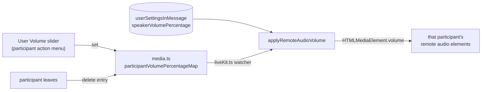

# Per-User Volume

Each remote call participant's action menu (the overflow button on their tile, or their avatar in the participant bar) carries a **User Volume** slider (0–200%) adjusting only that participant's audio locally — Discord's per-user volume.

## How it works

Client-only, in-call state — there is no DB column and no procedure; Discord has no stored panel default for this either. State lives in `call/media.ts` and dies with the call.

- `participantVolumePercentageMap` is keyed by participant id (the auth session id, which is also the LiveKit identity); an absent entry means the 100% default.
- Effective element volume = `min(1, (speakerVolumePercentage / 100) × (participantVolumePercentage / 100))` — `HTMLMediaElement.volume` caps at 1, so combined values above 100% clamp to full (same limitation as the master [speaker volume](/docs/esbabbler/voice-video)).
- The volume resets when the participant leaves (`onLeaveCall` deletes the map entry) and the whole map clears with the call (`resetCallMedia`).
- The action menu keeps `close-on-content-click` off so dragging the slider doesn't dismiss it; moderation items close it explicitly.

## Key files

| File                                                                            | Role                                                         |
| :------------------------------------------------------------------------------ | :----------------------------------------------------------- |
| `packages/app/app/store/message/room/call/media.ts`                             | `participantVolumePercentageMap` + set/delete mutations      |
| `packages/app/app/store/message/room/liveKit.ts`                                | applies master × participant volume to remote audio elements |
| `packages/app/app/components/Message/Content/Call/Participant/ActionMenu.vue`   | shared menu: volume slider + moderation actions              |
| `packages/app/app/components/Message/Content/Call/Participant/VolumeSlider.vue` | the slider bound to the store map                            |
| `packages/app/app/composables/message/room/call/useCallJoinedSubscribables.ts`  | deletes the entry on participant leave                       |

## Notes

- No persistence, no server involvement — deliberately the smallest possible feature. If users later ask for remembered per-friend volumes, that becomes a `userSettingsInMessage`-adjacent design decision, not an extension of this.
