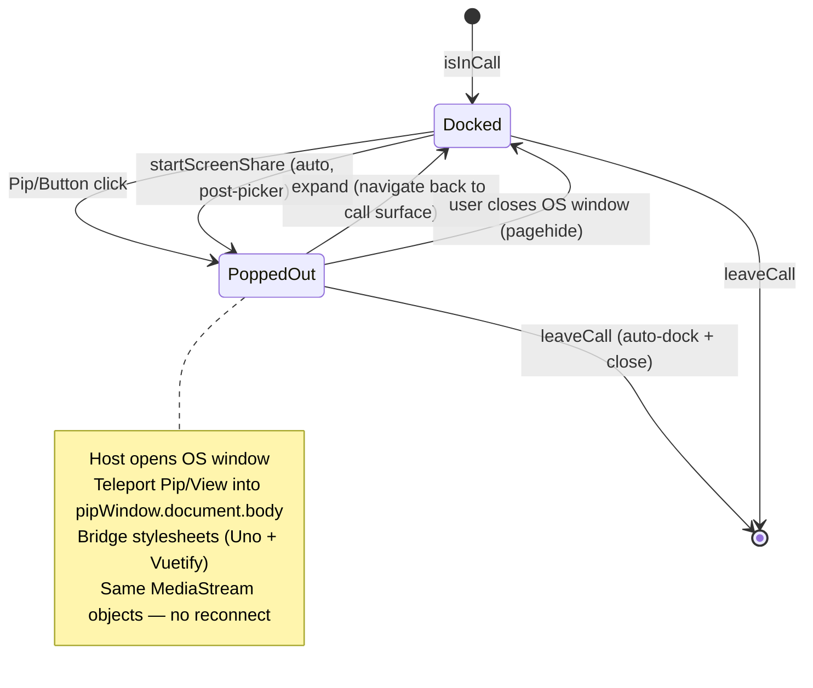

# Picture-in-Picture

Pop the active call out into an always-on-top OS window (Google Meet / Discord style) using the **Document Picture-in-Picture API**. Unlike native `<video>` PiP, Document PiP renders arbitrary DOM, so the popped-out window shows the full call stage (screen share + side tiles, or the participant grid) **and** a compact control bar.

Purely client-side: no DB changes, no procedures, no infrastructure. The LiveKit `Room` and every `MediaStream` live in Pinia stores independent of where the DOM renders — **popping out is a DOM relocation, not a media reconnection**. It builds on the [call lifetime boundary](/docs/esbabbler/calls): `activeCallSessionId` already survives navigation.

Chromium 116+ only; the pop-out button is feature-detected and never renders unsupported (the full-page call view is the fallback). VueUse has no Document-PiP composable (its PiP surface drives the single-`<video>` native API), so `useDocumentPictureInPicture` is a small hand-rolled SSR-safe composable in the VueUse return-shape style (`{ isSupported, pipWindow, isActive, open, close }`).

## How it works

The pop-out **intent** is a single `isPoppedOut` boolean on `call/media.ts` (cleared by `resetCallMedia`, so leaving the call auto-docks for free). `MessageContentCallPipHost` — mounted once in `app.vue`, the persistent root outside `<NuxtPage>`, so the window survives all route and layout changes — watches it, opens/closes the OS window, and `<Teleport>`s the compact view into `pipWindow.document.body` (the element, not a selector — Vue must teleport across documents). Component instances, reactivity, and handlers are unchanged; `<video :srcObject.prop>` keeps playing because the same `MediaStream` objects stay attached.

While popped out, the main page swaps the stage for `MessageContentCallPipPlaceholder` ("call is in a mini player") but **keeps rendering the full control bar**, so every primary control stays usable (Meet parity). The presenter pill lives in `MessageContentCallView`'s top bar, shown over both the live stage and the placeholder.

Both surfaces render the **same** `MessageContentCallStage` (`isDense` in PiP tightens padding/tile size and makes the screen stage non-interactive) — the layout lives in exactly one place; never fork a second stage.

## Style bridge

The PiP window opens with an empty document, so `useDocumentPictureInPicture`:

1. Rebuilds every `document.styleSheets` **and** `adoptedStyleSheets` entry into fresh `<style>` nodes by serialising `cssRules` — deliberate, because Vuetify's theme and UnoCSS's runtime inject rules via the CSSOM (`insertRule`), leaving `<style>` `textContent` empty; a naive `cloneNode` would copy nothing. Cross-origin sheets (which throw on `cssRules`) fall back to re-linked `<link>`s.
2. Adds the active `v-theme--*` class to the PiP `<body>` (not the whole `.v-application` className, to avoid its flex layout CSS) so `--v-theme-*` variables resolve.
3. Sets `<html>`/`<body>` `height: 100%` + `margin: 0` — a fresh document has no layout height, so `size-full` content would collapse.
4. Attaches a `MutationObserver` on `document.head` to mirror late-added stylesheets (UnoCSS dev-time HMR injection).

**Tooltips**: Vuetify positions overlays against the **main** window, so a `v-tooltip` inside the PiP window mis-anchors. `MessageContentCallControlActionButton` detects teleportation (`wrapper.ownerDocument !== document`) and sets the tooltip's `attach` to its own wrapper, with a global CSS override anchoring it — main-window tooltips are unaffected. The same mis-anchoring is why the PiP control bar is a flat row with no `v-menu` (the menu-only `HealthButton` is intentionally omitted), and why its `StyledCard` needs `overflow-visible` so the attached tooltip isn't clipped.

## Gesture / activation rules

`documentPictureInPicture.requestWindow()` **requires and consumes** a transient user activation — exactly like `getDisplayMedia()`. The two cannot share one click: opening PiP first spends the activation, so the picker never opens and the window pops out over a share that never starts. So `toggleScreenShare` awaits `setScreenShare(true)` **first** (the picker consumes the click; the user choosing a screen grants a **fresh** activation) and only then sets `isPoppedOut = true`. A cancelled/failed share throws before that line, so nothing pops. `Pip/Host` also checks `pipWindow` after `await open()` and reverts the intent if no window materialised (unsupported, denied, activation lost).

**The screen-share `<video>` must be `muted`**: `getDisplayMedia` may bundle a system-audio track, and a freshly opened PiP window has no activation, so browsers block autoplay of unmuted video — the stage would sit paused/blank (metadata loads, so the aspect ratio updates — the tell). Muted video always autoplays, and no audio is lost: screen-share audio plays through LiveKit's audio pipeline, not this element.

## Standalone-call interaction

`/calls/[id]` unmount normally leaves the call ([call view UI](/docs/esbabbler/calls/call-view)). Popping out a standalone call means navigating away while staying connected, so `useCallIdSubscribables` **skips `leaveCall()` on unmount when `isPoppedOut`**. Since a popped-out standalone call has no on-page surface, `MessageLeftSideBarStatusBar` surfaces **any** active call and links to the correct route (`RoutePath.Messages(callRoomId)` for room calls, the calls route for standalone) — a docked call is always one click away. The browser allows exactly one Document PiP window per document.

## Key files

| File                                                                        | Role                                                             |
| :-------------------------------------------------------------------------- | :--------------------------------------------------------------- |
| `packages/app/app/types/documentPictureInPicture.d.ts`                      | ambient types (API not yet in lib.dom)                           |
| `packages/app/app/composables/useDocumentPictureInPicture.ts`               | SSR-safe `requestWindow` wrapper + style bridge + cleanup        |
| `packages/app/app/components/Message/Content/Call/Pip/Host.vue`             | persistent window owner + teleport target (mounted in app.vue)   |
| `packages/app/app/components/Message/Content/Call/Pip/View.vue`             | compact call surface inside the window                           |
| `packages/app/app/components/Message/Content/Call/Pip/ControlBar.vue`       | trimmed control row (mute/camera/share/deafen/hand/expand/leave) |
| `packages/app/app/components/Message/Content/Call/Pip/Button.vue`           | feature-detected pop-out toggle                                  |
| `packages/app/app/components/Message/Content/Call/Pip/Placeholder.vue`      | main-page "mini player" notice                                   |
| `packages/app/app/composables/message/room/call/useCallParticipantTiles.ts` | shared tile/presenter-name source for both surfaces              |
