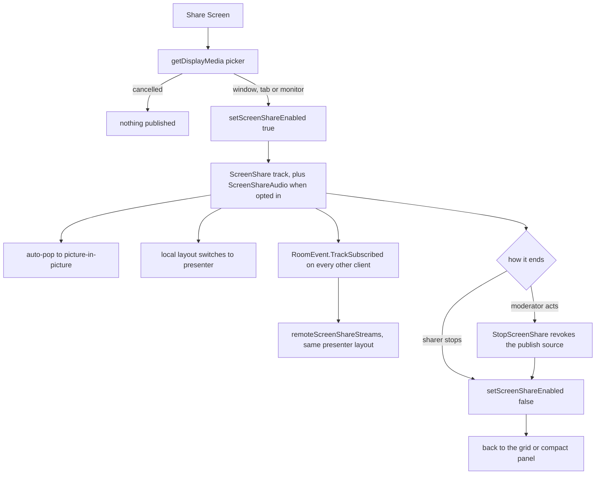

# Screenshare

A screen share is a LiveKit `Track.Source.ScreenShare` track published from the local participant — ephemeral media like audio, with **no DB columns or server state**. The token already grants `screen_share` + `screen_share_audio` publish sources ([calls](/docs/esbabbler/calls)).

## How it works

- **Start**: the Share Screen button calls `room.localParticipant.setScreenShareEnabled(true, { audio: true, resolution: 1920×1080@15 })` — the browser's native `getDisplayMedia` picker opens; picking a window/tab/monitor publishes the track (plus a separate `ScreenShareAudio` track if the user checked "Share audio").
- **Stop**: `setScreenShareEnabled(false)` unpublishes; the layout reverts to the video grid or compact panel.
- Remote clients receive the stream via `RoomEvent.TrackSubscribed` (source `ScreenShare`) into `call/media.ts`'s `remoteScreenShareStreams`.
- Starting a share **auto-pops the call into picture-in-picture** so the sharer keeps watching the call while presenting; the activation-ordering constraint behind this lives in [picture-in-picture](/docs/esbabbler/calls/picture-in-picture).
- Feature-detected: the button is hidden when `getDisplayMedia` is unavailable (iOS Safari).

The track is the only state there is, so every layout and moderation behaviour below is downstream of one publish:



## Presenter layout

When any participant publishes a screen track, the shared `MessageContentCallStage` `<main>` switches from `flex-col` to `flex-row`: the screenshare stage is the left hero (`flex-1`, full height), and participant tiles move into a `shrink-0` right sidebar — a vertical scrollable column of `h-32 aspect-video` tiles (`h-20` in the PiP window's `isDense` mode).

```text
┌────────────────────────────────────────┬─────────────┐
│        SCREEN SHARE (left, flex-1)     │  [tile]     │
│        presenter name bottom-left      │  [tile]     │  ← right sidebar (scrolls)
│                                        │  [tile]     │
├────────────────────────────────────────┴─────────────┤
│              [🎤] [🎧] [🖥] [📞]  (control bar)        │
└──────────────────────────────────────────────────────┘
```

- Clicking the stage requests **native fullscreen of the whole `MessageContentCallView` root** (Google Meet model), not the `<video>` — the Fullscreen API isolates rendering to the target's subtree, so fullscreening the video alone would drop the tiles and controls. `MessageContentCallScreenShareStage` emits `fullscreen`; `MessageContentCallView` owns the root ref and calls `requestFullscreen()`. In the PiP window the stage is non-interactive (no click-to-fullscreen), matching Meet.
- Multiple simultaneous sharers: tabs above the main area; the active tab is the focused share.
- **Pin/spotlight**: clicking any tile pins it (`pinnedParticipantId` in `call/media.ts`, values are LiveKit identities = auth session ids); local-only, not broadcast. With nothing pinned, `activeScreenShareParticipantId` prefers your own share and otherwise takes the first sharer in the presenter list.

## Moderation

`AdminActionType.StopScreenShare` (gate: `MuteMembers` — conceptually the same as force-mute) enforces server-side via the LiveKit Admin API: revoke the target's screen-share publish sources and mute active screen tracks; the target client also runs `setScreenShare(false)` + snackbar through the admin action hook. See [moderation](/docs/esbabbler/moderation).

## Key files

| File                                                                      | Role                                         |
| :------------------------------------------------------------------------ | :------------------------------------------- |
| `packages/app/app/components/Message/Content/Call/ScreenShare/Stage.vue`  | presenter `<video>` stage                    |
| `packages/app/app/components/Message/Content/Call/ScreenShare/Button.vue` | start/stop toggle                            |
| `packages/app/app/store/message/room/call/media.ts`                       | screenshare/pin state + local/remote streams |
| `packages/app/app/store/message/room/liveKit.ts`                          | `setScreenShare` + screen track event bridge |
