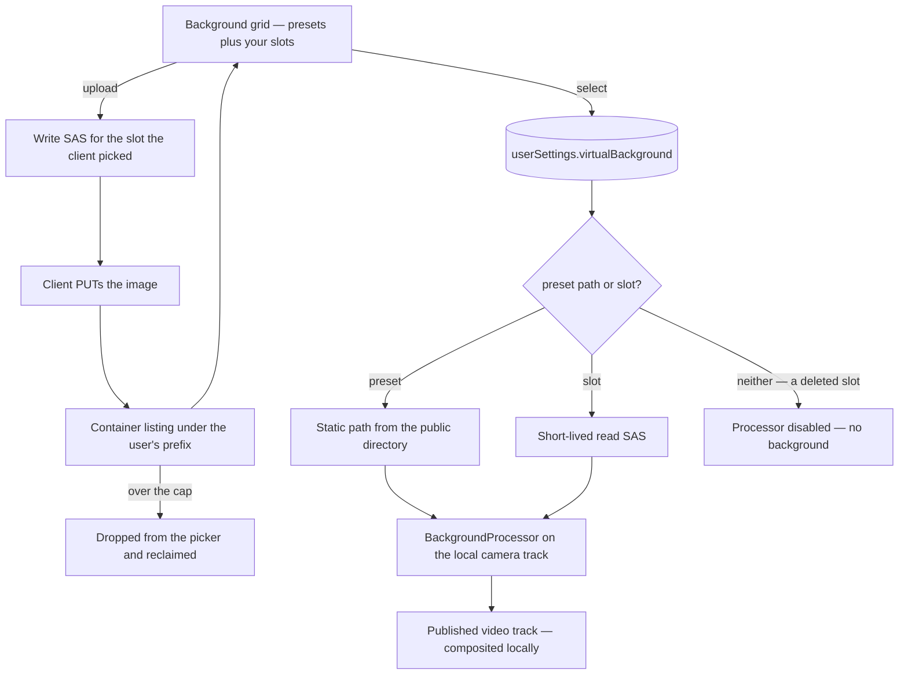

# Virtual Backgrounds

The camera background the local media pipeline composites behind you, applied through `@livekit/track-processors`. Two kinds of background share one selection: the presets the repo ships as static SVGs, and up to `MAX_CALL_BACKGROUNDS` images you upload yourself.

This is not profile imagery — the profile image is user-editable separately ([users](/docs/users)). A background is composited **locally**, before the track is published, so nobody but the uploader ever fetches it.

## Uploads into fixed slots — no table, no metering

An upload writes to `{userId}/CallBackground/{slot}` in the private user-assets container, where the slot is an index below the cap. This is the same trick the profile image uses: the blob name is **derived, not allocated**, so the number of blobs a user can hold is bounded by construction. There is no table, no id, no ledger row and nothing to reconcile — the cost of the feature is a fixed number of images per user, and re-uploading a slot overwrites it.

The container is the **private** one, because the only consumer of a background is the uploader's own browser. Reads are therefore a short-lived read SAS, the same shape resource-asset reads sign ([file uploads](/docs/architecture/file-uploads)), rather than a permanently public url.

The list is the container listing under that prefix. Nothing has to be kept in step with it, which is the point of deriving the name.

**The client picks the slot, and the server signs whatever slot it is asked for.** A listing cannot allocate durably: a delete is reclaimed by a worker, so a slot freed a moment ago still reads as taken and would refuse the replacement the user just made room for, and two concurrent requests read the same free one anyway. The client is the only party holding a view that already accounts for the delete it just made. Nothing is lost by trusting it, because the bound was never the count — there are only `MAX_CALL_BACKGROUNDS` names, the request schema enforces that range, and the worst a client can do with a slot it names deliberately is overwrite its own image.

**The size cap is the stored byte length, and the listing is where it is read.** A write SAS cannot bound what is PUT through it, so the size the picker checked before asking for a target is an early no rather than the guarantee — the same split [custom emoji](/docs/esbabbler/custom-emoji) has. A listing already carries each blob's `contentLength`, so a slot that came back over the cap is dropped from the list the picker receives and its blob reclaimed through the standard blob-deletion event. That costs no extra round trip and needs no row to hang a check on, which is what keeps the no-table property intact.

## Remembering the choice

`userSettingsInMessage.virtualBackground` is a text column defaulting to the empty sentinel, alongside the voice settings it already carries ([user settings](/docs/esbabbler/settings)). It holds either a preset's path or a slot name; the client resolves a slot to a freshly signed read SAS and a preset to its static path, and the empty value means no background.

**Resolving a slot re-reads the listing rather than the session cache.** The cache the picker renders from goes wrong in both directions over the life of a session: it holds a slot another device has deleted, which would resolve to a url whose blob is gone instead of to no background, and the read SAS it is holding expires while the session stays open. Only a slot ever reaches that path, so a preset still pays nothing.

A preset's path can never collide with a slot number, so the two need no tag to tell apart. Persisting it is the smaller half of the value, but the visible one: before it, choosing a background was a per-tab act and anyone who wanted one had to re-pick it every session.

Applying a background and remembering it are separate calls. A camera that starts mid-call applies the persisted pick without writing it back — restoring a selection is not the user making it again.

Picks supersede rather than queue, so only the one still in force is remembered. A slow selection can resolve after a later one has already applied; persisting it then would leave the settings row naming a background the call is not showing, and restore it on the next camera start.

## The flow

## Failure and teardown

A slot whose blob is gone resolves to nothing and falls back to no background, which is the state the picker's None entry already selects — a missing image must never leave a call with a broken video track. The settings row keeps naming a slot that no longer resolves until the user picks something else, which costs nothing and needs no cleanup pass.

Because a slot's blob name is fixed, a replace and a delete name the same blob, and a deletion event still in flight would take the replacement with it. **The delete is therefore published as a bounded prefix rather than as the name itself**: `publishBlobPrefixDeletion` stamps `createdBefore` with the instant the delete was decided, and the handler's listing drops anything created after it. A slot that has since been re-uploaded keeps its new image, and the worst case is a blob nothing points at rather than a background that vanishes after being replaced. This is the same bound every other prefix sweep states, so the delete needs no new field on the deletion event ([file & media](/docs/esbabbler/file-media)).

A browser without background-processor support keeps the earlier behaviour: uploads are still stored, and applying one warns rather than failing.

## Key files

| File                                                                              | Role                                                    |
| :-------------------------------------------------------------------------------- | :------------------------------------------------------ |
| `packages/db-schema/src/schema/userSettingsInMessage.ts`                          | the persisted selection                                 |
| `packages/app/server/services/message/call/getCallBackgroundBlobName.ts`          | the one place a slot's blob name is spelled             |
| `packages/app/server/trpc/routers/user.ts`                                        | slot upload SAS, slot listing, slot delete              |
| `packages/app/app/services/message/room/call/CallVirtualBackgroundDefinitions.ts` | presets as one source among two                         |
| `packages/app/app/store/message/user/settings/callBackground.ts`                  | the listing, the upload/delete writes, and the resolver |
| `packages/app/app/components/Message/Content/Call/VirtualBackground/Grid.vue`     | upload tile, per-slot delete, resolved image urls       |
| `packages/app/app/store/message/room/liveKit.ts`                                  | processor applied from a resolved url                   |

## Notes

Cropping and aspect ratio are the processor's problem, not ours — it already composites a preset SVG behind an arbitrary camera aspect, and an uploaded image goes through the same path with no new fitting logic. Only the presets are rasterized: a slot arrives as a signed url the processor takes directly.

The mime category is checked when the write target is minted, and that is all it is: a write SAS constrains the blob name it may be PUT to, never the bytes or the type they arrive as ([file uploads](/docs/architecture/file-uploads)). The listing does not re-check it either, because there is nothing there to check: the stored content type is set by the same client on the same upload, so it is the claim again rather than evidence about it. Signing it into the read SAS would be worse than leaving it off — it would let an uploader choose the type their own blob is served as.

That is not a check on the bytes either way, and no upload path in the app has one ([upload content validation](/docs/architecture/deferred/upload-content-validation)) — a slot is composited into the uploader's own camera track and reaches nobody else, so the exposure is a decoder bug in their own browser.
