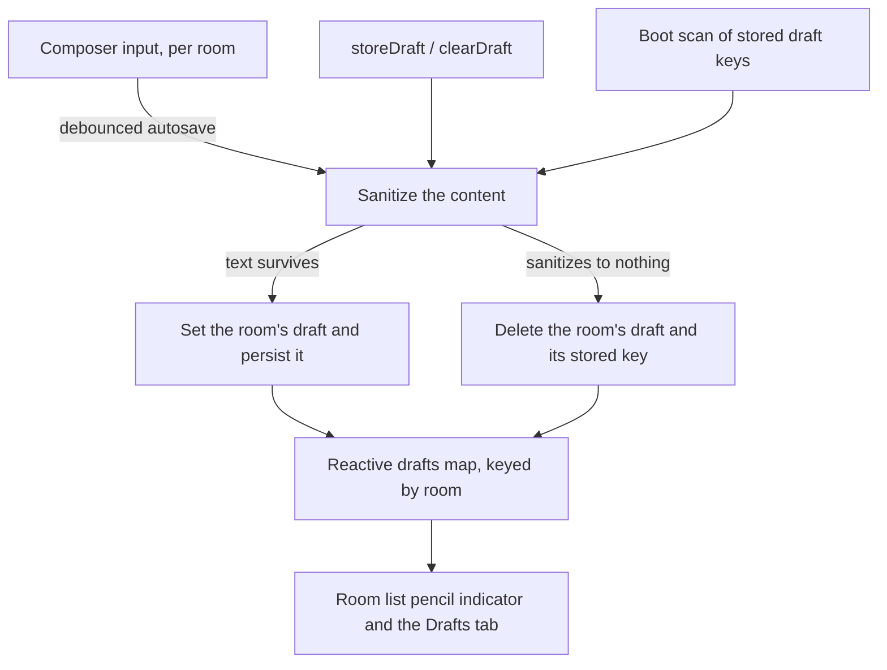

# Drafts & Sent

Route `/messages/draftsandsent`: a cross-room view of unsent drafts, scheduled jobs, and sent messages, reached from the top-level `Drafts & sent` sidebar item.

## Tabs

| Tab       | Source                            | Ordering                                              |
| --------- | --------------------------------- | ----------------------------------------------------- |
| Drafts    | Local draft storage keyed by room | Draft update time descending                          |
| Scheduled | `scheduledMessageJobsInMessage`   | `runAt ASC`, grouped by Today/Yesterday/date          |
| Sent      | Azure AI Search messages index    | Sent time descending, grouped by Today/Yesterday/date |

Sent messages reuse the existing Azure AI Search messages index as the cross-room read model — Azure Table Storage remains the source of truth for message writes. `message.readMySentMessages({ offset, limit })` queries the index with `userId` and non-deleted filters ordered `createdAt DESC`, returning total count, offset pagination metadata, deserialized message entities, and room metadata per row; the client groups rows by day and links each row back to its source room/message.

Scheduled rows come from `message.scheduledMessageJob.readMyScheduledMessageJobs` (see [scheduled messages](/docs/esbabbler/scheduled-messages)).

## Sidebar indicators

- Draft count: `mdi-pencil` immediately followed by the number; scheduled count: `mdi-clock-outline` + number.
- Room list items with drafts show a right-side `mdi-pencil` indicator and bold the room name (no `- Draft` suffix).

## Row actions

- **Draft rows** — hover action bar: delete draft, edit draft, schedule message, send message. Delete opens the shared delete confirmation dialog.
- **Scheduled rows** — hover action bar: edit scheduled message, reschedule message, send message, more (cancel schedule, save to drafts, delete message).

## Draft persistence and restore

Drafts themselves are held in the message input store as a reactive `Map<roomId, Draft>` with localStorage as persistence only — the store is the source of truth for reactivity.

Three things write a draft — the composer's debounced autosave, an explicit `storeDraft`/`clearDraft`, and the boot scan that restores what localStorage kept — and all three go through one writer, so sanitization and the "content that sanitizes to nothing removes the draft rather than storing an empty one" rule hold by construction rather than being restated per call site. An empty draft left stored would otherwise show up as a draft in the room list and in the Drafts tab.

Only the writers that own the composer's text follow the sanitized result back into the input — the debounced autosave deliberately does not, or it would rewrite the composer under a user who is still typing in it.
