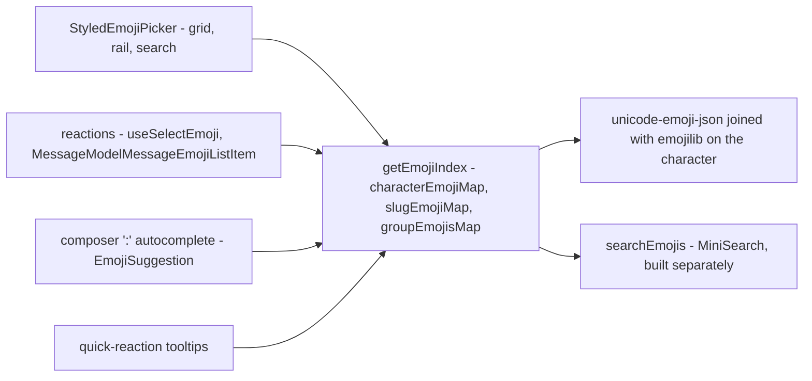

# Emoji

Every emoji surface — the picker grid, a stored reaction, the composer's `:` autocomplete and the quick-reaction tooltips — resolves through **one index built from one dataset**, plus whatever the room itself has uploaded ([custom emoji](/docs/esbabbler/custom-emoji)), which every surface renders through the same records without knowing which vocabulary it was handed. There is no emoji dependency: the picker is our own `<script setup>` components, and the lookups are three maps.

Owning the picker is what buys the single vocabulary. An off-the-shelf grid brings its own: one library's picker and another's shortcode resolver index different Unicode releases, so a glyph the picker offers has no shortcode to store and the round trip only appears to work because both directions fall back to their input. They also cost what a component dependency costs — a sprite sheet fetched from a CDN the CSP then has to whitelist, no dark mode without overriding theirs, and an Options API component that turns `vue.optionsApi` back on for the whole app. Three maps over one dataset have none of that surface.

## The shape of it

## The dataset

Two data-only MIT packages, both keyed by the emoji character and both tracking the same Unicode release, so the join is a lookup rather than a reconciliation.

| Package              | Provides                                                        |
| -------------------- | --------------------------------------------------------------- |
| `unicode-emoji-json` | name, slug, CLDR group, canonical order, skin-tone support flag |
| `emojilib`           | keywords per character                                          |

**No version cutoff.** Whichever Unicode release `unicode-emoji-json` is pinned to in the catalog is the release the picker offers, so bumping the dependency is the whole of "support the newest emoji". Whether a glyph actually renders is the reader's OS and font talking, which no build-time filter can know — if a box is ever reported, the answer is runtime canvas measurement, not a hardcoded version. Ordering, both of the categories and within them, is the CLDR order the dataset already ships in.

`emojibase-data` is the richer alternative — tags, subgroups, shortcode presets for several vocabularies — but it unpacks to tens of megabytes because it ships every locale, and we would import one file. Reconsider only if localisation lands.

## The index

`getEmojiIndex` builds three maps on first use, once for the whole app. It is deliberately not built at import: a page with no emoji surface never pays for it, and the server never builds it at all.

| Structure           | Answers                                            |
| ------------------- | -------------------------------------------------- |
| `groupEmojisMap`    | what a category tab shows, in CLDR order           |
| `slugEmojiMap`      | which record an exact shortcode query names        |
| `characterEmojiMap` | which record a glyph belongs to, for its shortcode |

`characterEmojiMap` is keyed by `getEmojiCharacterKey`, which strips skin-tone modifiers and variation selectors, so a toned glyph (👋🏽) and an unqualified one (`❤` vs `❤️`) still find their record. There are no collisions across the whole dataset under that normalisation, and slugs are unique, so both maps are total.

## Reactions store the emoji, not a name for it

`emojiTag` holds **the emoji character exactly as it was picked**, toned or not. That makes a reaction's identity plain string equality, so nothing about storing, matching or rendering one touches the index at all: `MessageModelMessageEmojiListItem` renders `emoji.emojiTag`, and `useSelectEmoji` finds the existing row with `emojiTag === emoji`. Leaving one is `toggleEmoji`, a store action both surfaces call, so a reaction and the quick-reaction bar cannot disagree about what leaving means: the row goes with its last reactor and is only rewritten for everyone else.

This is what Discord and Slack both do, and **reactions are therefore tone-sensitive**: 👍 and 👍🏽 are different strings and so different reactions, each with its own count. It also means there is no shortcode vocabulary in the storage path to keep two ends of agreeing on, no parsing, and no composite tag format to version — the alternative, a `slug` plus an encoded tone suffix, buys nothing over the character it would encode.

Shortcodes stay where they are a **label** rather than a key: the composer's `:` autocomplete inserts by name, and `getEmojiDescription` resolves the quick-reaction tooltips through `getEmojiSlug`.

### Reading who reacted

A reaction is a **pressed toggle**: a field-toned pill button holding the emoji and its count, pressed while the reader is among those who reacted, so pressing it adds or takes back theirs. Pressed, it takes a light tint of the info colour rather than the accent's fill, which would read too heavy beside the count ([design language](/docs/architecture/design-language#surfaces)). Its **tooltip** is Discord's hover card: the emoji large, then the sentence `:slug: reacted by <names>`, naming the first few reactors and counting the rest through `Intl.ListFormat` so it stays one line at any count, and a line saying a right-click shows everyone.

A tooltip cannot be clicked through, so everyone who reacted is the reaction's own [context menu](/docs/architecture/context-menus) — a right-click, long press or menu key offers **View Reactions**. The gestures stop at the reaction, so the message around it opens nothing of its own. View Reactions opens the **Reactions dialog** — one instance mounted at the list level and targeted through `messageDialogStore.reactionsRowKey` beside `reactionsRoomId` — the reaction's own room, since the thread pane renders messages beside whichever room is on screen — per [singleton dialogs](/docs/architecture/singleton-dialogs), never one per reaction. A rail of reactions sorted by count sits beside the reactors of whichever is selected. The selection is _derived_ rather than assigned when the dialog opens, so a reaction that overtakes another — or that disappears while the dialog is open — never leaves the rail pointing at nothing; and a message whose last reaction goes closes the dialog with it.

Each reactor renders under the name the rest of the room sees (`getMemberName`, nickname over global name), with the global name on a second line only when a nickname is standing in front of it.

### Search

Search is **MiniSearch**, the repo's one client-side index, per the [search standard](/docs/architecture/search) — a `computed` over an already-built index, with no server call, abort or pending state. It is built separately from the three maps, so a surface that only renders a stored reaction never builds a search index at all.

Three fields are indexed — slug, name, keywords — with the slug boosted hardest, because the shortcode is what a `:` query is naming. Two settings carry most of the relevance: `combineWith: "AND"` (the default unions terms, which makes `grin f` return most of the dataset) and `prefix: true`. An exact shortcode is pinned ahead of the ranked results, so `thumbs_up` resolves to 👍 alone. `fuzzy` is off: on names this short it manufactures noise.

**Punctuation is a delimiter, never an operator.** MiniSearch tokenizes on it rather than parsing it, so `grin(` searches for `grin`, and a query that is punctuation alone tokenizes to nothing and shows the empty state. There is no escaping step and no query syntax.

The picker and the `:` autocomplete share this one function and therefore one ranking — the two surfaces cannot disagree about what a query means.

## Skin tones

One tone, chosen once and persisted per device, applied to every emoji that supports one — Discord's model, not a per-emoji long-press.

`applySkinTone` takes the record rather than the character so the support flag cannot be forgotten; toning an emoji that does not support one would otherwise append a stray modifier beside it (🍎🏽). **The modifier attaches to the first code point, never the end**: 🧑‍💻 is a ZWJ sequence whose tone belongs to the person, so appending naively gives 🧑‍💻🏻 where the correct form is 🧑🏽‍💻. Variation selectors are dropped from the remainder, since a toned code point is already fully qualified.

The accepted limitation: Unicode allows a different tone per person in a sequence like 🧑‍🤝‍🧑, and one global setting only tones the first. Discord behaves the same way.

## The picker

`StyledEmojiPicker` is the trigger and the container it opens; everything else lives in `StyledEmojiPicker/`. The panel mounts on the first open and stays, which is what defers the index build to the first picker anyone opens, and keeps what its footer opened — a room's add-emoji dialog — alive after the panel closes behind it.

- **Search** replaces the grid wholesale while a query is running. The rail stays live rather than being disabled by it — picking a category clears the query.
- **One category renders at a time, and there is no virtualisation.** The largest CLDR group is under four hundred buttons, which a grid handles without help; the repo has no virtual-scroll primitive, and adding one for a cost that does not exist would be the opposite of lean. Discord scrolls continuously across all categories, which does need virtualisation — a deliberate deferral.
- **Categories are data, not the enum.** `getEmojiCategories` pins Frequently Used ahead of the nine CLDR groups when it has anything in it, and the room's own uploads sit between the two — where Discord puts a server's set.
- **Recents and the chosen tone live in Pinia**, persisted through the `LocalStorageKey` registry. Recents are stored as slugs rather than characters so they survive a change of skin tone, and holding them in a store rather than a module singleton is what makes the category update the moment an emoji is picked.
- **Every theme and style comes free** — the UI library's components and tokens throughout, no hardcoded palette.
- **One popover at every width.** The picker is a `UiPopover` anchored to its trigger, opening above it and toward the row's start, since every trigger ends a row near the foot of what it acts on, and flipping below only where the top has no room; a pick closes it back onto that trigger. The panel sizes itself to the screen — never wider than the viewport less a gutter, never taller than a share of it — so a phone needs no second container. A sheet up from a phone's bottom edge is not used: it lies over the dock, away from the message it reacts to. On a touch screen the search field does not autofocus: raising the keyboard would cover the emoji the reader opened the picker to tap.

## Key files

| File                                                                        | Role                                                             |
| --------------------------------------------------------------------------- | ---------------------------------------------------------------- |
| `apps/web/app/services/message/emoji/getEmojiIndex.ts`                      | The three maps, built once on first use                          |
| `apps/web/app/services/message/emoji/searchEmojis.ts`                       | MiniSearch index and the exact-shortcode pin                     |
| `apps/web/app/services/message/emoji/getEmojiCharacterKey.ts`               | Normalisation that finds a glyph's record whatever form it is in |
| `apps/web/app/services/message/emoji/applySkinTone.ts`                      | Tone synthesis, including the ZWJ rule                           |
| `apps/web/app/services/message/emoji/getEmojiSlug.ts`                       | Reverse lookup — the shortcode behind a glyph, for tooltips      |
| `apps/web/app/services/message/emoji/getEmojiCategories.ts`                 | Frequently Used, the room's own set, then the nine CLDR groups   |
| `apps/web/app/services/message/emoji/EmojiSuggestion.ts`                    | The composer's `:` trigger, on the same index and ranking        |
| `apps/web/app/components/Styled/EmojiPicker/Index.vue`                      | The trigger and its popover, at every width                      |
| `apps/web/app/components/Styled/EmojiPicker/Panel.vue`                      | Search field, category rail, grid, footer                        |
| `apps/web/app/store/message/emojiPicker.ts`                                 | Recents and the chosen skin tone                                 |
| `apps/web/app/components/Message/Model/Message/Emoji/ListItem.vue`          | A reaction: the pressed toggle, its tooltip and its context menu |
| `apps/web/app/components/Message/Model/Message/Emoji/ListItemHoverCard.vue` | What a reaction's tooltip shows: the emoji over who reacted      |
| `apps/web/app/components/Message/Model/Message/ReactionsDialog/Index.vue`   | Singleton Reactions dialog — rail plus reactors                  |
| `apps/web/app/services/message/emoji/getReactorNames.ts`                    | "Alice, Bob and 4 others", via `Intl.ListFormat`                 |
| `apps/web/app/types/unicodeEmojiJson.d.ts`                                  | Declares the dataset's shape so TypeScript never reads the JSON  |
