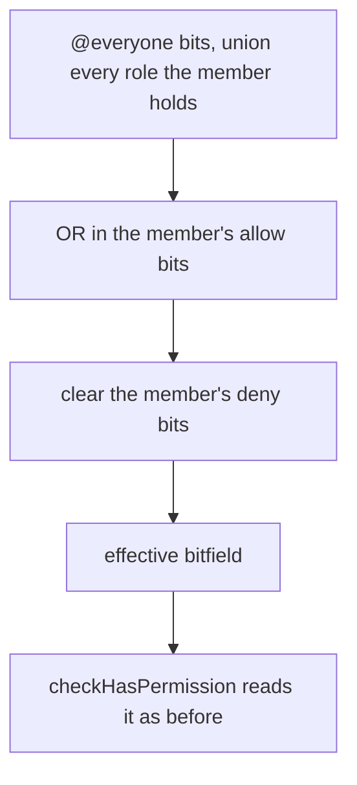

# Member Permission Overrides

A member can be given a room permission their roles do not carry, or have one taken away, without a role being minted to hold it. The override is one row per member per room, keyed by the pair it is about, and it is folded into the member's effective permissions wherever those are read.

## How it works

`roomMemberPermissions` holds `roomId · userId · allow · deny`, unique on the pair. A member with no row is the roles' answer exactly, so nothing needed backfilling.

Each override bitfield names the permissions one state covers. The write path takes three bitfields — `allow`, `deny` and `inherit` — and moves each bit it names into exactly one of the three states:

- a bit in `allow` is set in `allow` and cleared from `deny`;
- a bit in `deny` is set in `deny` and cleared from `allow`;
- a bit in `inherit` is cleared from both, so the roles decide it again.

A bit set in both fields would be a state the model does not have, so the table holds `(allow & deny) = 0` as a `CHECK`, and a write that names a bit in both `allow` and `deny` is refused. A row left with neither field set is removed rather than kept as an empty entry.

The fold happens in `getPermissions`, so `checkHasPermission`, `readMyPermissions` and the client's role store read one answer. The owner and an Administrator are still answered before any row is read: an Administrator bit comes from a role only, and the override bits never include it, so an override can neither grant Administrator nor strip it.

## Writing one

`upsertMemberPermissionOverride` and `deleteMemberPermissionOverride` are gated by `ManageRoles`, and by `assertIsManageable` over the target, which is the same hierarchy check a role assignment goes through. The target must be a member of the room. An upsert may grant only the `allow` bits the actor holds, through `assertCanGrantPermissions`, so `ManageRoles` alone is not a way to grant oneself anything.

Leaving a room deletes the row with the membership, through the composite foreign key's cascade.

## Decisions

- **Overrides do not change a member's top role position.** Position decides hierarchy for role assignments; an override is a statement about permissions, so `getRoomMemberAuthority` is unchanged and the grant check covers what an actor may give.
- **An override never reaches Administrator.** Both the `allow` and `deny` bits exclude it at the write and at the fold, the same rule that keeps an owner from being locked out of their own room.
- **Only the actor's held permissions may be granted.** Discord's rule for a channel entry, and the one `createRole` already applies to a role.
- **Writes are a transaction, and an empty row is deleted.** Clearing a bit can empty both fields, and an empty row would appear in the entry list as a member with nothing to show.

## Not yet built

The Roles panel's entry list, the `Add role or member` picker, the three-state control and the live role events are the parts of the [proposal](/docs/proposals/esbabbler/member-permission-overrides) still open. The procedures above have no caller in the client yet.

## Key files

| File                                                                      | Role                                                               |
| ------------------------------------------------------------------------- | ------------------------------------------------------------------ |
| `packages/db-schema/src/schema/message/roomMemberPermissionsInMessage.ts` | the table and its disjointness `CHECK`                             |
| `packages/db/src/services/room/rbac/getPermissions.ts`                    | folds the member's row into the effective bitfield                 |
| `apps/web/server/services/room/rbac/setMemberPermissionOverride.ts`       | the three-state write and the empty-row removal                    |
| `apps/web/server/trpc/routers/role.ts`                                    | `upsertMemberPermissionOverride`, `deleteMemberPermissionOverride` |
