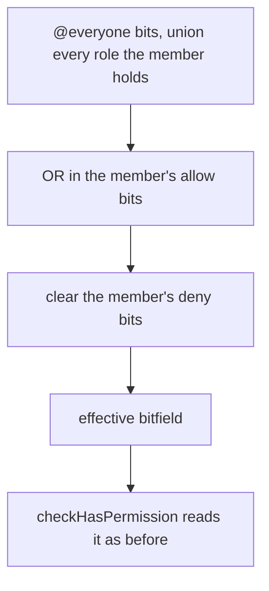

# Member Permission Overrides

A member can be given a room permission their roles do not carry, or have one taken away, without a role being minted to hold it. The override is one row per member per room, keyed by the pair it is about, and it is folded into the member's effective permissions wherever those are read.

## How it works

`roomMemberPermissions` holds `roomId · userId · allow · deny`, unique on the pair. A member with no row is the roles' answer exactly, so nothing needed backfilling.

Each override bitfield names the permissions one state covers. The write path takes three bitfields — `allow`, `deny` and `inherit` — and moves each bit it names into exactly one of the three states:

- a bit in `allow` is set in `allow` and cleared from `deny`;
- a bit in `deny` is set in `deny` and cleared from `allow`;
- a bit in `inherit` is cleared from both, so the roles decide it again.

A bit set in both fields would be a state the model does not have, so the table holds `(allow & deny) = 0` as a `CHECK`, and a write that names a bit in both `allow` and `deny` is refused. A row left with neither field set is removed rather than kept as an empty entry.

The fold happens in `getPermissions`, so `checkHasPermission`, `readMyPermissions` and the client's role store read one answer. The owner and an Administrator are still answered before any row is read: an Administrator bit comes from a role only, and the override bits never include it, so an override can neither grant Administrator nor strip it.

## Writing one

`upsertMemberPermissionOverride` and `deleteMemberPermissionOverride` are gated by `ManageRoles`, and by `assertIsManageable` over the target, which is the same hierarchy check a role assignment goes through. The target must be a member of the room. An upsert may grant only the `allow` bits the actor holds, through `assertCanGrantPermissions`, so `ManageRoles` alone is not a way to grant oneself anything. An upsert returns the state the server left, and a delete leaves both fields zero.

`readMemberPermissionOverrides` lists the room's rows to any member, as `readMemberRoles` does: a role assignment is already public to the room, and an override is the same kind of fact about the same member.

Each write publishes `updateMemberPermissionOverride` on the role event path, carrying the state it left. `onUpdateMemberPermissionOverride` forwards it to every open client of the room, which applies it to its override map; the member whose override changed re-reads their own permissions, since every permission gate reads that bitfield.

Leaving a room deletes the row with the membership, through the composite foreign key's cascade.

## The Roles panel

The Roles settings panel lists roles and members in two groups. A member appears while an override holds them, and while they are being added, which has no row until a first state is set.

- **`Add role or member`** creates a role from the typed name, as before. A member is added from the `Add member` picker, which offers the members the room's list has loaded and opens their entry to set.
- Selecting a role opens the role editor unchanged. Selecting a member opens the member editor: the same categories of permissions, each row a three-state segmented control — `Deny`, `Inherit`, `Allow`. The inherit segment names what the roles give, so `inherit` reads as the concrete answer it resolves to.
- `Remove override` asks first, then deletes the row, and the member falls back to their roles.

The member editor leaves out the Administrator bit, which no override can hold.

## Decisions

- **Overrides do not change a member's top role position.** Position decides hierarchy for role assignments; an override is a statement about permissions, so `getRoomMemberAuthority` is unchanged and the grant check covers what an actor may give.
- **An override never reaches Administrator.** Both the `allow` and `deny` bits exclude it at the write and at the fold, the same rule that keeps an owner from being locked out of their own room.
- **Only the actor's held permissions may be granted.** Discord's rule for a channel entry, and the one `createRole` already applies to a role.
- **Writes are a transaction, and an empty row is deleted.** Clearing a bit can empty both fields, and an empty row would appear in the entry list as a member with nothing to show.
- **Overrides are visible to the room, as role assignments are.** Reads and events take the member procedure, not the permission procedure, because the roles panel's data is already the room's own; a stricter read would hide from members a fact the roles already show them.
- **The `genshin-assets` value in the table's migration is deliberate.** `storage.azureContainer` gained `genshin-assets` in the schema without a migration, and `db:gen` generated it with this table. The migration carries it so the migration chain matches the schema, and the Genshin side does not add it again.

## Key files

| File                                                                                            | Role                                                                  |
| ----------------------------------------------------------------------------------------------- | --------------------------------------------------------------------- |
| `packages/db-schema/src/schema/message/roomMemberPermissionsInMessage.ts`                       | the table and its disjointness `CHECK`                                |
| `packages/db-schema/src/relations/message/roomMemberPermissionsInMessageRelation.ts`            | the room relation the relational read takes                           |
| `packages/db/src/services/room/rbac/getPermissions.ts`                                          | folds the member's row into the effective bitfield                    |
| `apps/web/server/services/room/rbac/setMemberPermissionOverride.ts`                             | the three-state write, the empty-row removal and the state it returns |
| `apps/web/server/trpc/routers/role.ts`                                                          | the upsert, delete and read procedures, and the override event        |
| `apps/web/server/services/role/events/roleEventEmitter.ts`                                      | `updateMemberPermissionOverride`                                      |
| `apps/web/app/store/message/room/role.ts`                                                       | the override map, its reads and writes                                |
| `apps/web/app/composables/message/subscribables/useRoleSubscribables.ts`                        | applies the override event and re-reads the member's own permissions  |
| `apps/web/app/components/Message/Model/Room/Settings/Type/Role/MemberEditor.vue`                | the member editor                                                     |
| `apps/web/app/components/Message/Model/Room/Settings/Type/Role/Permission/OverrideListItem.vue` | the three-state row                                                   |
