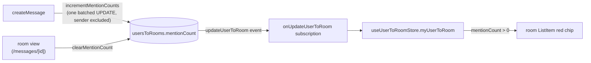

# Mention Badges

Red count chips in the room sidebar for rooms with unread `@mentions` of the current user. Full unread tracking is decided against ([read receipts and unread badges](/docs/esbabbler/rejected/read-receipts-unread-badges)) and mention-only counts are the narrower version that page explicitly allows.

## How it works

A per-user, per-room counter (`usersToRooms.mentionCount`) increments when a message mentioning the user arrives and resets when the user views the room. The room list item renders it as a red chip, taking precedence over the plain unread bold — Discord behaviour.

`createMessage` classifies the message's mentions (`classifyMentions`) and bumps every targeted member's counter in a single batched UPDATE (`incrementMentionCounts`): direct and role mentions badge unconditionally; `@everyone`/`@here` follow each member's notification rules (`Never` opts out; `@here` requires online, with no status row treated as online — the same broadcast targeting as [push notifications](/docs/esbabbler/push-notifications)); the sender is always excluded. The increment runs best-effort after the Table write — a failed increment loses one badge count, never a message, so there is no retry.

### Each consumer classifies for itself

Badging and [push notifications](/docs/esbabbler/push-notifications) both resolve the same three mention kinds, and `createMessage` invokes them back to back — so both call `classifyMentions` on the same body. That repetition is deliberate: the classification is a regex pass over the message text with no I/O, and the one query behind it (`getRoleMemberIds`) is skipped entirely unless the message actually mentions a role.

Threading a precomputed `ClassifiedMentions` through instead would buy that back at a real cost. `getMessageRecipientUserIds` is also called from outside the send path, where no classification has happened, so the parameter would have to be optional — and an optional precomputed input is a parameter a caller can pass from the _wrong_ message, turning a self-contained function into one whose correctness depends on its caller. What the two functions share is the resolution rule, and that is already shared: `getMentionConditions` plus `createMentionConditionBuilders` hold one copy of it, and the badge and notification variants differ only in the condition a resolved set of user ids becomes.

Counts arrive with `readMyUsersToRooms` at startup (already loaded for every room — see [nicknames](/docs/esbabbler/nicknames)) and update live through the `onUpdateUserToRoom` subscription: both the increment and the clear emit `updateUserToRoom` per affected row, so the chip appears and disappears with no new subscription.

## Data model

`usersToRooms.mentionCount` — integer, NOT NULL DEFAULT 0, with a `>= 0` check. The counter is the only state — there is no per-message read tracking anywhere, keeping the rejected read-receipt semantics out.

## Procedures

| Procedure                       | Auth   | Purpose                                                                |
| ------------------------------- | ------ | ---------------------------------------------------------------------- |
| `clearMentionCount({ roomId })` | member | reset own count on room view; idempotent, emits only when a count fell |

(The increment happens inside `createMessage`; there is no public write endpoint for it.)

## Key files

| File                                                           | Role                                                            |
| -------------------------------------------------------------- | --------------------------------------------------------------- |
| `packages/db-schema/src/schema/usersToRoomsInMessage.ts`       | `mentionCount` column + check                                   |
| `packages/db/src/services/message/incrementMentionCounts.ts`   | batched increment (`MentionBadgeConditionBuilderMap` targeting) |
| `packages/app/server/services/message/createUserMessage.ts`    | best-effort increment + `updateUserToRoom` fan-out              |
| `packages/app/server/trpc/routers/userToRoom.ts`               | `clearMentionCount`                                             |
| `packages/app/app/pages/messages/[id]/index.vue`               | clears the count on room view                                   |
| `packages/app/app/components/Message/Model/Room/List/Item.vue` | red count chip                                                  |

## Notes

Mentions arriving while the room is being viewed are suppressed in the sidebar (`isActive`), matching the unread-bold behaviour beside them; the stored count still clears on the next room view.
