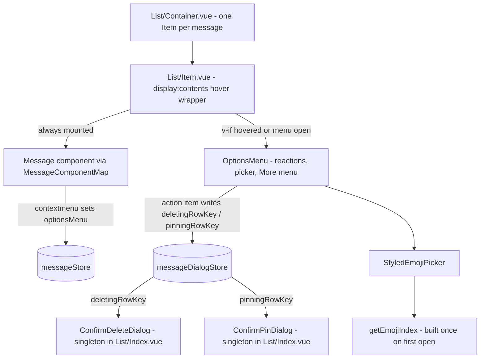
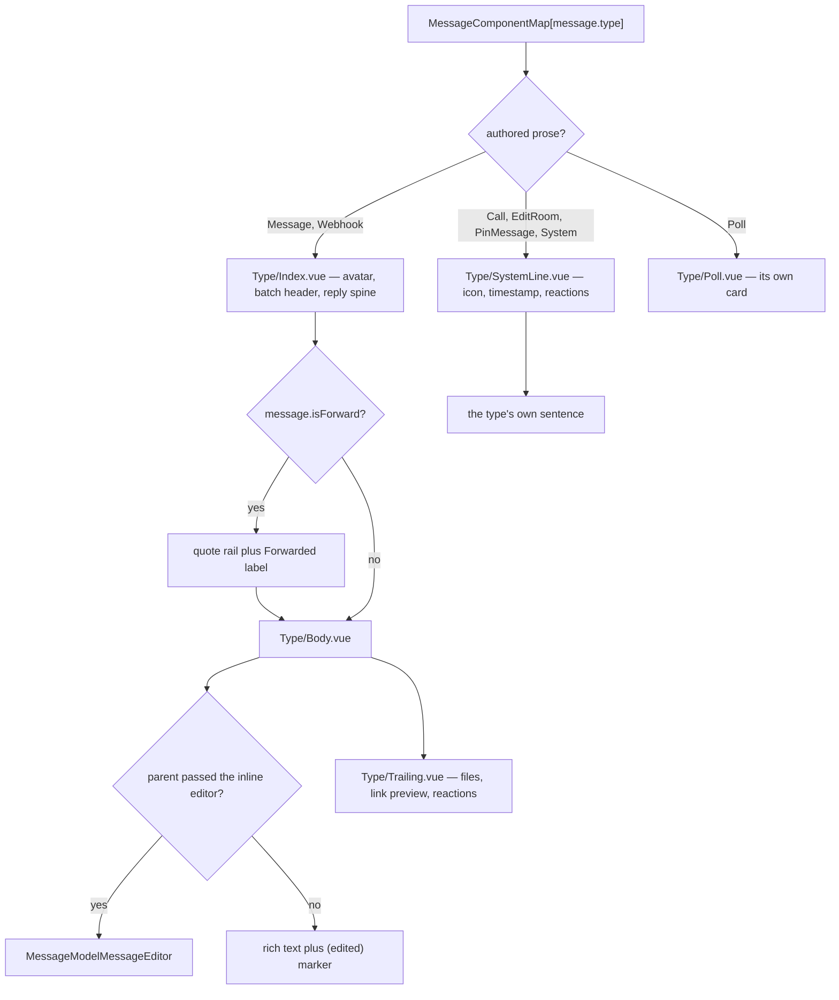

# Message List Rendering

The message list renders every loaded message as live DOM (no virtualization yet), so anything mounted per item multiplies by the page size and every pagination batch. The architecture therefore keeps each item down to its message component plus a hover wrapper, and everything interactive-but-occasional — the hover options menu, the confirm dialogs, the emoji index — exists at most once for the whole list.

## How it works

`MessageModelMessageListContainer` renders one `MessageModelMessageListItem` per message. Each item is wrapped in a `display: contents` div so the message component and its overlapping options menu stay direct flex children of the column-reversed `v-list` while sharing one `mouseenter`/`mouseleave` region — hovering either keeps the toolbar alive, with no unmount race when the pointer crosses between them.

The options menu (reaction buttons, emoji picker, edit/reply/forward buttons, the "More" context menu) is mounted with `v-if` only for the item that is hovered, the context-menu target (`messageStore.optionsMenu`), or has one of its menus open — so exactly one instance of that Vuetify-overlay-heavy subtree exists at a time. Right-clicking a message sets `optionsMenu = { rowKey, target: [x, y] }`, which both mounts the toolbar on that item and opens its "More" menu at the pointer.

The confirm dialogs follow the repo-wide [singleton dialog standard](/docs/architecture/singleton-dialogs): `MessageModelMessageList` mounts one `ConfirmDeleteDialog` and one `ConfirmPinDialog`, driven by the message dialog store's `deletingRowKey` / `pinningRowKey` targets. Action items (`useMessageActionItems`) write those store refs directly instead of threading emit chains through the component tree.

## The message component family

`MessageComponentMap` picks a component per `MessageType`, and those components are deliberately thin: each one writes only the sentence or body that is unique to its type and inherits everything else from a shared shell. There are two shells, and a new message type joins one of them rather than assembling `Type/ListItem` again.

`MessageModelMessageTypeBody` is the body of an authored message — the rendered rich text, the `(edited)` marker beside it, the attachment/link-preview/reaction trailing row, and the default slot the inline editor arrives through. `MessageModelMessageType` renders it for both an ordinary and a forwarded message: a forward adds only the quote rail and its **Forwarded** label, then hands the same body component the parent's slot. Re-implementing the body inside the forward branch is what silently drops the edited marker and makes a forwarded message uneditable, so the branch owns the rail and nothing else.

`MessageModelMessageTypeSystemLine` is the shell for the message types nobody authored as prose — call, room edit, pin and system notices. It owns the leading icon, the timestamp and the reaction row, leaving each type one slot of sentence. Secondary text in those sentences uses `op-medium-emphasis`, which dims the inherited colour by the Vuetify emphasis variable and therefore follows the theme; a fixed grey does not, because the palette UnoCSS is configured with holds only the theme colours.

The emoji index follows the same once-for-the-whole-list rule from the other direction: `getEmojiIndex` builds its maps on first use rather than at import, and the picker's overlay only renders its content once opened, so a list of reactions never constructs a search index and never builds one per picker instance. See [emoji](/docs/esbabbler/emoji).

## Key files

| File                                                                        | Role                                                          |
| --------------------------------------------------------------------------- | ------------------------------------------------------------- |
| `packages/app/app/components/Message/Model/Message/List/Item.vue`           | Hover wrapper, lazy options menu mount, context-menu handling |
| `packages/app/app/components/Message/Model/Message/Type/Body.vue`           | Shared authored-message body, edited marker, editor slot      |
| `packages/app/app/components/Message/Model/Message/Type/SystemLine.vue`     | Shared shell for the unauthored message lines                 |
| `packages/app/app/components/Message/Model/Message/OptionsMenu/Index.vue`   | Options toolbar (reactions, picker, items, More menu)         |
| `packages/app/app/components/Message/Model/Message/ConfirmDeleteDialog.vue` | Store-driven delete dialog singleton                          |
| `packages/app/app/components/Message/Model/Message/ConfirmPinDialog.vue`    | Store-driven pin dialog singleton                             |
| `packages/app/app/composables/message/message/useMessageActionItems.ts`     | Action items writing store targets directly                   |
| `packages/app/app/services/message/emoji/getEmojiIndex.ts`                  | Shared emoji index, built once on first use                   |
| `packages/app/app/store/message/index.ts`                                   | `optionsMenu`, `editingRowKey`                                |
| `packages/app/app/store/message/dialog.ts`                                  | Dialog targets: `deletingRowKey`, `pinningRowKey`             |

## Notes

- One options-menu store write must never fan out re-renders: per-item computeds (`isDisabled`, `isContextMenuTarget`) only propagate when their own value changes, so untargeted items stay untouched.
- Where the list is anchored — present detection, jump-to-present, bidirectional paging — is
  [message list scrolling](/docs/esbabbler/message-list-scrolling).
- List virtualization is the remaining lever if very long scrollback sessions become a problem.
