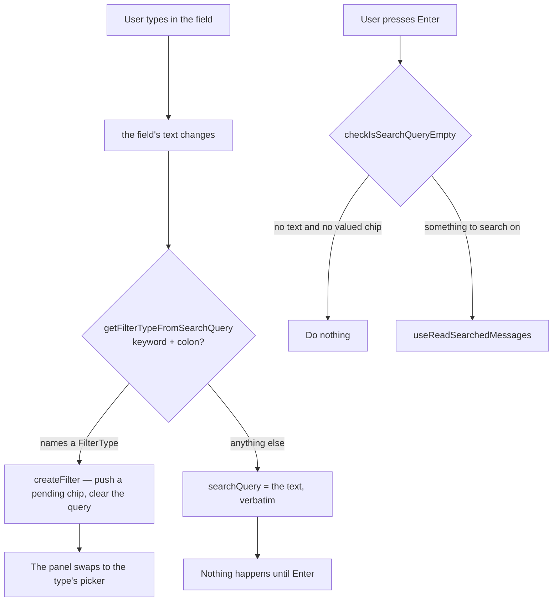
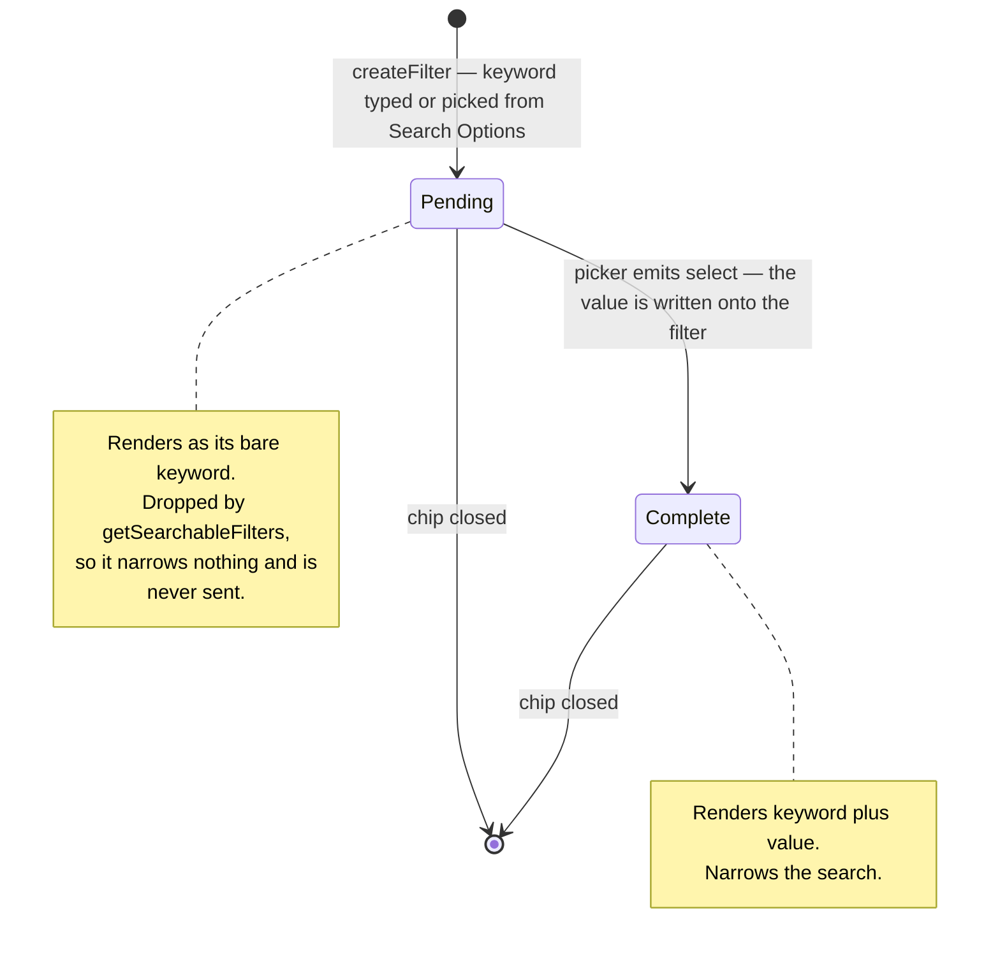
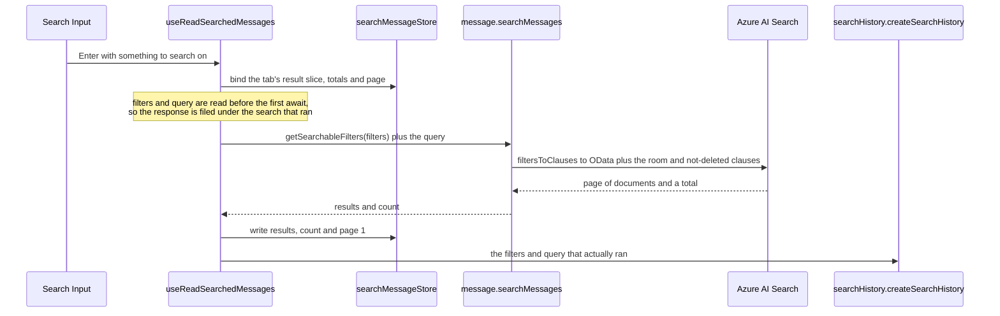

# Message search

The right sidebar searches a room's messages through the Azure AI Search index. One field carries two different things at once: **filter chips** that narrow structurally (`from:`, `has:`, `before:`) and **free text** that is matched against message content. This page is the ground truth for how a keystroke becomes one or the other, and for what a search is allowed to send.

Unlike every other search surface in the app, this one is explicit-submit — nothing fires per keystroke, so it sits outside the [`useAutoSearch` stack](/docs/architecture/search) by design.

## How typed text becomes a chip or a query

There is exactly one rule, and `getFilterTypeFromSearchQuery` is the only place that decides it: **a word becomes a chip when the word names a `FilterType` and is followed by a colon.** Everything else — including a word that ends in a colon but names nothing — stays search text and is searched for literally.

**The colon is the trigger, and the only one.** The rule runs on every change of the field's text, so the chip appears the instant the colon is typed, the way Discord does. Enter is therefore never a second chance to convert: by the time it is pressed, whatever is in the field is search text by definition, and Enter's only job is to search on it.

Enter never writes typed text into a chip either. No typed text can be the userId, room id, media kind, date or boolean a filter needs, so filling a chip from the field produces a filter the input schema rejects, one `filtersToClauses` throws on, or one that silently matches nothing. **Only a picker gives a filter its value.**

## The field and its panel

The field is the library's token field (`UiTokenField`): the chips sit before the text, each with its own remove button, and Backspace in empty text takes the last chip back. **The query outlives focus** because the text lives in the store and the field only reflects it — nothing clears it but the reader, the clear button or a keyword becoming a chip.

The panel hangs under the whole field at its width and opens as the field is focused. It shows the pending chip's picker while one waits for a value, and otherwise the search options and the room's history. Focus may move into it — a picker's calendar is walked by its own keys — and the panel closes only once focus is in neither the field nor the panel; Escape in the panel closes it and puts the reader back in the text, and Escape in the text closes the panel and then leaves the field.

## A chip's lifecycle

`createFilter` pushes `{ type, value: "" }`. That `""` is the absent-value sentinel: the chip exists, shows its keyword, and is waiting. `SearchFilterComponentMap` maps the type to the picker that fills it — members for `from:`/`mentions:`, rooms for `in:`, the media kinds for `has:`, a date picker for `before:`/`during:`/`after:`, true/false for `pinned:`.

The pending test is `value === ""` — **never falsiness**. `pinned: false` is a value the user chose, and reading it as absent leaves the chip blank with its picker still open.

Only the last chip is ever pending, because a chip is created by typing its keyword and immediately needs a value; that is what `activeSelectedFilter` means, and it is what the menu keys its picker off.

## What a search sends

Everything that searches goes through `getSearchableFilters`, on both sides of the wire. It drops pending chips, because they have no value to narrow on, and it drops exact repeats, because a second identical filter narrows nothing the first did not. `checkIsSearchQueryEmpty` asks the same question, so a pending chip on its own is not a search.

**Filters are not unique by type.** Azure Search takes one clause per filter, so two `from:` chips or two `has:` chips narrow together — `filtersToClauses` groups by type and emits a clause per value (`mentions:` being the one that collects its values into a single `arrayContains`). The wire and row schemas therefore constrain the array's length, not its uniqueness by type.

A history row therefore records what was searched, not what was on screen — clicking one restores exactly that combination, which is why a pending chip must never reach it.

Browsing a room's attachments is `has: file` and nothing more — a filter like every other narrowing, rather than a second surface asking the same question with its own result slice to keep apart. What those attachments are is [file and media](/docs/esbabbler/file-media)'s subject.

Results, totals and the current page are all keyed by room, so a response that lands after the user has moved on is filed under the room it was issued for rather than shown under the new one.

## Key files

| File                                                          | Role                                                                                                            |
| ------------------------------------------------------------- | --------------------------------------------------------------------------------------------------------------- |
| `app/components/Message/RightSideBar/Search/Input.vue`        | The token field — the colon that converts, the Enter that searches, and the panel's picker, options and history |
| `app/components/Ui/TokenField.vue`                            | The chips before the text, and the panel under the field                                                        |
| `app/services/message/filter/getFilterTypeFromSearchQuery.ts` | The keyword-plus-colon rule, and the only place it is decided                                                   |
| `app/services/message/filter/SearchFilterComponentMap.ts`     | Filter type to the picker that gives it a value                                                                 |
| `app/services/message/filter/getFilterDisplayValue.ts`        | What a chip reads as, pending or complete                                                                       |
| `shared/services/message/checkIsFilterPending.ts`             | The `""` sentinel test — the one definition of "waiting for a value"                                            |
| `shared/services/message/getSearchableFilters.ts`             | The filters a search runs with — pending chips and exact repeats dropped                                        |
| `shared/services/message/checkIsSearchQueryEmpty.ts`          | Whether there is anything to search on at all                                                                   |
| `app/composables/message/search/useReadSearchedMessages.ts`   | The explicit-submit read, and the history row it earns                                                          |
| `app/store/message/search/index.ts`                           | Per-room query, chips, results, totals and page                                                                 |
| `server/services/message/searchMessages.ts`                   | Clause assembly and the paged index read                                                                        |
| `packages/db/src/services/azure/search/filtersToClauses.ts`   | Each filter type's OData clause                                                                                 |
