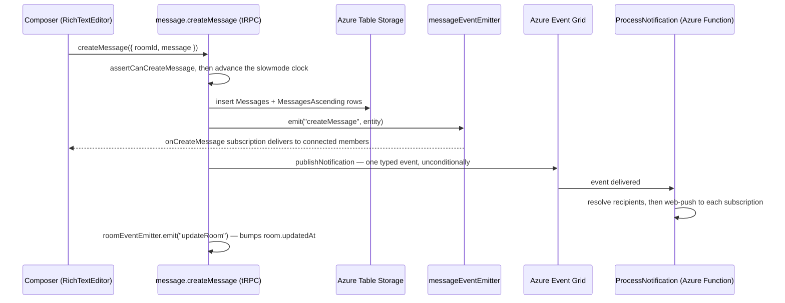
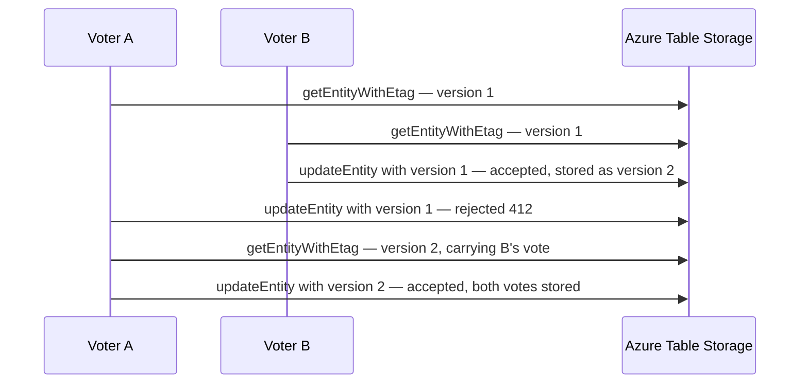

# Messaging

Messages are high-volume, append-heavy, and time-ordered, so they live in Azure Table Storage rather than Postgres. Everything relational around them (rooms, membership, roles) stays in Postgres.

## How it works

Messages are stored in `AzureTable.Messages` with `partitionKey = roomId` and `rowKey = reverseTickedTimestamp` — a reverse-ticked timestamp is `MAX_TICKS - now`, so lexicographic row order is newest-first, which matches how a chat list paginates. `AzureTable.MessagesAscending` is a companion index table keyed by the original timestamp so messages can be read in both directions (thread view, jump-to-message). `AzureTable.MessagesMetadata` holds per-message companion data.

Sending a message flows through one server service, `createUserMessage`, which writes storage, notifies live subscribers, and kicks off push delivery:

Real-time delivery is two-layered:

- **In-process** — `messageEventEmitter` / `roomEventEmitter` drive tRPC subscriptions (`onCreateMessage`, `onUpdateMessage`, `onDeleteMessage`, `onCreateTyping`). The app runs a single Node process, so this is sufficient (see [cross-process event bridge](/docs/esbabbler/deferred/cross-process-event-bridge)).
- **Azure Web PubSub** — used for inbound webhook message delivery; clients get a scoped access URL via `generateWebPubSubClientAccessUrl`.

Push notification filtering and delivery detail lives in [push notifications](/docs/esbabbler/push-notifications).

## Conditional writes

A message is stored as one blob, so a procedure that changes part of it reads the whole entity and writes the whole entity back. Two of those running at once both compute their result from the same stored version, and the later write echoes back a body that never saw the earlier one — the earlier change is erased with nothing surfaced to either caller. Poll voting is where that is routine rather than rare: every member of the room writes into the same poll body.

`getMessageProcedure` therefore reads through `getEntityWithEtag` and carries the version it saw on the procedure context as `messageEtag`, alongside `messageClient` and `messageEntity`. The read already happens, so the version costs no extra round trip and any message procedure can make its write conditional. `votePoll` passes it as the `etag` option on `updateEntity`, so the write lands only if nothing else has written since.

A rejected write means the vote is still valid and only the version it was computed against is stale, so it is re-read and re-applied rather than surfaced. `votePoll` does not own that loop: it hands `getUpdateEntity` and `writeEntity` to the shared `updateEntityConditionally` helper ([conditional writes](/docs/architecture/conditional-writes)), which owns the re-read, the retry and the bound. The bound is private to the helper and shared by every conditional write in the repo, so there is no poll-specific retry budget to raise — changing it changes `deleteFile`, `deleteLinkPreviewResponse` and `unpinMessage` with it. A vote that still cannot land is refused with `CONFLICT` so the voter sends it again instead of being shown a vote that never counted, and a failed write whose re-read finds the version unchanged was never a lost race, so that error propagates as itself rather than being retried into a `CONFLICT`.

The stored poll body is parsed and re-serialized through `pollMessageContentSchema` (`shared/models/message/poll/`) — the one schema that owns a poll's shape, and the same one `MessageModelMessageTypePoll` reads it back with. A vote sends only the option id, so nothing else in the body may change across it: a narrower server-side copy of that schema strips every field it does not name, and the first vote on a poll would take its option labels with it.

## Message types

`MessageType` (in `@esposter/db-schema`) discriminates rendering and behaviour: `Message`, `Poll`, `Call` (call started / call-end duration system message), `EditRoom`, `PinMessage`, `System` (join/leave), and `Webhook`. Adding a type requires updating `MessageTypeEntityMap` (type → entity class), `MessageComponentMap` (type → Vue rendering component), and `MessageTypeOperationPermissionMap` (type → the operations it supports and who may perform each).

`MessageTypeOperationPermissionMap` is the one source of truth for what may be done to a message, and it is declared `as const satisfies Record<MessageType, …>`, so it is exhaustive — a new type does not compile until it declares its operations. Presence answers whether the type supports the operation at all: `Call`, `EditRoom`, `PinMessage` and `System` messages are written by the server on the room's behalf and support none, so update, delete and pin on them are a `BAD_REQUEST` for every caller, including one holding `ManageMessages`. The value answers which of the callers who could perform it actually may — `Author` means the author _or_ a member with `ManageMessages`, `AnyMember` means the membership check already settled it, and `ManageMessages` means that permission alone. A webhook message has no user author, so all of its operations resolve to `ManageMessages`.

Mentions are stored as HTML: the TipTap mention suggestion inserts `` nodes, which the server later parses for notification targeting and the client resolves to display names (see [nicknames](/docs/esbabbler/nicknames)).

All three composer suggestion popovers — mentions, emoji and [slash commands](/docs/esbabbler/slash-commands) — render through one `MessageModelMessageSuggestionList` surface, so the composer's chrome is the same whichever trigger opened it. It owns the card, the group title from `getSuggestionListTitle`, and the keyboard-navigated `StyledList`; each popover supplies its own rows and its own width as a passthrough attribute, and nothing else.

## Procedures

The `message` router is flat-merged at the tRPC root, with `emoji`, `moderation`, and `scheduledMessageJob` nested under it. Every row marked _author_ below is a `getMessageProcedure` built on the operation it guards, so its real answer comes from `MessageTypeOperationPermissionMap` as described above — author or `ManageMessages` on a `Message`/`Poll`, `ManageMessages` on a `Webhook`, refused outright on the server-written types. Highlights:

| Procedure                         | Auth   | Purpose                                             |
| --------------------------------- | ------ | --------------------------------------------------- |
| `createMessage`                   | member | Write message, emit, trigger push                   |
| `updateMessage` / `deleteMessage` | author | Edit/delete own messages (message-scoped procedure) |
| `forwardMessage`                  | member | Forward into another room                           |
| `pinMessage` / `unpinMessage`     | author | Room-wide pins (message-scoped, `Pin` operation)    |
| `votePoll`                        | member | Cast/withdraw a poll vote via a conditional write   |
| `readMessages` / `readThread`     | member | Cursor pagination / thread view                     |
| `searchMessages`                  | member | Filtered search via the Azure AI Search index       |
| `readMySentMessages`              | authed | Cross-room sent list from the Search index          |
| `onCreateMessage` etc.            | member | Live subscriptions                                  |
| `createTyping` / `onCreateTyping` | member | Typing indicators                                   |
| `generate*FileSas*`               | member | SAS-based file upload/download URLs                 |

## Key files

| File                                                                        | Role                                                |
| --------------------------------------------------------------------------- | --------------------------------------------------- |
| `packages/app/server/trpc/routers/message/index.ts`                         | Message router (procedures above)                   |
| `packages/app/server/services/message/createUserMessage.ts`                 | Send pipeline: table write, emit, EventGrid publish |
| `packages/db-schema/src/models/azure/table/AzureTable.ts`                   | Table name enum (Messages, MessagesAscending, …)    |
| `packages/db-schema/src/models/message/MessageType.ts`                      | Message type discriminator                          |
| `packages/app/shared/services/message/MessageTypeOperationPermissionMap.ts` | Which operations each type supports, and for whom   |
| `packages/app/server/services/message/events/`                              | `messageEventEmitter` and friends                   |

## Notes

- Never bypass `createUserMessage` when adding a message-producing path — timeout, read-only, slowmode, and word-filter checks happen there and in the member procedures. `forwardMessage` is the one exception: it fans out over N rooms with a per-room `assertCanCreateMessage` and cloned files, so it reproduces the pipeline instead of calling it. Any _new_ path goes through `createUserMessage`.
- **Send order is fixed on every send path**, following [persist then notify](/docs/architecture/persist-then-notify): `assertCanCreateMessage` → advance the slowmode clock (`updateUserToRoom`) → Table write → `messageEventEmitter.emit` → best-effort side effects. The clock advances _before_ the write because it is the value the next send is checked against — a send that skips it keeps comparing against a stale `lastMessageAt` and slowmode silently never applies, so it fails closed on a failed write rather than open on a failed update.
- Azure Table has no joins: anything that must be queried relationally (e.g. who to notify) is resolved against Postgres at send time.
- **Single owner per store transition.** The subscription handler owns every remote-visible state change: `onCreateMessage`/`onUpdateMessage`/`onDeleteMessage` write the message list through `storeCreateMessage`/`storeUpdateMessage`/`storeDeleteMessage`, and the same rule holds across the room, userToRoom, emoji, pin, call, and member stores. A caller-side store mutation is kept only when it is a genuine optimistic update with revert (the `useMutation` `applyOptimistic` blocks, and the `isLoading` optimistic send) or when the emit excludes the actor's own device (`getRoomEventSubscription`, `checkIsSameDevice`) so the subscription can never reach the caller. No store applies a plain, non-optimistic mutation that a caller-reaching subscription would double-apply.
- **Idempotent by composite key.** Because the subscription echoes back to the sender for `isSendToSelf` sends (forward, pin) and on transport reconnect, `storeCreateMessage` dedups on `[partitionKey, rowKey]` via `createOperationData`, and update/delete handlers are set/filter operations that re-apply cleanly. Re-emitting an already-applied event is a no-op — locked in by `store/message/data.test.ts` and `services/shared/createOperationData.test.ts`.
- **Ascending reads re-project onto the index order.** `readMessages({ order: Asc })` reads oldest-first ids from `MessagesAscending`, then re-orders the joined `Messages` rows onto that sequence rather than trusting the Messages table's newest-first scan order — otherwise an ascending page comes back reversed.
- **An ascending page skips an index row the join cannot match, and always advances its cursor.** `createMessage` writes `MessagesAscending` first (so a rejection always means nothing is readable, which is what every caller's rollback assumes), and the two tables cannot be written atomically — so the index can briefly name a message the join does not find. **The page must not hold its cursor on that row.** Two reasons, either one sufficient: a soft delete produces the identical shape (`deleteMessage` stamps `deletedAt`, which the join filters, and leaves the index row), so an unmatched row says nothing about whether an entity is coming; and every caller advances only by `nextCursor` while `hasMore` is set — `onCreateMessage`'s catch-up loop and the newer-messages waypoint both re-issue on the returned cursor — so echoing the incoming cursor is a hot loop, not a wait. The cost is paid on the write side instead: `createMessage` deletes the index row when the entity write fails, bounding the unmatched window to one in-flight write. A page landing inside that window skips the message; the sender's own `onCreateMessage` subscription delivers it, and `storeCreateMessage` dedupes by composite key. **That fallback is why `onCreateMessage` attaches its emitter listener before it starts the catch-up, not after**: `on` queues what it receives until the loop consumes it, so a message committed while the catch-up is still paging is held rather than missed — attached afterwards, the one delivery path for a skipped message is the one thing not listening while the skip happens. The overlap can deliver a message twice, which the composite-key dedupe already absorbs.
