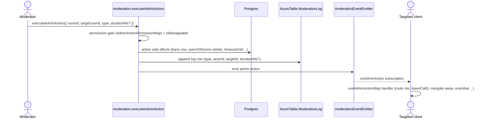

# Moderation

One unified admin action system: every moderation operation is an `AdminActionType` executed through a single procedure, gated behind a specific `RoomPermission` bit (see [RBAC](/docs/esbabbler/rbac)), hierarchy-checked with `isManageable`, logged to an append-only audit table, and delivered live to the targeted user.

**One procedure, and only one.** Everything that removes, mutes, times out or warns a member goes through `executeAdminAction` — which is why the permission is looked up per action type rather than fixed by the procedure. A second route to the same effect would be a second place to hold the hierarchy check, the audit row and the departure announcement.

## How it works

### Action behaviours

| Action                      | Permission       | Behaviour                                                                                                                                                                 |
| :-------------------------- | :--------------- | :------------------------------------------------------------------------------------------------------------------------------------------------------------------------ |
| `ForceMute` / `ForceUnmute` | `MuteMembers`    | targeted client's call store hook toggles local microphone + force-muted state                                                                                            |
| `StopScreenShare`           | `MuteMembers`    | server revokes screen-share publish sources via the LiveKit Admin API and mutes active screen-share tracks; targeted client also calls `setScreenShare(false)` + snackbar |
| `KickFromCall`              | `MoveMembers`    | targeted client calls `leaveCall()` through `AdminActionHookMap`; snackbar                                                                                                |
| `KickFromRoom`              | `KickMembers`    | server deletes the `usersToRooms` row and announces the departure; targeted client navigates away                                                                         |
| `TimeoutUser`               | `KickMembers`    | `durationMs` required; sets `timeoutUntil` on `usersToRooms`; all message-producing mutations reject while `timeoutUntil > now()`                                         |
| `CreateBan`                 | `BanMembers`     | permanent; deletes `usersToRooms` and announces the departure, inserts into `bans`; join/invite flows reject banned users                                                 |
| `SoftBan`                   | `BanMembers`     | ban + remove from room + mark the user's visible messages deleted                                                                                                         |
| `Warn`                      | `ManageMessages` | records and emits the action; targeted client shows a warning notification                                                                                                |

### A removal is a departure

Kick, ban and soft ban all delete a membership row, and a deleted membership row that nobody is told about leaves every other client rendering a member the room no longer has. So each of them ends in the same announcement a voluntary leave makes — the `leaveRoom` event every member list prunes from, and the system line naming who went — through one `announceRoomMemberRemoval`, best-effort after the removal has committed ([persist then notify](/docs/architecture/persist-then-notify)).

**Nobody moderates themselves.** The hierarchy comparison cannot express it: an actor and a target at the same position fail the strict comparison, but a room owner is above every rule it knows and would pass against their own row. The self-target rejection therefore sits in front of the comparison rather than inside it, and a direct message is rejected in front of both — a pair with no roles has no moderators, and blocking is what it has instead.

### Word filter

Rooms can define filtered words (`room.filter` router, `roomFiltersInMessage`). The word filter is the last rule in `getMessageCreationRejection`, the shared gate every message-producing path decides with — alongside the timeout, read-only, and slowmode checks. It reports the match; the caller (`assertCanCreateMessage`) applies the configured action and rejects. Every rule rejects with the sentence it owns, from one map beside that caller — the sender is shown the message text, so a bare code would tell them neither what stopped the send nor whether waiting helps. Slowmode is the one that answers yes to that second question, which is why it alone rejects as a rate limit.

## Data model

The moderation log is an append-only Azure Table (`AzureTable.ModerationLog`): `partitionKey = roomId`, `rowKey = reverseTickedTimestamp`, fields `type`, `actorUserId`, `targetUserId`, `durationMs?`. It is surfaced in the room settings **Audit Log** tab (behind `ManageRoom`), with a filter bar over action type, actor, and target — the filters become extra `$filter` clauses on the partition query (a partition scan, fine at room-log scale), so filtered pagination stays stateless through the same cursor. The empty state distinguishes "no entries" from "no matches". Bans are relational (`bans` table in Postgres: `roomId`, `userId`, `bannedByUserId`).

The **Bans** tab searches by the banned user's name, over the join that already renders the row, so the predicate costs nothing beyond the `ilike`. The ban reason is deliberately not matched: it is free text a moderator wrote, searching it makes the panel feel like a log search, and the want the tab serves is whether a person is banned — which is a name. An emptied field lists the room's bans again rather than leaving the last term's rows on screen, because the empty query is issued as a query rather than treated as a reset, and paging carries the term with the cursor so a ban placed mid-scroll cannot appear in a page of a search it does not match.

## Procedures

`moderation` router (`server/trpc/routers/message/moderation.ts`):

| Procedure                                                                   | Auth (permission)           | Purpose                                             |
| :-------------------------------------------------------------------------- | :-------------------------- | :-------------------------------------------------- |
| `executeAdminAction({ roomId, targetUserId, type, durationMs? })`           | per-action gate + hierarchy | Execute any admin action                            |
| `onAdminAction({ roomId })`                                                 | member                      | Subscription; targeted `userId` receives the action |
| `readBans({ roomId, cursor, filter, limit })`                               | `BanMembers`                | Cursor-paginated ban list, searchable by name       |
| `deleteBan({ roomId, userId })`                                             | `BanMembers`                | Unban                                               |
| `readModerationLog({ roomId, cursor, type?, actorUserId?, targetUserId? })` | `ManageRoom`                | Cursor-paginated audit log, optionally filtered     |

## Key files

| File                                                                                   | Role                              |
| :------------------------------------------------------------------------------------- | :-------------------------------- |
| `packages/db-schema/src/models/message/AdminActionType.ts`                             | action type enum                  |
| `packages/app/server/trpc/routers/message/moderation.ts`                               | moderation router                 |
| `packages/app/server/services/message/moderation/AdminActionPermissionMap.ts`          | action → required permission      |
| `packages/app/server/services/room/announceRoomMemberRemoval.ts`                       | the departure event + system line |
| `packages/app/shared/models/db/moderation/ExecuteAdminActionInput.ts`                  | discriminated union input         |
| `packages/app/app/composables/message/moderation/useAdminActionMap.ts`                 | client-side per-action handlers   |
| `packages/db/src/services/message/moderation/getMessageCreationRejection.ts`           | shared message-creation gate      |
| `packages/app/server/services/message/moderation/assertCanCreateMessage.ts`            | tRPC face — applies + rejects     |
| `packages/app/server/services/message/moderation/MessageCreationRejectionReasonMap.ts` | what each rule tells the sender   |
| `packages/app/server/trpc/routers/room/filter.ts`                                      | word filter CRUD                  |

## Notes

Adding a new action type touches five places (kept in lockstep by types): the `AdminActionType` enum, the `ExecuteAdminActionInput` discriminated union arm, `AdminActionPermissionMap`, the `useAdminActionMap` client handler, and the icon/color/label maps in `app/services/message/moderation/`.
