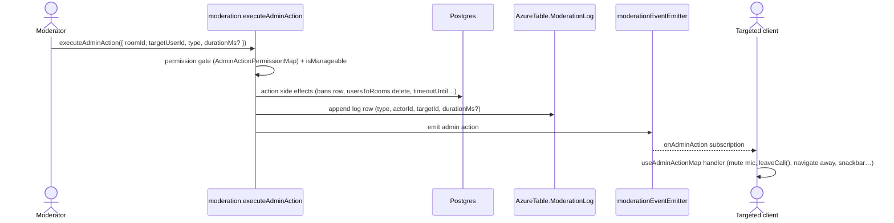

# Moderation

One unified admin action system: every moderation operation is an `AdminActionType` executed through a single procedure, gated behind a specific `RoomPermission` bit (see [RBAC](/docs/esbabbler/rbac)), hierarchy-checked with `isManageable`, logged to an append-only audit table, and delivered live to the targeted user.

**One procedure, and only one.** Everything that removes, mutes, times out or warns a member goes through `executeAdminAction` — which is why the permission is looked up per action type rather than fixed by the procedure. A second route to the same effect would be a second place to hold the hierarchy check, the audit row and the departure announcement.

## How it works

```mermaid
sequenceDiagram
    actor Mod as Moderator
    participant R as moderation.executeAdminAction
    participant PG as Postgres
    participant AT as AzureTable.ModerationLog
    participant E as moderationEventEmitter
    actor T as Targeted client

    Mod->>R: executeAdminAction({ roomId, targetUserId, type, durationMs? })
    R->>R: permission gate (AdminActionPermissionMap) + isManageable
    R->>PG: action side effects (bans row, usersToRooms delete, timeoutUntil…)
    R->>AT: append log row (type, actorId, targetId, durationMs?)
    R->>E: emit admin action
    E-->>T: onAdminAction subscription
    T->>T: useAdminActionMap handler (mute mic, leaveCall(), navigate away, snackbar…)
```

### Action behaviours

| Action                      | Permission       | Behaviour                                                                                                                                                                                                                            |
| :-------------------------- | :--------------- | :----------------------------------------------------------------------------------------------------------------------------------------------------------------------------------------------------------------------------------- |
| `ForceMute` / `ForceUnmute` | `MuteMembers`    | server revokes (or restores) the microphone publish source via the LiveKit Admin API and mutes the live microphone track; targeted client also toggles its microphone + force-muted state, only when the action's room is the call's |
| `StopScreenShare`           | `MuteMembers`    | server revokes screen-share publish sources via the LiveKit Admin API and mutes active screen-share tracks; targeted client also calls `setScreenShare(false)` + snackbar                                                            |
| `KickFromCall`              | `MoveMembers`    | server takes the target out of every call in the room and disconnects them at the SFU; targeted client also calls `leaveCall()`; snackbar                                                                                            |
| `KickFromRoom`              | `KickMembers`    | server deletes the `usersToRooms` row, announces the departure and takes the target out of the room's calls; targeted client navigates away                                                                                          |
| `TimeoutUser`               | `KickMembers`    | `durationMs` required; sets `timeoutUntil` on `usersToRooms` and takes the target out of the room's calls, which refuse them until it ends; all message-producing mutations reject while `timeoutUntil > now()`                      |
| `CreateBan`                 | `BanMembers`     | permanent; deletes `usersToRooms`, announces the departure and takes the target out of the room's calls, inserts into `bans`; join/invite flows reject banned users                                                                  |
| `SoftBan`                   | `BanMembers`     | ban + remove from room and its calls + mark the user's visible messages deleted                                                                                                                                                      |
| `Warn`                      | `ManageMessages` | records and emits the action; targeted client shows a warning notification                                                                                                                                                           |

**The server enforces every call action; the client's own reaction is a courtesy.** A targeted client that ignored the event would otherwise stay connected, talking or presenting. A removal from a call runs the same `leaveCallAsParticipant` every departure does and then disconnects the connection at the SFU (`evictRoomCallParticipants`), and it reaches every call the room runs, its own and each thread's. LiveKit lets a disconnected participant rejoin on the token it still holds, so the `participant_joined` webhook asks the room's door again (`checkIsCallConnectionAdmitted`) and drops a connection whose membership is gone or timed out — `joinCallByRoomId` asks the same door before minting a token, so a timeout keeps the member out of the room's calls until it ends. A publish revoke is computed from what the connection may publish now (`updateLiveKitTrackSources`), so a force-muted presenter whose screen share is stopped stays muted, and it runs one at a time per connection, since LiveKit replaces the whole permission and two moderations reading one list would each restore what the other took. A LiveKit failure fails the action rather than reporting an enforcement that never landed. A revoke lasts for the connection: a rejoin is granted the full join set again, as a moderator watching the call sees.

### A removal is a departure

Kick, ban and soft ban all delete a membership row, and a deleted membership row that nobody is told about leaves every other client rendering a member the room no longer has. So each of them ends in the same announcement a voluntary leave makes — the `leaveRoom` event every member list prunes from, and the system line naming who went — through one `announceRoomMemberRemoval`, best-effort after the removal has committed ([persist then notify](/docs/architecture/persist-then-notify)).

**Nobody moderates themselves.** The hierarchy comparison cannot express it: an actor and a target at the same position fail the strict comparison, but a room owner is above every rule it knows and would pass against their own row. The self-target rejection therefore sits in front of the comparison rather than inside it, and a direct message is rejected in front of both — a pair with no roles has no moderators, and blocking is what it has instead.

### Word filter

Rooms can define filtered words (`room.filter` router, `roomFiltersInMessage`). The word filter is the last rule in `getMessageCreationRejection`, the shared gate every message-producing path decides with — alongside the timeout, read-only, and slowmode checks. It reports the match; the caller (`assertCanCreateMessage`) applies the configured action and rejects. Every rule rejects with the sentence it owns, from one map beside that caller — the sender is shown the message text, so a bare code would tell them neither what stopped the send nor whether waiting helps. Slowmode is the one that answers yes to that second question, which is why it alone rejects as a rate limit.

## Data model

The moderation log is an append-only Azure Table (`AzureTable.ModerationLog`): `partitionKey = roomId`, `rowKey = reverseTickedTimestamp`, fields `type`, `actorUserId`, `targetUserId`, `durationMs?`. It is surfaced in the room settings **Audit Log** tab (behind `ManageRoom`), with a filter bar over action type, actor, and target — the filters become extra `$filter` clauses on the partition query (a partition scan, fine at room-log scale), so filtered pagination stays stateless through the same cursor. The empty state distinguishes "no entries" from "no matches". Bans are relational (`bans` table in Postgres: `roomId`, `userId`, `bannedByUserId`).

The **Bans** tab searches by the banned user's name, over the join that already renders the row, so the predicate costs nothing beyond the `ilike`. The ban reason is deliberately not matched: it is free text a moderator wrote, searching it makes the panel feel like a log search, and the want the tab serves is whether a person is banned — which is a name. An emptied field lists the room's bans again rather than leaving the last term's rows on screen, because the empty query is issued as a query rather than treated as a reset, and paging carries the term with the cursor so a ban placed mid-scroll cannot appear in a page of a search it does not match.

## Procedures

`moderation` router (`server/trpc/routers/message/moderation.ts`):

| Procedure                                                                   | Auth (permission)           | Purpose                                             |
| :-------------------------------------------------------------------------- | :-------------------------- | :-------------------------------------------------- |
| `executeAdminAction({ roomId, targetUserId, type, durationMs? })`           | per-action gate + hierarchy | Execute any admin action                            |
| `onAdminAction({ roomId })`                                                 | member                      | Subscription; targeted `userId` receives the action |
| `readBans({ roomId, cursor, filter, limit })`                               | `BanMembers`                | Cursor-paginated ban list, searchable by name       |
| `deleteBan({ roomId, userId })`                                             | `BanMembers`                | Unban                                               |
| `readModerationLog({ roomId, cursor, type?, actorUserId?, targetUserId? })` | `ManageRoom`                | Cursor-paginated audit log, optionally filtered     |

## Key files

| File                                                                               | Role                                |
| :--------------------------------------------------------------------------------- | :---------------------------------- |
| `packages/db-schema/src/models/message/AdminActionType.ts`                         | action type enum                    |
| `apps/web/server/trpc/routers/message/moderation.ts`                               | moderation router                   |
| `apps/web/server/services/message/moderation/AdminActionPermissionMap.ts`          | action → required permission        |
| `apps/web/server/services/room/announceRoomMemberRemoval.ts`                       | the departure event + system line   |
| `apps/web/server/services/message/call/evictRoomCallParticipants.ts`               | a removal reaching the room's calls |
| `apps/web/server/services/livekit/updateLiveKitTrackSources.ts`                    | publish revokes at the SFU          |
| `apps/web/shared/models/db/moderation/ExecuteAdminActionInput.ts`                  | discriminated union input           |
| `apps/web/app/composables/message/moderation/useAdminActionMap.ts`                 | client-side per-action handlers     |
| `packages/db/src/services/message/moderation/getMessageCreationRejection.ts`       | shared message-creation gate        |
| `apps/web/server/services/message/moderation/assertCanCreateMessage.ts`            | tRPC face — applies + rejects       |
| `apps/web/server/services/message/moderation/MessageCreationRejectionReasonMap.ts` | what each rule tells the sender     |
| `apps/web/server/trpc/routers/room/filter.ts`                                      | word filter CRUD                    |

## Notes

Adding a new action type touches five places (kept in lockstep by types — the permission, icon and color maps are a `Record<AdminActionType, …>`, and `ExecuteAdminActionInput.test-d.ts` holds the input union to the enum): the `AdminActionType` enum, an `ExecuteAdminActionInput` variant (its own model file, joined into the union), `AdminActionPermissionMap`, the `useAdminActionMap` client handler, and the icon/color/label maps in `app/services/message/moderation/`.
