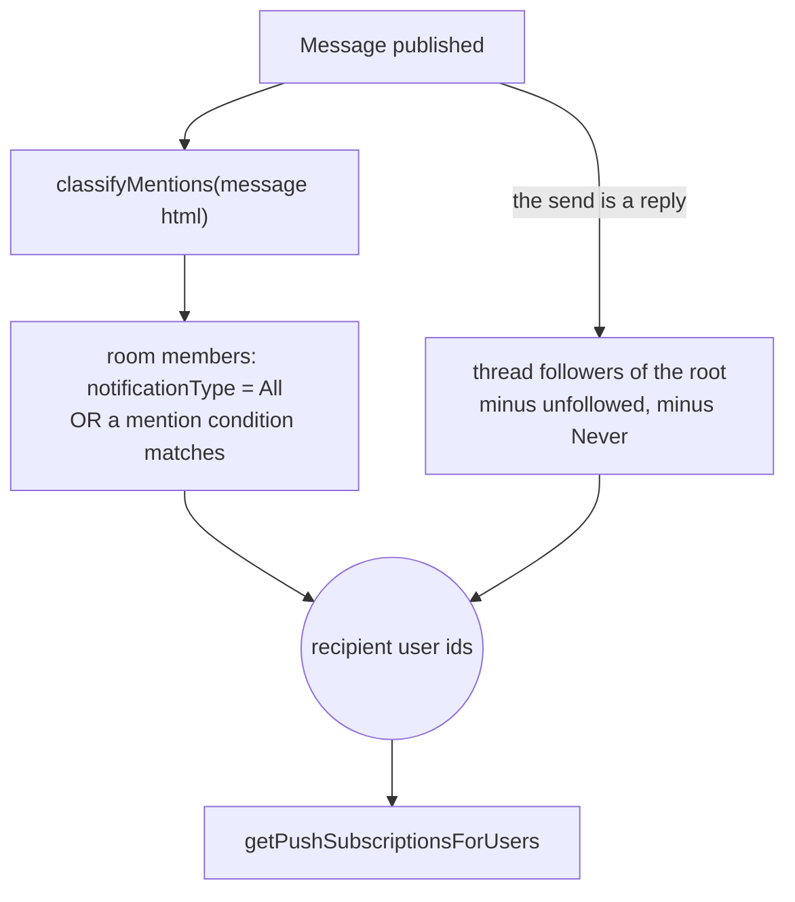

# Push Notifications

Delivery is not this page's subject. Every notification in the repo — a message, a friend request, a reminder, a resource operation — is published once and delivered by one Function ([notifications](/docs/architecture/notifications)). What is specific to chat is **who a message reaches**, and that is the one question `ProcessNotification` asks a message-shaped resolver.

The send itself publishes unconditionally: whether anyone is subscribed is no longer a question the request path asks, which is what took a recipient query off every message send.

## Recipients



Recipients are resolved as **user ids**, not as device rows, and the devices are looked up once from the union. That ordering is what lets a recipient with no push subscription still receive the surfaces that do not need one, and it is why a follower the room already notifies is de-duplicated by a set rather than subtracted by a query.

`getMessageRecipientUserIds(db, { message, partitionKey, threadRootRowKey, userId })`:

1. Parse mention `data-id` attributes from the message HTML → split into `regularUserIds | @here | @everyone`.
2. One SQL query over the room's members:

```text
usersToRooms
  LEFT JOIN userStatuses ON userId   ← always joined (needed for @here)
  WHERE roomId = partitionKey
    AND userId != sender
    AND (
      notificationType = All
      OR (DirectMessage AND userId IN regularIds)
      OR (@everyone AND notificationType != Never)
      OR (@here AND notificationType != Never AND status IN (Online, null))
    )
```

`userStatuses` is always left-joined even when there is no `@here` mention, so the query shape stays consistent.

3. When the send is a reply, union in the thread's followers — everyone following the root, minus the replier and minus anyone muted at room level. The follow model and its rules are [thread follows](/docs/esbabbler/thread-follows).

A webhook message has no sender to exclude, so every `All` member is reached including the app user's own account.

### `NotificationType` (on `usersToRooms`)

| Value           | Behavior                                   |
| --------------- | ------------------------------------------ |
| `All`           | Notified for all messages in the room      |
| `DirectMessage` | Only when directly `@mentioned` by user ID |
| `Never`         | Muted — no notifications                   |

## Rendering

The notification is shown as its author, resolved at delivery from the ids the event carries: the sender's per-room nickname when set ([nicknames](/docs/esbabbler/nicknames)), otherwise their account name; a webhook message resolves the app user that posted on its behalf. The body is the message's first paragraph as plain text — a send that renders to nothing at all (an attachment-only message) resolves to no notification rather than an empty one.

A reply deep-links to the thread root rather than to itself: the thread is where the reply is read, and it is the one destination that is right for a room member and a thread follower alike.

## Key files

| File                                                                        | Role                                                |
| :-------------------------------------------------------------------------- | :-------------------------------------------------- |
| `packages/db/src/services/notification/getMessageRecipientUserIds.ts`       | the room's recipients, thread followers unioned in  |
| `packages/db/src/services/notification/getThreadFollowerUserIds.ts`         | the thread half of that union                       |
| `packages/azure-functions/src/services/notification/resolveNotification.ts` | the message case — body, deep link, recipients      |
| `packages/app/server/services/message/createUserMessage.ts`                 | publishes one notification per send, reply included |
