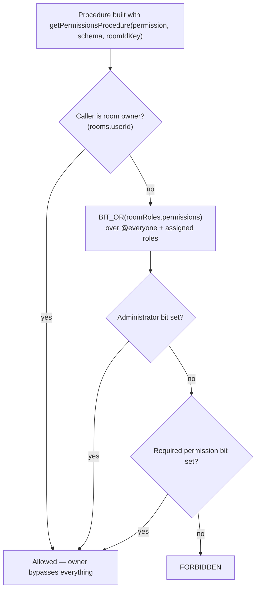

# RBAC

Discord-complexity role-based access control per room. Every privileged operation — moderation, settings, invites, webhooks — is gated through it.

## How it works

Each room has roles (`roomRoles`) carrying a `permissions` **bigint bitfield** of `RoomPermission` flags. `bigint` (not `number`) lets the field grow past 32 bits; since TypeScript enums cannot hold bigints, `RoomPermission` is a `const` object of `1n << n` values. A user's effective permissions are the SQL `BIT_OR` of the room's `@everyone` role plus every role assigned to them in `usersToRoomRoles`.

The diagram's shape is also the query plan: `checkHasPermission` awaits the owner lookup and only then reads the bitfield, rather than firing both together and picking a winner. Running them in parallel would shave one round trip off the member case, but it would make every owner pay for a role aggregation whose result is discarded — and the callers that reach here most are owners administering their own room, since `getPermissionsProcedure` guards the moderation and settings endpoints. Both reads are indexed single-row lookups against the same connection, so the sequential cost is small and lands on the branch that is about to do more work anyway. Ordering guards cheapest-and-most-decisive first is the rule; `Promise.all` is for reads where every result is used.

Authority is layered: **Owner** (`rooms.userId`, immune to all role manipulation) → **Administrator** permission (all bits, bypasses hierarchy but not ownership) → explicit permission bits (subject to hierarchy) → `@everyone` baseline. The `@everyone` role is a real `roomRoles` row (`isEveryone = true`, one per room via partial unique index) applied implicitly to every member — it is never stored in `usersToRoomRoles`. `createRoom` seeds it in the same transaction.

**Hierarchy** prevents lower roles acting upward: a user's _top position_ is the max `position` across explicitly assigned roles, and role management or member-targeting actions require the actor's top position to exceed the target's. That comparison is the pure predicate `checkIsManageable`, which lives in `shared/` because both the server guards and the client `role` store evaluate it.

**A role is assigned from two surfaces, both over one toggle.** Settings → Members is the list view — pick a member, see every role. The member's own profile card carries the same rows under a `Roles` menu, because the moment someone should be able to do more is the moment you are reading who they are, which is Discord's placement too. Both render `MessageModelRoomRoleMemberListItem` over `useToggleMemberRole`, which reads the actor's own standing from the role store rather than taking it as a prop — a surface cannot hand the toggle a hierarchy it read at a different moment than the guard it is checking.

**The owner is immune as a target, and position cannot express that.** An owner holds no `usersToRoomRoles` row — ownership is `rooms.userId`, not a role — so their top position is the floor every assigned role beats. Ranked on position alone the owner is the _most_ manageable member of their own room, which is why a member-targeting action compares through `checkIsMemberManageable` instead: it answers `actor.isOwner` when the target is the owner, and defers to the position comparison otherwise. A room has exactly one owner, so that first branch is the owner acting on themselves — which is what keeps an owner able to assign themselves a role while nobody else can kick, ban or strip them. The server reaches it through `assertIsManageable`, which resolves both sides against one read of the room and throws `UNAUTHORIZED` when it fails.

Every procedure that names a target member calls that guard, because holding the permission and outranking the target are two different questions: `getPermissionsProcedure` answers only the first. A member-targeting procedure that checks the permission alone is a hierarchy bypass, whatever the permission was.

**The bits are ordered by what they are, not by when they were added.** They run in category order — the text-channel permissions, then the room-wide ones, then moderation, then the advanced ones — with `Administrator` last, and adding one in the middle renumbers everything after it. That is only possible because a stored bitfield is read as the current shape rather than migrated ([clean slate](/docs/architecture/persisted-data-latest-shape-only)); the alternative, appending each new permission to whatever bit happened to be free, buys nothing here and costs the list its readability.

## Why a bitfield, and what it does not bound

A bitfield bounds **permissions**, never roles. A role is a `roomRoles` row and a grant is a `usersToRoomRoles` row, so a room may hold as many roles as it likes and a member as many of them as they like — the bits are the vocabulary each role draws its grant from, not a per-role slot. Nothing in the model gets tighter as roles are added.

This is the same shape Discord uses, and for the same reason: a room is a **flat scope over a fixed vocabulary**, so a permission check is one aggregate and one `AND` rather than a join per action name. Azure's RBAC solves a different problem — role definitions listing action strings (`Microsoft.Storage/*/read`) evaluated against a scope tree — which is what an open-ended, hierarchical resource surface needs and what a room does not have. Adopting it here would buy a wildcard syntax nobody would write and pay for it in a string match per check.

The one real limit is width: `permissions` is a signed 64-bit `bigint`, so bit 62 is the highest a stored value can carry. The number to watch is how many permissions the vocabulary has, not how many roles a room has. If the vocabulary ever exhausts them, the escape hatch is the storage, not the model: the column becomes arbitrary-precision (`numeric`) and the wire format a decimal string, which is exactly the step Discord took when 64 bits stopped being enough. Nothing about the roles, the grants or the checks changes with it.

## Data model

| Table              | Key facts                                                                                              |
| ------------------ | ------------------------------------------------------------------------------------------------------ |
| `roomRoles`        | `roomId` FK, `name`, `color`, `position` (higher = more authority), `permissions` bigint, `isEveryone` |
| `usersToRoomRoles` | `(userId, roomId, roleId)` composite PK — explicit role assignments                                    |

## Service layer & guards

The functions are split across three homes by who needs them. The two permission reads live in `@esposter/db`, because the Azure Functions workers evaluate them too; `server/services/room/rbac/` re-exports each as a one-line shim so server code keeps importing them from one place. The pure hierarchy predicate lives in `shared/` so the client can evaluate it without a round trip, and the server-only helpers stay under `server/`.

| Function                                                           | Home                         | Purpose                                            |
| ------------------------------------------------------------------ | ---------------------------- | -------------------------------------------------- |
| `getPermissions(db, userId, roomId)`                               | `@esposter/db`               | `BIT_OR` aggregate → bigint                        |
| `checkHasPermission(db, userId, roomId, perm)`                     | `@esposter/db`               | Owner bypass → Administrator bit → specific bit    |
| `getTopRolePosition(db, userId, roomId)`                           | `server/services/room/rbac/` | Max assigned-role position                         |
| `getRoomMemberAuthority(db, userId, roomId)`                       | `server/services/room/rbac/` | One side of a comparison: top position + ownership |
| `assertIsManageable(db, actorId, targetId, roomId)`                | `server/services/room/rbac/` | Resolves both sides, throws `UNAUTHORIZED`         |
| `checkIsManageable(actorTopPosition, targetPosition, isRoomOwner)` | `shared/services/room/rbac/` | The position comparison itself — no DB access      |
| `checkIsMemberManageable(actor, target)`                           | `shared/services/room/rbac/` | The same comparison plus owner immunity            |

tRPC procedure builders in `server/trpc/procedure/room/`:

| Guard                     | Use                                                             |
| ------------------------- | --------------------------------------------------------------- |
| `getMemberProcedure`      | Caller must be a room member — standard message/room operations |
| `getPermissionsProcedure` | Caller must hold a specific `RoomPermission` — moderation/admin |
| `getOwnerProcedure`       | Owner only — destructive room operations                        |

## Key files

| File                                                                 | Role                                    |
| -------------------------------------------------------------------- | --------------------------------------- |
| `packages/db-schema/src/schema/roomRolesInMessage.ts`                | `RoomPermission` const + roles table    |
| `packages/db-schema/src/schema/usersToRoomRolesInMessage.ts`         | Assignment table                        |
| `packages/db/src/services/room/rbac/`                                | `getPermissions` + `checkHasPermission` |
| `packages/app/server/services/room/rbac/`                            | Server helpers + re-export shims        |
| `packages/app/shared/services/room/rbac/checkIsManageable.ts`        | Hierarchy predicate shared w/ client    |
| `packages/app/server/trpc/procedure/room/getPermissionsProcedure.ts` | Permission middleware builder           |
| `packages/app/server/trpc/routers/role.ts`                           | Role CRUD + `readMemberRoles`           |

## Notes

- `readMemberRoles` is deliberately a separate procedure from `readMembers` (called in parallel from `useReadMembers`) rather than a join.
- Default `@everyone` permissions: `ReadMessages | SendMessages | MentionEveryone | ManageInvites`.
