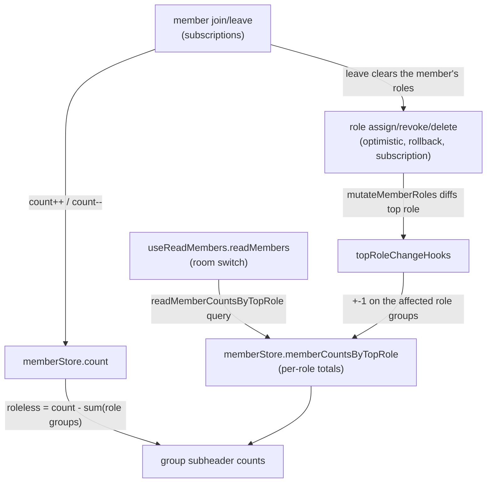

# Room UI

One cohesive polish pass over the room shell, matching Discord's refinements. Visual preferences (sidebar widths, message density) are device-local `localStorage`, per the [settings](/docs/esbabbler/settings) persistence rule; the one exception is category ordering, which is server-persisted through a dedicated `reorderRoomCategories` procedure.

## Role-grouped member list

The member sidebar groups members Discord-style: one group per top hoisted role ordered by role position (highest first), with roleless members trailing in a single "Members" group. A member's display name is tinted with their top role's color; the implicit `@everyone` role never groups or tints. Grouping and top-role resolution are pure services (`getMemberGroups`, `getTopRole`) with co-located tests.

### Group counts

Each group subheader shows the group's **total** member count, not the loaded-page count — the list is cursor-paginated, so counting loaded members would silently undercount. Totals stay correct through three mechanisms, each owning a different change source:

- **Room switch** — `readMembers` fetches `room.readMemberCountsByTopRole` (one `DISTINCT ON` query grouping members by their highest-positioned non-`@everyone` role) alongside the member page and total count.
- **Join/leave** — the roleless group is never fetched; it is derived as `count - sum(role groups)`. A join is roleless by definition, so the subscription's `count++` alone keeps it current. A leave is expressed as the member's top role becoming none — `storeDeleteMember` routes through `mutateMemberRoles` before decrementing `count`, so the role group the leaver belonged to drops with the total. Without that, the roleless remainder absorbs every departure of a roled member and goes negative in a room where everyone holds a role.
- **Role changes** — every role-membership mutation (optimistic apply, rollback, `onSuccess`, and the role subscription handlers) funnels through the role store's `mutateMemberRoles`, which diffs the member's top role and fires `topRoleChangeHooks`; the member store registers a hook that shifts the affected role-group counts. Reads (`readMemberRoles`) bypass the hooks — server counts already include loaded members.

## Resizable, persisted sidebars

The left (rooms) sidebar and right (members/search/thread) drawer have a drag handle on their inner edge. Widths clamp between the min and max sidebar constants, persist per device in `localStorage` via the message layout store, and feed both the Vuetify drawer width and the fixed-layout offset styles so the chat content reflows while dragging. Handles render on desktop only — drawers float over content on mobile.

## Message display density

User Settings → Appearance → Message Display offers Discord's Cozy/Compact choice. Compact halves the gap between message batches and the per-message vertical padding so more messages fit on screen. The mode is device-visual state in the appearance store (`localStorage`), consistent with the theme staying on the cookie rather than in `userSettingsInMessage`.

## Empty states

The generic `StyledEmptyState` (icon + title + description) backs welcome-style placeholders: the room list shows "No rooms yet" with a create/join hint when the user has no rooms, and message search shows "No results" with a retry hint when a query matches nothing. The Drafts & Sent view keeps its own full-height empty states.

## Mobile action bar

On `smAndDown` a bottom action bar sits above the composer, keeping room actions within thumb reach: room-list toggle, pinned messages, member-list toggle, and search. It reuses the same header action-button components and is the **only** small-screen surface for them — the header hides its room-list/search buttons and has no overflow menu on `smAndDown`, so every action keeps exactly one affordance.

## Category drag-reorder

Room categories in the left sidebar reorder by dragging their headers (SortableJS via `vue-draggable-plus`); a ghost placeholder with a primary-colored top border marks the drop target. Touch drags wait `ROOM_CATEGORY_TOUCH_DRAG_DELAY_MS` (`delayOnTouchOnly`) so a swipe that starts on a header scrolls the list instead of reordering it. Alt+↑/Alt+↓ on a focused category header moves it without a pointer. The store applies the new positions optimistically (via [`useMutation`](/docs/architecture/client-data)), then persists only the rows whose position changed (`getRoomCategoryPositionUpdates`) through the `reorderRoomCategories` procedure — a single DB transaction, so a drag either fully lands or fully rolls back. `readRoomCategories` orders by `position` first with `name` as tiebreaker, and `createRoomCategory` appends below the existing order (`max(position) + 1`) so a new category never jumps above a drag-assigned top.

## Key files

| File                                                                               | Role                                              |
| ---------------------------------------------------------------------------------- | ------------------------------------------------- |
| `packages/app/app/services/message/member/getMemberGroups.ts`                      | Discord-style member grouping by top role         |
| `packages/app/app/services/message/member/getTopRole.ts`                           | Top hoisted role for grouping + name tint         |
| `packages/app/app/services/message/member/topRoleChangeHooks.ts`                   | Role store → member store count-sync hooks        |
| `packages/app/shared/models/db/room/MemberCountByTopRole.ts`                       | Per-top-role count row from the server            |
| `packages/app/app/store/message/ui/layout.ts`                                      | Persisted sidebar widths + right drawer selection |
| `packages/app/app/components/Styled/ResizeHandle.vue`                              | Generic pointer-drag width handle                 |
| `packages/app/app/store/message/ui/appearance.ts`                                  | Persisted message display density                 |
| `packages/app/app/components/Message/Model/User/Settings/Type/Appearance/`         | Appearance settings panel (Message Display)       |
| `packages/app/app/components/Styled/EmptyState.vue`                                | Generic icon/title/description empty state        |
| `packages/app/app/components/Message/Content/MobileActionBar.vue`                  | Bottom action bar on small screens                |
| `packages/app/app/services/message/roomCategory/getRoomCategoryPositionUpdates.ts` | Position diff for category reorder persistence    |

## Notes

- Member-list search does not exist yet, so it has no empty state — if a search field lands it should reuse `StyledEmptyState`.
- Room drag-reorder (rooms within/between categories) is out of scope — only categories reorder.
