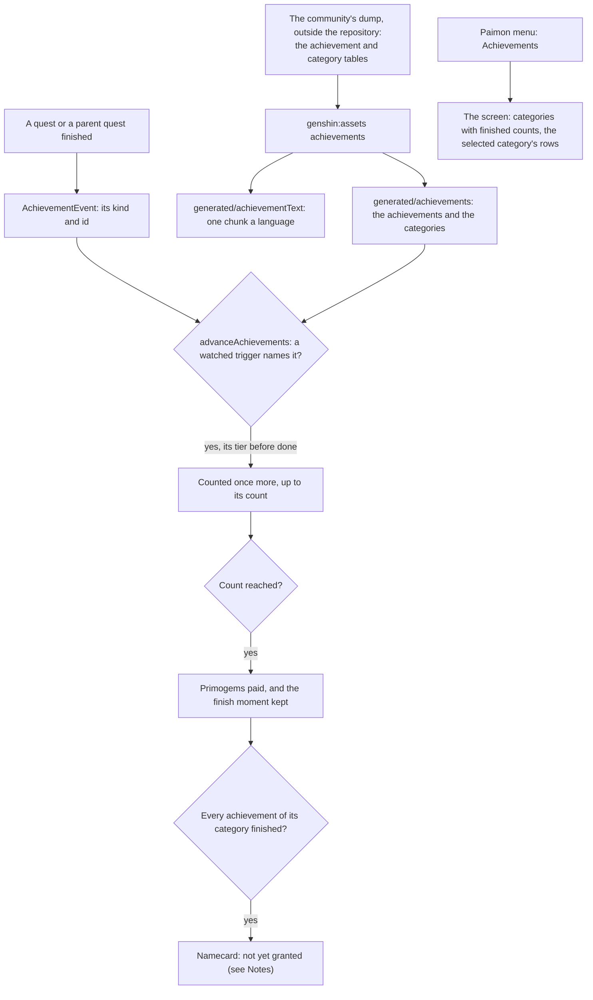

# Achievements

The game's achievements reward a player for what they have done anywhere in it. Each is a row of the game's own table: a category it is listed under, a trigger naming the doing that counts it, the count that finishes it and the Primogems it pays. The world holds them as the table does, by the game's own ids, and every title and description comes from the game's text.

## How it works

### The table

`pnpm -C scripts genshin:assets achievements` reads the game's achievement table and its category table from the dump, and writes two slices into the world's generated folder. A disused achievement, one the game no longer offers, is left out; the rest are kept whole, with every trigger, since the screen lists all of a category and a category's end waits on every one of its achievements. Each row is validated against the world's schema before it is written. The slices are written compact, the achievements one at about half a megabyte, and the world imports them on demand the first time the screen opens.

An achievement keeps its id, its category, its order there, its trigger type and the ids that trigger names, its count, the tier before it, whether it is hidden until it is done, its Primogems and its two text ids. A category keeps its name's text id, its order, and the namecard item its completion pays, which is zero for a category with no end.

### The words

The same run writes every title and description of a kept achievement, and every category's name, in the fifteen languages, into the world's own chunk per language by the same text ids, as the [names](/docs/genshin/game-text) and the [quests](/docs/genshin/quests) do. A language missing a text takes English's and says so. Each language chunk runs to a couple of hundred kilobytes, and the screen imports only the language it shows.

### Counting a doing

`AchievementTriggerEventKindMap` names the trigger types the world watches. Four are watched: the AND and OR forms of a finished quest and of a finished parent quest. An AND trigger names one id and an OR trigger names a list, which the reader splits into one parameter each. `advanceAchievements` takes an `AchievementEvent`, a kind and the id it finished, and each achievement that watches the kind and names the id is counted once more, up to its count. An achievement already finished never moves, and one whose tier before it is not finished does not count yet, so the tiers of a chain are done in order.

When an achievement reaches its count it is finished, its moment is kept, and its Primogems are returned for the caller to pay into the wallet. Every reward row of the table pays Primogems alone, so the Primogems are the whole of an achievement's reward.

A trigger type the map does not name is not watched, and its achievements never move; the table keeps them so their categories count them.

### The screen

`ScreenKind.Achievements` opens from the Paimon menu. The screen lists the categories down the left, each with how many of its achievements are finished over how many it has, and the selected category's achievements on the right in the table's order, each with its title, its description, its count when its count is more than one, and its Primogems. Q and E step between the categories, the quest screen's tab keys, and a hidden achievement reads "?" until it is finished. The screen opens empty of progress, since nothing yet emits the events a finish is counted from.

## Notes

- **Only quest triggers move yet.** The [quests](/docs/genshin/quests) page emits each finished sub-quest and each finished main quest, so the quest triggers count; the other trigger types wait on the pages that record their doings, as the [proposal](/docs/proposals/genshin/achievements) names.
- **A namecard is not granted.** A category's completion is checked by `checkIsAchievementCategoryComplete`, and its namecard item is kept on the category. Namecards are the [companionship](/docs/proposals/genshin/companionship) page's, which holds no namecard list yet.
- **The quest ids the table names are not all in the dump.** About two-thirds of the sub-quest ids the quest triggers name are in the dump's quest table; the rest name quests the dump does not carry, so their achievements stay at zero until that data is read.
- **The screen's look is provisional.** Its places follow the quest screen's grid, not the English client, and its category icons, its Primogem glyph and its tab shapes are not built.

## Parity

The Achievements screen has no parity measure yet. Its look waits on `achievements-screen.mkv`, listed as owed on the roadmap.

## Key files

| File                                                                                    | Role                                                                  |
| :-------------------------------------------------------------------------------------- | :-------------------------------------------------------------------- |
| `packages/genshin-world/src/models/achievement/Achievement.ts`                          | One achievement as the table holds it, with its schema                |
| `packages/genshin-world/src/models/achievement/AchievementCategory.ts`                  | One category, with the namecard its completion pays                   |
| `packages/genshin-world/src/models/achievement/AchievementEvent.ts`                     | The doing an achievement's trigger may be waiting on                  |
| `packages/genshin-world/src/models/achievement/AchievementProgress.ts`                  | How far an achievement has come and when it was finished              |
| `packages/genshin-world/src/services/achievement/advanceAchievements.ts`                | Counts a doing against the watched achievements, paying the finished  |
| `packages/genshin-world/src/services/achievement/AchievementTriggerEventKindMap.ts`     | The trigger types watched and the kind of doing each counts           |
| `packages/genshin-world/src/services/achievement/checkIsAchievementCategoryComplete.ts` | Whether every achievement of a category is finished                   |
| `packages/genshin-world/src/services/achievement/readAchievements.ts`                   | The slices read on demand, checked against their schemas              |
| `packages/genshin-world/src/services/achievement/AchievementTextLoaderMap.ts`           | The words in each language, imported on demand                        |
| `packages/genshin-world/src/components/Achievement/Screen/Index.vue`                    | The Achievements screen the Paimon menu opens                         |
| `packages/genshin-world/src/components/World/Screen/Index.vue`                          | Loads the slices and words when the screen opens, and shows it        |
| `scripts/src/services/genshinAssets/achievements/writeAchievements.ts`                  | The writer: the table's rows, mapped and checked, into the two slices |
| `scripts/src/services/genshinAssets/achievements/writeAchievementText.ts`               | The writer of every title and description in each language            |
| `scripts/src/services/genshinAssets/achievements/toAchievement.ts`                      | One row mapped to an achievement, its trigger's ids split             |

## Sources

- [Achievements](https://genshin-impact.fandom.com/wiki/Achievements), Genshin Impact Wiki: the Primogems each pays, a namecard for a category done, open-ended categories, and tiers shown as stars.
- [AnimeGameData](https://github.com/DimbreathBot/AnimeGameData), the community's per-patch dump: the achievement table with each one's category, trigger, count, reward and tier, the category table, and the quest table whose sub-quest ids the quest triggers name.
